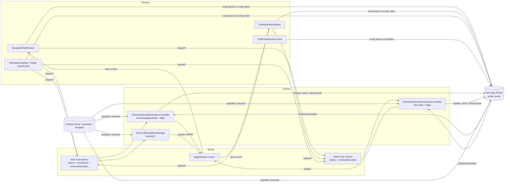
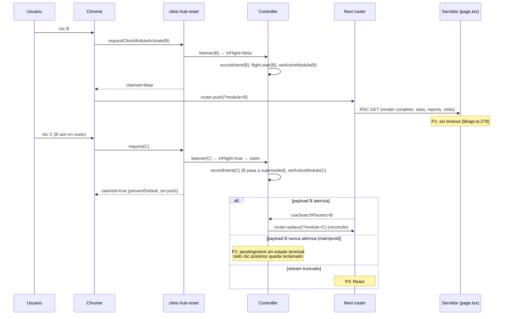
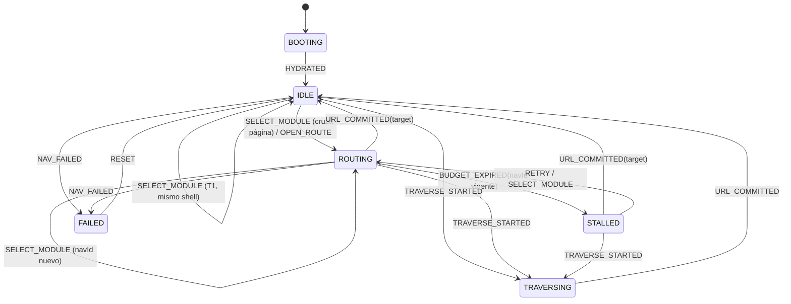
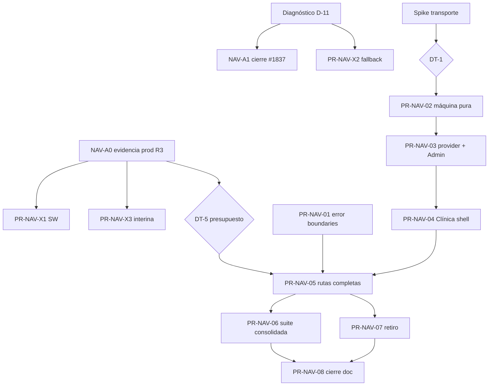

# Auditoría arquitectónica de navegación y hoja de ruta FSM

| Campo | Valor |
| --- | --- |
| Tipo | Auditoría docs-only (R0 lectura + R1 escritura de este documento) |
| Fecha | 2026-10-09 |
| Repositorio | `LABVETNEB/PORTAL-VETNEB` |
| Referencia auditada | rama `fix/dashboard-navigation-flight-budget`, HEAD `c35ebcb340e5a64b573292eef790a326bb6709c8` (head de PR #1837, abierta) |
| Base comparada | `main` = `37dbcaf6714f6ae7fb37eaad100370af2ab53cb8` (PR #1836) |
| Frontend productivo | `37dbcaf6` según sonda `/api/build-info` registrada el 2026-10-09 en una sesión previa; **no reverificado en esta sesión** (lectura de producción fuera del scope) |
| Stack verificado | Next.js `16.3.8`, React `19.3.0` (leídos de `frontend/node_modules`) |
| Lifecycle status | PROPUESTA — pendiente de revisión de Nico |
| Estado de implementación | NO IMPLEMENTADO. Ningún archivo de código, test o configuración fue modificado |

---

## 1. Resumen ejecutivo

El síntoma reportado — *la URL cambia pero el contenido no; los clics siguientes dejan de responder;
sólo un Reload recupera* — no tiene una causa única. La auditoría identifica **11 defectos
comprobados** y **7 hipótesis causales pendientes**. Los defectos se agrupan en tres raíces
estructurales:

1. **Coordinación sin estado terminal.** Los dashboards de Admin y Clínica coordinan la navegación
   de módulos con estado implícito repartido en 7–10 `useRef`/`useState` por controlador, más dos
   buses globales con semántica de "claim", un store de `stageModule`, un clasificador puro sólo
   para Clínica y listeners `popstate`/Navigation API en tres componentes. En `main` (= producción)
   el `pendingIntent` de SINGLE FLIGHT (#1835) sólo termina con un commit de URL o un `popstate`:
   si el payload RSC no aterriza, cada clic posterior queda reclamado y la URL/historial se congelan
   mientras el stage sigue moviéndose (D-02). PR #1837 agrega un presupuesto de 10 s como
   contención, pero sigue abierta con `validate-frontend` en FAILURE y no cubre las rutas
   completas de Clínica (D-04).
2. **El transporte de un cambio de módulo es un render de servidor completo.** Cada `?module=` vuelve
   a ejecutar la página entera (todas las llamadas de datos, sin timeout) aunque el cliente ya tiene
   renderizados **todos** los workspaces como slots y el controlador ignora `initialModule` después
   del montaje (D-03, D-09). La latencia del backend define la ventana durante la que existen todas
   las carreras que #1830–#1837 fueron parcheando.
3. **No hay frontera de error de navegación.** No existe ningún `error.tsx`, `global-error.tsx` ni
   `loading.tsx` en `frontend/src/app`; un stream RSC truncado deja la aplicación en la pantalla de
   error genérica de Next hasta un Reload (D-01, reproducido bajo inyección de fallos en una sesión
   previa).

**Riesgo arquitectónico principal:** seguir agregando guardas locales sobre una máquina de estados
implícita, duplicada (Admin inline vs Clínica pura) y dependiente del orden de eventos del
navegador y de React. Cada PR de la serie #1830–#1837 corrigió un caso real y agregó un mecanismo;
ninguno redujo el número de autoridades de navegación (hoy 9, §5.3).

**Arquitectura objetivo:** una *Explicit Finite-State Navigation Machine* por superficie, con un
único dueño montado en `app/dashboard/layout.tsx` (persiste entre `/dashboard`, sus rutas completas y
`/dashboard/admin`), transiciones puras y deterministas, y — sujeto a la decisión DT-1 — el cambio de
módulo transportado por `window.history.pushState` nativo (contrato documentado de Next 16), de modo
que URL y contenido cambian en la misma transición y **el estado "en vuelo" desaparece** para los
cambios de módulo. El estado asíncrono queda acotado a la navegación entre rutas distintas, con
presupuesto, estado `STALLED` recuperable y frontera de error.

**Estado de preparación:** NO LISTO para implementar la FSM. Faltan: (a) evidencia productiva de
latencias RSC y de errores de navegación (R3, [MANUAL-NICO]); (b) la decisión DT-1 sobre el
transporte; (c) el spike de verificación del transporte nativo (§15.2). **Sí está lista** una primera
intervención independiente de la FSM: fronteras de error (PR-NAV-01, §22).

---

## 2. Alcance, metodología y limitaciones

### 2.1. Alcance

| Incluido | Excluido (no-alcance explícito) |
| --- | --- |
| Navegación de módulos en `/dashboard` (Clínica) y `/dashboard/admin` | Backend, DB, migraciones, RLS |
| Rutas completas de Clínica (`/dashboard/informes`, `/dashboard/logistica/**`) | Implementación de cualquier fix |
| Chrome de navegación: banda lateral, barra móvil, app-bar, kebab, quick links | Ejecución contra staging o producción |
| Script pre-hidratación `public/theme-init.js` y service worker `public/sw.js` | Dependencias, lockfile, CI/workflows |
| Integración con Next.js App Router 16.3.8 (lectura de `node_modules/next/dist`) | Navegación pública más allá de su relación causal con D-01 y H-03 |
| Estado de PR #1830, #1833, #1835, #1836, #1837 | Rediseño visual |

### 2.2. Metodología

1. Protocolo de entrada de `AGENTS.md` §2: referencia, actor (caso A: auditoría + documento),
   `AGENTS.md` leído completo, búsqueda de `AGENTS.md` anidados con `git ls-files` (sólo el raíz es
   tracked), baseline Git (§3).
2. Lectura completa de los 14 archivos de coordinación (§5) y de los puntos de llamada de
   `router.*`, `history.*`, `popstate`, `window.location.*` (búsqueda exhaustiva en `frontend/src`).
3. Lectura de los contratos de Next instalados: `app-router.js`, `app-router-instance.js`,
   `server-patch-reducer.js`, `fetch-server-response.js`, `layout-router.js` y la guía
   `dist/docs/01-app/01-getting-started/04-linking-and-navigating.md`.
4. Lecturas GitHub R0: estado de PR, checks, review threads de #1837 y logs del run fallido.
5. Contraste con evidencia de reproducción de sesiones previas (2026-10-07 a 2026-10-09). Esa
   evidencia **no está versionada** (arneses en scratchpads); se cita como tal y se marca la prueba
   que la volvería reproducible.

### 2.3. Limitaciones

- Ningún comportamiento fue re-ejecutado en esta sesión: la tarea autoriza sólo lectura y este
  documento. Toda afirmación de comportamiento runtime lleva su fuente (código, CI o reproducción
  previa no versionada).
- No hay telemetría productiva de navegación (no existe RUM ni logging de errores de cliente, ver
  `docs/ops/METRICS_BASELINE.md`): ninguna hipótesis sobre frecuencia en producción puede cerrarse
  desde el repositorio.
- El artefacto `trace.zip` del run fallido de #1837 no se descargó (descarga = permiso explícito);
  el diagnóstico de D-11 queda como hipótesis H-04.
- `git fetch --prune` no se ejecutó (§5.2 de `AGENTS.md`: R1 sólo con pedido de implementación); el
  estado remoto se leyó con `gh` (R0).

---

## 3. Estado inicial del repositorio y PR relevantes

### 3.1. Baseline Git (capturado antes del análisis)

| Elemento | Valor |
| --- | --- |
| Rama | `fix/dashboard-navigation-flight-budget` |
| HEAD | `c35ebcb3` "fix(dashboard): end single flight when a navigation never lands" |
| `git diff --stat` (tracked) | vacío |
| Untracked | `frontend/AGENTS.md`, `frontend/CLAUDE.md` (generados por `next dev`; preservados, no son contrato: no están en `git ls-files`) |
| Stashes | 5 (`stash@{0}`..`stash@{4}`), preservados, no manipulados |
| Worktrees | 1 (`C:/PORTAL-VETNEB`) |
| `AGENTS.md` tracked | sólo el raíz |

### 3.2. Estado de las PR (leído con `gh pr view`, 2026-10-09)

| PR | Título | Estado | Merge commit | Head | Aporte a la navegación |
| --- | --- | --- | --- | --- | --- |
| #1830 | synchronize live module navigation state | MERGED 2026-10-07 | `1ca68922` | `e3c3ce90` | `supersededTargets`, `historyTraversal.ts`, origen `history` de un commit |
| #1833 | preserve clinic navigation on full routes | MERGED 2026-10-08 | `00c7ef1c` | `689ef793` | Bus `handsOver` para `ClinicFullRouteModuleStage`, `unheardActivation` |
| #1835 | single navigation authority per dashboard | MERGED 2026-10-08 | `05764256` | `8ce514f3` | `stageModule` store, SINGLE FLIGHT (claims), `pushedFrom` + `history.back()` |
| #1836 | drop clinic full-route handover when Back starts | MERGED 2026-10-08 | `37dbcaf6` | `7aafbee8` | Guard `window.event?.type === "popstate"`, traverse vía Navigation API |
| #1837 | end single flight when a navigation never lands | **OPEN** | — | `c35ebcb3` | `navigationFlight.ts` (presupuesto 10 s) + `useNavigationFlight.ts` |

### 3.3. Checks de #1837 sobre `c35ebcb3`

| Contexto required | Estado |
| --- | --- |
| `validate-pr-governance` | SUCCESS |
| `qga-workflow-security` | SUCCESS |
| `validate-backend` | SUCCESS |
| `validate-frontend` | **FAILURE** (run `37889048178`: `frontend-heavy-validation` 1253 passed / 1 failed / 1 skipped) |

Fallo: `frontend/e2e/admin/shell/admin-mobile-final-polish-no-scroll.spec.ts:580` ("Admin desktop
final polish smoke at 1280x800"), línea 608: *strict mode violation:
`[data-dashboard-navigation-drawer]` resolved to 2 elements*. Review threads de #1837: ninguno.
`main` en `00c7ef1c` (#1833) falló con la misma clase de error sobre
`[data-dashboard-mobile-nav="admin"]` (run `37725244360`); los runs de `main` posteriores
(`05764256`, `37dbcaf6`) pasaron. Ver D-11 y H-04.

---

## 4. Skills aplicadas

| Skill | Uso | Problema concreto que justificó su uso |
| --- | --- | --- |
| `vetneb-bugs-errores-optimizacion-rutas` (principal) | Separación síntoma/causa/evidencia/impacto; localización por capa (frontend, SW, Next, backend) | El síntoma cruza router de Next, controladores, SW y render de servidor |
| `vetneb-briefing-planificacion-diseno-desarrollo-pruebas` | Estructura de cada PR (scope, superficies afectadas/no afectadas, tests existentes/faltantes, criterio de merge) | Convertir la arquitectura objetivo en PR mínimos ejecutables por otro agente |
| `vetneb-production-web-optimization-engineer` | Análisis de complejidad, ownership, priorización P0–P3, plan mínimo con rollback | Nueve autoridades de navegación y lógica duplicada Admin/Clínica |
| `vetneb-web-end-to-end-global` | **No cargada.** La cobertura E2E se analizó con `frontend/e2e/suites/catalog.ts` y §7 de `AGENTS.md` | No hizo falta guía adicional más allá del catálogo |
| `vetneb-security-production-invariants` | **No cargada.** Los invariantes relevantes (`no-store`, sesiones, sin stack traces) se tomaron de `AGENTS.md` §9 | Sólo PR-NAV-01 roza un invariante (no exponer stack traces en `error.tsx`); queda listado como criterio de aceptación |

Contradicciones detectadas entre skills y `AGENTS.md` (prevalece `AGENTS.md`; se reportan, no se
resuelven en silencio):

| Skill dice | `AGENTS.md` dice | Resolución aplicada |
| --- | --- | --- |
| "Indicar Terminal 1 / Terminal 2 cuando se entreguen comandos" | §1: sólo cuando hay procesos simultáneos | Un solo flujo |
| "Antes de tocar código: `git fetch --prune`" | §5.2: R1 sólo con pedido de implementación | No ejecutado; estado remoto leído con `gh` (R0) |
| Cierre manual: `gh pr merge --squash --delete-branch` | §5.8/§5.9: squash con `--match-head-commit`; borrado de rama separado y verificado | Los comandos de este documento siguen `AGENTS.md` |
| `vetneb-production-web-optimization-engineer`: "No usar `rg`" | Sin restricción | Búsquedas hechas con la herramienta Grep del agente; no material |

---

## 5. Inventario de componentes responsables de navegación

### 5.1. Coordinación (estado y decisiones)

| Archivo | LOC | Rol actual | Estado propietario |
| --- | ---: | --- | --- |
| `frontend/src/components/dashboard/ClinicDashboardWorkspaceController.tsx` | 389 | Dueño del stage de Clínica en `/dashboard` | `activeModule`, `hubOverride`, `hasManuallyReturnedToHub`, `hasRestoredLastModule`, `navigationState` (ref), `historyTraversalStarted` (ref), `flight` |
| `frontend/src/app/dashboard/admin/AdminDashboardWorkspaceController.tsx` | 418 | Dueño del stage de Admin | `activeModule`, `previousUrlModule`, `currentUrlModule`, `pendingNavigationIntent`, `supersededTargets`, `pushedFrom`, `historyTraversalStarted`, `hasManuallyReturnedToHub`, `hasRestoredLastModule`, `flight` |
| `frontend/src/components/dashboard/ClinicFullRouteModuleStage.tsx` | 92 | Stage de rutas completas; "hand over" a `/dashboard` | `leavingTo` |
| `frontend/src/lib/dashboard/navigation/clinicNavigationState.ts` | 255 | Clasificador puro de commits (sólo Clínica) | — (puro) |
| `frontend/src/lib/dashboard/navigation/navigationFlight.ts` | 64 | Presupuesto de SINGLE FLIGHT (sólo en #1837) | timer |
| `frontend/src/lib/dashboard/navigation/stageModule.ts` | 77 | Store global del módulo publicado por el dueño | pila de claims por superficie |
| `frontend/src/lib/dashboard/navigation/historyTraversal.ts` | 29 | Adaptador Navigation API `navigate` (`traverse`) | — |
| `frontend/src/lib/clinic-hub-reset.ts` | 94 | Bus Clínica: hub reset + module activate con claims, `handsOver`, `unheardActivation` | `moduleActivateListeners`, `unheardActivation` |
| `frontend/src/lib/admin-hub-reset.ts` | 95 | Bus Admin: idem sin `handsOver` | `moduleActivateListeners`, `unheardActivation` |
| `frontend/src/components/dashboard/useNavigationFlight.ts` | 19 | Hook del presupuesto (#1837) | — |
| `frontend/src/components/dashboard/useStageModule.ts` | 44 | Publicación/lectura del store | — |
| `frontend/src/features/dashboard/application/dashboardModuleNavigation.ts` | 123 | Gramática `?module=` / `?hub=1` | — (puro) |

### 5.2. Chrome (emisores de intención)

| Archivo:línea | Emisión | Navega si no hay claim |
| --- | --- | --- |
| `frontend/src/components/dashboard/NavigationRail.tsx:110-118` | `request*ModuleActivate` | `PublicRouteControl` → `router.push` |
| `frontend/src/components/dashboard/NavigationDrawer.tsx:110-118` | idem | idem |
| `frontend/src/components/dashboard/DashboardMobileNav.tsx:538-545` | idem | idem (barra) |
| `frontend/src/components/dashboard/WorkspaceAppBar.tsx:139-143` | idem | `router.push` explícito |
| `frontend/src/components/dashboard/DashboardMobileKebabMenu.tsx:136-140` | idem | idem |
| `frontend/src/app/dashboard/admin/AdminOverviewQuickLinks.tsx:30` | `requestAdminModuleActivate` | `PublicRouteControl` |
| `frontend/src/components/dashboard/FullModuleRouteControl.tsx:30-37` | — | `startTransition(() => router.push(href))`; bloquea clics mientras `isPending` |
| `frontend/src/components/dashboard/DashboardNotificationsBell.tsx:231` | — | `router.push(destination)` |
| `frontend/src/components/public/PublicRouteControl.tsx:121-143` | — | `router.push`/`router.replace`; marca `data-public-route-control-hydrated` por nodo |

### 5.3. Autoridades de navegación (quién puede mover URL o contenido)

| # | Autoridad | Evidencia |
| --- | --- | --- |
| 1 | Router de Next (`push`, `replace`, traverse) | `node_modules/next/dist/client/components/app-router.js:233-305` |
| 2 | Estado optimista del controlador + claims de SINGLE FLIGHT | `ClinicDashboardWorkspaceController.tsx:261-282`; `AdminDashboardWorkspaceController.tsx:309-331` |
| 3 | Replay de `unheardActivation` al suscribirse | `clinic-hub-reset.ts:45-89`; `admin-hub-reset.ts:63-93` |
| 4 | Hand-over de ruta completa | `ClinicFullRouteModuleStage.tsx:37-71` |
| 5 | Restauración del último módulo (`router.replace` al montar; Admin además `history.replaceState` nativo) | `ClinicDashboardWorkspaceController.tsx:317-355`; `AdminDashboardWorkspaceController.tsx:338-377` |
| 6 | `history.back()` emitido por los controladores (`pushedFrom`) | `ClinicDashboardWorkspaceController.tsx:216-219`; `AdminDashboardWorkspaceController.tsx:233-239` |
| 7 | Fallback pre-hidratación (`window.location.assign/replace`) | `frontend/public/theme-init.js:63-133` |
| 8 | `BackForwardCacheGuard` (`location.reload()` en `pageshow.persisted`) | `frontend/src/components/dashboard/BackForwardCacheGuard.tsx:12-22` |
| 9 | `AppVersionGate` (`location.replace` a `/?vetnebUpdate=`) | `frontend/src/components/app-version/AppVersionGate.tsx:53-57` |

Las autoridades 7–9 producen navegaciones de documento completo (no comparten estado con 1–6) y se
consideran **legítimas y fuera de la FSM**; las autoridades 2–6 son las que la FSM debe consolidar.

---

## 6. Mapa arquitectónico actual



Observaciones del mapa:

- La misma intención atraviesa hasta cuatro saltos (chrome → bus → dueño → router) y vuelve por
  otros dos (router → `useSearchParams` → efecto de clasificación).
- La "confirmación" de una navegación se infiere de un cambio de `useSearchParams` observado en un
  `useEffect`; no hay identificador de navegación que correlacione intención y commit.
- `Stage` resuelve la coherencia chrome↔stage (#1835) pero es un segundo canal de estado con su
  propia pila de claims.

---

## 7. Flujo real de navegación y puntos de fallo

### 7.1. Cambio de módulo en `/dashboard` (Clínica) con SINGLE FLIGHT



### 7.2. Puntos de fallo

| Id | Punto | Dónde | Defecto/hipótesis |
| --- | --- | --- | --- |
| P1 | Render de servidor sin límite de tiempo | `frontend/src/lib/api.ts:279-283`; `app/dashboard/page.tsx:73-115`; `app/dashboard/admin/page.tsx:284-305` | D-03 |
| P2 | `pendingIntent` sin terminal | `main`: `ClinicDashboardWorkspaceController.tsx:241-252`, `AdminDashboardWorkspaceController.tsx:297-305` (en `37dbcaf6`) | D-02 |
| P3 | Sin frontera de error | `frontend/src/app` (sólo `not-found.tsx`) | D-01 |
| P4 | Ruta completa esperando un commit que no llega | `ClinicFullRouteModuleStage.tsx:37-71`; `FullModuleRouteControl.tsx:30-37` | D-04 |
| P5 | Orden de listeners `popstate` vs commit eager de React | `clinic-hub-reset.ts:48-55`; `ClinicFullRouteModuleStage.tsx:51-67` | D-08 |
| P6 | Fallo tardío de una navegación abandonada → recarga a su URL | `next/dist/client/components/router-reducer/reducers/server-patch-reducer.js:22-40` | D-10 |
| P7 | Error de red → Next espera conectividad y reintenta | `next/dist/client/components/router-reducer/fetch-server-response.js:209-225` | H-06 |
| P8 | `theme-init.js` servido cache-first desde un SW con versión fija | `frontend/public/sw.js:7, 77-87, 172-186` | H-03 |

---

## 8. Defectos comprobados y evidencias

Convención: **Comprobado (estructural)** = el hecho se demuestra leyendo código/configuración en
`c35ebcb3` o `37dbcaf6`. **Reproducido (previo)** = observado en un arnés local de una sesión previa,
no versionado; su prueba reproducible es parte de la hoja de ruta. Severidad P0–P3 según la skill
`vetneb-production-web-optimization-engineer`.

### D-01 — No existe ninguna frontera de error ni de carga en el App Router

| Campo | Contenido |
| --- | --- |
| Síntoma | Tras una respuesta RSC 200 truncada: la URL nueva queda empujada, la página muestra el error genérico de Next ("This page couldn't load") y la app no responde hasta Reload |
| Archivo/líneas | `frontend/src/app/` contiene `not-found.tsx` y ningún `error.tsx`, `global-error.tsx` ni `loading.tsx` (búsqueda `find src/app -name error.tsx -o -name loading.tsx -o -name global-error.tsx`) |
| Evidencia | Estructural (búsqueda). Reproducido (previo, 2026-10-09, `next start` + fixture): stream truncado → `pushState` de la URL nueva + React error #412, en público, Admin y Clínica. 500/524/abort/HTML → navegación MPA (recupera sola) |
| Causa raíz | Comprobada para el efecto "app muerta": no hay boundary que capture el error de render del segmento |
| Impacto | Todas las superficies. Coincide con "sólo se recupera con Reload" |
| Severidad | P1 |
| Prueba de causalidad | E2E que responda el `_rsc` de una navegación con `route.fulfill` de un cuerpo Flight cortado (no `route.abort`, que Next trata como fallo de red) y verifique recuperación sin Reload |
| Dependencias | Ninguna. Independiente de la FSM |

### D-02 — SINGLE FLIGHT sin estado terminal en `main` (= producción)

| Campo | Contenido |
| --- | --- |
| Síntoma | La URL y el historial quedan congelados en el módulo de origen; el stage y `aria-current` siguen a cada clic; sólo Back o Reload liberan |
| Archivo/líneas | `37dbcaf6`: `ClinicDashboardWorkspaceController.tsx:241-252` (`inFlight = pendingIntent !== null` → claim) y `:232` (único escape: `popstate`); `AdminDashboardWorkspaceController.tsx:297-305` |
| Evidencia | Estructural: el intent sólo se consume en el efecto de URL o en `popstate`. Reproducido (previo): RSC colgado ⇒ congelamiento; contrafactual `window.next.router.push` saltando el bus converge al instante ⇒ el bloqueo es del código VETNEB, no de Next |
| Causa raíz | Comprobada (máquina sin terminal). Que un payload "nunca aterrice" en producción es H-01 |
| Impacto | Admin y Clínica, todas las anchuras. Explica "la URL no cambia / los clics dejan de responder" |
| Severidad | P1 (P0 si H-01 se confirma con frecuencia relevante) |
| Prueba | Ya existe en #1837: escenarios "a payload held past the owner's flight budget" en `frontend/e2e/platform/app-shell/dashboard-real-pointer-navigation.spec.ts` (cohorte `visual-contract`) y unit en `test/unit/ui/dashboard/frontend-dashboard-lateral-navigation.test.ts` |
| Dependencias | #1837 (contención). La FSM lo elimina por construcción para cambios de módulo si DT-1 = transporte nativo |

### D-03 — El render de servidor de un cambio de módulo no está acotado

| Campo | Contenido |
| --- | --- |
| Síntoma | La ventana entre clic y commit de URL dura lo que tarde el backend; durante esa ventana existen todas las carreras de #1830–#1837 |
| Archivo/líneas | `frontend/src/lib/api.ts:279-283`: `fetch` sin `signal`/timeout. `frontend/src/app/dashboard/page.tsx:73-115`: `getDashboardStats` secuencial y luego `Promise.all(reports, visits)` en **cada** render. `frontend/src/app/dashboard/admin/page.tsx:284-305`: 4 lecturas (`audit`×3 + `system health`) en cada render, cualquiera sea el módulo |
| Evidencia | Estructural. Sin `loading.tsx` (D-01), Next no puede comitear la URL hasta completar el render |
| Causa raíz | Comprobada como amplificador; la latencia productiva real es H-01 |
| Impacto | Admin y Clínica. Con arranque en frío del backend la ventana puede ser de decenas de segundos (no medido) |
| Severidad | P1 |
| Prueba | Medición productiva p50/p95/p99 del `_rsc` de `/dashboard?module=` y `/dashboard/admin?module=` (R3, [MANUAL-NICO]); localmente, latencia inyectada en el fixture |
| Dependencias | DT-1 (transporte) y DT-3 (timeout SSR, PR fuera de este programa si se decide) |

### D-04 — Rutas completas de Clínica sin estado terminal (no cubierto por #1837)

| Campo | Contenido |
| --- | --- |
| Síntoma esperado | En `/dashboard/informes` o `/dashboard/logistica/**`, tras clicar un destino de la banda, el stage muestra "Cargando X" indefinidamente si `/dashboard` no aterriza; "Abrir módulo completo" queda en "Abriendo módulo…" e ignora clics |
| Archivo/líneas | `ClinicFullRouteModuleStage.tsx:37-49` (`setLeavingTo` sin salida temporal) y `:56-67` (únicas salidas: traverse/`popstate`/unmount); `FullModuleRouteControl.tsx:33-36` (`if (isPending) return`) |
| Evidencia | Estructural: no existe otra transición de salida. #1837 sólo arma presupuesto en los dos controladores (`git diff --stat 37dbcaf6..c35ebcb3`: 10 archivos, ninguno es `ClinicFullRouteModuleStage.tsx` ni `FullModuleRouteControl.tsx`) |
| Causa raíz | Comprobada (máquina implícita sin terminal). Ocurrencia productiva = H-01 |
| Impacto | Clínica, rutas completas |
| Severidad | P2 (P1 si H-01 se confirma) |
| Prueba | E2E con el payload de `/dashboard` retenido más allá del presupuesto desde una ruta completa; debe converger o mostrar estado recuperable |
| Dependencias | PR-NAV-05 (o PR-NAV-X3 interina, §16) |

### D-05 — La misma máquina está especificada dos veces y diverge

| Campo | Contenido |
| --- | --- |
| Síntoma | Cada corrección se aplica dos veces (#1837 toca ambos controladores) y las reglas difieren |
| Archivo/líneas | Clínica: clasificador puro `clinicNavigationState.ts:92-207`. Admin: reimplementación inline con refs `AdminDashboardWorkspaceController.tsx:141-254` |
| Evidencia | Divergencias comprobadas: (a) Admin trata `nextModule === previousCommittedModule` como "mantener optimista" (`:226`), Clínica no; (b) Admin registra `pushedFrom` en el listener (`:322-325`), Clínica en el reductor (`clinicNavigationState.ts:111-112`); (c) Admin usa `null` como destino de hub (`:295`), Clínica usa `hubOverride` + `confirmClinicHubEntry` (`:96-109`, `:189-193`); (d) Admin no tiene `handsOver`; (e) Admin resuelve el hub retirado con `history.replaceState` nativo (`:352-377`), Clínica con `router.replace` (`:342-346`) |
| Causa raíz | Comprobada: no hay especificación única |
| Impacto | Mantenibilidad; probabilidad de corregir un rol y no el otro |
| Severidad | P2 |
| Prueba | Model-based test que ejecute la misma secuencia de eventos contra ambos y compare (PR-NAV-02) |
| Dependencias | PR-NAV-02 |

### D-06 — Nueve autoridades de navegación

Ver §5.3. **Comprobado (estructural).** Impacto: ningún componente puede afirmar cuál es el estado de
navegación vigente; el orden de efectos de React y de listeners del navegador decide. Severidad P2.
Prueba: inventario automatizable (guard de arquitectura que cuente llamadas a
`router.push|replace|history.*` en `frontend/src/components/dashboard` y `app/dashboard`) — incluido
en PR-NAV-07.

### D-07 — Estado implícito sin tipo: combinaciones ilegales representables

| Campo | Contenido |
| --- | --- |
| Evidencia | Clínica: 7 piezas de estado independientes (§5.1); Admin: 10. Ningún tipo excluye, por ejemplo, `pendingIntent !== null` con `flight.isActive() === false` y `pushedFrom` no nulo; #1837 tuvo que introducir explícitamente el caso "intent sin vuelo" (`ClinicDashboardWorkspaceController.tsx:266-267`) |
| Causa raíz | Comprobada |
| Impacto | Cada fix crea un caso borde nuevo (historial de #1830–#1837) |
| Severidad | P2 |
| Prueba | PR-NAV-02: tipo de estado discriminado + test de exhaustividad de la tabla de transiciones |

### D-08 — Corrección dependiente del orden de eventos y de `window.event` (obsoleto)

| Campo | Contenido |
| --- | --- |
| Evidencia | Reproducido (previo, 15/15): React 19 comitea *eager* la transición iniciada en `popstate` dentro del listener del router; el controlador monta y re-emite `unheardActivation` antes de que corra el `popstate` del stage. Corregido en #1836 con Navigation API (`ClinicFullRouteModuleStage.tsx:56-67`) y con `window.event?.type === "popstate"` (`clinic-hub-reset.ts:53-55`) |
| Causa raíz | Comprobada y mitigada. Residual: `window.event` es una API heredada; sin Navigation API sólo queda ese guard |
| Severidad | P3 (residual) |
| Prueba | Ya existe: variante "without the Navigation API" en `dashboard-real-pointer-navigation.spec.ts` |
| Dependencias | La FSM elimina el replay (`unheardActivation`) al montar el dueño en el layout (§11.3) |

### D-09 — El RSC de un cambio de módulo no aporta nada a la selección del módulo

| Campo | Contenido |
| --- | --- |
| Evidencia | `app/dashboard/page.tsx:126-157` y `app/dashboard/admin/page.tsx:757-785` pasan **todos** los workspaces como slots en cada render. Los controladores leen `initialModule`/`initialHub` sólo como valor inicial de `useState` (`ClinicDashboardWorkspaceController.tsx:92-104`, `AdminDashboardWorkspaceController.tsx:125-127`). El único valor por módulo del servidor es `initialAccessErrorStatus` de Admin (`admin/page.tsx:307-318`) |
| Causa raíz | Comprobada: el viaje al servidor sólo refresca datos; la selección de módulo podría ser local |
| Impacto | Toda la complejidad de "superseded/claims/flight" existe para coordinar un viaje cuyo resultado no decide el módulo |
| Severidad | P1 (arquitectónico) |
| Prueba | Spike §15.2 con `window.history.pushState` nativo (contrato documentado: `node_modules/next/dist/docs/01-app/01-getting-started/04-linking-and-navigating.md:343-347`) |
| Dependencias | DT-1, DT-2 |

### D-10 — Fallo tardío de una navegación abandonada recarga el documento a su URL

| Campo | Contenido |
| --- | --- |
| Evidencia | `server-patch-reducer.js:22-30`: `action.mpa` se evalúa **antes** que `previousTree !== state.tree` (`:33`), por lo que un 524/error de red tardío de B provoca `completeHardNavigation` a la URL de B aunque el usuario esté en C. Reproducido (previo) también sin presupuesto (Back + fallo tardío) |
| Causa raíz | Comprobada; defecto de Next, no de VETNEB |
| Severidad | P2 |
| Prueba | E2E con payload abandonado que falla tarde (`route.fulfill` 524 tras liberar) |
| Dependencias | Con DT-1 = transporte nativo, los cambios de módulo no emiten payload y el caso queda limitado a rutas completas |

### D-11 — `validate-frontend` de #1837 en FAILURE por doble instancia del chrome

| Campo | Contenido |
| --- | --- |
| Evidencia | Run `37889048178`, `admin-mobile-final-polish-no-scroll.spec.ts:608`: dos `nav[data-dashboard-navigation-drawer="admin"]`. Misma clase en `main@00c7ef1c` (run `37725244360`, `[data-dashboard-mobile-nav="admin"]`). El fallback de Suspense de `DashboardNavigationFrame.tsx:160-166` renderiza `LateralNavigation` **con** los atributos identificadores, a diferencia de `DashboardMobileNav.tsx:576-594` (`identify={false}`) |
| Causa raíz | Pendiente (H-04): el fallback identificado explica la duplicación del drawer, pero no la del mobile nav en `00c7ef1c` |
| Severidad | P2 (bloquea el merge de #1837) |
| Prueba | Inspección del `trace.zip` del run (requiere descarga autorizada) y A/B del spec sobre `37dbcaf6` |

---

## 9. Hipótesis causales pendientes

| Id | Hipótesis | Evidencia a favor | Evidencia en contra / faltante | Prueba que la cierra | Actor |
| --- | --- | --- | --- | --- | --- |
| H-01 | El síntoma productivo es D-02/D-04 disparado por payloads RSC lentos o colgados | D-03 (sin timeout, render completo por clic); el contrafactual de D-02 | Ninguna latencia productiva medida; ninguna reproducción con datos reales | Latencias `_rsc` p50/p95/p99 y tasa de navegaciones > 10 s (logs de Render o RUM) | R3 — [MANUAL-NICO] |
| H-02 | Streams RSC truncados ocurren en producción (proxy/CDN/reinicio de instancia) | D-01 reproducido bajo inyección | Sin logs de cliente | Logs de error de cliente (requiere PR-NAV-01 con reporte sanitizado o RUM) | R3 |
| H-03 | Clientes con SW instalado ejecutan un `theme-init.js` obsoleto | `sw.js:7` `SW_VERSION` fijo desde 2026-06-26; `theme-init.js` cambió el 2026-07-15 (`26f09221`) y el 2026-09-04 (`c62de271`); scripts same-origin son cache-first (`sw.js:77-87,172-186`) | La versión de julio sólo desiste tras la hidratación global y excluye `/dashboard`: produce clics perdidos pre-hidratación, no congelamiento | Inspección en un dispositivo afectado (Application → Cache Storage) | [MANUAL-NICO] |
| H-04 | D-11 es una doble instancia transitoria (fallback de Suspense identificado o subárbol oculto) | `DashboardNavigationFrame.tsx:160-166` | `cacheComponents` no está habilitado (`next.config.ts`), por lo que el `Activity` oculto de `layout-router.js:684-688` no aplica | `trace.zip` del run + A/B | Agente (lectura) tras autorización de descarga |
| H-05 | Navegadores sin Navigation API siguen expuestos a variantes de D-08 | El guard `window.event` es el único respaldo | Cubierto por la variante E2E sin Navigation API | Matriz de navegadores de usuarios reales | [MANUAL-NICO] |
| H-06 | En redes móviles intermitentes, Next deja una navegación esperando conectividad indefinidamente (equivale a D-02) | `fetch-server-response.js:209-225` | No reproducido | E2E con `context.setOffline(true)` durante el payload | Agente |
| H-07 | Las superficies públicas sólo están afectadas por D-01 | Rutas públicas estáticas, salen de prefetch; sin reproducción en 5 viewports × 30 interacciones (2026-10-08) | — | PR-NAV-01 + E2E público de stream truncado | Agente |

---

## 10. Análisis de complejidad y deuda técnica

### 10.1. Crecimiento por PR

| PR | Mecanismo agregado | Mecanismo retirado |
| --- | --- | --- |
| #1830 | `supersededTargets`, `historyTraversal.ts`, origen del commit | — |
| #1833 | `handsOver`, `unheardActivation` en Clínica | — |
| #1835 | `stageModule.ts`, claims SINGLE FLIGHT, `pushedFrom`, `history.back()` | Lectura de URL del chrome |
| #1836 | Guard `window.event`, traverse en el stage de ruta completa | — |
| #1837 | `navigationFlight.ts`, `useNavigationFlight.ts`, `onExpire` | — |

### 10.2. Tamaño actual

| Componente | LOC |
| --- | ---: |
| Coordinación pura y buses (`clinicNavigationState`, `navigationFlight`, `stageModule`, `historyTraversal`, dos buses, dos hooks) | 677 |
| Controladores + stage de ruta completa | 899 |
| Tests unitarios de navegación (`dashboard-clinic-navigation-state`, `frontend-dashboard-lateral-navigation`, `frontend-dashboard-last-module`) | 1 822 |
| E2E de navegación (`dashboard-real-pointer-navigation`, `dashboard-global-live-navigation-sync`) | 1 544 |
| Archivos de test que anclan fuentes de navegación (`git grep` de los 8 módulos) | 28 |

### 10.3. Deuda identificada

| Deuda | Tipo | Consecuencia |
| --- | --- | --- |
| Estado implícito y duplicado (D-05, D-07) | Diseño | Correcciones dobles, casos borde nuevos por fix |
| Transporte por servidor para una decisión local (D-09) | Arquitectura | Toda la familia de carreras "superseded" |
| Buses globales con replay temporal (`LATE_ACTIVATION_MAX_AGE_MS = 5_000`) | Diseño | Corrección dependiente de tiempo y orden de montaje |
| Guards de fuente que anclan texto literal de controladores (28 archivos) | Test | Toda migración debe realinearlos en el mismo PR (§4 de `AGENTS.md`) |
| Ninguna observabilidad de navegación de cliente | Operación | Ninguna hipótesis productiva puede cerrarse desde el repo |

---

## 11. Arquitectura objetivo FSM

### 11.1. Principios

1. **Un dueño por superficie** (`admin`, `clinic`) y **una sola instancia**: un store externo
   creado por un `DashboardNavigationProvider` montado en `frontend/src/app/dashboard/layout.tsx`,
   que persiste entre `/dashboard`, `/dashboard/informes`, `/dashboard/logistica/**` y
   `/dashboard/admin` (el layout no se desmonta entre páginas hermanas del App Router).
2. **Transiciones puras**: `transition(state, event) → { state, effects[] }` sin imports, sin DOM,
   sin timers, testeable desde `test/unit/ui` como `clinicNavigationState.ts` hoy.
3. **Efectos como datos**: el provider es el único intérprete de efectos (`router.*`,
   `history.*`, timers, persistencia). Ningún componente llama al router para navegar módulos.
4. **Solicitado ≠ confirmado**: cada navegación asíncrona lleva un `navId` monótono; sólo un evento
   con el `navId` vigente puede confirmarla. Todo evento con `navId` obsoleto se descarta sin efecto.
5. **Sin segunda autoridad**: la FSM reemplaza a los controladores, buses, `stageModule` y
   hand-over; no se agrega encima. La migración es por superficie y cada PR retira lo que reemplaza.
6. **Next sigue siendo el router**: la FSM no intercepta ni reimplementa el router; usa sus API
   públicas documentadas.

### 11.2. Transporte (DT-1, recomendación pendiente de decisión)

| Opción | Cambio de módulo | Estado "en vuelo" de módulo | Frescura de datos |
| --- | --- | --- | --- |
| **T1 — nativo (recomendada)** | `window.history.pushState(null, "", href)`; Next lo integra como `ACTION_RESTORE` síncrono (`app-router.js:237-262`) que tiene prioridad sobre acciones pendientes (`app-router-instance.js:146-158`) | No existe | `router.refresh()` posterior (DT-2), descartable, no bloquea la navegación |
| T2 — router (actual) | `router.push(href)` | Existe: requiere `navId`, presupuesto, superseded, reconcile | Implícita en el render |

Con T1 la URL y el contenido cambian en la misma transición; Back/Forward entre entradas nativas
restaura desde el árbol guardado en `history.state` sin fetch (`app-router.js:282-299`). El
repositorio ya depende de este contrato: `AdminDashboardWorkspaceController.tsx:367-374`
("Native replace, synced into useSearchParams by the router"). Riesgos de T1 a verificar en el
spike (§15.2): frescura de datos, `initialAccessErrorStatus` por módulo en Admin, interacción con
navegaciones de filtros de auditoría (que siguen usando el router), PWA/iOS.

### 11.3. Ownership y contrato con el chrome

- `request*ModuleActivate(moduleId)` se conserva como **adaptador de entrada**: despacha
  `SELECT_MODULE` y devuelve `true` siempre que haya dueño (el dueño navega). El chrome no cambia
  (sigue haciendo `preventDefault` si hay claim) y el fallback pre-hidratación de `theme-init.js`
  sigue cubriendo clics antes de hidratar.
- Como el provider vive en el layout y su store existe antes de que monte cualquier página, el
  replay `unheardActivation` y el hand-over de la ruta completa dejan de ser necesarios.
- `useStageModule` pasa a ser un selector del store de la FSM (`state.display`), no un store aparte.

---

## 12. Estados, eventos y tabla de transiciones

### 12.1. Contexto

```ts
type Surface = "admin" | "clinic";
type Location =
  | { kind: "module"; module: string }          // /dashboard?module=x  o /dashboard/admin?module=x
  | { kind: "hub" }                              // /dashboard?hub=1 (sólo Clínica)
  | { kind: "route"; module: string; path: string }; // ruta completa de Clínica

type NavContext = {
  surface: Surface;
  committed: Location;        // última ubicación confirmada por URL
  display: Location;          // lo que el stage y el chrome muestran
  nextNavId: number;          // monótono, nunca se reutiliza
  superseded: Location[];     // destinos de navegaciones reemplazadas mientras seguían en vuelo
};
```

### 12.2. Estados finitos

| Estado | Datos | Significado |
| --- | --- | --- |
| `BOOTING` | — | Montado sin URL leída; sólo acepta `HYDRATED` |
| `IDLE` | — | `display` = `committed`; sin navegación asíncrona |
| `ROUTING` | `navId`, `target: Location`, `startedAt` | Navegación entre **páginas** distintas (ruta completa ↔ shell, o T2) esperando commit |
| `TRAVERSING` | `navId` | Back/Forward iniciado (Navigation API `traverse` o `popstate`) esperando el commit de la entrada restaurada |
| `STALLED` | `navId`, `target` | `ROUTING` excedió el presupuesto; UI recuperable (reintentar / navegación de documento) |
| `FAILED` | `reason` | Error de navegación capturado por una frontera de error; recuperable con `RESET` |

Con T1, un cambio de módulo es `IDLE → IDLE` (síncrono). `ROUTING` sólo aparece al cruzar páginas.

### 12.3. Eventos

| Evento | Payload | Origen |
| --- | --- | --- |
| `HYDRATED` | `url`, `storedModule` | Provider al montar |
| `SELECT_MODULE` | `module`, `source` | Adaptador `request*ModuleActivate` |
| `SELECT_HUB` | — | `requestClinicHubReset` |
| `OPEN_ROUTE` | `path`, `module` | `FullModuleRouteControl`, chrome en ruta completa |
| `URL_COMMITTED` | `url`, `navId?` | Efecto de `usePathname`/`useSearchParams` del provider |
| `TRAVERSE_STARTED` | — | `subscribeHistoryTraversal` o `popstate` (respaldo) |
| `BUDGET_EXPIRED` | `navId` | Timer del intérprete |
| `NAV_FAILED` | `navId?`, `reason` | Frontera de error (PR-NAV-01) |
| `RETRY` / `RESET` | — | UI de `STALLED` / `FAILED` |

### 12.4. Tabla de transiciones

| # | Estado | Evento | Guard | Estado siguiente | Efectos |
| --- | --- | --- | --- | --- | --- |
| 1 | `BOOTING` | `HYDRATED` | URL con `?module=` válido u `?hub=1` | `IDLE` | `PUBLISH_DISPLAY` |
| 2 | `BOOTING` | `HYDRATED` | URL desnuda y `storedModule` válido ≠ default | `IDLE` (display = stored) | `REPLACE_NATIVE(href(stored))`, `PUBLISH_DISPLAY` |
| 3 | `BOOTING` | `HYDRATED` | URL desnuda sin stored | `IDLE` (default) | `PUBLISH_DISPLAY` (Admin: `REPLACE_NATIVE(default)`) |
| 4 | `IDLE` | `SELECT_MODULE(m)` | `m === committed.module` y `committed.kind === "module"` | `IDLE` | — |
| 5 | `IDLE` | `SELECT_MODULE(m)` | T1, página actual = shell de la superficie | `IDLE` (committed = display = m) | `PUSH_NATIVE(href(m))`, `PERSIST(m)`, `REFRESH_DATA`, `PUBLISH_DISPLAY` |
| 6 | `IDLE` | `SELECT_MODULE(m)` | página actual = ruta completa | `ROUTING(navId++, m)` | `ROUTER_PUSH(href(m))`, `ARM_BUDGET(navId)`, `PUBLISH_DISPLAY(pending m)` |
| 7 | `IDLE` | `SELECT_HUB` | Clínica | `IDLE` (hub) | `PUSH_NATIVE(?hub=1)`, `PUBLISH_DISPLAY(null)` |
| 8 | `IDLE` | `OPEN_ROUTE(p)` | — | `ROUTING(navId++, route p)` | `ROUTER_PUSH(p)`, `ARM_BUDGET` |
| 9 | `ROUTING(id)` | `URL_COMMITTED(url)` | `url` coincide con `target` | `IDLE` | `CANCEL_BUDGET`, `PERSIST`, `PUBLISH_DISPLAY` |
| 10 | `ROUTING(id)` | `SELECT_MODULE(m)` | — | `ROUTING(id' = navId++, m)` | `ROUTER_PUSH(href(m))`, `ARM_BUDGET(id')` (Next descarta la acción pendiente, `app-router-instance.js:146-150`) |
| 11 | `ROUTING(id)` | `URL_COMMITTED(url)` | `url` ∈ `superseded` | `ROUTING(id)` | — (commit obsoleto: no se pinta, no se reconcilia) |
| 12 | `ROUTING(id)` | `BUDGET_EXPIRED(id)` | `id` vigente | `STALLED(id)` | `PUBLISH_DISPLAY(stalled)` |
| 13 | `ROUTING(id)` | `BUDGET_EXPIRED(k)` | `k ≠ id` | `ROUTING(id)` | — (timer obsoleto) |
| 14 | `STALLED(id)` | `URL_COMMITTED(url)` | `url` coincide con `target` | `IDLE` | `PUBLISH_DISPLAY` |
| 15 | `STALLED(id)` | `RETRY` | — | `ROUTING(navId++, target)` | `HARD_NAVIGATE(href(target))` (documento completo) |
| 16 | `STALLED` / `ROUTING` | `SELECT_MODULE(m)` | — | `ROUTING(navId++, m)` | como #10 |
| 17 | cualquiera ≠ `BOOTING` | `TRAVERSE_STARTED` | `parse(window.location)` ≠ `committed` o hay `ROUTING`/`STALLED` pendiente | `TRAVERSING(navId++)` | `CANCEL_BUDGET` |
| 18 | `TRAVERSING` | `URL_COMMITTED(url)` | — | `IDLE` (committed = display = parse(url)) | `PERSIST`, `PUBLISH_DISPLAY` |
| 19 | `TRAVERSING` | `SELECT_MODULE(m)` | — | según #5/#6 desde `committed` | ídem |
| 20 | cualquiera | `NAV_FAILED` | — | `FAILED(reason)` | `CANCEL_BUDGET` |
| 21 | `FAILED` | `RESET` | — | `IDLE` (desde URL actual) | `REFRESH_DATA` |
| 22 | `IDLE` | `URL_COMMITTED(url)` | `parse(url)` ≠ `committed` (commit externo sin señal previa: Back/Forward que Next comitea antes del `popstate` posterior, sin Navigation API) | `IDLE` (committed = display = parse(url)) | `CANCEL_BUDGET`, `PERSIST`, `PUBLISH_DISPLAY` |
| 23 | `ROUTING(id)` / `STALLED(id)` | `URL_COMMITTED(url)` | `url` ∉ `superseded` y `url` ≠ `target` (commit externo, no obsoleto) | `IDLE` (committed = display = parse(url)) | `CANCEL_BUDGET`, `PERSIST`, `PUBLISH_DISPLAY` |
| 24 | `IDLE` | `TRAVERSE_STARTED` | `parse(window.location)` = `committed` (el commit de la fila 22 ya ocurrió y el `popstate` llega tarde) | `IDLE` | — (el respaldo `popstate` es idempotente) |

Toda combinación (estado, evento) no listada es **ignorada sin efectos** y la tabla debe ser
exhaustiva por test (PR-NAV-02).



### 12.5. Efectos e intérprete

| Efecto | Implementación | Idempotencia |
| --- | --- | --- |
| `PUSH_NATIVE(href)` / `REPLACE_NATIVE(href)` | `window.history.pushState/replaceState(null, "", href)` | El intérprete omite si `location` ya es `href` |
| `ROUTER_PUSH(href)` | `router.push(href, { scroll: false })` | — |
| `HARD_NAVIGATE(href)` | `window.location.assign(href)` | Sólo desde `STALLED` por acción del usuario |
| `ARM_BUDGET(navId)` / `CANCEL_BUDGET` | `setTimeout` que despacha `BUDGET_EXPIRED(navId)` | El evento lleva `navId`: timers obsoletos son no-op (#13) |
| `REFRESH_DATA` | `router.refresh()` (DT-2) | Descartado por Next si llega otra navegación |
| `PERSIST(m)` | `writeDashboardLastModule` | — |
| `PUBLISH_DISPLAY` | notificación del store (`useSyncExternalStore`) | — |

### 12.6. Contratos de integración con Next.js 16.3.8

| Contrato | Fuente | Uso |
| --- | --- | --- |
| `pushState`/`replaceState` nativos sincronizan `usePathname`/`useSearchParams` | Docs `04-linking-and-navigating.md:343-347`; `app-router.js:233-276` | T1 |
| `ACTION_RESTORE` y `ACTION_NAVIGATE` descartan la acción pendiente | `app-router-instance.js:146-158` | #10, T1 |
| `popstate` de entradas `__NA` → traverse desde caché | `app-router.js:282-299` | #17–#18 |
| Next nunca aborta el fetch de una navegación de usuario (el `signal` sólo lo usa HMR) | `fetch-server-response.js:209-215`, `:454-455` | Justifica presupuesto en `ROUTING` |
| Fallo tardío con `mpa` → navegación de documento | `server-patch-reducer.js:22-30` | D-10: riesgo residual sólo en `ROUTING` |

---

## 13. Invariantes Safety / Liveness

### 13.1. Safety

| Id | Invariante | Verificación |
| --- | --- | --- |
| S1 | En `IDLE`, `display` = `committed` = ubicación parseada de `window.location` | Model-based unit + E2E (lectura de URL, workspace visible y `aria-current`) |
| S2 | Exactamente un elemento con `aria-current="page"` por landmark visible, igual a `display` | E2E existentes (`dashboard-global-live-navigation-sync.spec.ts`) |
| S3 | Ningún evento con `navId` obsoleto produce efectos | Unit: generador de eventos con ids viejos |
| S4 | Un commit no solicitado nunca se pinta salvo que provenga de traverse | Unit + E2E "late answer never repaints" (existente) |
| S5 | Una ráfaga A→B→C en el shell agrega exactamente una entrada de historial por selección efectiva (T1) o una por ráfaga (T2) | E2E de forma de historial (Back/Forward) |
| S6 | Ninguna navegación de documento salvo `HARD_NAVIGATE` explícito, fallo `mpa` de Next (D-10) o autoridades 7–9 | E2E: sin `document` request tras armar la compuerta (patrón existente) |
| S7 | Un solo dueño por superficie montado | Unit del provider + guard de arquitectura |
| S8 | Sin stack traces ni detalles internos en la UI de `FAILED` | Unit de fuente + E2E (`AGENTS.md` §9) |

### 13.2. Liveness

| Id | Invariante | Verificación |
| --- | --- | --- |
| L1 | Desde cualquier estado, un `SELECT_MODULE` produce un efecto de navegación en ≤ 1 tick o un estado `STALLED` visible en ≤ presupuesto | Unit con reloj falso + E2E con payload retenido |
| L2 | `ROUTING` termina siempre: `IDLE`, `STALLED`, `TRAVERSING` o `FAILED` | Unit: toda traza aleatoria acotada termina fuera de `ROUTING` tras `BUDGET_EXPIRED` |
| L3 | Desde `STALLED` y `FAILED` existe una acción de usuario que recupera sin Reload manual | E2E |
| L4 | Back/Forward siempre recupera el control (ningún claim sobrevive a un traverse) | E2E existentes + model-based |

---

## 14. Comparación arquitectura actual versus propuesta

| Dimensión | Actual (`c35ebcb3`) | Propuesta |
| --- | --- | --- |
| Autoridades que mueven URL/contenido (2–6 de §5.3) | 5 | 1 (intérprete del provider) |
| Especificaciones de la máquina | 2 (pura Clínica + inline Admin) | 1 pura, parametrizada por superficie |
| Estado de coordinación | 7–10 refs/estados por controlador + 2 buses + store | 1 estado discriminado por superficie |
| Correlación intención↔commit | Inferida por módulo y `supersededTargets` | `navId` |
| Cambio de módulo en vuelo | Siempre (render de servidor) | Nunca con T1 |
| Terminal ante payload colgado | Presupuesto 10 s (sólo en #1837, sólo controladores) | `STALLED` en todo `ROUTING` |
| Frontera de error | Ninguna | `FAILED` + `error.tsx` |
| Dependencia de orden de listeners / `window.event` | Sí (D-08) | No: el dueño existe antes del chrome; traverse es un evento más |
| Tests de contrato de la máquina | Unit de Clínica; Admin sólo por E2E | Unit exhaustivo + model-based compartido |

### 14.1. Conservar, reemplazar, eliminar

| Mecanismo | Decisión | PR |
| --- | --- | --- |
| `historyTraversal.ts` | Conservar como adaptador de `TRAVERSE_STARTED` | — |
| `dashboardModuleNavigation.ts` (gramática) | Conservar | — |
| `dashboard-last-module.ts` | Conservar (efecto `PERSIST`) | — |
| `PublicRouteControl` + `theme-init.js` | Conservar (pre-hidratación es navegación de documento) | — |
| `BackForwardCacheGuard`, `AppVersionGate` | Conservar (fuera de la FSM) | — |
| `request*ModuleActivate` | Conservar firma como adaptador; retirar listeners/claims | 03, 04 |
| `clinicNavigationState.ts` | Reemplazar por la máquina | 04 → eliminar en 07 |
| Lógica inline de Admin | Reemplazar | 03 |
| `navigationFlight.ts` / `useNavigationFlight.ts` | Reemplazar por `ARM_BUDGET` con `navId` | 05 → eliminar en 07 |
| `stageModule.ts` / `useStageModule.ts` | Reemplazar por selector del store | 03/04 → eliminar en 07 |
| `unheardActivation`, `handsOver`, `relinquish*HandOver`, guard `window.event` | Eliminar | 05 / 07 |
| `ClinicFullRouteModuleStage` (hand-over) | Reducir a vista de `display` | 05 |
| Restauración del último módulo en los controladores | Reemplazar por transiciones #2–#3 | 03, 04 |

---

## 15. Estrategia de migración y eliminación de redundancias

### 15.1. Reglas

1. **Una superficie por PR** (Admin primero: sin hub vigente y sin rutas completas, menor superficie).
2. Cada PR de corte **retira en el mismo PR** el mecanismo que su superficie deja de usar; lo
   compartido se elimina cuando el último consumidor migra (PR-NAV-07).
3. Los 28 archivos de test que anclan fuentes (§10.2) se **realinean en el mismo PR** que rompe su
   ancla, nunca se debilitan ni se marcan `skip` (`AGENTS.md` §4, §18).
4. Ningún PR convive con dos autoridades activas para la misma superficie.
5. #1837 se trata como **contención** hasta PR-NAV-05; la FSM la retira.

### 15.2. Spike de transporte (gate de DT-1, sin PR de código)

**Pendiente de ejecución: no se ha corrido ni se registra ningún resultado en este documento.** Se
ejecutará en un scratchpad sobre un build `next start` con fixture, sin commitear código. Debe
producir un acta (incluida en el documento de implementación de PR-NAV-03) con estos resultados
binarios:

| # | Verificación | Criterio |
| --- | --- | --- |
| SP-1 | `pushState` nativo de `?module=` actualiza `useSearchParams` sin request `_rsc` | 0 requests |
| SP-2 | Back/Forward entre entradas nativas restaura sin request y sin recarga | 0 requests, 0 `document` |
| SP-3 | `pushState` durante un `router.push` pendiente (filtro de auditoría retenido) descarta el pendiente y no lo pinta tarde | sin repintado |
| SP-4 | `router.refresh()` tras `pushState` refresca datos del módulo y `initialAccessErrorStatus` de Admin | valores nuevos visibles |
| SP-5 | `router.refresh()` colgado no bloquea un segundo `pushState` | URL y stage avanzan |
| SP-6 | Reload sobre una entrada nativa renderiza el módulo correcto | SSR correcto |
| SP-7 | Sin Navigation API (`delete window.navigation`) SP-2 se mantiene | igual |

Si cualquier verificación falla, DT-1 = T2 y la tabla §12.4 se usa con `ROUTING` también para
cambios de módulo (filas #9–#16); el plan de PR no cambia de forma, sí el esfuerzo de PR-NAV-03/04.

---

## 16. Hoja de ruta detallada por PR

Riesgo según `AGENTS.md` §3.1. Ningún PR de esta hoja toca backend, DB, dependencias, lockfile ni
workflows. Todas las operaciones Git/GitHub son [MANUAL-NICO] salvo delegación explícita futura.

### Fase A — Diagnóstico, baseline y contención

#### A0 — Evidencia productiva (operación, no PR)

| Campo | Contenido |
| --- | --- |
| ID | NAV-A0 |
| Objetivo | Cerrar H-01, H-02, H-03, H-05 con datos reales |
| Justificación | Ninguna hipótesis productiva es cerrable desde el repo (§2.3) |
| Dependencias | Ninguna |
| Scope | Logs de Render (latencia de `GET /dashboard*?_rsc`), navegador/PWA de los usuarios afectados, video de la secuencia |
| Exclusiones | Cualquier escritura en producción; datos clínicos en la evidencia |
| Riesgo | R3 (lectura de entorno productivo) |
| Esfuerzo | Bajo (recolección) |
| Skill Claude | `vetneb-lanzamiento-mantenimiento` si Nico delega sólo el análisis de la evidencia sanitizada |
| Implementación | — |
| Tests | — |
| Aceptación | p50/p95/p99 de `_rsc` por superficie; % > 10 s; lista de navegadores; acta sanitizada (§17 de `AGENTS.md`) |
| Rollback | — |
| Bloqueos | Autorización R3 de Nico; acceso a logs |

#### A1 — Cierre de #1837 (PR existente)

| Campo | Contenido |
| --- | --- |
| ID | NAV-A1 (PR #1837) |
| Objetivo | Contener D-02 en producción mientras llega la FSM |
| Justificación | D-02 comprobado; #1837 agrega terminal temporal en ambos controladores |
| Dependencias | Diagnóstico de D-11 |
| Scope | Sin cambios de código salvo que el diagnóstico de D-11 atribuya el fallo a #1837 |
| Exclusiones | Rutas completas (D-04), refactor |
| Riesgo | R2 (operación GitHub delegable) |
| Esfuerzo | Bajo |
| Skill Claude | `vetneb-bugs-errores-optimizacion-rutas` para el diagnóstico de D-11 |
| Implementación | Leer `trace.zip` del run `37889048178` (descarga autorizada); A/B del spec sobre `37dbcaf6` |
| Tests | `pnpm --dir frontend exec playwright test e2e/admin/shell/admin-mobile-final-polish-no-scroll.spec.ts` (cohorte `admin-mobile`) |
| Aceptación | Los 4 contextos required en SUCCESS sobre el head verificado |
| Rollback | Revert del squash |
| Bloqueos | Decisión de Nico: re-ejecutar el job fallido o abrir PR-NAV-X2 |

#### PR-NAV-01 — Fronteras de error de navegación

| Campo | Contenido |
| --- | --- |
| ID | PR-NAV-01 |
| Objetivo | Un stream RSC truncado o un error de render nunca deja la app muerta: el usuario ve un estado de error recuperable con reintento |
| Justificación | D-01 (comprobado estructural, reproducido previo); afecta las tres superficies |
| Dependencias | Ninguna |
| Scope | Nuevos: `frontend/src/app/error.tsx`, `frontend/src/app/global-error.tsx`, `frontend/src/app/dashboard/error.tsx`. Test unit nuevo en `test/unit/ui/frontend/`. Spec E2E nuevo (p. ej. `frontend/e2e/platform/app-shell/navigation-truncated-stream-recovery.spec.ts`) + entrada en `frontend/e2e/suites/catalog.ts` + realineación de los dos censos congelados (`test/architecture/e2e-suite-catalog-completeness.test.ts`, `test/unit/infrastructure/e2e-completeness-workflow.test.ts`) |
| Exclusiones | `loading.tsx` (cambia la semántica de commit: decisión DT-4), controladores, buses, backend, SW |
| Riesgo | R1 (frontend in-scope); roza invariante §9 (sin stack traces) |
| Esfuerzo | Medio: los boundaries son pequeños; el costo está en el E2E determinista del stream truncado y los censos |
| Skill Claude | `vetneb-bugs-errores-optimizacion-rutas` (reproducción y causa); `vetneb-security-production-invariants` (UI de error sin detalles internos) |
| Implementación | `error.tsx` cliente con mensaje genérico y botón "Reintentar" que llama `reset()` dentro de `startTransition` junto a `router.refresh()`; `global-error.tsx` con `<html>/<body>` propios; ningún `error.message`/`digest` visible |
| Tests | Nuevo E2E: `route.fulfill` del `_rsc` de una navegación con cuerpo Flight cortado en público, Admin y Clínica → estado de error visible → "Reintentar" recupera sin `document` request extra. Existentes: `e2e:smoke`, `e2e:public-clinic`, `e2e:visual-contract` |
| Aceptación | RED sobre `main` / GREEN con el fix; 0 stack traces en DOM; `pnpm --dir frontend lint`, `typecheck`, `build`, `security:public-surface` PASSED; cohorte del spec PASSED |
| Rollback | Revert: eliminar los tres archivos restaura el comportamiento previo |
| Bloqueos | Ninguno |

### Fase B — Especificación FSM

#### PR-NAV-02 — Máquina pura + tests model-based

| Campo | Contenido |
| --- | --- |
| ID | PR-NAV-02 |
| Objetivo | Especificación ejecutable de §12 sin cablear: `transition()` pura, tipos discriminados, exhaustividad |
| Justificación | D-05, D-07: hoy hay dos especificaciones divergentes y ninguna exhaustiva |
| Dependencias | DT-1 decidido (spike §15.2) |
| Scope | Nuevo `frontend/src/lib/dashboard/navigation/dashboardNavigationMachine.ts` (sin imports, como `clinicNavigationState.ts`); nuevo `test/unit/ui/dashboard/dashboard-navigation-machine.test.ts` |
| Exclusiones | Controladores, chrome, buses, provider, E2E |
| Riesgo | R1 |
| Esfuerzo | Medio: tabla de 24 filas + generador de trazas con PRNG con semilla propio (sin dependencias) |
| Skill Claude | `vetneb-briefing-planificacion-diseno-desarrollo-pruebas` (criterios y matriz); `vetneb-production-web-optimization-engineer` (diseño mínimo) |
| Implementación | `type NavState = { tag: "BOOTING" } \| { tag: "IDLE" } \| { tag: "ROUTING"; navId; target } \| …`; `transition(ctx, state, event): { ctx, state, effects }`; filas no listadas = identidad |
| Tests | Por fila de §12.4; exhaustividad (todo par estado×evento declarado o identidad); model-based: ≥ 10 000 trazas aleatorias con semilla fija verificando S1, S3, S4, S7, L1, L2, L4; trazas históricas de #1830–#1837 como casos nombrados (A→B→A, Back antes del commit en ruta completa, payload colgado, hub→módulo) |
| Aceptación | `node --test` del archivo PASSED; `pnpm validate:local` PASSED o FAILED sólo por el gate ambiental `03b` (DB) documentado; cobertura de filas 24/24 |
| Rollback | Revert (código no referenciado) |
| Bloqueos | DT-1 |

### Fase C — Sustitución controlada

#### PR-NAV-03 — Provider de layout + corte de Admin

| Campo | Contenido |
| --- | --- |
| ID | PR-NAV-03 |
| Objetivo | Admin navega módulos exclusivamente por la FSM; URL y contenido cambian en la misma transición |
| Justificación | D-02, D-05, D-06, D-09 para Admin |
| Dependencias | PR-NAV-02; acta del spike SP-1..SP-7 |
| Scope | Nuevo `frontend/src/components/dashboard/DashboardNavigationProvider.tsx` (store + intérprete); `frontend/src/app/dashboard/layout.tsx` (montaje); `AdminDashboardWorkspaceController.tsx` (pasa a vista de `display`); `frontend/src/lib/admin-hub-reset.ts` (adaptador de despacho); `useStageModule.ts` (selector, sin romper la API del chrome); doc `docs/implementation/dashboard-navigation-fsm-admin.md`; realineación de guards que anclan el controlador Admin (p. ej. `test/unit/ui/admin/frontend-dashboard-admin.test.ts`, `test/architecture/dashboard-b13-admin-entry.test.ts`, `test/unit/ui/dashboard/frontend-dashboard-last-module.test.ts`) |
| Exclusiones | Clínica (controlador, buses, rutas completas), filtros de auditoría (siguen con router), SW, backend |
| Riesgo | R1 (frontend in-scope); alto impacto funcional |
| Esfuerzo | Alto: el corte es pequeño en LOC, pero la realineación de guards y el E2E por 6 viewports son extensos |
| Skill Claude | `vetneb-production-web-optimization-engineer` (ownership único); `vetneb-web-end-to-end-global` (selección de cohortes y realineación de specs) |
| Implementación | Provider crea un store por superficie; `request*ModuleActivate` despacha `SELECT_MODULE` y devuelve `true`; efectos T1 + `REFRESH_DATA`; `initialAccessErrorStatus` llega por el refresh (SP-4); se retiran del controlador Admin `pendingNavigationIntent`, `supersededTargets`, `pushedFrom`, flight, restore y `resolveRetiredHub` |
| Tests | Existentes que deben seguir PASSED sin debilitarse: `dashboard-global-live-navigation-sync.spec.ts`, `dashboard-real-pointer-navigation.spec.ts`, `dashboard-b08-…`, `dashboard-b09-…`, `dashboard-b13-admin-entry.spec.ts` (cohorte `visual-contract`), `e2e:admin-mobile`. Los escenarios "payload held" de Admin cambian de forma (con T1 no hay payload de módulo): se reescriben para afirmar 0 `_rsc` de navegación y convergencia inmediata, documentado en el PR |
| Aceptación | Para Admin: S1–S7 y L1, L4 en E2E; 0 requests `_rsc` bloqueantes por cambio de módulo (el `_rsc` de `REFRESH_DATA` se cuenta aparte: 1 por selección efectiva); historial Back/Forward exacto; `e2e:visual-contract` y `e2e:admin-mobile` PASSED; gates frontend §6 PASSED |
| Rollback | Revert del squash restaura controlador y bus; el provider sin consumidores queda inactivo |
| Bloqueos | DT-1, DT-2 |

#### PR-NAV-04 — Corte de Clínica (shell + hub)

| Campo | Contenido |
| --- | --- |
| ID | PR-NAV-04 |
| Objetivo | Clínica en `/dashboard` (módulos y hub) navega exclusivamente por la FSM |
| Justificación | D-02, D-05, D-07, D-09 para Clínica |
| Dependencias | PR-NAV-03 (provider) |
| Scope | `ClinicDashboardWorkspaceController.tsx` (vista de `display` + `hub`); `frontend/src/lib/clinic-hub-reset.ts` (adaptador; `handsOver` permanece hasta PR-NAV-05); doc `docs/implementation/dashboard-navigation-fsm-clinic.md`; realineación de guards que anclan el controlador Clínica |
| Exclusiones | Rutas completas y `ClinicFullRouteModuleStage`, `FullModuleRouteControl` |
| Riesgo | R1 |
| Esfuerzo | Medio-alto (hub + restore + guards) |
| Skill Claude | `vetneb-bugs-errores-optimizacion-rutas` (regresiones de hub y restore conocidas: `?hub=1` leído como default) |
| Implementación | `SELECT_HUB` = `PUSH_NATIVE(?hub=1)`; restauración por filas #2–#3; se retiran `navigationState`, `hubOverride`, `historyTraversalStarted`, flight y restore del controlador |
| Tests | `dashboard-real-pointer-navigation.spec.ts` (bloques de hub y A→B→A), `dashboard-global-live-navigation-sync.spec.ts`, `e2e:public-clinic`, `dashboard-interaction-foundation.spec.ts` (`e2e:smoke`) |
| Aceptación | S1–S7, L1, L4 en Clínica; hub→módulo→Back vuelve al hub; `e2e:visual-contract`, `e2e:public-clinic`, `e2e:smoke` PASSED |
| Rollback | Revert del squash |
| Bloqueos | Ninguno adicional |

#### PR-NAV-05 — Rutas completas: `ROUTING`/`STALLED` y retiro del hand-over

| Campo | Contenido |
| --- | --- |
| ID | PR-NAV-05 |
| Objetivo | Navegación ruta completa ↔ shell con terminal garantizado y estado recuperable |
| Justificación | D-04, D-08, D-10 (acotado); L2, L3 |
| Dependencias | PR-NAV-04 |
| Scope | `ClinicFullRouteModuleStage.tsx` (vista de `display`/`STALLED`); `FullModuleRouteControl.tsx` (despacha `OPEN_ROUTE`, pending desde la FSM); `clinic-hub-reset.ts` (retiro de `handsOver`, `unheardActivation`, guard `window.event`, `relinquish…HandOver`); doc de implementación; realineación de guards |
| Exclusiones | Backend, `loading.tsx`, SW |
| Riesgo | R1 |
| Esfuerzo | Medio |
| Skill Claude | `vetneb-bugs-errores-optimizacion-rutas` |
| Implementación | Filas #6, #8–#16 con `navId`; UI de `STALLED` con "Reintentar" (`HARD_NAVIGATE`) y la banda operativa |
| Tests | Nuevo: payload de `/dashboard` retenido > presupuesto desde ruta completa → `STALLED` visible → clic posterior navega; "Abrir módulo completo" colgado → recuperable. Existentes: bloques de ruta completa de `dashboard-real-pointer-navigation.spec.ts` (incluida la variante sin Navigation API), `dashboard-clinic-full-route-stage-parity.spec.ts` (`e2e:public-clinic`), specs de logística full-route |
| Aceptación | L2, L3 en rutas completas; ningún estado sin salida; cohortes `visual-contract` y `public-clinic` PASSED |
| Rollback | Revert del squash |
| Bloqueos | DT-5 (valor del presupuesto con datos de A0) |

### Fase D — Validación

#### PR-NAV-06 — Suite consolidada de concurrencia y fallos

| Campo | Contenido |
| --- | --- |
| ID | PR-NAV-06 |
| Objetivo | Matriz única y reproducible de fallos de red/RSC × superficies × historial |
| Justificación | Hoy los specs prohíben `route.abort` y siempre liberan holds: ningún test cubre "nunca aterriza" fuera de #1837 ni stream cortado fuera de PR-NAV-01 |
| Dependencias | PR-NAV-05 |
| Scope | `frontend/e2e/platform/app-shell/` (spec nuevo de matriz) + helper de compuertas en `frontend/e2e/helpers/` (respetando `helpers/session.ts` como fuente única); `catalog.ts` + censos |
| Exclusiones | Código de producción |
| Riesgo | R1 (test-only) |
| Esfuerzo | Medio |
| Skill Claude | `vetneb-web-end-to-end-global` |
| Implementación | Fallos: retenido > presupuesto, truncado, 500, 524 tardío, offline (H-06). Secuencias: A→B, A→B→A, A→B→C rápido, Back en vuelo, Forward, reload, hub. Con y sin Navigation API; desktop y 390×844. Model-based E2E acotado (secuencias generadas con semilla fija, ≤ 30 por corrida) |
| Tests | El propio spec; cohorte a asignar verificando `catalog.ts` (§7 de `AGENTS.md`) |
| Aceptación | 100 % de celdas PASSED en Linux CI; duración incremental de `e2e:ci` ≤ 10 % |
| Rollback | Revert |
| Bloqueos | Ninguno |

### Fase E — Cierre

#### PR-NAV-07 — Retiro de mecanismos compartidos obsoletos

| Campo | Contenido |
| --- | --- |
| ID | PR-NAV-07 |
| Objetivo | Eliminar código muerto tras el corte y fijar el invariante "un dueño" con un guard |
| Justificación | §14.1; D-06 |
| Dependencias | PR-NAV-03, 04, 05 |
| Scope | Eliminar `clinicNavigationState.ts`, `navigationFlight.ts`, `useNavigationFlight.ts`, `stageModule.ts` (si el selector ya no lo usa) y sus tests; nuevo guard en `test/architecture/` que prohíbe `router.push|replace` y `history.pushState|replaceState|back` para `?module=` fuera del provider |
| Exclusiones | Comportamiento runtime (diff sólo de borrado + guard) |
| Riesgo | R1 |
| Esfuerzo | Bajo-medio |
| Skill Claude | `vetneb-production-web-optimization-engineer` |
| Implementación | Borrado + guard |
| Tests | `pnpm test` completo; cohortes de PR-NAV-03..05 |
| Aceptación | LOC de coordinación (§10.2) reducidas ≥ 40 %; guard en verde; sin imports colgantes (`typecheck`) |
| Rollback | Revert |
| Bloqueos | Ninguno |

#### PR-NAV-08 — Cierre documental

| Campo | Contenido |
| --- | --- |
| ID | PR-NAV-08 |
| Objetivo | Actualizar este documento a estado final, riesgos residuales y alta en `docs/audit/README.md` si Nico lo decide |
| Dependencias | PR-NAV-07 |
| Scope | `docs/audit/AUDITORIA_ARQUITECTURA_NAVEGACION_FSM_HOJA_DE_RUTA.md`, opcional `docs/audit/README.md` |
| Exclusiones | Código |
| Riesgo | R1 docs-only |
| Esfuerzo | Bajo |
| Skill Claude | `vetneb-briefing-planificacion-diseno-desarrollo-pruebas` |
| Implementación | — |
| Tests | `git diff --check` |
| Aceptación | Estados canónicos por invariante S/L |
| Rollback | Revert |
| Bloqueos | Ninguno |

### PR condicionales (sólo si la evidencia los justifica)

| ID | Disparador | Objetivo | Scope | Riesgo | Esfuerzo |
| --- | --- | --- | --- | --- | --- |
| PR-NAV-X1 | A0 confirma H-03 | `theme-init.js` fuera de cache-first o `SW_VERSION` atado a la versión de la app | `frontend/public/sw.js` (+ test de PWA existente) | R2 (caché productiva de clientes) | Bajo |
| PR-NAV-X2 | Diagnóstico de D-11 confirma H-04 | El fallback de Suspense del frame no lleva atributos identificadores (patrón `identify={false}` de `DashboardMobileNav`) | `frontend/src/components/dashboard/DashboardNavigationFrame.tsx` + specs afectados | R1 | Bajo |
| PR-NAV-X3 | A0 muestra payloads > 10 s **y** PR-NAV-05 no está próxima | Presupuesto interino en `ClinicFullRouteModuleStage`/`FullModuleRouteControl` reutilizando `navigationFlight.ts` | esos dos archivos + E2E | R1 | Bajo (se elimina en PR-NAV-05) |

---

## 17. Matriz de dependencias y orden de implementación



| Orden | Ítem | Paralelizable con | Prioridad causal |
| ---: | --- | --- | --- |
| 1 | PR-NAV-01 | NAV-A0, diagnóstico D-11, spike | Alta: única recuperación de D-01 |
| 1 | NAV-A0 | todo | Alta: dimensiona D-02/D-04 |
| 2 | NAV-A1 (#1837) | PR-NAV-01 | Alta: contención de D-02 en prod |
| 3 | Spike → DT-1 | PR-NAV-01 | Gate de la FSM |
| 4 | PR-NAV-02 | — | — |
| 5 | PR-NAV-03 | — | — |
| 6 | PR-NAV-04 | — | — |
| 7 | PR-NAV-05 | — | Cierra D-04 |
| 8 | PR-NAV-06, PR-NAV-07 | entre sí | — |
| 9 | PR-NAV-08 | — | — |

Restricción de recursos (`AGENTS.md` §8): una cohorte E2E o build por vez; ningún PR de esta hoja
requiere ejecución simultánea de builds frontend y backend.

---

## 18. Plan de pruebas y validación

| Nivel | Qué prueba | Dónde | Introducido por |
| --- | --- | --- | --- |
| Unit por fila | Cada transición de §12.4 | `test/unit/ui/dashboard/dashboard-navigation-machine.test.ts` | PR-NAV-02 |
| Unit exhaustividad | Todo par estado×evento declarado o identidad | idem | PR-NAV-02 |
| Model-based unit | Trazas aleatorias con semilla fija; invariantes S1, S3, S4, S7, L1, L2, L4 | idem | PR-NAV-02 |
| Regresión histórica | Secuencias de #1830–#1837 como casos nombrados | idem | PR-NAV-02 |
| Guard de arquitectura | Un solo intérprete de navegación de módulo | `test/architecture/` | PR-NAV-07 |
| E2E de contrato | Workspace, URL, `aria-current`, historial por superficie | specs existentes de `visual-contract` | PR-NAV-03/04 (realineados) |
| E2E de fallos | Retenido, truncado, 500, 524 tardío, offline | spec nuevo | PR-NAV-01, PR-NAV-05, PR-NAV-06 |
| E2E Back/Forward | Con y sin Navigation API | existentes + matriz | PR-NAV-06 |
| E2E navegación rápida | A→B→C, A→B→A con payloads retenidos (rutas completas) | existentes | PR-NAV-05 |
| Production runner | `next start` (no `next dev`: el HMR descarta `router.push` y produce falsos positivos de D-02) | local con `CI=true` | todos los PR de Fase C |

Reglas de ejecución que aplican a todos los PR:

- Nunca `route.abort` para simular cancelación (Next lo trata como fallo de red y navega MPA).
- No esperar ausencias con `waitForTimeout`; probar "no ocurre" con unit y con compuertas.
- Tras E2E, revertir `frontend/next-env.d.ts` antes de `pnpm test`; no dejar `playwright-report/` ni
  `test-results/` en el diff.
- `pnpm validate:local` falla sin DB desde #1711 (`03b`): reportarlo FAILED ambiental y ejecutar
  `pnpm build` aparte.

---

## 19. Riesgos, estimación de esfuerzo y rollback

| Riesgo | Probabilidad | Impacto | Mitigación |
| --- | --- | --- | --- |
| T1 cambia la frescura percibida de los datos | Media | Medio | `REFRESH_DATA` en cada selección (SP-4); DT-2 |
| Realineación de 28 guards introduce debilitamiento accidental | Media | Alto | Revisión explícita "sin debilitar" por guard en cada PR; censos exactos |
| El provider en el layout altera la hidratación de rutas no dashboard | Baja | Medio | El layout es `app/dashboard/layout.tsx`: público no afectado |
| `router.refresh()` concurrente repinta un módulo viejo | Baja | Medio | SP-3/SP-5; `ACTION_RESTORE` descarta el pendiente |
| Next cambia el contrato de `pushState` en un minor | Baja | Alto | Contrato documentado; test SP-1/SP-2 en la suite (PR-NAV-06) |
| D-10 persiste en rutas completas | Media | Bajo | Defecto de Next; acotado a `ROUTING` |
| Migración parcial deja dos autoridades | Baja | Alto | Regla §15.1.4 y guard de PR-NAV-07 |

| PR | Esfuerzo | Rollback |
| --- | --- | --- |
| PR-NAV-01 | Medio | Revert (3 archivos nuevos) |
| PR-NAV-02 | Medio | Revert (código no referenciado) |
| PR-NAV-03 | Alto | Revert del squash |
| PR-NAV-04 | Medio-alto | Revert del squash |
| PR-NAV-05 | Medio | Revert del squash |
| PR-NAV-06 | Medio | Revert |
| PR-NAV-07 | Bajo-medio | Revert |
| PR-NAV-08 | Bajo | Revert |

Los PR de Fase C son revertibles de forma independiente sólo en orden inverso (05 → 04 → 03).

---

## 20. Criterios de aceptación global

1. S1–S8 y L1–L4 en PASSED con evidencia de CI Linux sobre el head de cada PR.
2. Cero autoridades de navegación de módulo fuera del intérprete del provider (guard PR-NAV-07).
3. Ningún estado sin salida: toda traza model-based termina fuera de `ROUTING` tras el presupuesto.
4. Stream truncado, payload colgado, 524 tardío y offline recuperables sin Reload manual en las
   tres superficies (salvo D-10, documentado como residual de Next).
5. LOC de coordinación (§10.2) reducidas ≥ 40 % sin perder casos de los E2E existentes.
6. Los cuatro contextos required en SUCCESS en cada PR (`AGENTS.md` §6).
7. Evidencia productiva post-despliegue (R3, [MANUAL-NICO]): ningún reporte del síntoma en el período
   que Nico defina; con T1, 0 requests `_rsc` que bloqueen la navegación de módulo (el commit de URL
   no espera a ningún `_rsc`) y exactamente 1 request `_rsc` de `REFRESH_DATA` por selección efectiva
   (DT-2), contado por separado y descartable por la siguiente navegación.

---

## 21. Decisiones técnicas pendientes

| Id | Decisión | Opciones | Recomendación | Bloquea |
| --- | --- | --- | --- | --- |
| DT-1 | Transporte de cambio de módulo | T1 nativo / T2 router | T1, condicionada al spike §15.2 | PR-NAV-02..04 |
| DT-2 | Frescura de datos tras un cambio de módulo con T1 | `router.refresh()` por selección / refresco manual / fetch cliente por módulo | `router.refresh()` por selección (preserva el comportamiento actual) | PR-NAV-03/04 |
| DT-3 | Timeout del fetch SSR (`lib/api.ts`) | Sin cambio / `AbortSignal.timeout` | Evaluar con A0; sería un PR propio fuera de este programa | — |
| DT-4 | `loading.tsx` en `/dashboard` | No / sí | No en este programa: cambia cuándo comitea la URL y anula supuestos de E2E | — |
| DT-5 | Valor del presupuesto de `ROUTING` | 10 s (actual #1837) / derivado de p99 | p99 de A0 + margen | PR-NAV-05 |
| DT-6 | #1837 | Mergear como contención / cerrar y esperar FSM | Mergear tras resolver D-11 | NAV-A1 |
| DT-7 | Alta en `docs/audit/README.md` | Sí / no | Decidir en PR-NAV-08 | — |

---

## 22. Primera intervención recomendada

**PR-NAV-01 — Fronteras de error de navegación** (§16), en paralelo con la recolección NAV-A0 y el
diagnóstico de D-11.

Motivos: es el único defecto que deja la aplicación sin recuperación en las **tres** superficies;
está comprobado estructuralmente y fue reproducido bajo inyección; no depende de DT-1 ni de la FSM;
su scope es frontend-only con rollback trivial; y la FSM lo necesita igualmente (`NAV_FAILED` →
`FAILED`).

No se recomienda iniciar PR-NAV-02..05 hasta tener DT-1 decidido con el acta del spike.

---

## 23. Fuentes de evidencia

### 23.1. Código (en `c35ebcb3` salvo indicación)

| Archivo | Líneas citadas |
| --- | --- |
| `frontend/src/components/dashboard/ClinicDashboardWorkspaceController.tsx` | 92-104, 116-134, 147-163, 177-237, 243-256, 261-282, 317-355, 360 |
| `frontend/src/app/dashboard/admin/AdminDashboardWorkspaceController.tsx` | 125-127, 141-185, 187-254, 271-284, 309-331, 338-377, 382 |
| `frontend/src/components/dashboard/ClinicFullRouteModuleStage.tsx` | 37-71 |
| `frontend/src/components/dashboard/FullModuleRouteControl.tsx` | 30-37 |
| `frontend/src/lib/dashboard/navigation/clinicNavigationState.ts` | 92-114, 121-124, 156-207, 224-240 |
| `frontend/src/lib/dashboard/navigation/navigationFlight.ts` | 27-64 |
| `frontend/src/lib/dashboard/navigation/stageModule.ts` | 34-77 |
| `frontend/src/lib/dashboard/navigation/historyTraversal.ts` | 18-29 |
| `frontend/src/lib/clinic-hub-reset.ts` | 43-94 |
| `frontend/src/lib/admin-hub-reset.ts` | 57-95 |
| `frontend/src/components/dashboard/DashboardNavigationFrame.tsx` | 100-128, 151-177 |
| `frontend/src/components/dashboard/DashboardMobileNav.tsx` | 529-545, 571-594 |
| `frontend/src/components/dashboard/NavigationRail.tsx` / `NavigationDrawer.tsx` | 110-118 |
| `frontend/src/components/dashboard/WorkspaceAppBar.tsx` | 139-143 |
| `frontend/src/components/public/PublicRouteControl.tsx` | 96-180 |
| `frontend/src/app/dashboard/page.tsx` | 51-158 |
| `frontend/src/app/dashboard/admin/page.tsx` | 257-318, 750-787 |
| `frontend/src/lib/api.ts` | 254-300 |
| `frontend/public/theme-init.js` | 56-133 (y `26f09221:frontend/public/theme-init.js` para la variante de julio) |
| `frontend/public/sw.js` | 7, 77-87, 139-186 |
| `frontend/src/components/dashboard/BackForwardCacheGuard.tsx` | 12-22 |
| `frontend/src/components/app-version/AppVersionGate.tsx` | 53-57 |
| `37dbcaf6:ClinicDashboardWorkspaceController.tsx` | 232, 241-252 |
| `37dbcaf6:AdminDashboardWorkspaceController.tsx` | 297-305 |

### 23.2. Next.js 16.3.8 instalado

| Archivo | Líneas |
| --- | --- |
| `next/dist/client/components/app-router.js` | 233-305 |
| `next/dist/client/components/app-router-instance.js` | 107-158 |
| `next/dist/client/components/router-reducer/reducers/server-patch-reducer.js` | 17-40 |
| `next/dist/client/components/router-reducer/fetch-server-response.js` | 209-225, 454-455 |
| `next/dist/client/components/layout-router.js` | 551-557, 684-688 |
| `next/dist/docs/01-app/01-getting-started/04-linking-and-navigating.md` | 343-347 |
| `next/dist/docs/01-app/02-guides/single-page-applications.md` | 221-227 |

### 23.3. Tests

| Archivo | Cohorte / runner |
| --- | --- |
| `test/unit/ui/dashboard/dashboard-clinic-navigation-state.test.ts` | `pnpm test` |
| `test/unit/ui/dashboard/frontend-dashboard-lateral-navigation.test.ts` | `pnpm test` |
| `test/unit/ui/dashboard/frontend-dashboard-last-module.test.ts` | `pnpm test` |
| `frontend/e2e/platform/app-shell/dashboard-real-pointer-navigation.spec.ts` | `visual-contract` |
| `frontend/e2e/platform/app-shell/dashboard-global-live-navigation-sync.spec.ts` | `visual-contract` |
| `frontend/e2e/platform/app-shell/dashboard-card-navigation-shell.spec.ts` | `visual-contract` |
| `frontend/e2e/regression/dashboard-b08-navigation-migration.spec.ts`, `dashboard-b09-…`, `dashboard-b13-admin-entry.spec.ts` | `visual-contract` |
| `frontend/e2e/clinic/shell/dashboard-clinic-full-route-stage-parity.spec.ts` | `public-clinic` |
| `frontend/e2e/admin/shell/admin-mobile-final-polish-no-scroll.spec.ts` | `admin-mobile` |

### 23.4. GitHub (lecturas R0, 2026-10-09)

| Fuente | Dato |
| --- | --- |
| `gh pr view 1830/1833/1835/1836/1837` | Estados, heads y merge commits de §3.2 |
| `gh pr checks 1837` | §3.3 |
| Run `37889048178` (`--log-failed`) | D-11 |
| Run `37725244360` (`--log-failed`) | Antecedente de D-11 en `main@00c7ef1c` |
| `gh run list --workflow frontend-ci.yml` | `main@37dbcaf6` y `main@05764256` en success |
| GraphQL `reviewThreads` de #1837 | 0 threads |

### 23.5. Documentación previa relacionada

`docs/implementation/dashboard-global-live-state-sync.md`,
`docs/implementation/dashboard-stage-module-single-owner.md`,
`docs/implementation/dashboard-module-navigation-controller.md`,
`docs/implementation/dashboard-b08-navigation-migration.md`,
`docs/implementation/dashboard-b09-mobile-navigation-unification.md`.

---

## 24. Conclusión y estado de preparación para implementar

La navegación de los dashboards no falla por un error puntual. Falla porque una máquina de estados
implícita, duplicada y sin estados terminales coordina un viaje al servidor cuyo resultado no decide
el módulo. Las PR #1830–#1837 corrigieron casos reales con evidencia, y cada una agregó un mecanismo
más. La propuesta invierte esa tendencia: un solo dueño, transiciones explícitas y, si el spike lo
confirma, ningún estado en vuelo para los cambios de módulo.

| Aspecto | Estado |
| --- | --- |
| Diagnóstico estructural | COMPLETO (11 defectos comprobados) |
| Causalidad productiva del síntoma | NO CERRADA (H-01..H-07 pendientes; requiere NAV-A0, R3) |
| Especificación FSM | PRELIMINAR (§11–§13), pendiente de DT-1 |
| Primera intervención (PR-NAV-01) | LISTA para implementar con pedido explícito de Nico |
| Programa FSM (PR-NAV-02..08) | NO LISTO: bloqueado por DT-1 (spike) y DT-2 |
| Navegación declarada resuelta | **NO** |

### Estado final de esta tarea

| Elemento | Estado |
| --- | --- |
| Archivo creado | `docs/audit/AUDITORIA_ARQUITECTURA_NAVEGACION_FSM_HOJA_DE_RUTA.md` (untracked) |
| Código, tests, configuración | Sin cambios |
| Operaciones Git/GitHub de escritura | Ninguna |
| Untracked preexistentes y stashes | Preservados |
| Riesgo residual | Las afirmaciones "reproducido (previo)" dependen de arneses no versionados hasta que los PR de la hoja de ruta agreguen sus pruebas |
