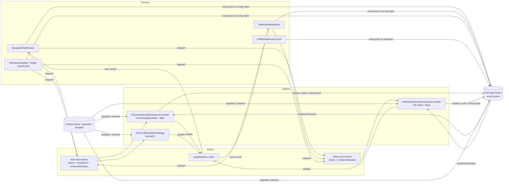
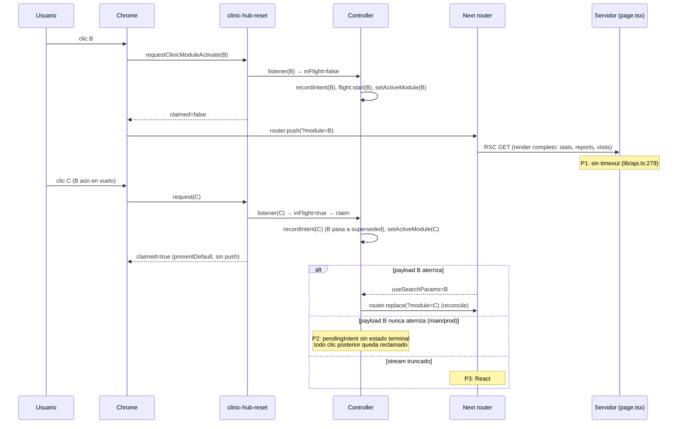
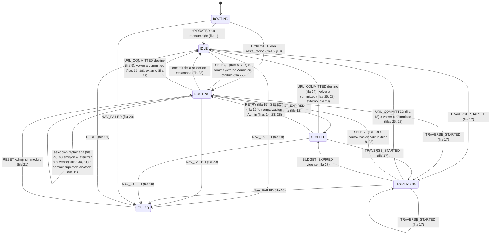
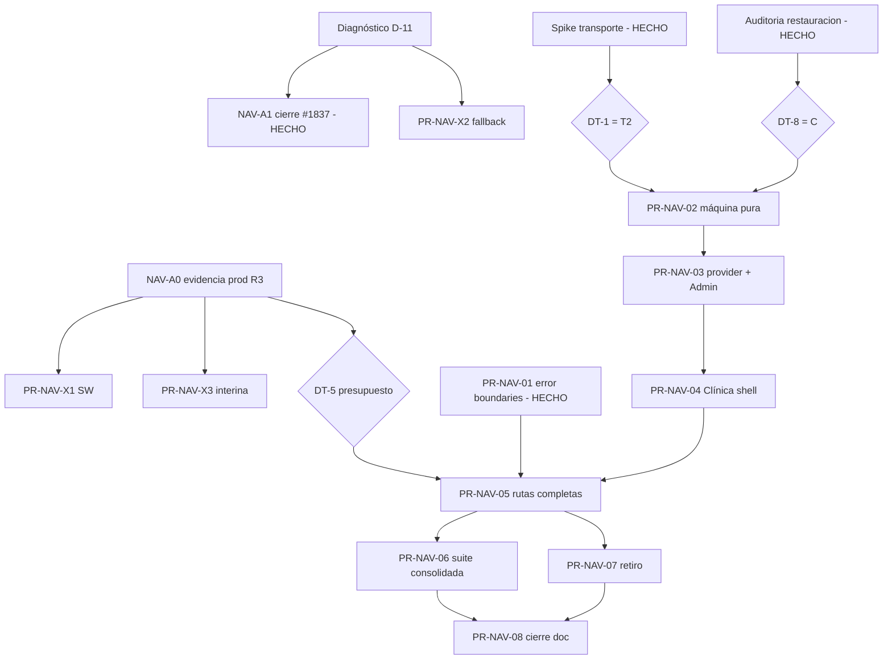

# Auditoría arquitectónica de navegación y hoja de ruta FSM

| Campo | Valor |
| --- | --- |
| Tipo | Auditoría docs-only (R0 lectura + R1 escritura de este documento) |
| Fecha | 2026-10-09 |
| Repositorio | `LABVETNEB/PORTAL-VETNEB` |
| Referencia auditada | rama `fix/dashboard-navigation-flight-budget`, HEAD `c35ebcb340e5a64b573292eef790a326bb6709c8` (head de PR #1837, abierta) |
| Base comparada | `main` = `37dbcaf6714f6ae7fb37eaad100370af2ab53cb8` (PR #1836) |
| Frontend productivo | `37dbcaf6` según sonda `/api/build-info` registrada el 2026-10-09 en una sesión previa; **no reverificado en esta sesión** (lectura de producción fuera del scope) |
| Stack verificado | Next.js `16.3.8` según `pnpm-lock.yaml` (desde #1834), React `19.3.0`. **Corrección rev. 2:** durante la auditoría original `frontend/node_modules` tenía `next@16.3.6` (instalación del 2026-10-07, anterior a #1834); la afirmación "leídos de `frontend/node_modules`" era inexacta para Next. Las pruebas válidas de rev. 2 (§15.2, §15.3) corrieron sobre `16.3.8` tras `pnpm install --frozen-lockfile` autorizado por Nico |
| Lifecycle status | Rev. 1: PROPUESTA. **Rev. 2 (2026-10-09): APROBADO por Nico** — DT-1 = T2, DT-2 = sin refresh por selección, restauración inicial = opción C, especificación FSM de 27 transiciones (§0). **Rev. 2.2 (2026-10-09) y rev. 2.2.1 (2026-10-10): enmiendas APROBADAS** de esa especificación con la fusión de su PR (#1841, `4f693d5c`, 2026-10-10); hasta entonces figuraban como propuestas (§0.4, §0.5). **Rev. 2.2.2 (2026-10-10): enmienda PROPUESTA** de la fila #10 (§0.6); queda aprobada cuando Nico fusiona su PR (#1843). **Rev. 2.3 (2026-10-10): rev. 2.2.2 quedó APROBADA** con la fusión de #1843 (`8d1a8812`). **Rev. 2.3 es una enmienda PROPUESTA** de §12–§13 (§0.7); queda aprobada cuando Nico fusiona su PR. **DT-5 = 10 000 ms, APROBADA por Nico** el 2026-10-10, y **DT-16 = A**, decidida el mismo día (§21) |
| Estado de implementación | **Estado vigente (rev. 2.3, 2026-10-10).** Productivo: **NO IMPLEMENTADO** (programa FSM). PR-NAV-01 (#1839, `c51b7e74`) y #1837 (`585bf3ba`) están fusionadas. **PR-NAV-02 está fusionada** (#1842, `0908bb02`): la máquina pura y su suite están en `main`, transcriben rev. 2.2.2 (245 tests) y sólo la suite importa la máquina. **PR-NAV-03 no se inició**: su verificación previa de H1 en navegador refutó el supuesto del que depende la fila #10 (C-11, §0.7), y queda **BLOQUEADA** hasta que esta revisión esté fusionada y la máquina y su suite se realineen con ella (§16). *Historia de esta fila, rev. 2.2.2:* Productivo: NO IMPLEMENTADO (programa FSM). La máquina pura existe pero no está conectada al dashboard: en #1842 sólo la importa su suite, y el provider y el intérprete de §12.5.1 corresponden a PR-NAV-03. PR-NAV-01 fusionada (#1839, `c51b7e74`); #1837 fusionada (`585bf3ba`). **PR-NAV-02 está publicada como PR #1842** (abierta, sin fusionar, head `541aabaa`): la implementación existe, transcribe rev. 2.2.1 y fue sometida a su verificación mecánica versionada, que pasa sobre ese head (241 tests; cuatro contextos required en verde). Queda **pendiente de corregir el hallazgo C-10** (P2 de su review, §0.6), y su **realineación está BLOQUEADA** hasta que se fusione la enmienda rev. 2.2.2. *Historia de esta fila:* rev. 2 decía que las 27 transiciones no tenían aún verificación mecánica y que correspondía a PR-NAV-02; rev. 2.2, que esa verificación se había ejecutado en local, que la tabla de rev. 2.1 no la superó (§0.4) y que PR-NAV-02 seguía sin publicar |
| Revisión 2 | 2026-10-09 sobre `main` = `c51b7e74`. Incorpora el spike de transporte SP-1..SP-7 y la auditoría de restauración R-1..R-8 (§0, §15.2, §15.3). La propuesta T1 de rev. 1 se conserva como historia y queda marcada como superada donde aplica |
| Revisión 2.2 | 2026-10-09 sobre `main` = `603c352f`. Enmienda docs-only de §11.3, §12, §13, §16 y §18–§21 tras la verificación mecánica de PR-NAV-02, que **falló** contra la tabla de rev. 2.1. Corrige ocho hallazgos (C-1..C-8, §0.4): la tabla pasa de 27 a **28 filas** y de 107 a **113 ramas de guard**; los invariantes, de S1–S11/L1–L5 a **S1–S12/L1–L6**. **PR-NAV-02 queda BLOQUEADA** hasta que esta revisión esté fusionada; su fusión equivale a la aprobación de Nico. La tabla enmendada se verificó sobre una copia temporal no versionada (§0.4, §23.5) |
| Revisión 2.2.1 | 2026-10-10, dentro de la misma PR (#1841). Corrige el P1 de su review: rev. 2.2 difería los efectos de `HYDRATED` al montaje del provider sin fijar su orden frente al `NAV_FAILED` de la frontera, y una restauración abandonada podía navegar y dejar un presupuesto vivo en `FAILED`. Agrega el **algoritmo de coordinación del intérprete** (§12.5.1, C-9) con invariantes de integración I1–I8. No cambia la máquina, la tabla ni S1–S12/L1–L6 (§0.5) |
| Revisión 2.2.2 | 2026-10-10 sobre `main` = `4f693d5c`, en la PR #1843. **Enmienda APROBADA** con la fusión de #1843 (`8d1a8812`; propuesta hasta entonces), docs-only, tras el P2 del review de PR-NAV-02 (#1842, head `541aabaa`): la fila #10 descartaba `afterTraverse`, y el commit tardío de un traverse abandonaba toda selección posterior a la primera (C-10, §0.6). Cambia **el estado siguiente de la fila #10** y agrega el invariante **S13**. No cambian los tipos, los guards, las 28 filas, las 113 ramas ni los 60 pares. **PR-NAV-02 queda BLOQUEADA** hasta que esta revisión esté fusionada; su fusión equivale a la aprobación de Nico. Verificada sobre una copia temporal no versionada (§0.6, §23.5). *Rev. 2.3:* esa fusión ocurrió (#1843, `8d1a8812`), y PR-NAV-02 se realineó con ella y se fusionó (#1842, `0908bb02`) |
| Revisión 2.3 | 2026-10-10 sobre `main` = `0908bb02`. **Enmienda PROPUESTA**, docs-only, tras la verificación en navegador que PR-NAV-03 debía hacer de H1 (§13.1): dos `router.push` de `?module=` no se descartan entre sí, y el primero puede aterrizar por su cuenta y dejar `[A, B, C]` (C-11, §0.7). La fila #10 emitía ese segundo `push`. La enmienda agrega el campo `next` a `ROUTING`, las filas **#29–#32** y el invariante **S14**; cambia las filas #9, #10, #11, #12, #16, #23, #25 y #26, los invariantes S4, S5, S13, L1 y L2, y los supuestos H1 y H3. La tabla pasa de 28 a **32 filas** y de 113 a **119 ramas**, sobre los mismos 60 pares. Registra además **DT-5 = 10 000 ms** y **DT-16 = A**, decididas por Nico. **PR-NAV-03 queda BLOQUEADA** hasta que esta revisión esté fusionada y la máquina realineada; su fusión equivale a la aprobación de Nico. Verificada sobre una copia temporal no versionada y medida en production runner (§0.7, §23.5) |

---

## 0. Revisión 2 — decisiones experimentales

Esta revisión sustituye la arquitectura de transporte T1 propuesta en rev. 1 por la decisión
experimental T2. No reescribe la evidencia de rev. 1: los diagnósticos §3–§10 conservan su texto
original, y las secciones normativas (§11–§22) marcan qué parte de la propuesta T1 quedó superada.

### 0.1. Decisiones aprobadas por Nico

| Id | Decisión | Evidencia | Sección |
| --- | --- | --- | --- |
| DT-1 | **T2**: `router.push` para módulos, hub y rutas completas, con `ROUTING` supervisado | SP-5 FAIL 0/10 (regla binaria de §15.2) | §11.2, §15.2 |
| DT-2 | **Ninguna selección inicia un `router.refresh()`**; la frescura llega con el render de la navegación | SP-4, SP-5 y D-10 extendido | §11.2, §21 |
| DT-8 | **Restauración inicial = opción C**: `router.replace` con `display = committed` hasta el commit | R-1..R-8 (175 corridas) | §15.3, §12.4 #2–#3 |
| — | **FSM de 27 transiciones** con invariantes S1–S11 y L1–L5. **Sin verificación mecánica todavía**: es el criterio de aceptación de PR-NAV-02 | Partición revisada a mano | §12, §13 |

### 0.2. Fuentes experimentales

Arnés y actas en el scratchpad de la sesión de Claude del 2026-10-09, **no versionados**:
`ACTA_SPIKE_DT1_TRANSPORTE.md`, `CONTRATO_FSM_T2_PR_NAV_02.md`, `evidence/results.json` (105 corridas
SP-1..SP-7) y `evidence-restore/restore-results.json` (175 corridas R-1..R-8). Entorno común: build de
producción de `c51b7e74` con Next `16.3.8` (`BUILD_ID C0uUMNcb2UNtPiY0Lv7pZ`), `next start` con
`CI=true` y las variables de `.github/workflows/frontend-ci.yml:130-135` (requisito de
`frontend/src/lib/api.ts:99-105`), fixture `frontend/e2e/fixtures/admin-populated-api-server.mjs` sin
modificar detrás de un proxy de control local, y Chromium headless de Playwright 1.63.0. No hay
mediciones productivas: H-01..H-08 siguen abiertas.

### 0.3. Matriz de trazabilidad de rev. 2

| Cambio | Antes (rev. 1) | Después (rev. 2) | Evidencia |
| --- | --- | --- | --- |
| Transporte de módulo | T1 `pushState` "recomendada" | T2 `router.push` | SP-5 0/10; control T2 en §15.2 |
| Frescura | `REFRESH_DATA` por selección | Render de la navegación; sin refresh | SP-4; SP-5; D-10 extendido 3/3 + 3/3 |
| Restauración (#2–#3) | `REPLACE_NATIVE` | `ROUTER_REPLACE`, `display = committed` | R-1 A FAIL / C PASS; R-2..R-8 |
| Tabla §12.4 | 24 filas con efectos nativos | 27 filas; `PUSH_NATIVE`, `REPLACE_NATIVE` y `REFRESH_DATA` eliminados | §12.4 (columna "Orig.") |
| Invariantes | S1–S8, L1–L4 | S1–S11, L1–L5 | §13 |
| Defectos | D-01..D-11 | + D-12 (restauración de Clínica muerta) | R-2 |
| Hipótesis | H-01..H-07 | + H-08 (refresh pendiente retiene commits) | SP-5 |
| Formulario "Aplicar" de auditoría | "usa el router" | `<form method="get">` (navegación de documento) | `AdminAuditFilterBar.tsx:57-69` |
| Versión de Next | "16.3.8 leído de `node_modules`" | 16.3.8 por lockfile; 16.3.6 instalado en rev. 1 | Encabezado |
| Escenarios "payload held" | Se reescribían a 0 `_rsc` | Siguen siendo contratos E2E | §16 PR-NAV-03 |
| Rev. 2.1 (review de #1840) | #1 persistía sólo `module`; `RESET` sin emisor real | #1 persiste `module` y `route` válidos; la frontera despacha `NAV_FAILED`/`RESET` y PR-NAV-03 la incluye en scope | §12.3, §12.4 #1/#20/#21, §12.5, §16 |
| Rev. 2.2 (verificación mecánica de PR-NAV-02) | Tabla de 27 filas "revisada a mano"; S1–S11, L1–L5 | 28 filas, 113 ramas de guard, S1–S12 y L1–L6; ocho correcciones C-1..C-8 | §0.4 |
| Rev. 2.2.1 (review de #1841, P1) | Efectos de `HYDRATED` "en un efecto" de montaje, sin regla de orden frente a los demás eventos | Algoritmo de coordinación del intérprete: cola FIFO, drenaje en microtarea, vigencia por `navId`, conciliación de timers; I1–I8 y P1–P4 (C-9) | §0.5, §11.3, §12.5.1 |
| Rev. 2.2.2 (review de #1842, P2) | Fila #10: toda selección que reemplaza un vuelo lo deja con `afterTraverse = false` | Fila #10: el vuelo nuevo hereda `afterTraverse`; invariante S13 (C-10) | §0.6, §12.4 #10/#26, §13 |
| Rev. 2.3 (H1 medido en navegador para PR-NAV-03) | H1: "una navegación nueva descarta la pendiente"; fila #10: toda selección sobre un vuelo emite `ROUTER_PUSH` de inmediato; fila #11: el commit superado no cambia nada | H1 y H3 según lo medido; un vuelo de usuario **reclama** la selección siguiente (`next`, #29) y la emite una vez, al aterrizar (#30) o al vencer su presupuesto (#31); #11 anota `committed`; #32; S14 (C-11). DT-5 = 10 000 ms | §0.7, §12.1, §12.4, §13, §13.1, §21 |

### 0.4. Revisión 2.2 — enmienda tras la verificación mecánica

PR-NAV-02 implementó la tabla de rev. 2.1 **sin reinterpretarla** y la sometió a tres oráculos
independientes: 152 casos literales (uno por rama de guard), la columna "Guard" transcrita fila por
fila como predicados sin orden, y los invariantes de §13 comprobados tras cada transición de un recorrido
exhaustivo y de 10 000 trazas con semilla. Resultado: **193 tests, 185 en verde y 8 en rojo**, todos
ellos contraejemplos de la especificación, no de la implementación. §16 prohíbe que PR-NAV-02 corrija
la tabla por su cuenta; esta revisión es la enmienda.

Estado de esa implementación: existe sólo en local (rama `feat/dashboard-navigation-machine`, sin
commit), transcribe rev. 2.1 y **no** se publica hasta realinearla con esta revisión.

Matriz de hallazgos y correcciones. "Mín." = traza mínima encontrada por el recorrido en anchura.

| Id | Hallazgo contra rev. 2.1 | Traza mínima | Corrección de rev. 2.2 | Secciones |
| --- | --- | --- | --- | --- |
| C-1 | **L5 roto**: Admin reposa en `IDLE` sin módulo. #9 y #14 confirmaban sin la normalización que `settle` da a #18 | Admin: `HYDRATED(módulo)` → `TRAVERSE_STARTED(none)` (#17) → `BUDGET_EXPIRED` (#27) → `URL_COMMITTED(none)` (#14) ⇒ `IDLE` en `none`. Variante `RETRY` (#15 → #9). En contrato: Back a una entrada desnuda cuyo payload supera el presupuesto | **Todo commit obedecido pasa por `settle`**, incluidos #9 y #14 | §12.4 `settle`, #9, #14; §13 L5 |
| C-2 | **Solapamiento #9/#11 y #14/#11, y S4 roto**: `settle` no decía qué hacía su rama de normalización con `superseded`; vía #23 re-armaba un target que seguía ahí. La premisa "disjuntos porque `T ∉ superseded`" era falsa | Admin: `HYDRATED(none)` (#3) → `SELECT_MODULE(B)` (#10, `superseded = {default}`) → `URL_COMMITTED(default)` (#11, commit tardío de la restauración) → `URL_COMMITTED(none)` (#23, normaliza a `default` con `superseded = {default}`) → `URL_COMMITTED(default)` ⇒ #9 **y** #11 | La normalización de `settle` **vacía `superseded`**, igual que su rama `IDLE` | §12.4 `settle`, partición; §13 S4 |
| C-3 | **L1 roto en su redacción**: en `ROUTING restore`, seleccionar el módulo que se restaura se ignora (ya está en vuelo) pero `display = committed`, así que ni se emite `ROUTER_PUSH` ni "el destino ya se muestra" | Ambas superficies: `HYDRATED` con restauración (#2/#3) → `SELECT_MODULE(T)` | **L1 se reformula** sobre el *destino vigente*; la tabla no cambia y no se agrega ningún `ROUTER_PUSH` redundante | §13 L1 |
| C-4 | **`initial()` sin especificar**: §12.1 fijaba la firma, no los valores de `committed`/`display` | — (hueco de contrato) | Valores, observabilidad y orden de `HYDRATED` definidos | §12.1 |
| C-5 | **`PERSIST` sin guard `valid` fuera de #1**: #9, #14 y `settle` persistían cualquier `module`, también el de una ruta sin módulo resoluble, contra el contrato de rev. 2.1 | Clínica: `URL_COMMITTED(ruta sin módulo válido)` (#22) ⇒ `PERSIST(módulo inválido)` | `persistable(L)` en **toda** persistencia; invariante nuevo S12 | §12.4 `persistable`, `settle`, #1; §13 S12 |
| C-6 | **`FAILED` sin salida real**: Next resetea la frontera cuando cambia el pathname (`error-boundary.js:82-90`), sin pasar por "Reintentar"; nadie despacha `RESET` y la máquina ignora todo lo demás | Clínica: error en `/dashboard/informes` → Back a `/dashboard` ⇒ contenido válido en pantalla y máquina en `FAILED` | La frontera despacha `RESET` **al desmontarse**, además de en "Reintentar"; el adaptador no reclama selecciones en `FAILED` | §11.3, §12.1, §12.3, #21, §12.6, §16 |
| C-7 | **S5 sin verificación**: §13 lo asignaba a PR-NAV-02 "sobre historial simulado" y §16 no lo listaba | — (obligación sin modelo) | Modelo abstracto de historial H1–H7; S5 formalizado; parte mecánica y parte E2E separadas | §13, §13.1, §16, §18 |
| C-8 | **Vuelo hacia la ubicación comiteada** (hallado por el modelo de C-7): un vuelo cuyo destino es `committed` no puede recibir `URL_COMMITTED`, porque la ubicación no cambia; sólo lo termina el presupuesto, con `STALLED` espurio. Rev. 2.1 aplicaba este principio en #24 y #25 pero no en dos orígenes | (a) Back y, antes de su commit, Forward: `TRAVERSING(D)` → `TRAVERSE_STARTED(committed)` (#17). (b) Back y, antes de su commit, clic en el módulo comiteado: `TRAVERSING(D)` → `SELECT_MODULE(committed)` (#19) | **#25 se extiende a `TRAVERSING`**; fila nueva **#28** (traverse hacia `committed` desde `ROUTING`/`STALLED`/`TRAVERSING`); invariante nuevo L6 | §12.4 #17, #19, #25, #28; §13 L6 |

Verificación mecánica de la enmienda. Se ejecutó sobre una **copia temporal** de la máquina y de la suite
(§23.5); la implementación local de PR-NAV-02 no se modificó. "Antes" = suite de PR-NAV-02 sin tocar
contra la máquina de rev. 2.1.

| Comprobación | Antes (rev. 2.1) | Después (rev. 2.2) |
| --- | --- | --- |
| Tests | 193: 185 en verde, 8 en rojo | 213: 213 en verde |
| Casos literales / ramas de guard / pares | 152 / 107 / 60 | 165 / 113 / 60 |
| Situaciones sin exactamente una fila | `#9 + #11` ×83, `#11 + #14` ×63; 0 huecos | 0 solapamientos, 0 huecos |
| L5 | roto en 228 transiciones | 0 |
| S4 | roto en 146 transiciones | 0 |
| L1 | roto en 615 transiciones (redacción de rev. 2.1) | 0 (redacción de rev. 2.2) |
| `PERSIST` de un módulo que la superficie no tiene | 29 355 (sin invariante que lo midiera) | 0 (S12) |
| Vuelos huérfanos en el modelo de historial | 572 en 4 000 sesiones, medido con C-1..C-5 aplicados y C-8 sin aplicar | 0 (L6) |
| Recorrido exhaustivo | 2 155 estados Admin + 12 687 Clínica; 393 754 transiciones | 1 456 + 9 274; 285 528 transiciones |
| Trazas aleatorias | 10 000; 208 726 transiciones; hash `5aaf3e1712bed977` | 10 000; 209 734 transiciones; hash `a73a97e2406c9242` |
| Sesiones en lazo cerrado (§13.1) | no existían | 4 000; 80 255 transiciones; hash `d4f699cdb8cab0f9` |

Lo que esta verificación **no** prueba: los supuestos H1–H7 del modelo de historial son contratos de
integración con Next y con el provider. Sólo un E2E los confirma, y queda como obligación de PR-NAV-03/04
(§13.1). Los hashes de la columna "Después" son los de la copia temporal: PR-NAV-02 los re-ancla al
portar la enmienda y los reporta.

Decisiones que esta revisión incorpora y que Nico aprueba al fusionarla: DT-9 (señal de salida de
`FAILED`), DT-10 (el adaptador no reclama en `BOOTING`/`FAILED`) y DT-11 (un vuelo hacia `committed` se
resuelve en la transición), en §21.

### 0.5. Revisión 2.2.1 — P1 del review de #1841 (C-9)

El review de la PR de rev. 2.2 (#1841, thread sobre §11.3) encontró un defecto en la propia enmienda.
No afecta a la máquina ni a la tabla de §12.4: afecta al **contrato del intérprete**.

| Campo | Contenido |
| --- | --- |
| Id | C-9 |
| Texto defectuoso | §11.3 de rev. 2.2: "`HYDRATED` se aplica al crear el store […]. Los efectos que produce `HYDRATED` sí se interpretan en un efecto" de montaje del provider |
| Causa | El mismo párrafo establecía que los efectos de un hijo corren antes que los del padre. Diferir los efectos de `HYDRATED` al efecto del provider los deja **detrás** del `NAV_FAILED` que la frontera despacha en el suyo. Rev. 2.2 no decía si los efectos de un evento se ejecutan al despacharlo ni en qué orden respecto de los diferidos: un intérprete conforme podía ejecutar `CANCEL_BUDGET(1)` antes que `ARM_BUDGET(1)` |
| Consecuencia | Con un fallo de render en la carga inicial y restauración (#2/#3): el `ROUTER_REPLACE` de una restauración ya abandonada navega después del fallo, y queda un presupuesto vivo con la máquina en `FAILED`. La máquina ignora el `BUDGET_EXPIRED` tardío (S3), pero el timer existe y la navegación sale |
| Alcance real | El defecto no es exclusivo del arranque. Sin una regla de coordinación, cualquier par de eventos despachados antes de ejecutar los efectos del primero lo reproduce: `RESET` con la cola pendiente (dos `router.replace` y dos timers), dos selecciones antes del primer drenaje, el doble montaje de StrictMode (pierde el presupuesto) y el `RESET` que llega con el provider ya desmontado |
| Corrección | Algoritmo de coordinación normativo, §12.5.1: transición al despachar, cola FIFO única de efectos, drenaje en microtarea con el provider montado, **vigencia por `navId`** al ejecutar y conciliación de timers al cierre. Invariantes de integración I1–I8 y supuestos de plataforma P1–P4 |
| Lo que no cambia | `transition()`, los tipos de §12.1, las 28 filas, las 113 ramas, S1–S12 y L1–L6. PR-NAV-02 no se ve afectada: el intérprete es de PR-NAV-03 |

Reproducciones sobre un modelo temporal del intérprete, que envuelve la copia de la máquina de rev. 2.2
(§23.5). "V0" ejecuta el texto de rev. 2.2 al pie de la letra: efectos de `HYDRATED` en el montaje del
provider y el resto al despachar. "V1" es el algoritmo de §12.5.1.

| # | Reproducción | V0 (rev. 2.2) | V1 (rev. 2.2.1) |
| --- | --- | --- | --- |
| R1 | `HYDRATED` → restauración → `NAV_FAILED` en un commit posterior | Correcto: `router.replace` emitido antes del fallo, presupuesto cancelado | Igual |
| R2 | `NAV_FAILED` antes de drenar los efectos de `HYDRATED` (**el P1**) | **Falla**: orden `CANCEL_BUDGET(1)` → `ROUTER_REPLACE` → `ARM_BUDGET(1)`; termina en `FAILED` con el timer 1 vivo y un `router.replace` emitido | `FAILED`, 0 timers, 0 navegaciones |
| R3 | `RESET` con la cola pendiente (entrada desnuda de Admin) | **Falla**: 2 `router.replace` y timers 1 y 2 vivos | `ROUTING(2)`, 1 `router.replace`, timer 2 |
| R4a | Desmontaje de la frontera en una tarea posterior | Correcto | Igual: `RESET` reconcilia, `IDLE` |
| R4b | Salida del dashboard con la frontera montada, en ambos órdenes de limpieza | **Falla**: `router.replace` y timer con el provider desmontado | 0 navegaciones, 0 timers |
| R5 | Dos selecciones y un traverse reemplazan la restauración inicial antes del primer drenaje | **Falla**: 3 navegaciones y 2 timers | 1 `router.push` (el último destino), 1 timer |
| R6 | Callback tardío de un timer después de `FAILED` | Correcto: par ignorado | Igual |
| R7 | StrictMode: doble montaje del provider y de la frontera en el mismo flush | **Falla**: 2 `router.replace` emitidos, uno de ellos ya en `FAILED`, y la máquina termina en `FAILED` | `FAILED`, 0 timers, 0 navegaciones |
| R7b | StrictMode sin fallo: doble montaje del provider | **Falla**: la limpieza cancela el timer y nadie lo re-arma | 1 `router.replace`, 1 timer |
| R8.1–R8.6 | Error durante la hidratación: Admin desnudo con y sin almacenado, Admin con módulo, Clínica desnuda con y sin almacenado, Clínica en ruta completa | **Falla** en los tres casos con restauración (R8.1, R8.2, R8.4): igual que R2 | Los seis: `FAILED`, 0 timers, 0 navegaciones |

Búsqueda aleatoria: tareas compuestas por despachos, montajes y desmontajes del provider y disparos de
timer, con los oráculos I1–I8 evaluados al ejecutar cada efecto y al final de cada tarea.

| Variante | Semilla `0x50314631` (20 000 ejecuciones, ≈ 169 000 tareas) | Semilla `0x0badc0de` |
| --- | --- | --- |
| V1, algoritmo de §12.5.1 | **0 violaciones** | **0 violaciones** |
| M1: sin vigencia | I7 ×30 359, I2 ×18 428, I8 ×21 665 | I7 ×30 421, I2 ×18 409, I8 ×21 606 |
| M2: drenaje síncrono en vez de microtarea | I8 ×9 294 | I8 ×9 325 |
| M3: vigencia por "última transición" en vez de por `navId` | I6 ×117 | I6 ×75 |
| M4: sin conciliación de timers (A6) | I3 ×961 | I3 ×1 034 |
| M5: drena con el provider desmontado | I4 ×173 759 | I4 ×171 859 |

Lectura de la tabla: cada elemento del algoritmo es necesario, y los oráculos detectan su ausencia. M3
es el caso menos obvio: descartar todo efecto que no sea de la última transición deja en `ROUTING`, sin
navegación emitida, el vuelo que la fila #26 conserva.

Regresión: la suite de rev. 2.2 se re-ejecutó sin cambios contra la misma copia de la máquina: 213 de
213. El modelo del intérprete compila con `tsc --strict`.

Límites, explícitos: (1) el modelo no ejecuta React ni Next; P1–P4 son supuestos hasta PR-NAV-03. (2) La
primera versión del algoritmo re-armaba el presupuesto sólo al montar y la búsqueda aleatoria la refutó
con un `BUDGET_EXPIRED` entregado sin que el timer hubiera disparado; de ahí la conciliación de cierre
A6, que hace cumplir I3 también frente a un evento así. (3) "A5: un efecto que lanza no detiene el
drenaje" es una regla de robustez no modelada. Decisión nueva: DT-12 (§21).

### 0.6. Revisión 2.2.2 — P2 del review de #1842 (C-10)

PR-NAV-02 se publicó como #1842 (head `541aabaa`) transcribiendo rev. 2.2.1, con su suite completa en
verde. El review dejó un P2 (thread `PRRT_kwDOR5qlsc6rBw_4`, "Preserve afterTraverse across replacement
selections") que no es un defecto de la implementación: es un contraejemplo de la **fila #10**. Ningún
oráculo de rev. 2.2.1 podía verlo, porque la tabla era su propio oráculo en ese punto. §16 prohíbe que
PR-NAV-02 corrija la tabla por su cuenta; esta revisión es la enmienda.

| Campo | Contenido |
| --- | --- |
| Id | C-10 |
| Texto defectuoso | §12.4, fila #10 de rev. 2.2.1: `ROUTING(n, X, user, push, false)`. Toda selección que reemplaza un vuelo lo deja con `afterTraverse = false` |
| Causa | `afterTraverse` es lo que hace que el commit de un traverse abandonado tome #26 (anotar `committed` y seguir en vuelo) y no #23 (obedecerlo como externo). #19 lo enciende para el primer clic posterior al traverse; #10 lo apagaba en el segundo, con ese commit todavía pendiente |
| Consecuencia | Back → C → D y el commit tardío del traverse: #23 cancela el presupuesto de D, persiste el módulo de la entrada de historial y deja `IDLE` en ella, con el `push` de D todavía en el router sin vuelo que lo supervise. Si ese commit se despacha antes del primer drenaje (§12.5.1), el `ROUTER_PUSH(D)` deja de estar vigente y **nunca sale**: el clic se pierde. En Admin, si el traverse iba a la entrada desnuda, `settle` emite además un `ROUTER_REPLACE` al último módulo, que pisa el clic |
| Alcance real | Las dos superficies, módulos, hub y rutas completas, y cualquier longitud de ráfaga a partir de dos selecciones. Sólo es observable si H1 no vale para un `push` sobre un traverse pendiente (§13.1): es un hueco de la **defensa** #26, no del camino nominal |
| Corrección | La fila #10 **hereda** `afterTraverse` del vuelo que reemplaza. Invariante nuevo S13, que fija cuándo vale el flag en ambos sentidos (ni se pierde antes ni se retiene después) |
| Lo que no cambia | Los tipos de §12.1, todos los guards, las 28 filas, las 113 ramas, los 60 pares, S1–S12, L1–L6 y el algoritmo de §12.5.1. En lazo cerrado bajo H1–H7 la máquina recorre las mismas transiciones que antes |

Traza mínima del hallazgo (Clínica; la misma forma vale para Admin, hub y rutas completas):

| # | Evento | Rev. 2.2.1 | Rev. 2.2.2 |
| --- | --- | --- | --- |
| 1 | `HYDRATED(operaciones)` | #1 → `IDLE` | igual |
| 2 | `TRAVERSE_STARTED(informes)` | #17 → `TRAVERSING(1, informes)` | igual |
| 3 | `SELECT_MODULE(logistica)` | #19 → `ROUTING(2, logistica, afterTraverse)` | igual |
| 4 | `SELECT_MODULE(perfil)` | #10 → `ROUTING(3, perfil)`, **sin** `afterTraverse`; `superseded = {logistica}` | #10 → `ROUTING(3, perfil, afterTraverse)`; `superseded = {logistica}` |
| 5 | `URL_COMMITTED(informes)` | **#23** → `IDLE` en `informes`; `CANCEL_BUDGET(3)`, `PERSIST(informes)`, `PUBLISH_DISPLAY` | **#26** → `ROUTING(3, perfil)`, `committed = informes`, sin efectos |
| 6 | `URL_COMMITTED(perfil)` | #22 → `IDLE` en `perfil` (si el `push` llegó a salir) | #9 → `IDLE` en `perfil`; `CANCEL_BUDGET(3)`, `PERSIST(perfil)`, `PUBLISH_DISPLAY` |

Verificación mecánica. Como en §0.4, se ejecutó sobre una **copia temporal** de la máquina y de la suite
de #1842 (§23.5); el repositorio no se modificó. "Antes" = los dos archivos de `541aabaa` sin tocar.

| Comprobación | Antes (rev. 2.2.1, `541aabaa`) | Después (rev. 2.2.2) |
| --- | --- | --- |
| Suite de #1842 sin cambios | 241 de 241: el defecto es invisible | — |
| Reproducción dirigida del P2 (8 variantes: Admin y Clínica, 2 y 3 selecciones, hub, rutas completas) | 8 en rojo; 2 controles en verde (una sola selección; selección repetida) | 10 de 10 |
| Suite con S13 agregado | 242 tests, 2 en rojo: el caso literal de #10 y S13 | 245 de 245 (incluye tres trazas nombradas de C-10) |
| S13 | Roto en 1 820 de 209 734 transiciones aleatorias y en 20 080 de 327 438 recorridas. Mínimo (Admin, 4 eventos): `HYDRATED(none)` (#3) → `TRAVERSE_STARTED(admin)` (#17) → `SELECT_MODULE(admin-clinics)` (#19) → `SELECT_MODULE(admin)` (#10) | 0 |
| Casos literales / ramas de guard / pares / filas | 171 / 113 / 60 / 28 | 171 / 113 / 60 / 28 |
| Situaciones sin exactamente una fila | 0 | 0 |
| Recorrido exhaustivo | 1 456 estados Admin + 9 274 Clínica; 285 528 transiciones | 1 576 + 10 724; 327 438 transiciones (los estados nuevos son `ROUTING` con `afterTraverse` y `superseded` no vacío) |
| Trazas aleatorias (semilla `0x4e415632`) | 10 000; 209 734 transiciones; hash `a73a97e2406c9242`; #23 ×6 812, #26 ×574 | 10 000; 209 653 transiciones; hash `d6b4b32f4822884a`; #23 ×6 687, #26 ×696 |
| Trazas del universo amplio (semilla `0x57494445`) | 2 000; 41 321 transiciones; hash `7c133347a5c95876` | 2 000; 41 212 transiciones; hash `17abdaccdca4ee3b` |
| Sesiones en lazo cerrado (semilla `0x53355632`) | 4 000; 80 255 transiciones; hash `d4f699cdb8cab0f9` | 4 000; **las mismas 80 255 transiciones y los mismos conteos por fila**; hash `f3b66b570889461e` (cambia sólo el texto canónico de `ROUTING`); 16 700 ráfagas, 10 905 entradas, 0 vuelos huérfanos |
| Mutaciones fuera de árbol | 76 de 76 detectadas (sesión de PR-NAV-02; no repetidas aquí contra `541aabaa`) | 89 de 89: las 76 anteriores y 13 nuevas sobre la procedencia (#10 que descarta, fija o invierte el flag; flag inventado en #5, #15, #16 y `settle`; #26 que no salda; #11 que salda) |
| Modelo del intérprete de §0.5 (2 × 20 000 ejecuciones, I1–I8) | 0 violaciones; el P2 en una sola tarea termina en `IDLE` con **0 navegaciones emitidas** | 0 violaciones; el mismo caso termina en `ROUTING` hacia el último clic, con una navegación y un timer |

Auditoría adversarial de la enmienda, también sobre la copia. Su propósito es refutarla, y separa lo que
C-10 cierra de lo que no toca:

| Prueba | Resultado |
| --- | --- |
| Cinco semillas más por campaña (10 000 trazas base, 10 000 amplias y 4 000 sesiones cada una) | 0 invariantes rotos, 0 situaciones sin fila única, 0 vuelos huérfanos |
| Tormenta de selecciones, traverses y commits fuera de orden (3 × 20 000 trazas, ≈ 450 000 transiciones cada una), con un oráculo de **resultado** que no lee `afterTraverse` | El commit del traverse llega durante su ráfaga 1 316, 1 333 y 1 348 veces: el vuelo se conserva siempre. Con rev. 2.2.1, 206 de 1 322 lo abandonaban. Ráfagas de hasta 9 selecciones. En el otro sentido, un commit ajeno con nada pendiente se obedece siempre (12 116 de 12 116): el flag no se retiene de más |
| Router con H1 relajado: un `push` deja vivo al traverse pendiente con probabilidad 0,6 (8 000 sesiones, semilla `0x48315831`) | Vuelos de usuario abandonados por el commit de ese traverse **en una ráfaga ininterrumpida**: 123 en rev. 2.2.1, **0** en rev. 2.2.2 |
| El mismo router bajo H1 | Rev. 2.2.1 y rev. 2.2.2: ningún abandono, ningún vuelo terminado sólo por presupuesto |

Lo que C-10 **no** cierra, medido en el mismo router relajado. Son clases que ya existían en rev. 2.2.1,
que no dependen de la fila #10 y cuyos números no cambian con la enmienda más allá del ruido del
generador:

| Clase | Rev. 2.2.1 | Rev. 2.2.2 | Estado |
| --- | --- | --- | --- |
| El traverse se abandona volviendo a `committed` (#25/#28), la máquina reposa, y un clic posterior (#5) es abandonado por el commit de ese traverse | 180 | 176 | Extensión del costo aceptado de C-8 (DT-11): `IDLE` no lleva procedencia. Lo cubriría la opción B de DT-14 llevada al contexto |
| La ráfaga pasa por `STALLED` y un clic posterior (#16) es abandonado | 29 | 29 | Decisión de rev. 2: `STALLED` no conserva `afterTraverse` (§19) |
| Vuelos que sólo termina su presupuesto, sin autoridad externa | 2 | 3 | Traverse que se traba (#27), se reemplaza (#16) y aterriza después: #11 ignora su commit, `committed` queda atrás y una selección de esa ubicación vuela hacia la URL vigente. Costo de S4 cuando H1 falla (§19) |
| Lo mismo con una autoridad ajena a la máquina navegando | 72 | 71 | `afterTraverse` booleano anota un commit que no es el del traverse (§19); la enmienda no lo agrava de forma medible |

Límites, explícitos: (1) nada de esto se ejecutó en un navegador; si un traverse sobrevive o no a un
`push` es H1, y lo decide el E2E de PR-NAV-03. (2) El router relajado es un modelo adversarial, no una
descripción de Next: sirve para comparar las dos revisiones, no para estimar frecuencias. (3) Los hashes
de la columna "Después" son los de la copia temporal: PR-NAV-02 los re-ancla al realinearse y los
reporta. Decisión nueva: DT-14 (§21).

### 0.7. Revisión 2.3 — H1 refutado en navegador (C-11) y DT-5

PR-NAV-02 se fusionó como #1842 (`0908bb02`). La ficha de PR-NAV-03 exige confirmar en navegador los
supuestos H1–H7 del modelo de historial (§13.1), y esa comprobación se hizo **antes** de escribir el
intérprete, sobre el build de producción de `0908bb02`. H1 resultó falso en el caso del que depende la
fila #10. No es un defecto de la implementación de #1842, que transcribe la tabla: es un contraejemplo de
la **especificación**, y §16 prohíbe que un PR de implementación la corrija por su cuenta.

| Campo | Contenido |
| --- | --- |
| Id | C-11 |
| Texto defectuoso | §13.1, H1: "una navegación nueva, un traverse o una navegación de documento **descartan** la pendiente". §12.4, fila #10: toda selección sobre un vuelo emite `ROUTER_PUSH(X)` en la misma transición. §12.4, fila #11: el commit superado "sin cambios" |
| Causa | Un `router.push` de `?module=` no descarta al `router.push` pendiente: las dos navegaciones conviven en el router y cada una aterriza cuando llega su payload. Rev. 2.2 dejó escrito que H1 no tenía evidencia ejecutada para `push` sobre `push`; existía, en contra, y versionada: `docs/implementation/dashboard-stage-module-single-owner.md`, §M2, "dos `router.push` directos con B liberado antes que C: `[A, B, C]` en 8/8". Esta revisión la reprodujo |
| Consecuencia | A → B → C con B respondiendo antes que C deja `[A, B, C]`: Back desde C cae en B, el módulo que el usuario abandonó. Es el síntoma 2 que #1835 corrigió. La fila #11 evita que B se pinte, pero no que escriba su entrada, y deja a la máquina con `committed` atrasado respecto de la URL: una selección posterior de ese destino vuela hacia la URL vigente y sólo la termina su presupuesto |
| Alcance real | Las dos superficies, toda ráfaga de dos o más selecciones antes del primer commit. La ficha de PR-NAV-03 exigía a la vez "`history.length` crece 1 en una ráfaga A→B→C" y que el bloque *single flight* de `dashboard-real-pointer-navigation.spec.ts` siguiera en verde sin debilitarse; ese bloque afirma que la segunda elección **no pide payload** mientras la primera está en vuelo. Con rev. 2.2.2 lo segundo falla por construcción, y lo primero en 7 de las 10 corridas de E1 |
| Corrección | La máquina **no emite una segunda navegación de usuario** mientras la primera está en vuelo y dentro de su presupuesto: la selección siguiente se **reclama** (campo `next`, fila #29) y sale a lo sumo una vez, como `replace` cuando el vuelo aterriza (#30) o como relevo cuando su presupuesto vence (#31). Es el mecanismo que #1835 y #1837 ya tienen en producción, llevado a la tabla. H1 y H3 se reescriben según lo medido |
| Lo que no cambia | Los 60 pares, los seis estados, los diez eventos, los siete efectos, `initial()`, `settle`, `persistable`, las filas #1–#8, #13–#15, #17–#22, #24, #27 y #28, S1–S3, S6–S12, L3–L6 y el algoritmo de §12.5.1 |

Mediciones. Production runner local (`next start`, `CI=true`, build con las variables de
`frontend-ci.yml`), Next `16.3.8`, `BUILD_ID O74pOz5kAF84iClwC31BH`, Chromium headless de Playwright
1.63.0, 1366×768, fixture sin modificar. Los payloads `_rsc` se retienen con `page.route` y se
**continúan**, nunca se abortan ni se simulan. Las navegaciones se emiten con `window.next.router`, que es
lo que hará el intérprete. Cinco corridas por caso y superficie, 90 en total.

| # | Secuencia | Admin | Clínica |
| --- | --- | --- | --- |
| E1 | `push` B, `push` C; B responde primero (**lo que emite la fila #10**) | `[A, B, C]` 4/5; `[A, C]` 1/5 | `[A, B, C]` 3/5; `[A, C]` 2/5 |
| E2 | `push` B, `push` C; C responde primero | `[A, C]` 5/5; la respuesta tardía de B no escribe historial | 5/5 |
| E3 | `push` B, `push` A con A comiteado (fila #25) | B nunca comitea 5/5; el `push` a la URL vigente **pide un `_rsc`** y termina en `replaceState(A)` | 5/5 |
| E4 | Back cruzando un reload con su `_rsc` retenido, luego `push` C | URL y stage en el destino del traverse **al instante**, con el payload todavía retenido, 5/5; C aterriza sin entrada de más | 5/5 |
| E5 | `push` B; B aterriza; `replace` C (**filas #29 y #30**) | `[A, C]` 5/5; Back → A, Forward → C | 5/5 |
| E6 | `push` B; `replace` C al aterrizar B; `replace` D al aterrizar C | `[A, D]` 5/5 | 5/5 |
| E7 | `replace` B, `push` C, en ambos órdenes de respuesta (restore superado por un clic, fila #10) | +1 entrada 10/10: `[B, C]` o `[A, C]` según el orden y el plegado, nunca dos | 10/10 |
| E8 | `push` B, `push` C, B aterriza, `replace` C con el `push` de C todavía pendiente | `[A, C]` 4/5; `[A, B, C]` 1/5 | `[A, C]` 5/5 |

Lectura. E1 refuta H1 para `push` sobre `push`; E2 y E1 juntos dicen qué vale en su lugar: una navegación
que aterriza termina a las que se emitieron **antes** que ella, no a las posteriores. E3 confirma la
premisa de la fila #25. E4 muestra que un traverse dentro de la misma página comitea de inmediato, de
modo que la ventana en que #19 y #26 pueden actuar es de un commit. E5 y E6 son el mecanismo de la
enmienda. E7 dice que un `push` sobre un `replace` pendiente es seguro en los dos órdenes, y por eso un
vuelo `restore` conserva la fila #10. E8 es la reconciliación que #1837 hace hoy sobre una navegación
abandonada por presupuesto: mejora E1 sin garantizarlo.

Diseño, en una línea por pieza. Todas salen de la misma causa: las navegaciones superadas **sí
aterrizan**, así que las filas que rev. 2.2 trataba como defensas muertas están vivas.

| Pieza | Regla | Origen |
| --- | --- | --- |
| `next` | `ROUTING` lleva la selección reclamada, o nada. `target` sigue siendo la navegación que está en el router | E1, E5 |
| #29 | Un vuelo de **usuario** reclama la selección: mismo `navId`, mismo presupuesto, ningún efecto de navegación | Bloque *single flight* del E2E; E5 |
| #30 | El vuelo aterriza con una selección reclamada: sale como `ROUTER_REPLACE` sobre la entrada recién escrita, con vuelo y presupuesto nuevos | E5, E6 |
| #31 | El presupuesto vence con una selección reclamada: se releva una vez, con el mismo tipo de historial del vuelo que abandona | Bloque *abandoned flight* del E2E (#1837) |
| #32 | Otra navegación comitea la selección reclamada: se reposa en ella y se descarta el vuelo del router con un `push` a la URL vigente | Hallado por el modelo de historial; E3 |
| #10 | Queda sólo para vuelos `restore`: el clic sale de inmediato | E7 |
| #11 | El commit superado no se pinta, pero **anota `committed`**: es donde está la URL | Hallado por el modelo de historial (vuelos huérfanos) |
| #16 | Un vuelo de continuación trabado se re-emite como `replace`: su ráfaga ya tiene entrada | Hallado por el modelo de historial (segunda entrada) |

Verificación mecánica. Como en §0.4 y §0.6, sobre una **copia temporal** de la máquina y de la suite de
`0908bb02` (§23.5); el repositorio no se modificó. "Antes" = los dos archivos de `main` sin tocar. El
modelo de historial de la columna "Después" interpreta H1 y H3 **como se midieron** (§13.1).

| Comprobación | Antes (rev. 2.2.2, `0908bb02`) | Después (rev. 2.3) |
| --- | --- | --- |
| Suite sin cambios | 245 de 245: el defecto es invisible mientras el modelo asume H1 | — |
| El modelo de historial medido contra la máquina de rev. 2.2.2 (4 000 sesiones, misma semilla) | **714 de 15 840 ráfagas** con una segunda entrada dentro de presupuesto; 88 vuelos y 8 *stalls* huérfanos; 17 sesiones que no llegan a reposar; `committed` distinto de la URL en 3 020 pasos | — |
| Suite enmendada contra la máquina enmendada | — | **280 de 280** |
| Filas / pares / ramas / casos literales | 28 / 60 / 113 / 171 | 32 / 60 / 119 / 198 |
| Situaciones sin exactamente una fila | 0 | 0 |
| Recorrido exhaustivo | 1 576 estados Admin + 10 724 Clínica; 327 438 transiciones | 6 406 + 94 674; 2 705 178 transiciones (los estados nuevos son `ROUTING` con `next`) |
| Invariantes por transición (S1, S3–S6, S9–S14, L1–L6 y los de emisión) | S14 no existía | 0 violaciones en el recorrido, las trazas y las sesiones |
| Trazas aleatorias (semilla `0x4e415632`) | 10 000; 209 653 transiciones; hash `d6b4b32f4822884a` | 10 000; 210 737 transiciones; hash `41b04f215052b219`; #29 ×9 535, #30 ×1 612, #31 ×1 633, #32 ×257 |
| Trazas del universo amplio (semilla `0x57494445`) | 2 000; hash `17abdaccdca4ee3b` | 2 000; 40 411 transiciones; hash `836f3b89e7f600ee` |
| Sesiones en lazo cerrado (semilla `0x53355632`) | 4 000 bajo H1; hash `f3b66b570889461e` | 4 000 bajo H1 medido; 81 526 transiciones; hash `59bf33aede5a22b2`; 15 930 ráfagas |
| S5(b): ráfagas con una segunda entrada **dentro de presupuesto** | 714 (medido arriba) | **0** |
| Vuelos y *stalls* sin nada pendiente en el router (L6 en lazo cerrado) | 96 (medido arriba) | 0 |
| Sesiones que no terminan en reposo, tras la frontera o en una navegación de documento | 17 | 0 |
| Mutaciones fuera de árbol sobre las piezas nuevas | — | 18 de 18 detectadas: #29 que navega, #30 que hace `push`, que no cancela o que no anota; #31 ausente, que no supera al colgado, que siempre hace `push` o que pierde `afterTraverse`; reclamo sobre un `restore`; #32 ausente, sin su `push` o detrás de #11; #11 que no anota; #16 que siempre hace `push`; reclamo que no publica o que no se retira |

Lo que C-11 **no** cierra, medido en el mismo modelo. Son ráfagas fuera del alcance de S5(b) tal como
queda redactado, y se cuentan aparte en la suite en vez de afirmarse en cero:

| Clase | Rev. 2.2.2 | Rev. 2.3 | Estado |
| --- | --- | --- | --- |
| Una navegación abandonada por su presupuesto (#31, #16) aterriza antes que la que la relevó y deja su entrada | 338 ráfagas | 240 | Residual. En `main` el controlador la reconcilia con un `replace` (E8: 9 de 10). La máquina no lo hace porque `superseded` no distingue un `push` colgado de un `restore`, y reconciliar un `restore` pierde la entrada del clic (E7). Opción B de DT-15 (§21) |
| Un `push` sale mientras un traverse no comiteó y la URL ya se movió (#19, #25 desde `TRAVERSING`) | 137 | 88 | Residual de C-8 (DT-11). E4 muestra que dentro de la misma página el traverse comitea al instante |
| A → B → C (reclamado) → B aterriza → A (reclamado) → C aterriza | — | No medido | Los dos `replace` de #30 dejan `[A, A]`. `main` lo evita con `history.back()`, que S9 prohíbe. Residual (§19) |

Auditoría adversarial de la enmienda, sobre la copia. Tres hallazgos de la primera versión del diseño, que
sólo reclamaba y emitía (#29, #30, #31); los tres los encontró el modelo de historial y están corregidos
en la tabla de arriba:

| Hallazgo | Traza mínima | Corrección |
| --- | --- | --- |
| Un vuelo de continuación trabado se re-emitía como `push` y la ráfaga sumaba una segunda entrada | A → B → C (reclamado) → B aterriza (#30) → presupuesto vencido (#12) → D (#16) | #16 conserva el `history` de un vuelo de usuario trabado |
| Tras un commit superado, `committed` quedaba atrás de la URL: 23 vuelos huérfanos en 4 000 sesiones | A → B → C (reclamado) → vence (#31) → B aterriza (#11) → B (reclamado) → vence (#31): `push` a la URL vigente, sin commit posible | #11 anota `committed`; la selección de ese destino pasa a ser #25 |
| El commit de la selección reclamada, emitido por otra navegación, caía en #11 o en #23 y dejaba al vuelo del router aterrizar después | Restore → clic B (#10) → clic en el módulo restaurado (reclamado) → aterriza el restore | #32 |

Límites, explícitos: (1) E1–E8 son Chromium headless, Windows y fixture local, cinco corridas por caso:
miden si algo ocurre, no su frecuencia en producción. (2) El modelo de historial es un modelo: "aterrizar
una navegación termina a las anteriores" resume E1 y E2 y no se probó con tres navegaciones pendientes.
(3) Los hashes de la columna "Después" son los de la copia temporal: la realineación de la máquina los
re-ancla y los reporta (§16). (4) Nada de §12.5.1 se ejecutó: el intérprete sigue siendo de PR-NAV-03.
Decisiones: DT-5 aprobada, DT-16 decidida y DT-15 propuesta (§21).

---

## 1. Resumen ejecutivo

El síntoma reportado — *la URL cambia pero el contenido no; los clics siguientes dejan de responder;
sólo un Reload recupera* — no tiene una causa única. La auditoría identifica **11 defectos
comprobados** y **7 hipótesis causales pendientes**. Los defectos se agrupan en tres raíces
estructurales:

1. **Coordinación sin estado terminal.** Los dashboards de Admin y Clínica coordinan la navegación
   de módulos con estado implícito repartido en 7–10 `useRef`/`useState` por controlador, más dos
   buses globales con semántica de "claim", un store de `stageModule`, un clasificador puro sólo
   para Clínica y listeners `popstate`/Navigation API en tres componentes. En `main` (= producción)
   el `pendingIntent` de SINGLE FLIGHT (#1835) sólo termina con un commit de URL o un `popstate`:
   si el payload RSC no aterriza, cada clic posterior queda reclamado y la URL/historial se congelan
   mientras el stage sigue moviéndose (D-02). PR #1837 agrega un presupuesto de 10 s como
   contención, pero sigue abierta con `validate-frontend` en FAILURE y no cubre las rutas
   completas de Clínica (D-04).
2. **El transporte de un cambio de módulo es un render de servidor completo.** Cada `?module=` vuelve
   a ejecutar la página entera (todas las llamadas de datos, sin timeout) aunque el cliente ya tiene
   renderizados **todos** los workspaces como slots y el controlador ignora `initialModule` después
   del montaje (D-03, D-09). La latencia del backend define la ventana durante la que existen todas
   las carreras que #1830–#1837 fueron parcheando.
3. **No hay frontera de error de navegación.** No existe ningún `error.tsx`, `global-error.tsx` ni
   `loading.tsx` en `frontend/src/app`; un stream RSC truncado deja la aplicación en la pantalla de
   error genérica de Next hasta un Reload (D-01, reproducido bajo inyección de fallos en una sesión
   previa).

**Riesgo arquitectónico principal:** seguir agregando guardas locales sobre una máquina de estados
implícita, duplicada (Admin inline vs Clínica pura) y dependiente del orden de eventos del
navegador y de React. Cada PR de la serie #1830–#1837 corrigió un caso real y agregó un mecanismo;
ninguno redujo el número de autoridades de navegación (hoy 9, §5.3).

**Arquitectura objetivo:** una *Explicit Finite-State Navigation Machine* por superficie, con un
único dueño montado en `app/dashboard/layout.tsx` (persiste entre `/dashboard`, sus rutas completas y
`/dashboard/admin`), transiciones puras y deterministas, y — sujeto a la decisión DT-1 — el cambio de
módulo transportado por `window.history.pushState` nativo (contrato documentado de Next 16), de modo
que URL y contenido cambian en la misma transición y **el estado "en vuelo" desaparece** para los
cambios de módulo. El estado asíncrono queda acotado a la navegación entre rutas distintas, con
presupuesto, estado `STALLED` recuperable y frontera de error.

**Estado de preparación:** NO LISTO para implementar la FSM. Faltan: (a) evidencia productiva de
latencias RSC y de errores de navegación (R3, [MANUAL-NICO]); (b) la decisión DT-1 sobre el
transporte; (c) el spike de verificación del transporte nativo (§15.2). **Sí está lista** una primera
intervención independiente de la FSM: fronteras de error (PR-NAV-01, §22).

> **Rev. 2 (2026-10-09).** El párrafo "Arquitectura objetivo" describía la propuesta T1, y el spike la
> descartó: con un `router.refresh()` pendiente, un `pushState` nativo mueve la URL pero no el contenido
> (SP-5, 0/10). **DT-1 = T2**: el cambio de módulo conserva un estado en vuelo, y la FSM lo supervisa
> con `navId`, presupuesto y `STALLED` (§11.2, §12). Lo que sigue vigente de la propuesta: el dueño
> único en el layout, las transiciones puras y la frontera de error.
>
> Estado de preparación actualizado: (b) y (c) **resueltos**; PR-NAV-01 **fusionada** (#1839); (a)
> NAV-A0 sigue pendiente (R3, [MANUAL-NICO]). **PR-NAV-02 especificada** (§16) y pendiente de
> autorización. Su verificación mecánica de la tabla no se ha ejecutado.
>
> **Rev. 2.2 (2026-10-09).** Esa verificación se ejecutó y la tabla de rev. 2.1 **no la superó**. Ocho
> hallazgos (§0.4): los contraejemplos C-1, C-2 y C-3 contra §13 y la partición, cuatro huecos de
> contrato (C-4..C-7) y un contraejemplo más, C-8, que apareció al modelar el historial. Esta revisión
> los enmienda y PR-NAV-02 queda bloqueada hasta su fusión.
>
> **Rev. 2.2.2 (2026-10-10) — estado a esa revisión; lo actualiza la nota de rev. 2.3 que sigue.** Rev. 2.2 y rev. 2.2.1 se fusionaron en #1841
> (`4f693d5c`). PR-NAV-02 se implementó sobre rev. 2.2.1 y está **publicada como PR #1842**, abierta, con
> su verificación mecánica en verde. Su review halló C-10 (§0.6): la corrección exige enmendar la fila
> #10, de modo que #1842 queda bloqueada hasta la fusión de esta revisión y después se realinea. La
> máquina sigue sin conectarse al dashboard; NAV-A0 sigue pendiente.
>
> **Rev. 2.3 (2026-10-10) — estado vigente.** Rev. 2.2.2 se fusionó en #1843 (`8d1a8812`) y PR-NAV-02 en
> #1842 (`0908bb02`): la máquina pura y su suite están en `main`. Antes de escribir PR-NAV-03 se midió
> en navegador el supuesto H1 del que depende la fila #10 y resultó falso: dos `router.push` de
> `?module=` no se descartan entre sí (C-11, §0.7). Esta revisión enmienda la tabla para que un vuelo de
> usuario **reclame** la selección siguiente en vez de navegarla, que es lo que #1835 y #1837 ya hacen en
> producción, y registra **DT-5 = 10 000 ms**. PR-NAV-03 queda bloqueada hasta su fusión y la
> realineación de la máquina. La máquina sigue sin conectarse al dashboard; NAV-A0 sigue pendiente.

---

## 2. Alcance, metodología y limitaciones

### 2.1. Alcance

| Incluido | Excluido (no-alcance explícito) |
| --- | --- |
| Navegación de módulos en `/dashboard` (Clínica) y `/dashboard/admin` | Backend, DB, migraciones, RLS |
| Rutas completas de Clínica (`/dashboard/informes`, `/dashboard/logistica/**`) | Implementación de cualquier fix |
| Chrome de navegación: banda lateral, barra móvil, app-bar, kebab, quick links | Ejecución contra staging o producción |
| Script pre-hidratación `public/theme-init.js` y service worker `public/sw.js` | Dependencias, lockfile, CI/workflows |
| Integración con Next.js App Router 16.3.8 (lectura de `node_modules/next/dist`) | Navegación pública más allá de su relación causal con D-01 y H-03 |
| Estado de PR #1830, #1833, #1835, #1836, #1837 | Rediseño visual |

### 2.2. Metodología

1. Protocolo de entrada de `AGENTS.md` §2: referencia, actor (caso A: auditoría + documento),
   `AGENTS.md` leído completo, búsqueda de `AGENTS.md` anidados con `git ls-files` (sólo el raíz es
   tracked), baseline Git (§3).
2. Lectura completa de los 14 archivos de coordinación (§5) y de los puntos de llamada de
   `router.*`, `history.*`, `popstate`, `window.location.*` (búsqueda exhaustiva en `frontend/src`).
3. Lectura de los contratos de Next instalados: `app-router.js`, `app-router-instance.js`,
   `server-patch-reducer.js`, `fetch-server-response.js`, `layout-router.js` y la guía
   `dist/docs/01-app/01-getting-started/04-linking-and-navigating.md`.
4. Lecturas GitHub R0: estado de PR, checks, review threads de #1837 y logs del run fallido.
5. Contraste con evidencia de reproducción de sesiones previas (2026-10-07 a 2026-10-09). Esa
   evidencia **no está versionada** (arneses en scratchpads); se cita como tal y se marca la prueba
   que la volvería reproducible.

### 2.3. Limitaciones

- Ningún comportamiento fue re-ejecutado en esta sesión: la tarea autoriza sólo lectura y este
  documento. Toda afirmación de comportamiento runtime lleva su fuente (código, CI o reproducción
  previa no versionada).
- No hay telemetría productiva de navegación (no existe RUM ni logging de errores de cliente, ver
  `docs/ops/METRICS_BASELINE.md`): ninguna hipótesis sobre frecuencia en producción puede cerrarse
  desde el repositorio.
- El artefacto `trace.zip` del run fallido de #1837 no se descargó (descarga = permiso explícito);
  el diagnóstico de D-11 queda como hipótesis H-04.
- `git fetch --prune` no se ejecutó (§5.2 de `AGENTS.md`: R1 sólo con pedido de implementación); el
  estado remoto se leyó con `gh` (R0).
- **Rev. 2.** Las líneas de `node_modules/next/dist` citadas en rev. 1 (§12.6, §23.2) se leyeron
  sobre `16.3.6`, que era lo instalado. Rev. 2 reverificó sobre `16.3.8` las que usa la especificación
  revisada: `app-router.js:38-71, 84-95, 233-307`, `app-router-instance.js:50-170, 234-241, 352-357`,
  `use-action-queue.js:109-139` y `refresh-reducer.js:57-76`. Rev. 2 sí re-ejecutó comportamiento
  (§15.2, §15.3), siempre en local; producción sigue sin medirse.

---

## 3. Estado inicial del repositorio y PR relevantes

### 3.1. Baseline Git (capturado antes del análisis)

| Elemento | Valor |
| --- | --- |
| Rama | `fix/dashboard-navigation-flight-budget` |
| HEAD | `c35ebcb3` "fix(dashboard): end single flight when a navigation never lands" |
| `git diff --stat` (tracked) | vacío |
| Untracked | `frontend/AGENTS.md`, `frontend/CLAUDE.md` (generados por `next dev`; preservados, no son contrato: no están en `git ls-files`) |
| Stashes | 5 (`stash@{0}`..`stash@{4}`), preservados, no manipulados |
| Worktrees | 1 (`C:/PORTAL-VETNEB`) |
| `AGENTS.md` tracked | sólo el raíz |

### 3.2. Estado de las PR (leído con `gh pr view`, 2026-10-09)

| PR | Título | Estado | Merge commit | Head | Aporte a la navegación |
| --- | --- | --- | --- | --- | --- |
| #1830 | synchronize live module navigation state | MERGED 2026-10-07 | `1ca68922` | `e3c3ce90` | `supersededTargets`, `historyTraversal.ts`, origen `history` de un commit |
| #1833 | preserve clinic navigation on full routes | MERGED 2026-10-08 | `00c7ef1c` | `689ef793` | Bus `handsOver` para `ClinicFullRouteModuleStage`, `unheardActivation` |
| #1835 | single navigation authority per dashboard | MERGED 2026-10-08 | `05764256` | `8ce514f3` | `stageModule` store, SINGLE FLIGHT (claims), `pushedFrom` + `history.back()` |
| #1836 | drop clinic full-route handover when Back starts | MERGED 2026-10-08 | `37dbcaf6` | `7aafbee8` | Guard `window.event?.type === "popstate"`, traverse vía Navigation API |
| #1837 | end single flight when a navigation never lands | **OPEN** | — | `c35ebcb3` | `navigationFlight.ts` (presupuesto 10 s) + `useNavigationFlight.ts` |

> **Rev. 2 (lectura `gh pr view`, 2026-10-09).** #1837 se fusionó el 2026-10-09T17:09:21Z (`585bf3ba`);
> #1838 (este documento) el 2026-10-09T15:44:25Z (`d186aff5`); #1839 (PR-NAV-01, fronteras de error)
> el 2026-10-09T19:23:45Z (`c51b7e74`). La tabla anterior conserva el estado observado en rev. 1.

### 3.3. Checks de #1837 sobre `c35ebcb3`

| Contexto required | Estado |
| --- | --- |
| `validate-pr-governance` | SUCCESS |
| `qga-workflow-security` | SUCCESS |
| `validate-backend` | SUCCESS |
| `validate-frontend` | **FAILURE** (run `37889048178`: `frontend-heavy-validation` 1253 passed / 1 failed / 1 skipped) |

Fallo: `frontend/e2e/admin/shell/admin-mobile-final-polish-no-scroll.spec.ts:580` ("Admin desktop
final polish smoke at 1280x800"), línea 608: *strict mode violation:
`[data-dashboard-navigation-drawer]` resolved to 2 elements*. Review threads de #1837: ninguno.
`main` en `00c7ef1c` (#1833) falló con la misma clase de error sobre
`[data-dashboard-mobile-nav="admin"]` (run `37725244360`); los runs de `main` posteriores
(`05764256`, `37dbcaf6`) pasaron. Ver D-11 y H-04.

---

## 4. Skills aplicadas

| Skill | Uso | Problema concreto que justificó su uso |
| --- | --- | --- |
| `vetneb-bugs-errores-optimizacion-rutas` (principal) | Separación síntoma/causa/evidencia/impacto; localización por capa (frontend, SW, Next, backend) | El síntoma cruza router de Next, controladores, SW y render de servidor |
| `vetneb-briefing-planificacion-diseno-desarrollo-pruebas` | Estructura de cada PR (scope, superficies afectadas/no afectadas, tests existentes/faltantes, criterio de merge) | Convertir la arquitectura objetivo en PR mínimos ejecutables por otro agente |
| `vetneb-production-web-optimization-engineer` | Análisis de complejidad, ownership, priorización P0–P3, plan mínimo con rollback | Nueve autoridades de navegación y lógica duplicada Admin/Clínica |
| `vetneb-web-end-to-end-global` | **No cargada.** La cobertura E2E se analizó con `frontend/e2e/suites/catalog.ts` y §7 de `AGENTS.md` | No hizo falta guía adicional más allá del catálogo |
| `vetneb-security-production-invariants` | **No cargada.** Los invariantes relevantes (`no-store`, sesiones, sin stack traces) se tomaron de `AGENTS.md` §9 | Sólo PR-NAV-01 roza un invariante (no exponer stack traces en `error.tsx`); queda listado como criterio de aceptación |

Contradicciones detectadas entre skills y `AGENTS.md` (prevalece `AGENTS.md`; se reportan, no se
resuelven en silencio):

| Skill dice | `AGENTS.md` dice | Resolución aplicada |
| --- | --- | --- |
| "Indicar Terminal 1 / Terminal 2 cuando se entreguen comandos" | §1: sólo cuando hay procesos simultáneos | Un solo flujo |
| "Antes de tocar código: `git fetch --prune`" | §5.2: R1 sólo con pedido de implementación | No ejecutado; estado remoto leído con `gh` (R0) |
| Cierre manual: `gh pr merge --squash --delete-branch` | §5.8/§5.9: squash con `--match-head-commit`; borrado de rama separado y verificado | Los comandos de este documento siguen `AGENTS.md` |
| `vetneb-production-web-optimization-engineer`: "No usar `rg`" | Sin restricción | Búsquedas hechas con la herramienta Grep del agente; no material |

---

## 5. Inventario de componentes responsables de navegación

### 5.1. Coordinación (estado y decisiones)

| Archivo | LOC | Rol actual | Estado propietario |
| --- | ---: | --- | --- |
| `frontend/src/components/dashboard/ClinicDashboardWorkspaceController.tsx` | 389 | Dueño del stage de Clínica en `/dashboard` | `activeModule`, `hubOverride`, `hasManuallyReturnedToHub`, `hasRestoredLastModule`, `navigationState` (ref), `historyTraversalStarted` (ref), `flight` |
| `frontend/src/app/dashboard/admin/AdminDashboardWorkspaceController.tsx` | 418 | Dueño del stage de Admin | `activeModule`, `previousUrlModule`, `currentUrlModule`, `pendingNavigationIntent`, `supersededTargets`, `pushedFrom`, `historyTraversalStarted`, `hasManuallyReturnedToHub`, `hasRestoredLastModule`, `flight` |
| `frontend/src/components/dashboard/ClinicFullRouteModuleStage.tsx` | 92 | Stage de rutas completas; "hand over" a `/dashboard` | `leavingTo` |
| `frontend/src/lib/dashboard/navigation/clinicNavigationState.ts` | 255 | Clasificador puro de commits (sólo Clínica) | — (puro) |
| `frontend/src/lib/dashboard/navigation/navigationFlight.ts` | 64 | Presupuesto de SINGLE FLIGHT (sólo en #1837) | timer |
| `frontend/src/lib/dashboard/navigation/stageModule.ts` | 77 | Store global del módulo publicado por el dueño | pila de claims por superficie |
| `frontend/src/lib/dashboard/navigation/historyTraversal.ts` | 29 | Adaptador Navigation API `navigate` (`traverse`) | — |
| `frontend/src/lib/clinic-hub-reset.ts` | 94 | Bus Clínica: hub reset + module activate con claims, `handsOver`, `unheardActivation` | `moduleActivateListeners`, `unheardActivation` |
| `frontend/src/lib/admin-hub-reset.ts` | 95 | Bus Admin: idem sin `handsOver` | `moduleActivateListeners`, `unheardActivation` |
| `frontend/src/components/dashboard/useNavigationFlight.ts` | 19 | Hook del presupuesto (#1837) | — |
| `frontend/src/components/dashboard/useStageModule.ts` | 44 | Publicación/lectura del store | — |
| `frontend/src/features/dashboard/application/dashboardModuleNavigation.ts` | 123 | Gramática `?module=` / `?hub=1` | — (puro) |

### 5.2. Chrome (emisores de intención)

| Archivo:línea | Emisión | Navega si no hay claim |
| --- | --- | --- |
| `frontend/src/components/dashboard/NavigationRail.tsx:110-118` | `request*ModuleActivate` | `PublicRouteControl` → `router.push` |
| `frontend/src/components/dashboard/NavigationDrawer.tsx:110-118` | idem | idem |
| `frontend/src/components/dashboard/DashboardMobileNav.tsx:538-545` | idem | idem (barra) |
| `frontend/src/components/dashboard/WorkspaceAppBar.tsx:139-143` | idem | `router.push` explícito |
| `frontend/src/components/dashboard/DashboardMobileKebabMenu.tsx:136-140` | idem | idem |
| `frontend/src/app/dashboard/admin/AdminOverviewQuickLinks.tsx:30` | `requestAdminModuleActivate` | `PublicRouteControl` |
| `frontend/src/components/dashboard/FullModuleRouteControl.tsx:30-37` | — | `startTransition(() => router.push(href))`; bloquea clics mientras `isPending` |
| `frontend/src/components/dashboard/DashboardNotificationsBell.tsx:231` | — | `router.push(destination)` |
| `frontend/src/components/public/PublicRouteControl.tsx:121-143` | — | `router.push`/`router.replace`; marca `data-public-route-control-hydrated` por nodo |

### 5.3. Autoridades de navegación (quién puede mover URL o contenido)

| # | Autoridad | Evidencia |
| --- | --- | --- |
| 1 | Router de Next (`push`, `replace`, traverse) | `node_modules/next/dist/client/components/app-router.js:233-305` |
| 2 | Estado optimista del controlador + claims de SINGLE FLIGHT | `ClinicDashboardWorkspaceController.tsx:261-282`; `AdminDashboardWorkspaceController.tsx:309-331` |
| 3 | Replay de `unheardActivation` al suscribirse | `clinic-hub-reset.ts:45-89`; `admin-hub-reset.ts:63-93` |
| 4 | Hand-over de ruta completa | `ClinicFullRouteModuleStage.tsx:37-71` |
| 5 | Restauración del último módulo (`router.replace` al montar; Admin además `history.replaceState` nativo) | `ClinicDashboardWorkspaceController.tsx:317-355`; `AdminDashboardWorkspaceController.tsx:338-377` |
| 6 | `history.back()` emitido por los controladores (`pushedFrom`) | `ClinicDashboardWorkspaceController.tsx:216-219`; `AdminDashboardWorkspaceController.tsx:233-239` |
| 7 | Fallback pre-hidratación (`window.location.assign/replace`) | `frontend/public/theme-init.js:63-133` |
| 8 | `BackForwardCacheGuard` (`location.reload()` en `pageshow.persisted`) | `frontend/src/components/dashboard/BackForwardCacheGuard.tsx:12-22` |
| 9 | `AppVersionGate` (`location.replace` a `/?vetnebUpdate=`) | `frontend/src/components/app-version/AppVersionGate.tsx:53-57` |

Las autoridades 7–9 producen navegaciones de documento completo (no comparten estado con 1–6) y se
consideran **legítimas y fuera de la FSM**; las autoridades 2–6 son las que la FSM debe consolidar.

---

## 6. Mapa arquitectónico actual



Observaciones del mapa:

- La misma intención atraviesa hasta cuatro saltos (chrome → bus → dueño → router) y vuelve por
  otros dos (router → `useSearchParams` → efecto de clasificación).
- La "confirmación" de una navegación se infiere de un cambio de `useSearchParams` observado en un
  `useEffect`; no hay identificador de navegación que correlacione intención y commit.
- `Stage` resuelve la coherencia chrome↔stage (#1835) pero es un segundo canal de estado con su
  propia pila de claims.

---

## 7. Flujo real de navegación y puntos de fallo

### 7.1. Cambio de módulo en `/dashboard` (Clínica) con SINGLE FLIGHT



### 7.2. Puntos de fallo

| Id | Punto | Dónde | Defecto/hipótesis |
| --- | --- | --- | --- |
| P1 | Render de servidor sin límite de tiempo | `frontend/src/lib/api.ts:279-283`; `app/dashboard/page.tsx:73-115`; `app/dashboard/admin/page.tsx:284-305` | D-03 |
| P2 | `pendingIntent` sin terminal | `main`: `ClinicDashboardWorkspaceController.tsx:241-252`, `AdminDashboardWorkspaceController.tsx:297-305` (en `37dbcaf6`) | D-02 |
| P3 | Sin frontera de error | `frontend/src/app` (sólo `not-found.tsx`) | D-01 |
| P4 | Ruta completa esperando un commit que no llega | `ClinicFullRouteModuleStage.tsx:37-71`; `FullModuleRouteControl.tsx:30-37` | D-04 |
| P5 | Orden de listeners `popstate` vs commit eager de React | `clinic-hub-reset.ts:48-55`; `ClinicFullRouteModuleStage.tsx:51-67` | D-08 |
| P6 | Fallo tardío de una navegación abandonada → recarga a su URL | `next/dist/client/components/router-reducer/reducers/server-patch-reducer.js:22-40` | D-10 |
| P7 | Error de red → Next espera conectividad y reintenta | `next/dist/client/components/router-reducer/fetch-server-response.js:209-225` | H-06 |
| P8 | `theme-init.js` servido cache-first desde un SW con versión fija | `frontend/public/sw.js:7, 77-87, 172-186` | H-03 |

---

## 8. Defectos comprobados y evidencias

Convención: **Comprobado (estructural)** = el hecho se demuestra leyendo código/configuración en
`c35ebcb3` o `37dbcaf6`. **Reproducido (previo)** = observado en un arnés local de una sesión previa,
no versionado; su prueba reproducible es parte de la hoja de ruta. Severidad P0–P3 según la skill
`vetneb-production-web-optimization-engineer`.

### D-01 — No existe ninguna frontera de error ni de carga en el App Router

| Campo | Contenido |
| --- | --- |
| Síntoma | Tras una respuesta RSC 200 truncada: la URL nueva queda empujada, la página muestra el error genérico de Next ("This page couldn't load") y la app no responde hasta Reload |
| Archivo/líneas | `frontend/src/app/` contiene `not-found.tsx` y ningún `error.tsx`, `global-error.tsx` ni `loading.tsx` (búsqueda `find src/app -name error.tsx -o -name loading.tsx -o -name global-error.tsx`) |
| Evidencia | Estructural (búsqueda). Reproducido (previo, 2026-10-09, `next start` + fixture): stream truncado → `pushState` de la URL nueva + React error #412, en público, Admin y Clínica. 500/524/abort/HTML → navegación MPA (recupera sola) |
| Causa raíz | Comprobada para el efecto "app muerta": no hay boundary que capture el error de render del segmento |
| Impacto | Todas las superficies. Coincide con "sólo se recupera con Reload" |
| Severidad | P1 |
| Prueba de causalidad | E2E que responda el `_rsc` de una navegación con `route.fulfill` de un cuerpo Flight cortado (no `route.abort`, que Next trata como fallo de red) y verifique recuperación sin Reload |
| Dependencias | Ninguna. Independiente de la FSM |

### D-02 — SINGLE FLIGHT sin estado terminal en `main` (= producción)

| Campo | Contenido |
| --- | --- |
| Síntoma | La URL y el historial quedan congelados en el módulo de origen; el stage y `aria-current` siguen a cada clic; sólo Back o Reload liberan |
| Archivo/líneas | `37dbcaf6`: `ClinicDashboardWorkspaceController.tsx:241-252` (`inFlight = pendingIntent !== null` → claim) y `:232` (único escape: `popstate`); `AdminDashboardWorkspaceController.tsx:297-305` |
| Evidencia | Estructural: el intent sólo se consume en el efecto de URL o en `popstate`. Reproducido (previo): RSC colgado ⇒ congelamiento; contrafactual `window.next.router.push` saltando el bus converge al instante ⇒ el bloqueo es del código VETNEB, no de Next |
| Causa raíz | Comprobada (máquina sin terminal). Que un payload "nunca aterrice" en producción es H-01 |
| Impacto | Admin y Clínica, todas las anchuras. Explica "la URL no cambia / los clics dejan de responder" |
| Severidad | P1 (P0 si H-01 se confirma con frecuencia relevante) |
| Prueba | Ya existe en #1837: escenarios "a payload held past the owner's flight budget" en `frontend/e2e/platform/app-shell/dashboard-real-pointer-navigation.spec.ts` (cohorte `visual-contract`) y unit en `test/unit/ui/dashboard/frontend-dashboard-lateral-navigation.test.ts` |
| Dependencias | #1837 (contención). La FSM lo elimina por construcción para cambios de módulo si DT-1 = transporte nativo |

### D-03 — El render de servidor de un cambio de módulo no está acotado

| Campo | Contenido |
| --- | --- |
| Síntoma | La ventana entre clic y commit de URL dura lo que tarde el backend; durante esa ventana existen todas las carreras de #1830–#1837 |
| Archivo/líneas | `frontend/src/lib/api.ts:279-283`: `fetch` sin `signal`/timeout. `frontend/src/app/dashboard/page.tsx:73-115`: `getDashboardStats` secuencial y luego `Promise.all(reports, visits)` en **cada** render. `frontend/src/app/dashboard/admin/page.tsx:284-305`: 4 lecturas (`audit`×3 + `system health`) en cada render, cualquiera sea el módulo |
| Evidencia | Estructural. Sin `loading.tsx` (D-01), Next no puede comitear la URL hasta completar el render |
| Causa raíz | Comprobada como amplificador; la latencia productiva real es H-01 |
| Impacto | Admin y Clínica. Con arranque en frío del backend la ventana puede ser de decenas de segundos (no medido) |
| Severidad | P1 |
| Prueba | Medición productiva p50/p95/p99 del `_rsc` de `/dashboard?module=` y `/dashboard/admin?module=` (R3, [MANUAL-NICO]); localmente, latencia inyectada en el fixture |
| Dependencias | DT-1 (transporte) y DT-3 (timeout SSR, PR fuera de este programa si se decide) |

### D-04 — Rutas completas de Clínica sin estado terminal (no cubierto por #1837)

| Campo | Contenido |
| --- | --- |
| Síntoma esperado | En `/dashboard/informes` o `/dashboard/logistica/**`, tras clicar un destino de la banda, el stage muestra "Cargando X" indefinidamente si `/dashboard` no aterriza; "Abrir módulo completo" queda en "Abriendo módulo…" e ignora clics |
| Archivo/líneas | `ClinicFullRouteModuleStage.tsx:37-49` (`setLeavingTo` sin salida temporal) y `:56-67` (únicas salidas: traverse/`popstate`/unmount); `FullModuleRouteControl.tsx:33-36` (`if (isPending) return`) |
| Evidencia | Estructural: no existe otra transición de salida. #1837 sólo arma presupuesto en los dos controladores (`git diff --stat 37dbcaf6..c35ebcb3`: 10 archivos, ninguno es `ClinicFullRouteModuleStage.tsx` ni `FullModuleRouteControl.tsx`) |
| Causa raíz | Comprobada (máquina implícita sin terminal). Ocurrencia productiva = H-01 |
| Impacto | Clínica, rutas completas |
| Severidad | P2 (P1 si H-01 se confirma) |
| Prueba | E2E con el payload de `/dashboard` retenido más allá del presupuesto desde una ruta completa; debe converger o mostrar estado recuperable |
| Dependencias | PR-NAV-05 (o PR-NAV-X3 interina, §16) |

### D-05 — La misma máquina está especificada dos veces y diverge

| Campo | Contenido |
| --- | --- |
| Síntoma | Cada corrección se aplica dos veces (#1837 toca ambos controladores) y las reglas difieren |
| Archivo/líneas | Clínica: clasificador puro `clinicNavigationState.ts:92-207`. Admin: reimplementación inline con refs `AdminDashboardWorkspaceController.tsx:141-254` |
| Evidencia | Divergencias comprobadas: (a) Admin trata `nextModule === previousCommittedModule` como "mantener optimista" (`:226`), Clínica no; (b) Admin registra `pushedFrom` en el listener (`:322-325`), Clínica en el reductor (`clinicNavigationState.ts:111-112`); (c) Admin usa `null` como destino de hub (`:295`), Clínica usa `hubOverride` + `confirmClinicHubEntry` (`:96-109`, `:189-193`); (d) Admin no tiene `handsOver`; (e) Admin resuelve el hub retirado con `history.replaceState` nativo (`:352-377`), Clínica con `router.replace` (`:342-346`) |
| Causa raíz | Comprobada: no hay especificación única |
| Impacto | Mantenibilidad; probabilidad de corregir un rol y no el otro |
| Severidad | P2 |
| Prueba | Model-based test que ejecute la misma secuencia de eventos contra ambos y compare (PR-NAV-02) |
| Dependencias | PR-NAV-02 |

### D-06 — Nueve autoridades de navegación

Ver §5.3. **Comprobado (estructural).** Impacto: ningún componente puede afirmar cuál es el estado de
navegación vigente; el orden de efectos de React y de listeners del navegador decide. Severidad P2.
Prueba: inventario automatizable (guard de arquitectura que cuente llamadas a
`router.push|replace|history.*` en `frontend/src/components/dashboard` y `app/dashboard`) — incluido
en PR-NAV-07.

### D-07 — Estado implícito sin tipo: combinaciones ilegales representables

| Campo | Contenido |
| --- | --- |
| Evidencia | Clínica: 7 piezas de estado independientes (§5.1); Admin: 10. Ningún tipo excluye, por ejemplo, `pendingIntent !== null` con `flight.isActive() === false` y `pushedFrom` no nulo; #1837 tuvo que introducir explícitamente el caso "intent sin vuelo" (`ClinicDashboardWorkspaceController.tsx:266-267`) |
| Causa raíz | Comprobada |
| Impacto | Cada fix crea un caso borde nuevo (historial de #1830–#1837) |
| Severidad | P2 |
| Prueba | PR-NAV-02: tipo de estado discriminado + test de exhaustividad de la tabla de transiciones |

### D-08 — Corrección dependiente del orden de eventos y de `window.event` (obsoleto)

| Campo | Contenido |
| --- | --- |
| Evidencia | Reproducido (previo, 15/15): React 19 comitea *eager* la transición iniciada en `popstate` dentro del listener del router; el controlador monta y re-emite `unheardActivation` antes de que corra el `popstate` del stage. Corregido en #1836 con Navigation API (`ClinicFullRouteModuleStage.tsx:56-67`) y con `window.event?.type === "popstate"` (`clinic-hub-reset.ts:53-55`) |
| Causa raíz | Comprobada y mitigada. Residual: `window.event` es una API heredada; sin Navigation API sólo queda ese guard |
| Severidad | P3 (residual) |
| Prueba | Ya existe: variante "without the Navigation API" en `dashboard-real-pointer-navigation.spec.ts` |
| Dependencias | La FSM elimina el replay (`unheardActivation`) al montar el dueño en el layout (§11.3) |

### D-09 — El RSC de un cambio de módulo no aporta nada a la selección del módulo

| Campo | Contenido |
| --- | --- |
| Evidencia | `app/dashboard/page.tsx:126-157` y `app/dashboard/admin/page.tsx:757-785` pasan **todos** los workspaces como slots en cada render. Los controladores leen `initialModule`/`initialHub` sólo como valor inicial de `useState` (`ClinicDashboardWorkspaceController.tsx:92-104`, `AdminDashboardWorkspaceController.tsx:125-127`). El único valor por módulo del servidor es `initialAccessErrorStatus` de Admin (`admin/page.tsx:307-318`) |
| Causa raíz | Comprobada: el viaje al servidor sólo refresca datos; la selección de módulo podría ser local |
| Impacto | Toda la complejidad de "superseded/claims/flight" existe para coordinar un viaje cuyo resultado no decide el módulo |
| Severidad | P1 (arquitectónico) |
| Prueba | Spike §15.2 con `window.history.pushState` nativo (contrato documentado: `node_modules/next/dist/docs/01-app/01-getting-started/04-linking-and-navigating.md:343-347`) |
| Dependencias | DT-1, DT-2 |
| Resultado rev. 2 | El hecho estructural se mantiene. La consecuencia propuesta (selección local por `pushState`) **se descartó**: el spike muestra que, con un `router.refresh()` pendiente, la URL nativa se adelanta al contenido (SP-5). Además, el viaje al servidor sí decide un valor por módulo, `initialAccessErrorStatus` (SP-4, R-1). DT-1 = T2 |

### D-10 — Fallo tardío de una navegación abandonada recarga el documento a su URL

| Campo | Contenido |
| --- | --- |
| Evidencia | `server-patch-reducer.js:22-30`: `action.mpa` se evalúa **antes** que `previousTree !== state.tree` (`:33`), por lo que un 524/error de red tardío de B provoca `completeHardNavigation` a la URL de B aunque el usuario esté en C. Reproducido (previo) también sin presupuesto (Back + fallo tardío) |
| Causa raíz | Comprobada; defecto de Next, no de VETNEB |
| Severidad | P2 |
| Prueba | E2E con payload abandonado que falla tarde (`route.fulfill` 524 tras liberar) |
| Dependencias | Con DT-1 = transporte nativo, los cambios de módulo no emiten payload y el caso queda limitado a rutas completas |
| Rev. 2 | Reproducido sobre Next 16.3.8 en ambos transportes: `router.push` de filtro retenido y liberado con 500 tras un cambio de módulo produce navegación de documento a la URL del filtro (T1 5/5, T2 5/5). **Extendido a `ACTION_REFRESH`**: un `router.refresh()` retenido que falla tarde tras un cambio de módulo recarga el documento en el módulo anterior (T1 3/3, T2 3/3). Con DT-1 = T2 el riesgo aplica a todo `ROUTING` y a los `router.refresh()` existentes (§19) |

### D-11 — `validate-frontend` de #1837 en FAILURE por doble instancia del chrome

| Campo | Contenido |
| --- | --- |
| Evidencia | Run `37889048178`, `admin-mobile-final-polish-no-scroll.spec.ts:608`: dos `nav[data-dashboard-navigation-drawer="admin"]`. Misma clase en `main@00c7ef1c` (run `37725244360`, `[data-dashboard-mobile-nav="admin"]`). El fallback de Suspense de `DashboardNavigationFrame.tsx:160-166` renderiza `LateralNavigation` **con** los atributos identificadores, a diferencia de `DashboardMobileNav.tsx:576-594` (`identify={false}`) |
| Causa raíz | Pendiente (H-04): el fallback identificado explica la duplicación del drawer, pero no la del mobile nav en `00c7ef1c` |
| Severidad | P2 (bloquea el merge de #1837) |
| Prueba | Inspección del `trace.zip` del run (requiere descarga autorizada) y A/B del spec sobre `37dbcaf6` |
| Evidencia adicional rev. 2 | En Clínica, el HTML SSR de `/dashboard?module=perfil` contiene `aria-current="page"` en `operaciones` **y** en `perfil` en las bandas laterales; el estado es visible 65–98 ms antes de hidratar (R-8, 5/5). Es coherente con el fallback de Suspense identificado de H-04. Admin no lo presenta |

### D-12 — La restauración del último módulo de Clínica no ocurre (rev. 2)

| Campo | Contenido |
| --- | --- |
| Síntoma | Entrar a `/dashboard` con un último módulo almacenado distinto de `operaciones` abre siempre `operaciones` |
| Archivo/líneas | `frontend/src/components/dashboard/ClinicDashboardWorkspaceController.tsx:297-299` persiste `activeModule` (inicializado en el default) **antes** de que el efecto de `:317-355` lea el almacenado; la lectura encuentra `operaciones` y retorna en `:340` |
| Evidencia | R-2 (5/5): almacenado `logistica` → `storage = operaciones` tras hidratar, 0 `_rsc`, sin `router.replace`. Admin no lo sufre: su efecto de persistencia ignora `null` (`AdminDashboardWorkspaceController.tsx:333-336`) |
| Causa raíz | Comprobada: orden de efectos en el mismo commit |
| Impacto | Clínica en producción. La preferencia de último módulo no tiene efecto |
| Severidad | P3 (funcional, sin pérdida de datos ni divergencia URL↔contenido) |
| Prueba | E2E R-2 de §15.3 |
| Dependencias | Lo corrige por construcción la fila #2 de §12.4 en PR-NAV-04; no se corrige aparte |

---

## 9. Hipótesis causales pendientes

| Id | Hipótesis | Evidencia a favor | Evidencia en contra / faltante | Prueba que la cierra | Actor |
| --- | --- | --- | --- | --- | --- |
| H-01 | El síntoma productivo es D-02/D-04 disparado por payloads RSC lentos o colgados | D-03 (sin timeout, render completo por clic); el contrafactual de D-02 | Ninguna latencia productiva medida; ninguna reproducción con datos reales | Latencias `_rsc` p50/p95/p99 y tasa de navegaciones > 10 s (logs de Render o RUM) | R3 — [MANUAL-NICO] |
| H-02 | Streams RSC truncados ocurren en producción (proxy/CDN/reinicio de instancia) | D-01 reproducido bajo inyección | Sin logs de cliente | Logs de error de cliente (requiere PR-NAV-01 con reporte sanitizado o RUM) | R3 |
| H-03 | Clientes con SW instalado ejecutan un `theme-init.js` obsoleto | `sw.js:7` `SW_VERSION` fijo desde 2026-06-26; `theme-init.js` cambió el 2026-07-15 (`26f09221`) y el 2026-09-04 (`c62de271`); scripts same-origin son cache-first (`sw.js:77-87,172-186`) | La versión de julio sólo desiste tras la hidratación global y excluye `/dashboard`: produce clics perdidos pre-hidratación, no congelamiento | Inspección en un dispositivo afectado (Application → Cache Storage) | [MANUAL-NICO] |
| H-04 | D-11 es una doble instancia transitoria (fallback de Suspense identificado o subárbol oculto) | `DashboardNavigationFrame.tsx:160-166` | `cacheComponents` no está habilitado (`next.config.ts`), por lo que el `Activity` oculto de `layout-router.js:684-688` no aplica | `trace.zip` del run + A/B | Agente (lectura) tras autorización de descarga |
| H-05 | Navegadores sin Navigation API siguen expuestos a variantes de D-08 | El guard `window.event` es el único respaldo | Cubierto por la variante E2E sin Navigation API | Matriz de navegadores de usuarios reales | [MANUAL-NICO] |
| H-06 | En redes móviles intermitentes, Next deja una navegación esperando conectividad indefinidamente (equivale a D-02) | `fetch-server-response.js:209-225` | No reproducido | E2E con `context.setOffline(true)` durante el payload | Agente |
| H-07 | Las superficies públicas sólo están afectadas por D-01 | Rutas públicas estáticas, salen de prefetch; sin reproducción en 5 viewports × 30 interacciones (2026-10-08) | — | PR-NAV-01 + E2E público de stream truncado | Agente |
| H-08 (rev. 2) | En producción, un `router.refresh()` pendiente (`DashboardRefreshButton.tsx:23`, `UploadReportModal.tsx:528`, `LoginContent.tsx:123`) retiene el commit de navegaciones posteriores mientras no recibe headers | Comprobado en local: retención ⇒ sin commit con el hilo ocioso; liberación ⇒ convergencia en 40–182 ms; aplica a `pushState` (la URL se adelanta) y a `router.push` (URL y contenido congelados) (SP-5) | El bloqueo cesa cuando llegan los headers; el RSC responde en ~10 ms aun con backend lento (streaming). Sin medición del TTFB productivo | TTFB `_rsc` productivo y frecuencia de refresh + navegación (NAV-A0) | R3 — [MANUAL-NICO] |

Límites causales demostrados en rev. 2 (no extrapolar):

- El bloqueo de H-08 depende de la fase **anterior a los headers**. Con un backend lento pero headers
  ya recibidos no hay bloqueo (variante "backend lento": 5/5 avanzan).
- El mecanismo interno, dos transiciones de React sobre la misma cola de estado del router
  (`use-action-queue.js:139`, `app-router.js:240`, `app-router-instance.js:352-357`), es una
  **inferencia no instrumentada**. Sólo la causalidad observable está comprobada.
- Toda la evidencia es de Chromium headless sobre Windows con fixture local; WebKit/iOS, PWA instalada
  y producción no se ejecutaron.

---

## 10. Análisis de complejidad y deuda técnica

### 10.1. Crecimiento por PR

| PR | Mecanismo agregado | Mecanismo retirado |
| --- | --- | --- |
| #1830 | `supersededTargets`, `historyTraversal.ts`, origen del commit | — |
| #1833 | `handsOver`, `unheardActivation` en Clínica | — |
| #1835 | `stageModule.ts`, claims SINGLE FLIGHT, `pushedFrom`, `history.back()` | Lectura de URL del chrome |
| #1836 | Guard `window.event`, traverse en el stage de ruta completa | — |
| #1837 | `navigationFlight.ts`, `useNavigationFlight.ts`, `onExpire` | — |

### 10.2. Tamaño actual

| Componente | LOC |
| --- | ---: |
| Coordinación pura y buses (`clinicNavigationState`, `navigationFlight`, `stageModule`, `historyTraversal`, dos buses, dos hooks) | 677 |
| Controladores + stage de ruta completa | 899 |
| Tests unitarios de navegación (`dashboard-clinic-navigation-state`, `frontend-dashboard-lateral-navigation`, `frontend-dashboard-last-module`) | 1 822 |
| E2E de navegación (`dashboard-real-pointer-navigation`, `dashboard-global-live-navigation-sync`) | 1 544 |
| Archivos de test que anclan fuentes de navegación (`git grep` de los 8 módulos) | 28 |

### 10.3. Deuda identificada

| Deuda | Tipo | Consecuencia |
| --- | --- | --- |
| Estado implícito y duplicado (D-05, D-07) | Diseño | Correcciones dobles, casos borde nuevos por fix |
| Transporte por servidor para una decisión local (D-09) | Arquitectura | Toda la familia de carreras "superseded" |
| Buses globales con replay temporal (`LATE_ACTIVATION_MAX_AGE_MS = 5_000`) | Diseño | Corrección dependiente de tiempo y orden de montaje |
| Guards de fuente que anclan texto literal de controladores (28 archivos) | Test | Toda migración debe realinearlos en el mismo PR (§4 de `AGENTS.md`) |
| Ninguna observabilidad de navegación de cliente | Operación | Ninguna hipótesis productiva puede cerrarse desde el repo |

---

## 11. Arquitectura objetivo FSM

### 11.1. Principios

1. **Un dueño por superficie** (`admin`, `clinic`) y **una sola instancia**: un store externo
   creado por un `DashboardNavigationProvider` montado en `frontend/src/app/dashboard/layout.tsx`,
   que persiste entre `/dashboard`, `/dashboard/informes`, `/dashboard/logistica/**` y
   `/dashboard/admin` (el layout no se desmonta entre páginas hermanas del App Router).
2. **Transiciones puras**: `transition(config, ctx, state, event) → { ctx, state, effects[] }` (firma
   exacta en §12.1) sin imports, sin DOM, sin timers, testeable desde `test/unit/ui` como
   `clinicNavigationState.ts` hoy.
3. **Efectos como datos**: el provider es el único intérprete de efectos (`router.*`, navegación de
   documento, timers, persistencia). Ningún componente llama al router para navegar módulos. *(Rev. 2:
   la máquina no emite efectos `history.*` nativos; ver §12.5.)*
4. **Solicitado ≠ confirmado**: cada navegación asíncrona lleva un `navId` monótono. *(Rev. 2:* el
   `navId` correlaciona presupuestos (`BUDGET_EXPIRED`), y un evento de presupuesto con `navId`
   obsoleto no tiene efecto (S3). Un commit de URL no trae `navId`: se confirma por igualdad con el
   destino vigente y se descarta si pertenece a `superseded` (§12.4 #9, #11).*)*
   *(Rev. 2.3: "destino vigente" pasa a nombrar `next ?? target`, lo que el usuario eligió. Un commit se
   confirma contra `target`, la navegación que está en el router (#9, #30); el de la selección reclamada
   es #32, y el de `superseded` se anota sin pintarse, #11.)*
5. **Sin segunda autoridad**: la FSM reemplaza a los controladores, buses, `stageModule` y
   hand-over; no se agrega encima. La migración es por superficie y cada PR retira lo que reemplaza.
6. **Next sigue siendo el router**: la FSM no intercepta ni reimplementa el router; usa sus API
   públicas documentadas.

### 11.2. Transporte (DT-1 — decidido en rev. 2: T2)

**Decisión (rev. 2): T2.** Módulos, hub y rutas completas navegan con `router.push`; la restauración
inicial y la normalización de Admin, con `router.replace` (§15.3). Todo cambio asíncrono pasa por
`ROUTING` con `navId`, presupuesto y `STALLED` (§12). Ninguna selección inicia `router.refresh()`
(DT-2): la frescura de datos e `initialAccessErrorStatus` llegan con el render de la propia navegación.

Propuesta de rev. 1, conservada como historia:

| Opción | Cambio de módulo | Estado "en vuelo" de módulo | Frescura de datos | Resultado rev. 2 |
| --- | --- | --- | --- | --- |
| T1 — nativo (recomendada en rev. 1) | `window.history.pushState(null, "", href)`; Next lo integra como `ACTION_RESTORE` síncrono (`app-router.js:237-262`) que tiene prioridad sobre acciones pendientes (`app-router-instance.js:146-158`) | No existe | `router.refresh()` posterior (DT-2), descartable, no bloquea la navegación | **Descartada.** SP-1, SP-2, SP-6 y SP-7 pasan, pero SP-5 falla 0/10: con un `router.refresh()` pendiente la URL avanza y el contenido no. El refresh que T1 necesita para frescura (SP-4) es justamente lo que lo bloquea, y si falla tarde recarga el módulo anterior (D-10 extendido) |
| T2 — router | `router.push(href)` | Existe: requiere `navId`, presupuesto, superseded | Implícita en el render | **Adoptada.** Ante el mismo refresh pendiente, URL y contenido quedan congelados juntos (consistentes) y el presupuesto lo acota |

Texto original de rev. 1, conservado: "Con T1 la URL y el contenido cambian en la misma transición;
Back/Forward entre entradas nativas restaura desde el árbol guardado en `history.state` sin fetch
(`app-router.js:282-299`). El repositorio ya depende de este contrato:
`AdminDashboardWorkspaceController.tsx:367-374` ('Native replace, synced into useSearchParams by the
router'). Riesgos de T1 a verificar en el spike (§15.2): frescura de datos, `initialAccessErrorStatus`
por módulo en Admin, interacción con navegaciones de filtros de auditoría, PWA/iOS."

**Corrección rev. 2 sobre los filtros de auditoría.** Rev. 1 afirmaba que "siguen usando el router".
En el código, "Aplicar" es un `<form method="get">` nativo, es decir una navegación de documento
(`frontend/src/app/dashboard/admin/AdminAuditFilterBar.tsx:57-69`, con `FilterBar` sin router). La
única navegación por router del filtro es "Limpiar", que usa `PublicRouteControl replace` →
`router.replace` (`:128-136`). Con T2, "Limpiar" es un commit externo para la FSM (§12.4 #22/#23).

### 11.3. Ownership y contrato con el chrome

- `request*ModuleActivate(moduleId)` se conserva como **adaptador de entrada**: despacha
  `SELECT_MODULE` y devuelve `true` siempre que haya dueño (el dueño navega). El chrome no cambia
  (sigue haciendo `preventDefault` si hay claim) y el fallback pre-hidratación de `theme-init.js`
  sigue cubriendo clics antes de hidratar.
  **Rev. 2.2 (C-6, DT-10):** "siempre que haya dueño" excluye `BOOTING` y `FAILED`. En esos dos estados
  la máquina ignora toda selección (§12.4), así que el adaptador devuelve `false` y el chrome conserva
  su navegación propia (`PublicRouteControl` → `router.push`). Reclamar un clic que la máquina va a
  descartar reproduciría el síntoma original: clics que no responden.
- Como el provider vive en el layout y su store existe antes de que monte cualquier página, el
  replay `unheardActivation` y el hand-over de la ruta completa dejan de ser necesarios.
- `useStageModule` pasa a ser un selector del store de la FSM (`state.display`), no un store aparte.
- **Rev. 2.** `requestAdminHubReset` y `requestClinicHubReset` no tienen emisores en `frontend/src`
  (sólo sus definiciones: `admin-hub-reset.ts:18`, `clinic-hub-reset.ts:5`). `SELECT_HUB` queda
  especificado para Clínica (§12.4 #7) pero hoy `?hub=1` sólo se alcanza por URL directa. En Admin,
  `SELECT_HUB` se rechaza (#6).
- **Rev. 2 — requisito de integración.** El `display` de `IDLE` y la emisión de `URL_COMMITTED` se
  derivan **en render** a partir de `useSearchParams`/`usePathname`, no en `useEffect`. Evidencia
  (§15.3): un valor derivado en render cambia en el mismo commit que la URL de un `router.replace`
  (5/5). El stage de los controladores actuales, derivado en efecto, llega con 8–364 ms de retraso.
- **Rev. 2.2 — orden y deduplicación de eventos (C-4, C-6).** `HYDRATED` es el primer evento que recibe
  la máquina. El provider lo garantiza aplicándolo al crear el store en el cliente: los efectos de un
  hijo corren antes que los del padre, y la frontera (`app/dashboard/error.tsx`) es hija del provider,
  así que un `HYDRATED` despachado en un efecto de montaje llegaría **después** de `NAV_FAILED` y se
  ignoraría en `FAILED`. Además,
  `URL_COMMITTED` se emite sólo cuando la ubicación derivada difiere de la **última ubicación entregada
  a la máquina por cualquier evento** (`HYDRATED`, `URL_COMMITTED` o `RESET`), no sólo de la del último
  `URL_COMMITTED`: sin esa regla, un `RESET` seguido del commit de la misma ubicación re-normalizaría
  dos veces una entrada desnuda de Admin.
- **Rev. 2.2.1 — ejecución de efectos (C-9, P1 del review de #1841).** Rev. 2.2 decía aquí que los
  efectos de `HYDRATED` "se interpretan en un efecto" de montaje del provider. Era insuficiente y, leído
  al pie de la letra, incorrecto: ese mismo orden hijo → padre hace que el `NAV_FAILED` de la frontera se
  procese **antes** de que el provider ejecute el `ROUTER_REPLACE` y el `ARM_BUDGET` de las filas #2/#3,
  que entonces navegan y arman un timer con la máquina ya en `FAILED`. Queda sustituido por el
  **algoritmo de coordinación de §12.5.1**, que es normativo: una transición se aplica al despachar, sus
  efectos entran en una cola FIFO única, la cola se drena en una microtarea con el provider montado y
  cada efecto de navegación o de armado se ejecuta sólo si su vuelo sigue vigente.
- **Rev. 2.2.1 — render sin efectos secundarios.** "Se derivan en render" (rev. 2) significa **cálculo
  puro**: el render puede previsualizar `transition(…, URL_COMMITTED(L))` para pintar `display` en el
  mismo commit que la URL, pero no despacha. `URL_COMMITTED` se despacha en un efecto de layout del
  provider de ese commit; `NAV_FAILED` y `RESET`, en efectos pasivos de la frontera; el resto, en
  handlers y callbacks. Crear el store, incluida la transición `HYDRATED`, no ejecuta nada (§12.5.1).
- **Rev. 2.3 — el reclamo vive en la máquina (C-11).** Hoy `request*ModuleActivate` devuelve `true`
  ("reclamado") sólo cuando el controlador tiene una navegación en vuelo, y el productor navega en el
  resto de los casos. Con la FSM el adaptador sigue devolviendo `true` siempre que haya dueño fuera de
  `BOOTING` y `FAILED` (rev. 2.2), y es la **máquina** la que decide si la selección navega (#5, #10,
  #16, #19) o queda reclamada por el vuelo de usuario que ya está en el router (#29). El chrome no
  cambia y no hay una segunda copia del reclamo fuera de la tabla.

---

## 12. Estados, eventos y tabla de transiciones

> **Rev. 2 (2026-10-09).** Esta sección reemplaza la especificación T1 de rev. 1 (tabla de 24 filas con
> `PUSH_NATIVE`, `REPLACE_NATIVE` y `REFRESH_DATA`; recuperable en el historial de git, commit
> `d186aff5`, §12). Fuente: contrato técnico de rev. 2 (§0.2), transcrito sin reinterpretación. La
> columna "Orig." de §12.4 traza cada fila contra rev. 1. **Rev. 2.1 (review de #1840):** las filas
> #1, #20 y #21 y los contratos de entrada de §12.1 se enmendaron respecto del contrato: persistencia
> de rutas completas y cableado frontera ↔ provider. El número de filas no cambia (27). **La partición de guards se revisó a mano;
> su verificación mecánica (exhaustividad, ≥ 10 000 trazas) es el criterio de aceptación de PR-NAV-02
> y todavía no se ejecutó.**
>
> **Rev. 2.2 (2026-10-09).** La verificación mecánica se ejecutó y encontró ocho hallazgos (C-1..C-8,
> §0.4). Esta sección queda enmendada en el lugar: `settle` y `persistable` (§12.4), filas #9, #14, #17,
> #19 y #25, fila nueva #28, `initial()` y contratos del provider (§12.1). La tabla tiene **28 filas** y
> la partición **113 ramas** sobre los mismos 60 pares. La columna "Orig." marca cada cambio como
> "Rev. 2.2"; el texto de rev. 2.1 se recupera en el historial de git (commit `603c352f`). La enmienda
> se verificó sobre una copia temporal (§0.4); su verificación versionada es PR-NAV-02.
>
> **Rev. 2.2.2 (2026-10-10).** El review de PR-NAV-02 (#1842) halló que la fila #10 descartaba
> `afterTraverse` y dejaba sin la protección de #26 a toda selección posterior a la primera (C-10, §0.6).
> Esta sección queda enmendada en el lugar: **fila #10** y justificación de #26 (§12.4). No cambian los
> tipos de §12.1, los guards, las 28 filas, las 113 ramas ni los 60 pares. §13 agrega S13.
>
> **Rev. 2.3 (2026-10-10).** La comprobación en navegador de H1 refutó el supuesto en que se apoyaba la
> fila #10: dos `router.push` no se descartan entre sí (C-11, §0.7). Esta sección queda enmendada en el
> lugar: el campo `next` de `ROUTING` (§12.1), las filas #9, #10, #11, #12, #16, #23, #25 y #26 y las
> filas nuevas **#29–#32** (§12.4). La tabla tiene **32 filas** y la partición **119 ramas** sobre los
> mismos 60 pares. La columna "Orig." marca cada cambio como "Rev. 2.3"; el texto de rev. 2.2.2 se
> recupera en el historial de git (commit `8d1a8812`). §13 agrega S14 y §13.1 reescribe H1 y H3.

### 12.1. Tipos (exactos para PR-NAV-02)

```ts
export type Surface = "admin" | "clinic";

export type NavLocation =
  | { readonly kind: "none" }                                   // Admin: /dashboard/admin sin módulo válido (desnuda, ?hub=1, ?module inválido). Rev. 2.2: además, en ambas superficies, "URL aún no leída" (sólo el valor de initial())
  | { readonly kind: "module"; readonly module: string }
  | { readonly kind: "hub" }                                    // Clínica: /dashboard?hub=1
  | { readonly kind: "route"; readonly path: string; readonly module: string }; // Clínica: ruta completa

export type MachineConfig = {
  readonly surface: Surface;
  readonly modules: readonly string[];  // ids canónicos de la superficie
  readonly defaultModule: string;        // "admin" | "operaciones"
};

export type NavContext = {
  readonly committed: NavLocation;       // última ubicación confirmada por commit de URL
  readonly display: NavLocation;         // lo que stage y chrome deben mostrar
  readonly nextNavId: number;            // monótono, empieza en 1, nunca se reutiliza
  readonly superseded: readonly NavLocation[]; // destinos reemplazados en vuelo (vacío fuera de ROUTING/STALLED)
  readonly lastModule: string | null;    // último módulo persistido; destino de normalización Admin post-BOOTING
};

export type NavState =
  | { readonly tag: "BOOTING" }
  | { readonly tag: "IDLE" }
  | { readonly tag: "ROUTING"; readonly navId: number; readonly target: NavLocation; readonly intent: "user" | "restore"; readonly history: "push" | "replace"; readonly afterTraverse: boolean; readonly next: NavLocation | null } // rev. 2.3: `next`
  | { readonly tag: "TRAVERSING"; readonly navId: number; readonly destination: NavLocation }
  | { readonly tag: "STALLED"; readonly navId: number; readonly target: NavLocation; readonly intent: "user" | "restore" | "traverse"; readonly history: "push" | "replace" }
  | { readonly tag: "FAILED"; readonly reason: "render" | "payload" | "unknown" };

export type NavEvent =
  | { readonly type: "HYDRATED"; readonly location: NavLocation; readonly explicit: boolean; readonly storedModule: string | null }
  | { readonly type: "SELECT_MODULE"; readonly module: string }
  | { readonly type: "SELECT_HUB" }
  | { readonly type: "OPEN_ROUTE"; readonly path: string; readonly module: string }
  | { readonly type: "URL_COMMITTED"; readonly location: NavLocation }
  | { readonly type: "TRAVERSE_STARTED"; readonly destination: NavLocation }
  | { readonly type: "BUDGET_EXPIRED"; readonly navId: number }
  | { readonly type: "NAV_FAILED"; readonly reason: "render" | "payload" | "unknown" }
  | { readonly type: "RETRY" }
  | { readonly type: "RESET"; readonly location: NavLocation };

export type NavEffect =
  // Navegación de usuario
  | { readonly type: "ROUTER_PUSH"; readonly to: NavLocation }
  // Normalización inicial y de entradas Admin sin módulo
  | { readonly type: "ROUTER_REPLACE"; readonly to: NavLocation }
  // Recuperación (sólo desde STALLED por acción del usuario)
  | { readonly type: "HARD_NAVIGATE"; readonly to: NavLocation; readonly mode: "assign" | "replace" }
  // Temporización
  | { readonly type: "ARM_BUDGET"; readonly navId: number }
  | { readonly type: "CANCEL_BUDGET"; readonly navId: number }
  // Persistencia y publicación
  | { readonly type: "PERSIST"; readonly module: string }
  | { readonly type: "PUBLISH_DISPLAY" };

export type TransitionResult = { readonly ctx: NavContext; readonly state: NavState; readonly effects: readonly NavEffect[] };
export function initial(config: MachineConfig): { ctx: NavContext; state: NavState };
export function transition(config: MachineConfig, ctx: NavContext, state: NavState, event: NavEvent): TransitionResult;
```

**Rev. 2.2 (C-4) — `initial(config)`, valor normativo.** Rev. 2.1 fijaba la firma y no los valores.

| Campo | Valor | Razón |
| --- | --- | --- |
| `state` | `{ tag: "BOOTING" }` | Montado sin URL leída |
| `ctx.committed` | `{ kind: "none" }` | Ningún commit observado todavía |
| `ctx.display` | `{ kind: "none" }` | Igual a `committed`: no hay nada que mostrar por decisión de la máquina |
| `ctx.nextNavId` | `1` | Monótono desde 1; nunca se reutiliza |
| `ctx.superseded` | `[]` | No hubo vuelos |
| `ctx.lastModule` | `null` | El almacenado llega con `HYDRATED.storedModule` |

- **Diferencias por superficie: ninguna.** `initial()` devuelve el mismo valor para Admin y Clínica y
  no lee `config`; el parámetro se conserva porque la firma es parte del contrato. En Clínica `none` no
  es una ubicación de su gramática: es exclusivamente este valor inicial y desaparece con `HYDRATED`.
- **Observabilidad.** Antes de `HYDRATED` la máquina no emitió ningún `PUBLISH_DISPLAY`, así que
  `display = none` no es un valor publicado: stage y chrome se renderizan a partir de la URL del propio
  render, igual que en SSR. El primer `display` que el store publica es el de la fila #1, #2 o #3.
- **Único caso en que `none` inicial sobrevive a `BOOTING`:** `NAV_FAILED` antes de `HYDRATED` (#20), que
  deja `FAILED` con `display = none`. El contrato de orden de §11.3 lo vuelve inalcanzable en la
  integración; la fila se conserva como defensa y `RESET` la recupera (#21).
- `BOOTING` sólo se abandona por `HYDRATED` (#1–#3) o `NAV_FAILED` (#20), y ninguna fila vuelve a él.

**Rev. 2.3 (C-11) — `ROUTING.next`, la selección reclamada.** Es el único cambio de tipos de esta
revisión, y existe porque rev. 2.2.2 no podía distinguir "lo que el usuario eligió" de "lo que está en el
router".

| Campo | Significado en rev. 2.3 |
| --- | --- |
| `target` | Sin cambios: el destino de la navegación que **está en el router** con este `navId`. Es lo que un commit confirma (#9, #30) y lo que el intérprete juzga al ejecutar un efecto (§12.5.1, I2) |
| `next` | La última selección del usuario hecha mientras ese vuelo está en el router, todavía sin navegar; `null` si no hay ninguna. Nunca es `target` ni `committed` |
| *destino vigente* `D` | `next ?? target`: lo que el estado ya responde por el usuario. Es el `X` contra el que una selección es idempotente (L1) y lo que muestra `display` en un vuelo de usuario |
| `history` | Sin cambios de tipo: cómo salió la navegación de `target`. Rev. 2.3 agrega la combinación `user` + `replace`, la de un vuelo de **continuación** (#30, y #31 y #16 cuando continúan uno): su ráfaga ya tiene entrada en el historial |

- Toda fila que abre un vuelo lo abre con `next = null`. Sólo #29 lo establece, y sólo en un vuelo de
  usuario; un vuelo `restore` nunca lo lleva. `STALLED` y `TRAVERSING` no tienen el campo.
- `next` muere con el vuelo: #9 no aplica con reclamo (resuelve #30), y #17, #20, #23, #25, #28 y #32 lo
  descartan al abandonar el vuelo. #26 lo conserva, porque conserva el vuelo.

Contratos de entrada que cumple el **provider**, no la máquina:

- `HYDRATED.storedModule` llega canonicalizado con la gramática real (`parseAdminModule`, que aplica
  alias, / `parseClinicModule`), o `null`. `HYDRATED.explicit` = la URL tenía `module` o `hub`,
  válidos o no.
- `TRAVERSE_STARTED.destination` es la URL destino: `navigate` de Navigation API (`event.destination`),
  o `location` en el respaldo `popstate`, que dispara después de mover la URL.
- `URL_COMMITTED` se emite sólo cuando la ubicación comiteada cambia.
- *(Rev. 2.1)* `HYDRATED.location` de una ruta completa de Clínica lleva `{ kind: "route", path,
  module }` con `module` resuelto por la gramática existente de rutas completas. Una ruta sin módulo
  resoluble no produce `PERSIST` (guard `valid` de #1). Admin nunca produce `route`, y cada
  superficie persiste en su propia clave (`dashboard-last-module.ts`).
- *(Rev. 2.1)* Contrato frontera ↔ provider. `app/dashboard/error.tsx` vive bajo
  `app/dashboard/layout.tsx`, que monta el provider, así que la frontera accede al store. Al montar,
  despacha `NAV_FAILED(reason)` una sola vez. En "Reintentar" despacha `RESET(parse(window.location))`
  y después invoca `retry()`. La frontera **sólo** observa errores de render y payload que React le
  entrega. Un payload colgado o un refresh pendiente no la montan: esos casos los cubre el presupuesto
  (`STALLED`), no `FAILED`. No existe otra autoridad de recuperación: `STALLED` recupera con
  `HARD_NAVIGATE` (#15) y `FAILED` con `retry()` (#21).
- *(Rev. 2.2, C-6, DT-9)* **La frontera despacha `RESET` también al desmontarse.** Next resetea la
  frontera sin invocar `retry()` cuando cambia el pathname (`error-boundary.js:82-90`, §12.6): Back,
  Forward o cualquier navegación entre `/dashboard`, sus rutas completas y `/dashboard/admin`. El único
  hecho observable común a todas las salidas (botón, cambio de pathname, cambio de segmento, abandono del
  dashboard) es el **desmontaje del componente de la frontera**, y su limpieza de efecto es el productor:
  monta ⇒ `NAV_FAILED(reason)`; desmonta ⇒ `RESET(L)`. `L` es la ubicación comiteada vigente según el
  provider, la misma fuente que `URL_COMMITTED`. Consecuencias:
  - `FAILED` dura exactamente lo que dura montada la frontera.
  - "Reintentar" despacha `RESET` y luego `retry()`; el desmontaje que sigue despacha un segundo `RESET`,
    que cae en un par ignorado (`IDLE`/`ROUTING` × `RESET`): no hay presupuesto duplicado ni segunda
    normalización.
  - Un cambio de URL que no cambia el pathname (Back dentro de `/dashboard/admin`) no desmonta la
    frontera: la máquina sigue en `FAILED`, ignora ese `URL_COMMITTED` y se reconcilia con `L` cuando
    llega el `RESET`.
  - En `FAILED` no hay presupuesto armado (#20 lo canceló), así que `RESET` no cancela nada; si `L` es
    la entrada desnuda de Admin, `settle` arma el de la normalización.
- *(Rev. 2.2, C-4)* `HYDRATED` precede a todo otro evento y `URL_COMMITTED` se deduplica contra la última
  ubicación entregada por cualquier evento (§11.3).
- *(Rev. 2.2.1, C-9)* Los eventos de la frontera se despachan en efectos **pasivos** y sus efectos, como
  los de cualquier otro evento, pasan por la cola de §12.5.1: ni el `RESET` del desmontaje ni el
  `NAV_FAILED` del montaje ejecutan nada por sí mismos.

### 12.2. Estados finitos

| Estado | Datos | Significado |
| --- | --- | --- |
| `BOOTING` | — | Montado sin URL leída; sólo acepta `HYDRATED` (y `NAV_FAILED`) |
| `IDLE` | — | `display` = `committed`; sin navegación asíncrona |
| `ROUTING` | `navId`, `target`, `intent` (`user` \| `restore`), `history` (`push` \| `replace`), `afterTraverse`; rev. 2.3: `next` | Navegación T2 esperando commit, con presupuesto armado: selección de usuario (`display = target`; rev. 2.3: `display = next ?? target`) o restauración/normalización (`display = committed`) |
| `TRAVERSING` | `navId`, `destination` | Back/Forward iniciado, con presupuesto armado; `display = destination` |
| `STALLED` | `navId`, `target`, `intent` (`user` \| `restore` \| `traverse`), `history` | Presupuesto vencido; UI recuperable (`RETRY` = navegación de documento; nueva selección = reintento suave) |
| `FAILED` | `reason` | Error capturado por la frontera; recuperable con `RESET`. Rev. 2.2: dura lo que dura montada la frontera (§12.1) |

Rev. 1 decía: "Con T1, un cambio de módulo es `IDLE → IDLE` (síncrono). `ROUTING` sólo aparece al
cruzar páginas". **Superado:** con T2 todo cambio de módulo, hub o ruta pasa por `ROUTING`.

### 12.3. Eventos

| Evento | Payload | Origen |
| --- | --- | --- |
| `HYDRATED` | `location`, `explicit`, `storedModule` (canonicalizado por el provider) | Provider al montar |
| `SELECT_MODULE` | `module` | Adaptador `request*ModuleActivate` |
| `SELECT_HUB` | — | `requestClinicHubReset` (hoy sin emisores, §11.3) |
| `OPEN_ROUTE` | `path`, `module` | `FullModuleRouteControl`, chrome en ruta completa |
| `URL_COMMITTED` | `location` (sin `navId`) | Derivado **en render** de `usePathname`/`useSearchParams` del provider (§11.3) |
| `TRAVERSE_STARTED` | `destination` | `navigate` de Navigation API (`event.destination`) o `popstate` (`location`) |
| `BUDGET_EXPIRED` | `navId` | Timer del intérprete |
| `NAV_FAILED` | `reason` | Montaje de la frontera `app/dashboard/error.tsx` (PR-NAV-01, cableada en PR-NAV-03; rev. 2.1) |
| `RETRY` | — | UI de `STALLED` |
| `RESET` | `location` | Botón "Reintentar" de la frontera: despacha `RESET(parse(window.location))` y luego invoca `retry()` (rev. 2.1). **Rev. 2.2:** también la limpieza de efecto de la frontera al desmontarse, con la ubicación comiteada vigente del provider (C-6, §12.1) |

### 12.4. Tabla de transiciones (32 filas: las 27 de rev. 2.1, la #28 de rev. 2.2 y las #29–#32 de rev. 2.3)

Funciones auxiliares puras (definición normativa):

| Función | Definición |
| --- | --- |
| `same(a, b)` | Igualdad estructural: mismo `kind` y, cuando existen, mismo `module` y mismo `path` |
| `valid(m)` | `config.modules.includes(m)` |
| `targetOf(ev)` | `SELECT_MODULE`: `valid(m) ? {module m} : null`. `SELECT_HUB`: `surface === "clinic" ? {hub} : null`. `OPEN_ROUTE`: `surface === "clinic" && valid(module) ? {route path, module} : null` |
| `bootRestore(ev)` | Admin: `ev.location.kind === "none"` → `{module: valid(stored) ? stored : defaultModule}`. Clínica: `!ev.explicit && same(ev.location, {module default}) && valid(stored) && stored !== default` → `{module stored}`. Si no, `null` |
| `normalization(L)` | Admin y `L.kind === "none"` → `{module: valid(ctx.lastModule) ? lastModule : defaultModule}`. Si no, `null` |
| `persistable(L)` *(rev. 2.2, C-5)* | `L.kind ∈ {module, route}` y `valid(L.module)` → `L.module`. Si no, `null`. Es el único origen de un efecto `PERSIST` y de una actualización de `lastModule` por commit |
| `settle(L)` *(rev. 2.2: C-1, C-2, C-5)* | `normalization(L) = T ≠ null` → `ROUTING(n, T, restore, replace, false)`, `committed = display = L`, **`superseded = []`**, `lastModule` sin cambios, efectos `ROUTER_REPLACE(T)`, `ARM_BUDGET(n)`, `PUBLISH_DISPLAY`. Si no → `IDLE`, `committed = display = L`, `superseded = []`, y con `m = persistable(L)`: si `m ≠ null`, `lastModule = m` y efecto `PERSIST(m)`; después `PUBLISH_DISPLAY`. **Toda transición que reposa en una ubicación recién confirmada, o la normaliza, pasa por `settle`**: #9, #14, #18, #21, #22, #23 y #28 (rev. 2.3: y #32). Quedan fuera #1 (hidratación, con el mismo `persistable`), #25 (reposa en una ubicación ya confirmada, que nunca es `none`) y #26 (anota `committed` y sigue en vuelo); rev. 2.3: tampoco pasan #11 y #30, que anotan `committed` sin reposar en él |
| `n` | `ctx.nextNavId`; toda transición que lo consume lo incrementa en 1 |
| `D` *(rev. 2.3, C-11)* | Destino vigente de un vuelo: en `ROUTING`, `next ?? T`; en `TRAVERSING`, el destino; en `STALLED`, `T` |
| `issue(q, h, a)` *(rev. 2.3, C-11)* | Emite la selección reclamada como vuelo propio: `ROUTING(n, q, user, h, a, next = ∅)`, `display = q`, efectos `ROUTER_PUSH(q)` si `h = push` o `ROUTER_REPLACE(q)` si `h = replace`, `ARM_BUDGET(n)`, `PUBLISH_DISPLAY`. Lo usan #30 (`h = replace`), #31 (`h` = el del vuelo que releva) y #16 (`h` = el del vuelo trabado si era de usuario, `push` si no) |

`settle` no puede encadenar normalizaciones: `normalization` sólo devuelve un destino para `L.kind ===
"none"`, y ese destino es siempre `{module}` con módulo válido, de modo que su commit toma la rama `IDLE`.
Cada normalización emite exactamente un `ROUTER_REPLACE` y un `ARM_BUDGET`; el presupuesto del vuelo
anterior, si existía, lo cancela la fila que invoca a `settle` **antes** de esos efectos (S11).

Reglas de `display`: en `IDLE`, `committed`. En `ROUTING` `user`, `target` (rev. 2.3: el destino vigente
`next ?? target`). En `ROUTING` `restore`, `committed`. En `TRAVERSING`, `destination`. En `STALLED`, el
valor que tenía al entrar. En `FAILED`, sin cambios.

Columna "Orig." = fila del roadmap y cambio aplicado. `SELECT_*` = `SELECT_MODULE`, `SELECT_HUB` u
`OPEN_ROUTE`, con `X = targetOf(ev)`.

| # | Estado | Evento | Guard | Estado siguiente / contexto | Efectos (en este orden) | Orig. |
| --- | --- | --- | --- | --- | --- | --- |
| 1 | `BOOTING` | `HYDRATED` | `bootRestore(ev) === null` y no rige #3 | `IDLE`; `committed = display = ev.location`; `lastModule = ev.location.module` si `ev.location.kind ∈ {module, route}` y `valid(ev.location.module)`, si no `storedModule` | `PERSIST(ev.location.module)` si `ev.location.kind ∈ {module, route}` y `valid(ev.location.module)`; `PUBLISH_DISPLAY` | #1 (absorbe #3 de Clínica). Rev. 2.1: persiste también `route`, igual que #9, #14 y `settle` (review de #1840) |
| 2 | `BOOTING` | `HYDRATED` | `bootRestore(ev) = T` y `T` proviene de `storedModule` | `ROUTING(n, T, restore, replace, false)`; `committed = display = ev.location`; `lastModule = T.module` | `ROUTER_REPLACE(T)`; `ARM_BUDGET(n)`; `PUBLISH_DISPLAY` | #2: `REPLACE_NATIVE` → `ROUTER_REPLACE`; display deja de ser el almacenado |
| 3 | `BOOTING` | `HYDRATED` | Admin, `ev.location.kind === "none"` y `!valid(storedModule)` (`T = {module default}`) | igual que #2 con `T` default | igual que #2 | #3: Admin normaliza vía router; Clínica pasa a #1 |
| 4 | `IDLE` | `SELECT_*` | `X ≠ null` y `same(X, committed)` | `IDLE` (sin cambios) | — | #4 extendida a hub y ruta |
| 5 | `IDLE` | `SELECT_MODULE` | `X ≠ null` y `!same(X, committed)` | `ROUTING(n, X, user, push, false)`; `display = X`; `superseded = []` | `ROUTER_PUSH(X)`; `ARM_BUDGET(n)`; `PUBLISH_DISPLAY` | #5: **sin** `PUSH_NATIVE`, **sin** `REFRESH_DATA`, `PERSIST` pasa al commit |
| 6 | cualquiera | `SELECT_*` | `X === null` (módulo inválido, hub en Admin, ruta en Admin) | sin cambios | — | #6 (ruta completa) absorbida por #5/#8; la fila pasa a ser el rechazo explícito |
| 7 | `IDLE` | `SELECT_HUB` | `X ≠ null` y `!same(X, committed)` | `ROUTING(n, {hub}, user, push, false)`; `display = {hub}` | `ROUTER_PUSH({hub})`; `ARM_BUDGET(n)`; `PUBLISH_DISPLAY` | #7: `PUSH_NATIVE` → `ROUTER_PUSH`. Hoy sin emisor (`requestClinicHubReset` no tiene llamadores) |
| 8 | `IDLE` | `OPEN_ROUTE` | `X ≠ null` y `!same(X, committed)` | `ROUTING(n, X, user, push, false)`; `display = X` | `ROUTER_PUSH(X)`; `ARM_BUDGET(n)`; `PUBLISH_DISPLAY` | #8 |
| 9 | `ROUTING(id, T, next = ∅)` | `URL_COMMITTED(L)` | `same(L, T)` y ninguna selección reclamada | `settle(L)` | `CANCEL_BUDGET(id)`; efectos de `settle(L)` | #9. **Rev. 2.2 (C-1, C-5):** pasa por `settle`; con `T = none` en Admin normaliza en vez de reposar, y `PERSIST` exige `persistable`. **Rev. 2.3 (C-11):** con una selección reclamada el vuelo no reposa: resuelve #30 |
| 10 | `ROUTING(id, T, restore)` | `SELECT_*` | `X ≠ null`, `!same(X, T)`, `!same(X, committed)` y el vuelo es `restore` | `ROUTING(n, X, user, push, false)`; `display = X`; `superseded = (superseded ∪ {T}) \ {X}` (el destino vigente nunca está en `superseded`) | `CANCEL_BUDGET(id)`; `ROUTER_PUSH(X)`; `ARM_BUDGET(n)`; `PUBLISH_DISPLAY` | #10. **Rev. 2.2.2 (C-10):** heredaba `afterTraverse` del vuelo que reemplazaba. **Rev. 2.3 (C-11):** queda **sólo** para el `restore` superado por el usuario, donde un `push` sobre un `replace` pendiente agrega una entrada en cualquier orden (E7, §0.7); un vuelo `restore` nunca lleva `afterTraverse`, así que el argumento es `false`. Sobre un vuelo de usuario la selección se reclama (#29), y la herencia de C-10 pasa a #29–#31 |
| 11 | `ROUTING(id)` / `STALLED(id)` | `URL_COMMITTED(L)` | `L ∈ superseded` y, en `ROUTING`, `!same(L, next)` | `committed = L`; estado, `display` y `superseded` sin cambios | — (commit obsoleto: no se pinta) | #11 extendida a `STALLED`. **Rev. 2.3 (C-11):** anota `committed`, porque la navegación superada sí aterrizó y la URL está ahí; rev. 2.2.2 no cambiaba nada y dejaba a la máquina atrás de la URL. Si `L` es la selección reclamada resuelve #32 |
| 12 | `ROUTING(id, T, next = ∅)` | `BUDGET_EXPIRED(k)` | `k === id` y ninguna selección reclamada | `STALLED(id, T, intent, history)`; `display` sin cambios | `PUBLISH_DISPLAY` | #12. **Rev. 2.3 (C-11):** con una selección reclamada el vencimiento la releva: #31 |
| 13 | `ROUTING(id)` / `TRAVERSING(id)` / `STALLED(id)` | `BUDGET_EXPIRED(k)` | `ROUTING`/`TRAVERSING`: `k !== id`. `STALLED`: cualquier `k` (su presupuesto ya venció; un disparo duplicado es inerte) | sin cambios | — (timer obsoleto) | #13 extendida |
| 14 | `STALLED(id, T)` | `URL_COMMITTED(L)` | `same(L, T)` | `settle(L)` | efectos de `settle(L)` (sin `CANCEL_BUDGET`: el presupuesto ya venció) | #14. **Rev. 2.2 (C-1, C-5):** pasa por `settle`, como #9 |
| 15 | `STALLED(id, T, intent, history)` | `RETRY` | — | `ROUTING(n, T, intent === "restore" ? "restore" : "user", history, false)` (un traverse trabado reintenta como `user`: `display = T` sin salto) | `HARD_NAVIGATE(T, history === "push" ? "assign" : "replace")`; `ARM_BUDGET(n)`; `PUBLISH_DISPLAY` | #15 (modo derivado del historial) |
| 16 | `STALLED(id, T, intent, history)` | `SELECT_*` | `X ≠ null`, `!same(X, committed)` | `issue(X, h, false)` con `h = history` si `intent = user` y `h = push` si no; `superseded = same(X, T) ? superseded : (superseded ∪ {T}) \ {X}` | `ROUTER_PUSH(X)` si `h = push`, `ROUTER_REPLACE(X)` si `h = replace`; `ARM_BUDGET(n)`; `PUBLISH_DISPLAY` | #16 (re-seleccionar el destino trabado = reintento suave). **Rev. 2.3 (C-11):** rev. 2.2.2 emitía siempre `ROUTER_PUSH`; un vuelo de continuación trabado (`user`, `replace`) ya tiene la entrada de su ráfaga, y un `push` le sumaba otra |
| 17 | `IDLE` / `ROUTING(id)` / `STALLED(id)` / `TRAVERSING(id)` | `TRAVERSE_STARTED(D)` | `!same(D, committed)` en los cuatro orígenes | `TRAVERSING(n, D)`; `display = D`; `superseded = []` | `CANCEL_BUDGET(id)` si había (`ROUTING`, `TRAVERSING`); `ARM_BUDGET(n)`; `PUBLISH_DISPLAY` | #17: agrega presupuesto (fila #27) y `TRAVERSING` como origen. **Rev. 2.2 (C-8):** el guard `!same(D, committed)` deja de ser exclusivo de `IDLE`; el caso contrario es #24 o #28 |
| 18 | `TRAVERSING(id)` | `URL_COMMITTED(L)` | — | `settle(L)` | `CANCEL_BUDGET(id)`; efectos de `settle(L)` | #18 + normalización Admin |
| 19 | `TRAVERSING(id, D)` | `SELECT_*` | `X ≠ null`, `!same(X, D)`, `!same(X, committed)` | `ROUTING(n, X, user, push, true)`; `display = X` | `CANCEL_BUDGET(id)`; `ROUTER_PUSH(X)`; `ARM_BUDGET(n)`; `PUBLISH_DISPLAY` | #19: elimina "según #5/#6 desde committed" (lógica T1). **Rev. 2.2 (C-8):** agrega `!same(X, committed)`; ese caso pasa a #25 |
| 20 | `BOOTING` / `IDLE` / `ROUTING` / `TRAVERSING` / `STALLED` | `NAV_FAILED(r)` | — | `FAILED(r)`; `display` sin cambios; `superseded = []` | `CANCEL_BUDGET(id)` si había; `PUBLISH_DISPLAY` | #20. Rev. 2.1: origen exclusivo = montaje de `app/dashboard/error.tsx` (§12.5) |
| 21 | `FAILED` | `RESET(L)` | — | `settle(L)` | efectos de `settle(L)` | #21: **sin** `REFRESH_DATA`. Rev. 2.1: `RESET` lo despacha la frontera inmediatamente antes de invocar su `retry()` (`app/dashboard/error.tsx:10,26`); la máquina no emite efecto de recuperación propio (§12.5). **Rev. 2.2 (C-6):** también lo despacha el desmontaje de la frontera; la fila no cambia |
| 22 | `IDLE` | `URL_COMMITTED(L)` | `!same(L, committed)` | `settle(L)` | efectos de `settle(L)` | #22 + normalización Admin |
| 23 | `ROUTING(id, T)` / `STALLED(id, T)` | `URL_COMMITTED(L)` | `!same(L, T)`, `L ∉ superseded` y (`STALLED` o `!afterTraverse`); rev. 2.3: en `ROUTING`, además `!same(L, next)` | `settle(L)` | `CANCEL_BUDGET(id)` (sólo `ROUTING`); efectos de `settle(L)` | #23. **Rev. 2.3 (C-11):** el commit de la selección reclamada es #32 |
| 24 | `IDLE` | `TRAVERSE_STARTED(D)` | `same(D, committed)` | `IDLE` | — | #24 |
| 25 | `ROUTING(id, T)` / `STALLED(id, T)` / `TRAVERSING(id, D)` | `SELECT_*` | `X ≠ null`, `same(X, committed)`, `!same(X, T)` (en `TRAVERSING`, `!same(X, D)`; rev. 2.3: en `ROUTING`, `!same(X, next ?? T)`) | `IDLE`; `display = committed`; `superseded = []` | `CANCEL_BUDGET(id)` (`ROUTING` y `TRAVERSING`); `ROUTER_PUSH(X)`; `PUBLISH_DISPLAY` | **Nueva** (rev. 2). **Rev. 2.2 (C-8):** `TRAVERSING` como origen. **Rev. 2.3:** el vuelo se abandona con su selección reclamada. Medido (E3, §0.7): el `push` a la URL vigente descarta al pendiente, que nunca comitea, y pide un `_rsc` propio |
| 26 | `ROUTING(id, T, afterTraverse = true)` | `URL_COMMITTED(L)` | `!same(L, T)`, `L ∉ superseded`; rev. 2.3: `!same(L, next)` | `ROUTING(id, T, intent, history, false)`; `committed = L`; rev. 2.3: `next` sin cambios | — | **Nueva** (rev. 2). **Rev. 2.3 (C-11):** conserva la selección reclamada; si `L` es esa selección resuelve #32 |
| 27 | `TRAVERSING(id, D)` | `BUDGET_EXPIRED(k)` | `k === id` | `STALLED(id, D, traverse, replace)`; `display = D` | `PUBLISH_DISPLAY` | **Nueva** (rev. 2) |
| 28 | `ROUTING(id)` / `STALLED(id)` / `TRAVERSING(id)` | `TRAVERSE_STARTED(D)` | `same(D, committed)` | `settle(D)` | `CANCEL_BUDGET(id)` (`ROUTING` y `TRAVERSING`); efectos de `settle(D)` | **Nueva en rev. 2.2 (C-8)**: contraparte de #24 con un vuelo abierto |
| 29 | `ROUTING(id, T, user, next = q)` | `SELECT_*` | `X ≠ null`, `!same(X, q ?? T)`, `!same(X, committed)` y el vuelo es `user` | El **mismo vuelo**: `ROUTING(id, T, user, history, afterTraverse, next = same(X, T) ? ∅ : X)`; `display = X`; `superseded` y `nextNavId` sin cambios | `PUBLISH_DISPLAY` | **Nueva en rev. 2.3 (C-11)**: la selección se reclama. Ningún efecto de navegación ni de presupuesto: el vuelo, su `navId` y su timer son los mismos |
| 30 | `ROUTING(id, T, user, afterTraverse = a, next = q ≠ ∅)` | `URL_COMMITTED(L)` | `same(L, T)` | `issue(q, replace, a)`; `committed = L`; `superseded = superseded \ {q}` | `CANCEL_BUDGET(id)`; `ROUTER_REPLACE(q)`; `ARM_BUDGET(n)`; `PUBLISH_DISPLAY` | **Nueva en rev. 2.3 (C-11)**: el vuelo aterrizó y lo que el usuario quiere es `q`. `L` se anota y no se pinta ni se persiste |
| 31 | `ROUTING(id, T, user, history = h, afterTraverse = a, next = q ≠ ∅)` | `BUDGET_EXPIRED(k)` | `k === id` | `issue(q, h, a)`; `committed` sin cambios; `superseded = (superseded ∪ {T}) \ {q}` | `ROUTER_PUSH(q)` si `h = push`, `ROUTER_REPLACE(q)` si `h = replace`; `ARM_BUDGET(n)`; `PUBLISH_DISPLAY` | **Nueva en rev. 2.3 (C-11)**: relevo. El vuelo nuevo no tiene reclamo, así que su propio vencimiento es #12: un relevo por selección, sin bucle |
| 32 | `ROUTING(id, T, user, next = q ≠ ∅)` | `URL_COMMITTED(L)` | `same(L, q)` | `settle(L)`, que aquí nunca normaliza: `L` es una selección y no puede ser `none` | `CANCEL_BUDGET(id)`; `ROUTER_PUSH(L)`; efectos de `settle(L)` | **Nueva en rev. 2.3 (C-11)**: otra navegación comiteó la selección reclamada. Contraparte de #25 disparada por un commit: reposa como cualquier confirmación y, además, descarta el vuelo del router |

Justificación de las filas nuevas:

- **#25.** Bajo T2, volver al módulo ya comiteado con otro en vuelo (A→B→A) exige descartar el pendiente.
  Next no tiene API de cancelación, pero un `navigate` nuevo marca `discarded` la acción pendiente
  (`app-router-instance.js:147-161`; comprobado en SP-3). El `ROUTER_PUSH(A)` sobre la URL vigente no
  produce cambio de URL, así que `URL_COMMITTED` nunca llegaría y `ROUTING(A)` violaría L2. Next lo
  resuelve como `replace` sin entrada nueva (`app-router.js:59-66`).
- **#26.** Un clic dentro de la ventana de un traverse (#19) no debe ser abandonado por el commit del
  traverse que empezó antes. Sin esta fila, #23 lo trataría como externo y la vista parpadearía hacia
  la entrada de historial antes de llegar al clic.
  **Rev. 2.2.2 (C-10).** El argumento vale para toda la ráfaga, no sólo para su primer clic: si a ese
  clic lo reemplaza otro antes del commit del traverse (Back → C → D), el commit sigue pendiente y D
  merece la misma protección. Rev. 2.2.1 la perdía porque #10 construía el vuelo nuevo con
  `afterTraverse = false`. Desde esta revisión #10 **hereda** el valor, de modo que `afterTraverse`
  significa: *el vuelo desciende, selección tras selección, de un traverse abandonado cuyo commit todavía
  no fue anotado* (S13). Se salda una sola vez, en #26, y muere con el vuelo: #9, #23, #25, #28, #17, #20
  y el vencimiento del presupuesto (#12) lo terminan, y toda otra entrada a `ROUTING` parte de `false`
  (#2, #3, #5, #7, #8, #15, #16 y la normalización de `settle`). `STALLED` no lo conserva: su tipo no
  lo lleva y el guard de #23 obedece ahí todo commit ajeno (`STALLED` o `!afterTraverse`), igual que en
  rev. 2.2.1 (residual en §19).
  **Rev. 2.3 (C-11).** La mecánica cambia de fila, no de sentido. El vuelo que debe el commit del traverse
  lo conserva a través de las selecciones que reclama (#29) y de los vuelos que las emiten (#30 al
  aterrizar, #31 al vencer el presupuesto con un reclamo). #10 sale de la cadena porque sólo actúa sobre
  un `restore`, que nunca lleva el flag. El vencimiento sin reclamo (#12) sigue terminándolo.
- **#27.** Bajo T2, un traverse hacia una entrada sin caché emite payload (spike SP-6: Back cruzando un
  reload = 1 `_rsc`) y puede quedar colgado igual que cualquier payload (SP-5). L2 debe cubrir
  `TRAVERSING`.
- **#28 y la extensión de #25 a `TRAVERSING` (rev. 2.2, C-8).** Es el argumento de #25 llevado a los
  orígenes que rev. 2.1 dejó fuera: una navegación cuyo destino es la ubicación comiteada no produce
  cambio de ubicación, el provider no emite `URL_COMMITTED` (lo emite sólo cuando cambia) y el vuelo
  sólo podría terminar por presupuesto, mostrando un `STALLED` que no corresponde a nada pendiente. Dos
  secuencias corrientes lo alcanzaban: Back y, antes de su commit, Forward (`TRAVERSING(D)` ×
  `TRAVERSE_STARTED(committed)`), y Back y, antes de su commit, clic en el módulo comiteado
  (`TRAVERSING(D)` × `SELECT_*` con `X = committed`). En el modelo de historial de §13.1, con C-1..C-5
  aplicados y sin C-8, 572 vuelos de 4 000 sesiones quedaban sin nada pendiente en el router; con C-8,
  ninguno. #28 usa `settle(D)` y no un `IDLE` directo porque `D = committed` puede ser la entrada desnuda
  de Admin durante una restauración: ahí `settle` re-emite la normalización que el traverse descartó
  (L5). **Costo aceptado:** si el commit del traverse abandonado llega igual, la máquina lo obedece como
  externo (#22) antes de que aterrice el clic, y la vista pasa por esa entrada durante el intervalo
  entre ambos commits; en rev. 2.1 ese sub-caso no parpadeaba (#26) y el otro terminaba en `STALLED`.
- **#29–#31 (rev. 2.3, C-11).** Rev. 2.2.2 emitía un `ROUTER_PUSH` por selección (#10) y confiaba en que
  el router descartara al anterior. No lo hace (E1, §0.7): las dos navegaciones conviven, y si la primera
  aterriza antes escribe su propia entrada. La única forma de garantizar una entrada por ráfaga con las
  API públicas del router es no tener dos `push` propios pendientes a la vez. #29 **reclama** la
  selección: la muestra (`display = X`) y la deja en `next` sin navegar, con el vuelo, el `navId` y el
  presupuesto intactos. Cuando el vuelo aterriza, #30 la emite como `ROUTER_REPLACE` sobre la entrada
  que ese aterrizaje acaba de escribir, de modo que la ráfaga termina con una entrada y Back vuelve al
  origen (E5, E6). Si el vuelo no aterriza, el reclamo no puede esperar para siempre: #31 lo releva al
  vencer el presupuesto, que es el comportamiento de #1837 y lo que afirma su E2E. El relevo conserva el
  `history` del vuelo que abandona — `push` si ese vuelo todavía no escribió entrada, `replace` si era
  una continuación — y abre un vuelo **sin** reclamo: su propio vencimiento es #12, así que una selección
  se releva una vez y dos payloads colgados no forman un bucle. Desde el relevo hay dos
  navegaciones propias en el router, la colgada y la nueva, y la garantía de una entrada **deja de
  valer**: si la colgada responde primero escribe la suya. Esta revisión no lo resuelve; lo deja contado
  como residual (§0.7, §19).
- **Por qué #29 no alcanza a los vuelos `restore`.** Un `restore` es un `replace`, y un `push` emitido
  sobre un `replace` pendiente agrega exactamente una entrada en los dos órdenes de respuesta (E7): no
  hay nada que serializar. Reclamar ahí haría esperar al clic detrás del payload de la restauración sin
  ganar nada. Por eso #10 se conserva para ese único origen.
- **#32 (rev. 2.3).** Con una selección reclamada `q` puede llegar un commit de `q` que la máquina no
  emitió en este vuelo: el de una navegación a `q` abandonada antes por su presupuesto, el del `restore`
  cuyo destino el usuario volvió a elegir, o el de un traverse. El usuario ya está donde quería. Tratarlo
  como superado (#11) o como externo (#23) dejaba al vuelo del router aterrizar después y pintar `T`. #32
  reposa en `q` y emite `ROUTER_PUSH(q)`, que sobre la URL vigente no agrega entrada y descarta lo
  pendiente (E3): es el argumento de #25, disparado por un commit en vez de por una selección. #32
  precede a #11 en la partición: un commit igual a la selección reclamada la resuelve aunque esa
  ubicación estuviera en `superseded`.
- **#11 anota `committed` (rev. 2.3).** Rev. 2.2 contaba #11 entre las defensas que el lazo cerrado no
  alcanza, porque H3 decía que una navegación descartada nunca aterriza. Aterriza (E1, E8), y cuando lo
  hace la URL queda en `L`. Si la máquina no lo anota, `committed` deja de ser la URL: una selección
  posterior de `L` vuela hacia la URL vigente y no puede confirmarse (L6), y un Back anuncia un destino
  que la máquina cree comiteado. La fila sigue sin pintar, sin persistir y sin emitir efectos.
- **#16 y el vuelo de continuación (rev. 2.3).** Hasta esta revisión todo vuelo de usuario era un `push`.
  #30 introduce el vuelo de usuario con `history = replace`, cuya ráfaga ya escribió su entrada. Si se
  traba (#12) y el usuario elige otra cosa, #16 debe emitirla también como `replace`: un `push` dejaba
  la entrada del módulo abandonado y sumaba otra. `RETRY` (#15) ya derivaba su modo de `history`, así
  que desde un vuelo de continuación trabado hace `location.replace`, que es lo correcto.

Pares explícitamente ignorados: sin cambio de estado, sin efectos y con test obligatorio.

| Estado | Eventos ignorados |
| --- | --- |
| `BOOTING` | `SELECT_*` con `X ≠ null`, `URL_COMMITTED`, `TRAVERSE_STARTED`, `BUDGET_EXPIRED`, `RETRY`, `RESET` |
| `IDLE` | `HYDRATED`, `URL_COMMITTED` con `same(L, committed)`, `BUDGET_EXPIRED`, `RETRY`, `RESET` |
| `ROUTING` | `HYDRATED`, `SELECT_*` con `same(X, T)` (ya en vuelo con presupuesto; rev. 2.3: con `same(X, next ?? T)`, el destino vigente), `RETRY`, `RESET` |
| `TRAVERSING` | `HYDRATED`, `SELECT_*` con `same(X, D)`, `RETRY`, `RESET` |
| `STALLED` | `HYDRATED`, `SELECT_*` con `same(X, committed)` y `same(X, T)` (rev. 2.1: alcanzable con entradas de historial duplicadas `[A, A]`. **Rev. 2.2:** inalcanzable por L6, porque #28 impide un vuelo hacia `committed`; se conserva como defensa y con su caso de test), `RESET` |
| `FAILED` | `HYDRATED`, `SELECT_*` con `X ≠ null`, `URL_COMMITTED`, `TRAVERSE_STARTED`, `BUDGET_EXPIRED`, `NAV_FAILED`, `RETRY` |

Partición de guards por par:

| Par | Reparto exhaustivo y disjunto |
| --- | --- |
| `BOOTING × HYDRATED` | #2 (destino desde almacenado) / #3 (Admin `none` sin almacenado válido) / #1 (resto) |
| `* × SELECT_*` | `X === null` → #6 en todo estado; con `X ≠ null`: `IDLE` #4 / #5·#7·#8; `ROUTING` same(X,D) ignorado / same(X,committed) #25 / resto: vuelo `restore` #10, vuelo `user` #29 *(rev. 2.3; `D = next ?? T`)*; `TRAVERSING` same(X,D) ignorado / same(X,committed) #25 *(rev. 2.2)* / resto #19; `STALLED` same(X,committed)∧same(X,T) ignorado / same(X,committed) #25 / resto #16; `BOOTING`, `FAILED` ignorado |
| `IDLE × URL_COMMITTED` | same → ignorado / resto #22 |
| `ROUTING × URL_COMMITTED` | same(L,T): #9 sin selección reclamada, #30 con ella *(rev. 2.3)* / same(L,next) #32 *(rev. 2.3)* / L ∈ superseded #11 / afterTraverse #26 / resto #23 (disjuntos porque `T ∉ superseded`, garantizado por #10/#16 y, **desde rev. 2.2**, porque toda otra entrada a `ROUTING` parte de `superseded = []` — #2, #3, #5, #7, #8, #19 y la normalización de `settle` — o conserva `T` y `superseded` sin tocarlos, como #15 y #26. **Rev. 2.3:** #29 conserva `T` y `superseded`; #30, #31 y #16 quitan de `superseded` el destino que emiten; y como `next` nunca es `T`, #32 no se cruza con #9 ni con #30. #32 se evalúa antes que #11: `next` sí puede estar en `superseded`) |
| `STALLED × URL_COMMITTED` | same(L,T) #14 / L ∈ superseded #11 / resto #23 (misma garantía: `STALLED` hereda `T` y `superseded` de `ROUTING` por #12, o `superseded = []` de `TRAVERSING` por #27) |
| `TRAVERSING × URL_COMMITTED` | #18 |
| `* × TRAVERSE_STARTED` | `IDLE` same(D,committed) #24 / resto #17; `ROUTING`, `STALLED`, `TRAVERSING` same(D,committed) #28 *(rev. 2.2)* / resto #17; `BOOTING`, `FAILED` ignorado |
| `* × BUDGET_EXPIRED` | `ROUTING` k=id: #12 sin selección reclamada, #31 con ella *(rev. 2.3)* / k≠id #13; `TRAVERSING` k=id #27 / k≠id #13; `STALLED` #13; `BOOTING`, `IDLE`, `FAILED` ignorado |
| `* × NAV_FAILED` | `FAILED` ignorado / resto #20 |
| `* × RETRY` | `STALLED` #15 / resto ignorado |
| `* × RESET` | `FAILED` #21 / resto ignorado |
| `* × HYDRATED` | `BOOTING` #1–#3 / resto ignorado |

Cobertura: 6 estados × 10 eventos = 60 pares. Cada par lo resuelve exactamente una fila o una
entrada ignorada, con guards que forman partición sin solaparse (tabla anterior). PR-NAV-02 lo
verifica por test.

**Rev. 2.2 — recuento normativo.** Contando una rama por cada terna (estado, evento, fila o "ignorado")
que declaran la tabla y la lista de ignorados, con `SELECT_MODULE`, `SELECT_HUB` y `OPEN_ROUTE` como
eventos distintos: rev. 2.1 tenía **107 ramas** (68 de fila y 39 ignoradas); rev. 2.2 tiene **113** (74 y
39). Las seis nuevas son #25 × `TRAVERSING` × los tres `SELECT_*`, y #28 × `ROUTING`, `STALLED` y
`TRAVERSING`. Los 60 pares no cambian. La verificación de rev. 2.2 (§0.4) no halló ninguna situación
alcanzable con cero o con más de una rama aplicable, ni en el recorrido exhaustivo ni en las trazas.

**Rev. 2.2.2 — recuento sin cambios.** C-10 modifica el *estado siguiente* de la fila #10, no un guard:
siguen siendo 28 filas, 113 ramas y 60 pares, y la partición de `ROUTING × URL_COMMITTED` conserva su
texto. Lo que cambia es qué situaciones son alcanzables: `ROUTING` con `afterTraverse` y `superseded`
no vacío pasa a existir, y en ellas resuelve #26 donde antes resolvía #23 (§0.6).

**Rev. 2.3 — recuento normativo.** Con el mismo criterio de rev. 2.2: **32 filas**, **119 ramas** (80 de
fila y 39 ignoradas) y los mismos 60 pares. Las seis ramas nuevas son #29 × `ROUTING` × los tres
`SELECT_*`, #30 y #32 × `ROUTING` × `URL_COMMITTED`, y #31 × `ROUTING` × `BUDGET_EXPIRED`. Ninguna rama
desaparece: #10 conserva sus tres, ahora con el guard "vuelo `restore`". La verificación de §0.7 no halló
ninguna situación alcanzable con cero o con más de una rama aplicable.

Contradicciones T1 eliminadas respecto de §12.4 original: `PUSH_NATIVE` (#5, #7), `REPLACE_NATIVE`
(#2, #3), `REFRESH_DATA` (#5, #21), "IDLE → IDLE en el shell" (#5) y "según #5/#6" (#19). Ninguna
fila emite un efecto nativo de historial.



### 12.5. Efectos e intérprete

| Categoría | Efecto | Implementación del intérprete (PR-NAV-03) | Filas |
| --- | --- | --- | --- |
| Navegación de usuario | `ROUTER_PUSH(to)` | `router.push(href(to), { scroll: false })`; `href` con la gramática existente (`buildDashboardModuleHref`, `clinicModuleHref`; default de Clínica = URL desnuda) | 5, 7, 8, 10, 16, 19, 25; rev. 2.3: 31 y 32 |
| Normalización inicial / Admin sin módulo | `ROUTER_REPLACE(to)` | `router.replace(href(to), { scroll: false })` | 2, 3, `settle` (18, 21, 22, 23; rev. 2.2: también 9, 14 y 28) |
| Continuación de una ráfaga *(rev. 2.3, C-11)* | `ROUTER_REPLACE(to)` | El mismo `router.replace`: el efecto no lleva procedencia y el intérprete no la necesita | 30; 31 y 16 cuando continúan un vuelo `user` con `history = replace` |
| Recuperación | `HARD_NAVIGATE(to, mode)` | `location.assign` / `location.replace` | 15 |
| Recuperación de render | — (fuera de la máquina) | `retry()` de Next en `app/dashboard/error.tsx`, invocado por la frontera **después** de despachar `RESET(location)`; única autoridad de recuperación de render (rev. 2.1). **Rev. 2.2:** cuando Next abandona la frontera sin `retry()`, la limpieza de efecto de la frontera despacha el `RESET` (§12.1); la recuperación de render ya ocurrió y la máquina sólo se reconcilia | 20, 21 |
| Temporización | `ARM_BUDGET(id)` / `CANCEL_BUDGET(id)` | `setTimeout` → `BUDGET_EXPIRED(id)` (valor DT-5; **rev. 2.3: 10 000 ms**, §21) | todas las entradas/salidas de `ROUTING`/`TRAVERSING` |
| Persistencia | `PERSIST(m)` | `writeDashboardLastModule` | sólo en confirmaciones: 1 y `settle` (9, 14, 18, 21, 22, 23, 28; rev. 2.3: 32). **Rev. 2.2:** siempre con `m = persistable(L)`, nunca un módulo que la superficie no tiene (S12) |
| Publicación | `PUBLISH_DISPLAY` | notificación del store | toda transición que cambia `display` o el tag |

Prohibidos por tipo: `PUSH_NATIVE`, `REPLACE_NATIVE` y `REFRESH_DATA`.

#### 12.5.1. Coordinación del intérprete (rev. 2.2.1, C-9)

La máquina es pura y devuelve efectos; **cuándo** se ejecutan lo fija este algoritmo. Es normativo para
el provider de PR-NAV-03 y no cambia `transition()` ni los tipos de §12.1.

Estado del store, uno por superficie: `ctx`, `state`; `outbox`, una cola FIFO de entradas; `seq`, el
número de transiciones no inertes aplicadas; `ready`, verdadero mientras el provider está montado;
`timers`, a lo sumo un timer físico por `navId`. Una transición es **inerte** cuando no cambia `state`
ni `ctx` y no produce efectos (pares ignorados y filas #4, #6, #11, #13 y #24). *(Rev. 2.3: la fila #11 anota `committed` y deja de ser inerte, salvo cuando `L` ya es `committed`; la
definición — nada cambia y nada se emite — es la que manda, no la lista.)*

| Paso | Regla |
| --- | --- |
| A1 — crear | El store se crea en el render de cliente con `initial(config)` seguido de la transición `HYDRATED`. Los efectos de esa transición **se encolan**, no se ejecutan. Crear el store no navega, no arma timers, no persiste y no notifica; puede repetirse o descartarse sin consecuencias |
| A2 — despachar | `dispatch(evento)` aplica `transition()` de inmediato y en el orden de llamada: es la única serialización de eventos. Si la transición no es inerte, incrementa `seq`. Cada efecto se agrega al final de `outbox` como entrada `(efecto, flight, seq)`, donde `flight` es el `navId` del estado resultante si es `ROUTING` o `TRAVERSING`, y `null` si no. `dispatch` nunca ejecuta un efecto y nunca se llama durante el render |
| A3 — programar | Tras encolar, `dispatch` programa **un** drenaje en una microtarea si no hay uno programado. Todos los despachos de un mismo bloque síncrono — el flush de efectos de un commit, un handler, un doble montaje de StrictMode — comparten ese drenaje |
| A4 — montar | El efecto **pasivo** de montaje del provider pone `ready = true` y programa un drenaje. No ejecuta efectos por sí mismo. No puede ser un efecto de layout: el drenaje correría antes que los efectos pasivos de la frontera del mismo commit |
| A5 — drenar | Si `ready` es falso, el drenaje no hace nada y la cola se conserva. Si es verdadero, extrae las entradas **en orden**, una por una, hasta vaciar la cola; un `dispatch` ocurrido durante el drenaje agrega al final y el mismo drenaje lo alcanza. Cada entrada se ejecuta sólo si está **vigente** (tabla siguiente); si no, se descarta definitivamente. Un efecto que lanza una excepción no detiene el drenaje |
| A6 — conciliar | Paso de cierre de todo drenaje con `ready`: se cancela todo timer cuyo `navId` no sea el del vuelo vigente y, si el estado es `ROUTING` o `TRAVERSING` y no hay timer para su `navId`, se arma. Los timers quedan así determinados por el estado, no por la historia de efectos |
| A7 — timer | El callback de un timer se quita a sí mismo de `timers` y despacha `BUDGET_EXPIRED(navId)`. Un `navId` nunca se reutiliza, de modo que un callback tardío cae en #13 o en un par ignorado |
| A8 — desmontar | La limpieza del efecto del provider pone `ready = false`, cancela todos los timers y da de baja a los productores de eventos (Navigation API, `popstate`). No vacía la cola ni cambia el estado: bajo StrictMode el montaje siguiente la drena y A6 re-arma el presupuesto; en un desmontaje real el store se descarta sin haber ejecutado nada más |

Vigencia de una entrada en el momento de ejecutarla, contra el estado actual `S`:

| Efecto | Vigente si | Si no está vigente |
| --- | --- | --- |
| `ROUTER_PUSH`, `ROUTER_REPLACE`, `HARD_NAVIGATE` con `flight = n` | `S` es `ROUTING` con `navId = n` | Se descarta: ese vuelo fue reemplazado, abandonado o falló antes de que la navegación saliera |
| `ROUTER_PUSH` con `flight = null` (fila #25; rev. 2.3: también #32) | `entrada.seq = seq`: ninguna transición no inerte posterior | Se descarta: algo ocurrió después de volver a `committed` |
| `ARM_BUDGET(n)` | `S` es `ROUTING` o `TRAVERSING` con `navId = n` | Se descarta: nunca se arma el presupuesto de un vuelo que ya no existe |
| `CANCEL_BUDGET(n)` | siempre | — (idempotente) |
| `PERSIST(m)` | siempre | — (confirmó una ubicación; el orden FIFO deja ganar a la última) |
| `PUBLISH_DISPLAY` | siempre | — (notifica; los suscriptores leen el estado actual) |

La vigencia se decide por `navId`, no por igualdad de destino ni por "última transición": la fila #26
cambia `committed` sin cambiar de vuelo y no debe invalidar el `ROUTER_PUSH` de #19 (rev. 2.2.2: ni el
de la fila #10 que heredó `afterTraverse`, C-10); y como un `navId`
no se reutiliza, ninguna transición posterior — tampoco un `RESET` — puede volver vigente una entrada
descartada o todavía en cola de un vuelo anterior.

**Rev. 2.3 (C-11).** El algoritmo no cambia; cambia lo que la tabla le entrega. Tres consecuencias que el
intérprete de PR-NAV-03 debe respetar:

1. **Un reclamo no invalida nada.** #29 conserva el `navId`: el `ROUTER_PUSH(T)` de ese vuelo, si
   todavía está en cola, sigue vigente y sale. La selección reclamada no lo sustituye; su navegación la
   emite #30 o #31 con un `navId` nuevo. I2 se juzga contra `target`, que sigue siendo lo que está en el
   router, y no contra `next`.
2. **Un vuelo de usuario puede salir por `ROUTER_REPLACE`** (#30; #31 y #16 cuando continúan uno). La
   tabla de vigencia ya trata igual a `ROUTER_PUSH` y `ROUTER_REPLACE` con `flight = n`.
3. **Las reproducciones de §0.5 que encadenan selecciones cambian de valores esperados.** En R5 la
   primera selección supera al `restore` (#10) y es la que navega; la segunda queda reclamada. Antes del
   primer drenaje sale un `router.push`, el de la primera, y no "el último destino". PR-NAV-03 re-deriva
   R1–R8 y la búsqueda aleatoria contra la máquina realineada; los invariantes I1–I8 conservan su texto.

Orden normativo del arranque cuando el render inicial falla (el caso del P1):

| # | Momento | Qué ocurre | Cola / timers |
| --- | --- | --- | --- |
| 1 | Render de cliente | A1: `HYDRATED` → #2/#3, `ROUTING(1, T, restore)` | `[ROUTER_REPLACE(T)@1, ARM_BUDGET(1)@1, PUBLISH_DISPLAY]` / ninguno |
| 2 | Efecto pasivo de la frontera (hija: corre primero) | `dispatch(NAV_FAILED)` → #20, `FAILED` | se agregan `[CANCEL_BUDGET(1), PUBLISH_DISPLAY]` / ninguno |
| 3 | Efecto pasivo del provider | A4: `ready = true` | sin cambios |
| 4 | Microtarea | A5: `ROUTER_REPLACE(T)@1` y `ARM_BUDGET(1)@1` **no vigentes, descartados**; se ejecutan `PUBLISH_DISPLAY`, `CANCEL_BUDGET(1)` (sin timer que cancelar) y `PUBLISH_DISPLAY`. A6: nada que conciliar | vacía / ninguno |
| 5 | "Reintentar" o desmontaje de la frontera | `dispatch(RESET(L))` → #21. Si `L` es la entrada desnuda de Admin: `ROUTING(2, T', restore)` con `[ROUTER_REPLACE(T')@2, ARM_BUDGET(2)@2, PUBLISH_DISPLAY]`, vigentes en su drenaje | un `router.replace`, un timer (`navId` 2) |

Si la frontera se monta en un commit **posterior** al del provider, el drenaje del paso 4 ya ocurrió con
`ROUTING(1)` vigente: el `router.replace` salió antes de conocerse el fallo, que es legítimo, y
`NAV_FAILED` cancela su presupuesto. Lo que el algoritmo impide es que una navegación salga **después**
de que la máquina dejó ese vuelo.

Obligaciones verificables — invariantes de integración, que no reemplazan a los de §13:

| Id | Invariante | Cómo se observa |
| --- | --- | --- |
| I1 | Los efectos se ejecutan en el orden en que se encolaron (FIFO) | Índice de encolado creciente en cada ejecución |
| I2 | Ninguna navegación se ejecuta fuera de su vuelo: al ejecutar `ROUTER_PUSH`/`ROUTER_REPLACE`/`HARD_NAVIGATE`, el estado es `ROUTING` hacia ese destino, o `IDLE` en ese destino para #25 (rev. 2.3: y para #32) | Oráculo por estado, independiente del `navId` |
| I3 | En reposo (cola vacía, provider montado): los timers son exactamente el del vuelo vigente si el estado es `ROUTING`/`TRAVERSING`, y ninguno si no. En particular, ningún presupuesto vivo en `FAILED`, `IDLE`, `STALLED` o `BOOTING`. Es la contraparte de integración de S11 | Conjunto de timers contra el estado al final de cada tarea |
| I4 | Con el provider desmontado no se ejecuta ningún efecto ni queda ningún timer | Idem |
| I5 | A lo sumo una navegación ejecutada por vuelo (`navId`) | Conteo por `navId` |
| I6 | En reposo, un vuelo en `ROUTING` tiene su navegación emitida exactamente una vez: la vigencia nunca deja un vuelo sin salir | Conteo por `navId` del estado |
| I7 | Nunca se arma un presupuesto para un vuelo que no es el vigente | Estado en el momento de ejecutar `ARM_BUDGET` |
| I8 | Ninguna navegación ejecutada en una tarea pertenece a un vuelo que esa misma tarea abandonó | Navegaciones de la tarea contra el estado final |

Supuestos de plataforma en que descansa el algoritmo. Ninguno se ejecutó en un navegador en esta
revisión; los cierra PR-NAV-03:

| Id | Supuesto | Qué lo confirma |
| --- | --- | --- |
| P1 | Los efectos pasivos de un mismo commit se ejecutan en **un único flush síncrono**, sin microtareas intercaladas. Dentro de él el orden es hijo → padre, que es lo que originó C-9, pero el algoritmo no depende de ese orden: sólo de que el efecto de la frontera y el del provider compartan flush | Test con React del provider y de la frontera (PR-NAV-03) |
| P2 | Una microtarea programada durante ese flush corre después de que termina y antes de cualquier callback de timer (run-to-completion) | Semántica del lenguaje; cubierto por el mismo test |
| P3 | Bajo StrictMode en desarrollo, montaje → limpieza → montaje ocurren en el mismo bloque síncrono | Test en modo desarrollo; no vale como evidencia de producción |
| P4 | `router.push`, `router.replace` y `location.assign`/`replace` pueden invocarse desde una microtarea posterior a los efectos | E2E en production runner con Next 16.3.8 |

Verificación de esta revisión, sobre un modelo temporal del intérprete (§0.5, §23.5): 15 reproducciones
dirigidas y 20 000 ejecuciones aleatorias con cada una de dos semillas, sin ninguna violación de I1–I8; y
cinco variantes del algoritmo, cada una sin uno de sus elementos, que violan todas al menos un
invariante (entre las cinco: I2, I3, I4, I6, I7 e I8).
Ese modelo **no** ejecuta React: prueba que el algoritmo es correcto bajo P1–P4, no que React los cumpla.

### 12.6. Contratos de integración con Next.js 16.3.8

| Contrato | Fuente (16.3.8 salvo indicación) | Uso rev. 2 |
| --- | --- | --- |
| `router.push`/`router.replace` escriben la URL en el `useInsertionEffect` del mismo commit que el árbol nuevo | `app-router.js:38-71` | Requisito de `display` en render (§11.3); R-1 (§15.3) |
| `ACTION_NAVIGATE`/`ACTION_RESTORE` marcan `discarded` la acción pendiente; su estado nunca se aplica | `app-router-instance.js:75-97, 147-161` | #10, #16, #25; SP-3 (§15.2). **Rev. 2.3 (C-11):** vale mientras la acción sigue en la cola del router. Una navegación de `?module=` sale de esa cola antes de que llegue su payload (`dashboard-stage-module-single-owner.md`: ~15 ms) y deja de ser descartable; lo que queda pendiente es su render, que React comitea por separado |
| **Rev. 2.3, medido.** Un `router.push` o `router.replace` no descarta a otro ya emitido: cada uno aterriza con su payload, y el que aterriza termina a los emitidos antes que él | E1, E2, E5–E8 de §0.7; `docs/implementation/dashboard-stage-module-single-owner.md` §M2 (`[A, B, C]` 8/8) | #29–#32, #11 y #16. H1 y H3 de §13.1 |
| Navegar a la URL vigente es `replace` sin entrada nueva | `app-router.js:59-66` | #25; rev. 2.3: #32. Medido (E3, §0.7): además descarta la navegación pendiente y pide un `_rsc` propio |
| `popstate` de entradas `__NA` → traverse (`ACTION_RESTORE`) | `app-router.js:284-299`; `app-router-instance.js:234-241` | #17, #18 |
| `router.refresh()` = `ACTION_REFRESH` en transición; el estado del router se consume con `use()` | `app-router-instance.js:352-357`; `use-action-queue.js:109-139` | H-08: un refresh pendiente sin headers retiene commits posteriores (SP-5) |
| `pushState`/`replaceState` nativos sincronizan `useSearchParams` | Docs `04-linking-and-navigating.md` ("Native History API"); `app-router.js:233-279` | **No lo usa la FSM** (T1 descartado). Sigue vigente para el código actual (`AdminDashboardWorkspaceController.tsx:370-374`) hasta PR-NAV-03 |
| Next nunca aborta el fetch de una navegación de usuario | `fetch-server-response.js:209-215`, `:454-455` (líneas de rev. 1 sobre 16.3.6, no reverificadas) | Justifica presupuesto en `ROUTING`/`TRAVERSING` |
| Fallo tardío con `mpa` → navegación de documento | `server-patch-reducer.js:22-30` (rev. 1, 16.3.6, no reverificado); comportamiento reproducido sobre 16.3.8 (D-10 rev. 2) | Riesgo residual (§19) |
| La frontera de error se resetea sola cuando cambia el pathname, sin invocar `retry()` ni `reset()` de la aplicación | `error-boundary.js:82-90` (16.3.8, leído en rev. 2.2: `getDerivedStateFromProps` compara `props.pathname` con `state.previousPathname`). No ejecutado en navegador | C-6: `RESET` por desmontaje de la frontera (§12.1); E2E obligatorio en PR-NAV-03/04 |
| Un cambio de query sin cambio de pathname **no** resetea la frontera | Mismo archivo: el reset depende sólo del pathname. Inferencia de lectura, no ejecutada | C-6: `FAILED` persiste en Admin tras Back dentro de `/dashboard/admin`; lo reconcilia el `RESET` de "Reintentar" |

---

## 13. Invariantes Safety / Liveness

> **Rev. 2.** Reemplaza S1–S8 / L1–L4 de rev. 1. Cambios: S1, S4 y S5 reformulados para T2; S3
> restringido a `BUDGET_EXPIRED` (los commits se correlacionan por destino); L1 reformulado; L2
> extendido a `TRAVERSING`; nuevos S9, S10, S11 y L5. Ninguno está verificado todavía: la columna
> "Verificación PR-NAV-02" describe pruebas por implementar.
>
> **Rev. 2.2.** La verificación de PR-NAV-02 halló rotos L5, S4 y L1 contra la tabla de rev. 2.1 (§0.4).
> Cambios: S4 y L5 pasan a sostenerse en `settle`; S5 se formaliza sobre el modelo de §13.1; L1 y L4 se
> reformulan; **S12 y L6 son nuevos**. Sobre la copia temporal de la enmienda, S1, S3–S6, S9–S12 y
> L1–L6 se cumplen en las tres pruebas mecánicas: recorrido exhaustivo, 10 000 trazas y 4 000 sesiones en
> lazo cerrado. S2, S7 y S8 siguen siendo de UI, guard o E2E.
>
> **Rev. 2.2.2.** El review de PR-NAV-02 (#1842) halló un defecto que ningún invariante de rev. 2.2.1
> podía ver, porque la propia fila #10 lo prescribía (§0.6, C-10). **S13 es nuevo** y lo vuelve
> verificable. S1–S12 y L1–L6 no cambian de texto; los que rev. 2.2 verifica mecánicamente (S1, S3–S6,
> S9–S12 y L1–L6) se cumplen, junto con S13, sobre la copia temporal de la enmienda en las tres pruebas.
>
> **Rev. 2.3.** La comprobación en navegador refutó H1, el supuesto bajo el que S5(b) estaba verificado
> (§0.7, C-11). **S14 es nuevo**; S4, S5, S13, L1 y L2 cambian de texto. Con H1 y H3 reescritos según lo
> medido, S1, S3–S6, S9–S14 y L1–L6 se cumplen sobre la copia temporal de la enmienda en las tres pruebas,
> y S5(b) vuelve a valer dentro del alcance que su fila declara.

| Id | Invariante | Filas que lo sostienen | Verificación PR-NAV-02 | Verificación posterior |
| --- | --- | --- | --- | --- |
| S1 | En `IDLE`, `display = committed` | 1, 4, 9, 14, 21–25, `settle` | model-based (todas las trazas) | E2E: URL ↔ workspace ↔ `aria-current` |
| S2 | Un `aria-current` por landmark visible = `display` | — (UI) | n/a | E2E; excluye el fallback SSR de Clínica (D-11, evidencia adicional rev. 2; PR-NAV-X2) |
| S3 | `BUDGET_EXPIRED` con id obsoleto no produce efectos ni cambios | 13 + ignorados | unit + generador de ids viejos | — |
| S4 | Un commit ∈ `superseded` nunca se pinta. **Rev. 2.3:** se anota en `committed` y nada más cambia: ni el estado, ni `display`, ni `superseded`, ni un efecto | 11; rev. 2.2: y el vaciado de `superseded` en las dos ramas de `settle`, que mantiene `T ∉ superseded` | unit + model-based, más la propiedad auxiliar "el target en vuelo nunca está en `superseded`" | E2E "late answer never repaints" |
| S5 | Una entrada por ráfaga de usuario; 0 por restauración/normalización. **Rev. 2.2**, formulación verificable (§13.1): (a) toda transición que entra a `ROUTING` `restore` vuela a un módulo válido con `ROUTER_REPLACE` (o con el `HARD_NAVIGATE` de un `RETRY`) y nunca emite `ROUTER_PUSH`; (b) bajo H1–H6, una ráfaga de selecciones de usuario agrega **a lo sumo una** entrada al historial. **Rev. 2.3 (C-11):** (b) vale con H1 y H3 **como se midieron** (§13.1), y su alcance es la ráfaga en la que ningún presupuesto venció y ningún `push` salió sobre un traverse sin comitear; fuera de ese alcance la segunda entrada es un residual contado, no prohibido (§0.7, §19) | 5, 7, 8, 10, 16, 19, 25 (ráfaga); 2, 3, `settle` (restauración); rev. 2.3: 29–32 | (a) por transición en las tres pruebas; (b) sesiones en lazo cerrado sobre el modelo de §13.1. Rev. 2.1 lo asignaba aquí sin modelo y §16 no lo listaba (C-7) | E2E de historial: los supuestos H1–H4 son de integración y los cierra PR-NAV-03/04 (§13.1). R-6 ya en verde para la implementación actual |
| S6 | Ninguna navegación de documento salvo `HARD_NAVIGATE`, MPA de Next (D-10) o autoridades 7–9 | 15 | por tipo de efecto | E2E sin `document` |
| S7 | Un dueño por superficie | — | n/a | guard PR-NAV-07 |
| S8 | `FAILED` sin stack traces | — | n/a | PR-NAV-01 (ya en `main`) |
| **S9** (nueva) | Ninguna transición emite `REFRESH_DATA`, `PUSH_NATIVE` ni `REPLACE_NATIVE` | todas | por tipo + test de unión de efectos | guard PR-NAV-07 |
| **S10** (nueva) | En `ROUTING` `restore`, `display = committed` | 2, 3, `settle` | model-based | E2E R-1/R-2 |
| **S11** (nueva) | Exactamente un presupuesto armado mientras el estado es `ROUTING`/`TRAVERSING`, con su `navId` | todas | model-based contando `ARM`/`CANCEL` | — |
| **S12** (nueva, rev. 2.2) | Todo `PERSIST(m)` cumple `valid(m)`, y `m` es el módulo de la ubicación que esa misma transición confirma en `IDLE` | 1, `settle` (`persistable`) | por transición en las tres pruebas; casos literales con módulo retirado y con ruta sin módulo resoluble | E2E de persistencia de ruta completa (PR-NAV-05) |
| **S13** (nueva, rev. 2.2.2) | En `ROUTING`, `afterTraverse` es verdadero **si y sólo si** el vuelo desciende de un traverse abandonado por una selección (#19), a través de cero o más selecciones que lo reemplazaron (#10; **rev. 2.3:** que el vuelo reclamó, #29, y de los vuelos que las emiten, #30 y #31), sin que desde entonces un commit haya sido anotado por #26. Consecuencia en ambos sentidos: mientras dura esa ráfaga, el primer commit ajeno (`≠ T`, `∉ superseded`) no abandona la selección vigente (#26); y un vuelo que no debe nada obedece todo commit ajeno (#23) | 19, 10, 26; toda otra entrada a `ROUTING` parte de `false`: 2, 3, 5, 7, 8, 15, 16 y `settle`. **Rev. 2.3:** 19, 29, 30, 31 y 26; #10 pasa a las que parten de `false`, y #11 anota un commit sin saldar la deuda | por transición en las tres pruebas, contra una variable testigo que la suite deriva de eventos y tags **sin leer `afterTraverse`**; caso literal de #10 con `afterTraverse`; trazas nombradas de C-10 | E2E: Back y dos clics antes del commit no pasan por la entrada de historial ni pierden el último clic (PR-NAV-03/04). Sólo es observable si H1 no vale para un `push` sobre un traverse pendiente (§13.1) |
| **S14** (nueva, rev. 2.3) | Mientras un vuelo de **usuario** está en `ROUTING`, ninguna selección emite una navegación, salvo la que vuelve a `committed` (#25): la selección queda reclamada (#29) y se emite **a lo sumo una vez**, cuando el vuelo aterriza (#30) o cuando su presupuesto vence (#31); no se emite si antes la reemplaza otra selección, si el vuelo se abandona (#17, #20, #23, #25, #28) o si otra navegación la comitea (#32). `next` sólo existe en un vuelo de usuario y nunca es su `target` ni `committed` | 29, 30, 31, 32; el guard `restore` de 10 | por transición en las tres pruebas; caso literal de cada fila nueva; en lazo cerrado sobre H1 medido, 0 ráfagas con una segunda entrada dentro de presupuesto | E2E: con el primer payload retenido, la segunda elección no pide el suyo hasta que el primero aterriza, y entonces exactamente uno (bloque *single flight* existente, sin cambios; PR-NAV-03/04) |
| L1 | **Rev. 2.2 (C-3).** Desde `IDLE`/`ROUTING`/`TRAVERSING`/`STALLED`, un `SELECT_*` válido (`X ≠ null`) cumple exactamente una de dos: **inicia una navegación** y emite `ROUTER_PUSH(X)` en la misma transición, o **es idempotente** — sin cambio de estado ni efectos — porque `X` ya es el *destino vigente* del estado: `committed` en `IDLE`; el target en vuelo en `ROUTING`, aunque `display` todavía no coincida con él (restauración); el destino en `TRAVERSING`; y en `STALLED` sólo si el target es además `committed`, porque un target trabado ya no está en vuelo y re-seleccionarlo reintenta (#16). *Rev. 2.1 decía "salvo destino ya mostrado", falso durante una restauración*. **Rev. 2.3 (C-11):** son tres salidas, no dos: inicia una navegación (`ROUTER_PUSH(X)`, o `ROUTER_REPLACE(X)` en #16 sobre un vuelo de continuación trabado), **queda reclamada** por el vuelo de usuario que está en el router (#29: ese vuelo responde por ella y la emite en #30 o #31, salvo que antes se abandone o la reemplace otra selección), o es idempotente. En `ROUTING` el destino vigente es `next ?? T` | 4, 5, 7, 8, 10, 16, 19, 25, 29 e ignorados de `SELECT_*` | unit + model-based | E2E payload retenido |
| L2 | `ROUTING` y `TRAVERSING` terminan: `IDLE`, `STALLED`, `TRAVERSING` o `FAILED` tras `BUDGET_EXPIRED` vigente. **Rev. 2.3:** o un vuelo nuevo hacia la selección reclamada (#31), que no lleva reclamo: ningún reclamo dura más que un presupuesto y una selección se releva a lo sumo una vez. Consecuencia: con una selección reclamada, `STALLED` puede llegar hasta **dos** presupuestos después del primer clic, el del vuelo colgado y el del relevo | 12, 27, 31 + S11 | model-based con reloj simulado | — |
| L3 | Desde `STALLED` (`RETRY`) y `FAILED` (`RESET`) hay recuperación sin Reload manual | 15, 21 | unit | E2E |
| L4 | `TRAVERSE_STARTED` siempre abandona el vuelo vigente de `ROUTING`/`STALLED`. **Rev. 2.2:** el estado siguiente es `TRAVERSING` (#17), `IDLE` (#28) o una normalización nueva de Admin, con otro `navId` (#28); nunca el mismo vuelo | 17, 28 | unit + model-based | E2E Back en vuelo |
| **L5** (nueva) | Un Admin sin módulo nunca queda en `IDLE` | `settle`, 3. Rev. 2.2: `settle` cubre también 9, 14 y 28 (C-1) | model-based | E2E Back a entrada desnuda, incluido el payload que supera el presupuesto |
| **L6** (nueva, rev. 2.2) | Ningún vuelo tiene por destino la ubicación comiteada: en `ROUTING`, `STALLED` y `TRAVERSING`, target/destino ≠ `committed`. Un vuelo así no podría confirmarse, porque el provider emite `URL_COMMITTED` sólo cuando la ubicación cambia | 4, 24, 25, 28 y los guards `!same(·, committed)` de 5, 7, 8, 10, 16, 17 y 19; rev. 2.3: y el de 29. #11 mantiene `committed` igual a la URL tras un commit superado, sin lo cual esos guards no protegen (§0.7) | por transición en las tres pruebas; en lazo cerrado, 0 vuelos sin nada pendiente en el router | E2E: Back + Forward antes del commit y Back + clic en el módulo comiteado no muestran `STALLED` (PR-NAV-03/04) |

Ninguna fila contradice estos invariantes: `PERSIST` sólo en confirmaciones, `display` definido por
estado y `superseded` vaciado al salir de `ROUTING`/`STALLED`.

**Rev. 2.2.** La frase anterior era una revisión a mano y resultó falsa para L5, S4 y L1 (§0.4). Con la
tabla enmendada pasa a ser un resultado de la verificación mecánica sobre la copia temporal; su prueba
versionada es PR-NAV-02.

**Rev. 2.2.1.** Estos invariantes son de la **máquina**: hablan de estados, contexto y efectos
*emitidos*. Que un efecto emitido se *ejecute* en el momento correcto es responsabilidad del intérprete
y tiene sus propios invariantes, I1–I8 (§12.5.1). El par a tener presente es S11 ↔ I3: S11 garantiza que
la máquina emite un `ARM_BUDGET` por vuelo y lo cancela al salir; I3, que en reposo existe exactamente
ese timer. PR-NAV-02 prueba S11; I3 sólo puede probarse con el intérprete (PR-NAV-03).

### 13.1. Modelo abstracto de historial (rev. 2.2, C-7)

S5 habla del historial de sesión, que la máquina no ve: sólo emite efectos. Para verificarlo hace falta
un modelo del router y del historial que **interprete esos efectos y sea lo único que responda**. A
diferencia de las trazas aleatorias, que entregan a la máquina cualquier evento, aquí todo
`URL_COMMITTED`, `TRAVERSE_STARTED` y `RESET` es consecuencia de una acción del modelo.

Estado del modelo: lista de entradas e índice; a lo sumo una navegación pendiente (`push`, `replace` o
`traverse`); la ubicación que el router tiene comiteada; la última ubicación entregada a la máquina; y
si la frontera está montada.

| Id | Supuesto | Fuente | Qué lo confirma |
| --- | --- | --- | --- |
| H1 | Una navegación nueva, un traverse o una navegación de documento **descartan** la pendiente. **Rev. 2.3 (C-11), medido:** falso para un `push` o un `replace` sobre otro ya emitido: **conviven**, y cada uno puede aterrizar por separado y en cualquier orden. Descartan lo pendiente un traverse (bloque *Back during a pending activation* de `dashboard-global-live-navigation-sync.spec.ts`, en verde en `main`), una navegación de documento y un `push` a la URL vigente (E3) | §12.6 (`app-router-instance.js:75-97, 147-161`); SP-3 lo observó para un `pushState` sobre un `router.push` pendiente | Lectura de código más SP-3. **Sin evidencia ejecutada** para `router.push` sobre `router.push` ni para un `push` sobre un traverse pendiente: E2E en PR-NAV-03. **Rev. 2.3:** ejecutado antes de PR-NAV-03 (E1–E8, §0.7). Sigue sin medir un `push` sobre un traverse que no comiteó: en E4 el traverse comitea antes |
| H2 | Un `push` que aterriza agrega una entrada tras la actual y descarta las siguientes, salvo que su destino sea la URL vigente: entonces reemplaza en el lugar. Un `replace` que aterriza sobrescribe la entrada actual | §12.6 (`app-router.js:59-66`) | E2E de `history.length` en PR-NAV-03/04 |
| H3 | Una navegación descartada nunca aterriza. **Rev. 2.3, medido:** y lo emitido **antes** de una navegación que aterriza no aterriza después (E2) | §12.6; SP-3 (15/15, misma salvedad que H1) | Residual: si aterrizara, la máquina la obedece como externa cuando ya salió del vuelo (§19) |
| H4 | Back/Forward mueve el índice de inmediato, anuncia su destino y no agrega ni quita entradas | Semántica del navegador; `TRAVERSE_STARTED` de §12.1 | E2E Back/Forward con y sin Navigation API |
| H5 | `HARD_NAVIGATE` es una navegación de documento y termina la instancia de la máquina | §12.5 | E2E de `STALLED` → "Reintentar" |
| H6 | El provider emite `URL_COMMITTED` sólo cuando la ubicación que deriva difiere de la última entregada a la máquina | §11.3, §12.1 (rev. 2.2) | Unit del provider y E2E en PR-NAV-03 |
| H7 | La frontera se monta con `NAV_FAILED` y se va con "Reintentar" o cuando cambia el pathname; al irse despacha `RESET` con la ubicación vigente | §12.1 (rev. 2.2), §12.6 | E2E de C-6 en PR-NAV-03/04 |

Acciones del modelo, elegidas con PRNG y semilla: selección (módulo, hub o ruta, válidos e inválidos),
aterrizaje de la navegación pendiente, vencimiento del presupuesto vigente, Back, Forward, "Reintentar"
de `STALLED`, fallo de render y "Reintentar" de la frontera. Los efectos `ROUTER_PUSH`, `ROUTER_REPLACE`
y `HARD_NAVIGATE` se aplican según H1, H2 y H5.

Qué se verifica mecánicamente en PR-NAV-02, y qué no:

| Afirmación | Dónde se prueba | Resultado sobre la copia de rev. 2.2 |
| --- | --- | --- |
| S5(a): restauración y normalización nunca emiten `ROUTER_PUSH` | Por transición, en las tres pruebas | Se cumple |
| S5(b): una ráfaga agrega a lo sumo una entrada. Una ráfaga empieza con un `ROUTER_PUSH` emitido desde un estado que no es un vuelo de usuario y continúa mientras la máquina siga en `ROUTING`/`STALLED` de usuario | Sesiones en lazo cerrado | Se cumple: 16 700 ráfagas, 10 905 entradas agregadas, ninguna ráfaga con dos |
| L6 en lazo cerrado: ningún vuelo queda sin nada pendiente en el router | Sesiones en lazo cerrado | 0 vuelos huérfanos (572 sin C-8) |
| C-6: `FAILED` ⇔ frontera montada, tras cada acción | Sesiones en lazo cerrado | Se cumple |
| Todos los invariantes por transición de §13 | También en lazo cerrado | Se cumplen |
| "0 entradas por restauración" en el historial real | **No** en PR-NAV-02: dado (a), se reduce a H2 | E2E R-6 con la FSM (PR-NAV-03/04) |
| H1–H7 | **No** en PR-NAV-02: son contratos de Next y del provider | E2E de PR-NAV-03/04 (§16) |

En lazo cerrado las filas #11, #13, #23 y #26 **no se alcanzan**: son defensas frente a lo que H1, H3 y
H6 excluyen (commit de una navegación descartada, timer cancelado que dispara, commit externo en vuelo
y commit de un traverse ya descartado). Siguen cubiertas por los casos literales, el recorrido
exhaustivo y las trazas aleatorias, que no asumen esos supuestos.

**Rev. 2.2.1.** Este modelo entrega un evento por tarea y aplica sus efectos de inmediato, que es lo que
el algoritmo de §12.5.1 hace cuando no hay nada más en cola. No cubre varios eventos dentro de una misma
tarea ni el arranque: eso lo verifica el modelo del intérprete de §0.5 y, de forma versionada, PR-NAV-03.

**Rev. 2.2.2.** C-10 vive por completo fuera del lazo cerrado: H1 descarta el traverse en cuanto sale el
`push` de #19, de modo que su commit nunca llega y #26 sigue sin alcanzarse. Con la enmienda las 4 000
sesiones recorren las mismas transiciones y las mismas filas que antes; sólo cambia el hash, porque el
texto canónico de `ROUTING` incluye `afterTraverse` (§0.6). S13 se juzga en el recorrido exhaustivo y en
las trazas aleatorias, que no asumen H1.

**Rev. 2.3 (C-11).** El modelo cambia en un punto: en vez de "a lo sumo una navegación pendiente" lleva
la **lista** de las emitidas y no aterrizadas, en orden de emisión. Un `push` o un `replace` se agregan a
la lista; cualquiera de la lista puede aterrizar, y al hacerlo quita a las emitidas antes que ella; un
traverse, una navegación de documento y un `push` a la URL vigente la vacían. Las sesiones eligen con el
PRNG cuál aterriza. Consecuencias:

- Las filas #11, #23 y #32 **se alcanzan** en lazo cerrado: son los commits de navegaciones que H1 daba por
  descartadas. Quedan fuera sólo #13 (un timer cancelado que dispara) y #26 (el commit de un traverse
  posterior a un `push`, que el modelo sigue descartando).
- S5(b) se afirma sobre las ráfagas de su alcance y da 0 de 15 930. Las que quedan fuera se **cuentan**:
  240 con un presupuesto vencido y 88 con un `push` sobre un traverse sin comitear (§0.7).
- La máquina de rev. 2.2.2 bajo este mismo modelo no pasa: 714 ráfagas con una segunda entrada, 96 vuelos y
  *stalls* huérfanos y 17 sesiones sin reposo. Es la prueba de que el oráculo ve el defecto.
- Lo que el modelo sigue sin probar es lo mismo que antes, con otro contenido: que el router real se
  comporte así con tres o más navegaciones pendientes, y H2, H4–H7. Son E2E de PR-NAV-03/04.

---

## 14. Comparación arquitectura actual versus propuesta

| Dimensión | Actual (`c35ebcb3`) | Propuesta |
| --- | --- | --- |
| Autoridades que mueven URL/contenido (2–6 de §5.3) | 5 | 1 (intérprete del provider) |
| Especificaciones de la máquina | 2 (pura Clínica + inline Admin) | 1 pura, parametrizada por superficie |
| Estado de coordinación | 7–10 refs/estados por controlador + 2 buses + store | 1 estado discriminado por superficie |
| Correlación intención↔commit | Inferida por módulo y `supersededTargets` | `navId` para presupuestos; commits por igualdad con el destino vigente y `superseded` (rev. 2); rev. 2.3: por igualdad con `target`, la navegación que está en el router, con `next` y `superseded` como casos propios |
| Cambio de módulo en vuelo | Siempre (render de servidor) | ~~Nunca con T1~~ **Rev. 2: siempre (T2)**, supervisado por `ROUTING` con presupuesto |
| Terminal ante payload colgado | Presupuesto 10 s (sólo en #1837, sólo controladores) | `STALLED` en todo `ROUTING` y `TRAVERSING` (rev. 2, #12/#27) |
| Frontera de error | Ninguna | `FAILED` + `error.tsx` |
| Dependencia de orden de listeners / `window.event` | Sí (D-08) | No: el dueño existe antes del chrome; traverse es un evento más |
| Tests de contrato de la máquina | Unit de Clínica; Admin sólo por E2E | Unit exhaustivo + model-based compartido |

### 14.1. Conservar, reemplazar, eliminar

| Mecanismo | Decisión | PR |
| --- | --- | --- |
| `historyTraversal.ts` | Conservar como adaptador de `TRAVERSE_STARTED` | — |
| `dashboardModuleNavigation.ts` (gramática) | Conservar | — |
| `dashboard-last-module.ts` | Conservar (efecto `PERSIST`) | — |
| `PublicRouteControl` + `theme-init.js` | Conservar (pre-hidratación es navegación de documento) | — |
| `BackForwardCacheGuard`, `AppVersionGate` | Conservar (fuera de la FSM) | — |
| `request*ModuleActivate` | Conservar firma como adaptador; retirar listeners/claims | 03, 04 |
| `clinicNavigationState.ts` | Reemplazar por la máquina | 04 → eliminar en 07 |
| Lógica inline de Admin | Reemplazar | 03 |
| `navigationFlight.ts` / `useNavigationFlight.ts` | Reemplazar por `ARM_BUDGET` con `navId` | 05 → eliminar en 07 |
| `stageModule.ts` / `useStageModule.ts` | Reemplazar por selector del store | 03/04 → eliminar en 07 |
| `unheardActivation`, `handsOver`, `relinquish*HandOver`, guard `window.event` | Eliminar | 05 / 07 |
| `ClinicFullRouteModuleStage` (hand-over) | Reducir a vista de `display` | 05 |
| Restauración del último módulo en los controladores | Reemplazar por transiciones #2–#3 (rev. 2: opción C, `ROUTER_REPLACE`; incluye el `replaceState` nativo de `resolveRetiredHub`, `AdminDashboardWorkspaceController.tsx:352-377`; corrige D-12) | 03, 04 |

---

## 15. Estrategia de migración y eliminación de redundancias

### 15.1. Reglas

1. **Una superficie por PR** (Admin primero: sin hub vigente y sin rutas completas, menor superficie).
2. Cada PR de corte **retira en el mismo PR** el mecanismo que su superficie deja de usar; lo
   compartido se elimina cuando el último consumidor migra (PR-NAV-07).
3. Los 28 archivos de test que anclan fuentes (§10.2) se **realinean en el mismo PR** que rompe su
   ancla, nunca se debilitan ni se marcan `skip` (`AGENTS.md` §4, §18).
4. Ningún PR convive con dos autoridades activas para la misma superficie.
5. #1837 se trata como **contención** hasta PR-NAV-05; la FSM la retira. *(Rev. 2: #1837 fusionada,
   `585bf3ba`; la regla sigue vigente.)*

### 15.2. Spike de transporte (gate de DT-1, sin PR de código)

**Estado rev. 1:** "Pendiente de ejecución: no se ha corrido ni se registra ningún resultado en este
documento". Se planificaba en un scratchpad, sobre un build `next start` con fixture y sin commitear
código, con un acta que iría al documento de implementación de PR-NAV-03.

**Estado rev. 2: ejecutado el 2026-10-09** en el entorno de §0.2 (105 corridas, 5 por variante, 0
crashes, 0 `pageerror`). Las ausencias se probaron con una barrera causal (`requestAnimationFrame` →
`requestIdleCallback` ×3 y un request centinela), sin esperas fijas. La primera corrida de humo, hecha
sin `CI=true` en runtime (con las lecturas SSR fallando por `api.ts:99-105`), **se descartó entera**.

| # | Verificación | Criterio | Resultado rev. 2 | Evidencia |
| --- | --- | --- | --- | --- |
| SP-1 | `pushState` nativo de `?module=` actualiza `useSearchParams` sin request `_rsc` | 0 requests | **PASS** 40/40 | 120 `pushState`, Admin+Clínica × 1280/390 × con/sin Navigation API: 0 `_rsc`, 0 prefetch, 0 `document`; stage y `aria-current` siguen a `useSearchParams` |
| SP-2 | Back/Forward entre entradas nativas restaura sin request y sin recarga | 0 requests, 0 `document` | **PASS** 40/40 | 240 traversals: 0 `_rsc`, 0 `document`, token de documento estable, 6/6 `popstate` por corrida |
| SP-3 | `pushState` durante un `router.push` pendiente (filtro de auditoría retenido) descarta el pendiente y no lo pinta tarde | sin repintado | **PASS** 15/15 (salvedad no discriminante) | Stage nuevo en la barrera; 0 repintados ni URLs tardías; historial +1. El control sin `pushState` sí comitea el filtro. La navegación por router del filtro es "Limpiar" (§11.2). Liberado con 500 → navegación de documento a la URL abandonada en T1 **y** T2 (5/5 c/u, D-10) |
| SP-4 | `router.refresh()` tras `pushState` refresca datos del módulo y `initialAccessErrorStatus` de Admin | valores nuevos visibles | **PASS** 5/5 | `pushState` → 0 `_rsc`, dato viejo; `router.refresh()` → 1 `_rsc` `module=admin-health`, dato nuevo; el 403 aparece tras el refresh; sesión revocada + refresh → `/login`. El 403 del módulo anterior queda heredado hasta el siguiente render, también en T2 (fail-closed) |
| SP-5 | `router.refresh()` colgado no bloquea un segundo `pushState` | URL y stage avanzan | **FAIL** 0/10 | Con el refresh retenido: Admin URL `?module=admin-pricing` / stage `admin-clinics`; Clínica URL `?module=logistica` / stage `informes`, en la barrera y 3 s después; converge 41–182 ms tras liberar. Control T2 (`router.push`): URL y stage congelados juntos, convergen 40–85 ms tras liberar. Backend lento sin retención: avanza (4/5 en la barrera, 5/5 ≤ 93 ms) |
| SP-6 | Reload sobre una entrada nativa renderiza el módulo correcto | SSR correcto | **PASS** 10/10 | Documento 200 con el módulo nativo; HTML SSR con un único workspace = nativo |
| SP-7 | Sin Navigation API (`delete window.navigation`) SP-2 se mantiene | igual | **PASS** 20/20 | `window.navigation = undefined` verificado en página; mismo contrato |

Regla de rev. 1, aplicada sin modificar: "Si cualquier verificación falla, DT-1 = T2 y la tabla §12.4
se usa con `ROUTING` también para cambios de módulo (filas #9–#16); el plan de PR no cambia de forma,
sí el esfuerzo de PR-NAV-03/04". **Resultado: DT-1 = T2.**

Supuesto adicional ejecutado para DT-2 (3 corridas por transporte): refresh retenido → cambio de
módulo → refresh liberado con 500 ⇒ **navegación de documento de vuelta al módulo anterior** en T1 y
en T2 (D-10 extendido).

### 15.3. Auditoría de restauración inicial R-1..R-8 (rev. 2, decisión DT-8)

Ejecutada el 2026-10-09 en el entorno de §0.2: 35 escenarios × 5 corridas = 175, 0 crashes, 0 errores
de hidratación. Opciones evaluadas para las filas #2–#3:

- **A** `REPLACE_NATIVE`.
- **B** `ROUTER_REPLACE` con display optimista.
- **C** `ROUTER_REPLACE` con `display = committed` hasta el commit.

En Clínica, A y C se emularon con el efecto exacto que emitiría la máquina tras hidratar, porque su
restauración actual no ocurre (D-12). "Lag" = estado hidratado con la URL ya movida y el stage aún sin
re-renderizar, propio de los controladores actuales.

| # | Escenario | Actual (`c51b7e74`) | A | C | Evidencia (5/5 salvo indicación) |
| --- | --- | --- | --- | --- | --- |
| R-1 | Admin, URL desnuda, almacenado `admin-pricing` | PASS con lag 19–69 ms; híbrido `replaceState` nativo + `router.replace` (1 `_rsc`) | **FAIL** | **PASS** | A: con `system/health` 403 y el `router.replace` retenido, `replaceState(?module=admin-pricing)` deja URL+stage en `admin-pricing` con el 403 del render desnudo, aunque la verdad del servidor para ese módulo es "sin error". Bajo A puro no hay render posterior. C: `∅/∅/ERR → admin-pricing/∅/- → admin-pricing/admin-pricing/-`; el valor derivado en render cambia en el mismo commit que la URL |
| R-2 | Clínica, URL desnuda, almacenado `logistica` | **FAIL** (D-12): restauración no ocurre | PASS (Clínica sin datos SSR por módulo); lag 36–41 ms | **PASS**: retenido = URL `/dashboard` + `operaciones` (desnuda ≡ default); final `logistica`, 1 `_rsc` | `storage = operaciones` tras hidratar |
| R-3 | Sin almacenado | PASS | PASS | PASS | Admin → `?module=admin` (1 `_rsc`); Clínica → `/dashboard` + `operaciones`, 0 `_rsc`, sin normalización |
| R-4 | Almacenado inválido / retirado / alias | PASS | PASS | PASS | Admin `bogus`/`home` → `?module=admin`; `maintenance` → `?module=admin-maintenance`; Clínica `bogus`/`hub` → `operaciones` |
| R-5 | Reload tras restaurar | PASS | n/a | PASS | Documento 200 con el módulo restaurado; HTML SSR con un único workspace = restaurado |
| R-6 | Back/Forward tras restaurar | PASS | PASS | PASS | La restauración agrega **0** entradas; Back → página previa; Forward → URL+stage restaurados |
| R-7 | Sin permisos / revocada | PASS | PASS | PASS | Sin cookie → `/login?next=…` (proxy). Backend 401 → `/login` por redirect SSR (`admin/page.tsx:225,241`; `dashboard/page.tsx:76,98,108`) antes de cualquier restauración. 403 en auditoría → error de acceso idéntico a la carga directa |
| R-8 | `?module=` explícito con otro almacenado | PASS | — | PASS | La URL explícita gana (0 `_rsc`). Admin `?module=bogus` / `?hub=1` ya restauran hoy con `replaceState` nativo puro (0 `_rsc`). Clínica `?module=bogus` → URL intacta + `operaciones` |

**Decisión DT-8: opción C.**

- **A** se descarta: en Admin deja `initialAccessErrorStatus` del render desnudo bajo el módulo
  restaurado, sin render posterior que lo corrija (R-1).
- **B** se descarta: viola URL↔workspace durante toda la ventana pendiente y hereda el mismo
  transitorio de acceso (SP-4, control T2).
- **C** es la única opción consistente en todo instante observado.

Costo aceptado: en Admin, la entrada por URL desnuda muestra el módulo almacenado cuando aterriza el
payload y no en la hidratación. Ventana medida en local, desde la hidratación hasta el commit de la URL
restaurada: **Admin 38–69 ms, Clínica 64–148 ms**. En producción depende del `_rsc` real (H-01, sin
medir). Durante esa ventana el stage puede mostrar un placeholder neutro, nunca contenido de otro
módulo. La alternativa de restaurar en el servidor (preferencia en cookie) no se evaluó.

---

## 16. Hoja de ruta detallada por PR

Riesgo según `AGENTS.md` §3.1. Ningún PR de esta hoja toca backend, DB, dependencias, lockfile ni
workflows. Todas las operaciones Git/GitHub son [MANUAL-NICO] salvo delegación explícita futura.

### Fase A — Diagnóstico, baseline y contención

#### A0 — Evidencia productiva (operación, no PR)

| Campo | Contenido |
| --- | --- |
| ID | NAV-A0 |
| Objetivo | Cerrar H-01, H-02, H-03, H-05 con datos reales |
| Justificación | Ninguna hipótesis productiva es cerrable desde el repo (§2.3) |
| Dependencias | Ninguna |
| Scope | Logs de Render (latencia de `GET /dashboard*?_rsc`), navegador/PWA de los usuarios afectados, video de la secuencia |
| Exclusiones | Cualquier escritura en producción; datos clínicos en la evidencia |
| Riesgo | R3 (lectura de entorno productivo) |
| Esfuerzo | Bajo (recolección) |
| Skill Claude | `vetneb-lanzamiento-mantenimiento` si Nico delega sólo el análisis de la evidencia sanitizada |
| Implementación | — |
| Tests | — |
| Aceptación | p50/p95/p99 de `_rsc` por superficie; % > 10 s; lista de navegadores; acta sanitizada (§17 de `AGENTS.md`). **Rev. 2.3:** estas mediciones son además una condición de la aprobación de DT-5: con ellas se decide si el presupuesto de 10 000 ms se mantiene (§21) |
| Rollback | — |
| Bloqueos | Autorización R3 de Nico; acceso a logs |

#### A1 — Cierre de #1837 (PR existente)

| Campo | Contenido |
| --- | --- |
| ID | NAV-A1 (PR #1837) |
| Objetivo | Contener D-02 en producción mientras llega la FSM |
| Justificación | D-02 comprobado; #1837 agrega terminal temporal en ambos controladores |
| Dependencias | Diagnóstico de D-11 |
| Scope | Sin cambios de código salvo que el diagnóstico de D-11 atribuya el fallo a #1837 |
| Exclusiones | Rutas completas (D-04), refactor |
| Riesgo | R2 (operación GitHub delegable) |
| Esfuerzo | Bajo |
| Skill Claude | `vetneb-bugs-errores-optimizacion-rutas` para el diagnóstico de D-11 |
| Implementación | Leer `trace.zip` del run `37889048178` (descarga autorizada); A/B del spec sobre `37dbcaf6` |
| Tests | `pnpm --dir frontend exec playwright test e2e/admin/shell/admin-mobile-final-polish-no-scroll.spec.ts` (cohorte `admin-mobile`) |
| Aceptación | Los 4 contextos required en SUCCESS sobre el head verificado |
| Rollback | Revert del squash |
| Bloqueos | Decisión de Nico: re-ejecutar el job fallido o abrir PR-NAV-X2 |
| Estado rev. 2 | **Cumplido**: #1837 fusionada el 2026-10-09 (`585bf3ba`). D-11/H-04 sigue sin diagnóstico cerrado (§8, evidencia adicional rev. 2) |

#### PR-NAV-01 — Fronteras de error de navegación

| Campo | Contenido |
| --- | --- |
| ID | PR-NAV-01 |
| Objetivo | Un stream RSC truncado o un error de render nunca deja la app muerta: el usuario ve un estado de error recuperable con reintento |
| Justificación | D-01 (comprobado estructural, reproducido previo); afecta las tres superficies |
| Dependencias | Ninguna |
| Scope | Nuevos: `frontend/src/app/error.tsx`, `frontend/src/app/global-error.tsx`, `frontend/src/app/dashboard/error.tsx`. Test unit nuevo en `test/unit/ui/frontend/`. Spec E2E nuevo (p. ej. `frontend/e2e/platform/app-shell/navigation-truncated-stream-recovery.spec.ts`) + entrada en `frontend/e2e/suites/catalog.ts` + realineación de los dos censos congelados (`test/architecture/e2e-suite-catalog-completeness.test.ts`, `test/unit/infrastructure/e2e-completeness-workflow.test.ts`) |
| Exclusiones | `loading.tsx` (cambia la semántica de commit: decisión DT-4), controladores, buses, backend, SW |
| Riesgo | R1 (frontend in-scope); roza invariante §9 (sin stack traces) |
| Esfuerzo | Medio: los boundaries son pequeños; el costo está en el E2E determinista del stream truncado y los censos |
| Skill Claude | `vetneb-bugs-errores-optimizacion-rutas` (reproducción y causa); `vetneb-security-production-invariants` (UI de error sin detalles internos) |
| Implementación | `error.tsx` cliente con mensaje genérico y botón "Reintentar" que llama `reset()` dentro de `startTransition` junto a `router.refresh()`; `global-error.tsx` con `<html>/<body>` propios; ningún `error.message`/`digest` visible |
| Tests | Nuevo E2E: `route.fulfill` del `_rsc` de una navegación con cuerpo Flight cortado en público, Admin y Clínica → estado de error visible → "Reintentar" recupera sin `document` request extra. Existentes: `e2e:smoke`, `e2e:public-clinic`, `e2e:visual-contract` |
| Aceptación | RED sobre `main` / GREEN con el fix; 0 stack traces en DOM; `pnpm --dir frontend lint`, `typecheck`, `build`, `security:public-surface` PASSED; cohorte del spec PASSED |
| Rollback | Revert: eliminar los tres archivos restaura el comportamiento previo |
| Bloqueos | Ninguno |
| Estado rev. 2 | **Fusionada** (#1839, `c51b7e74`): existen `frontend/src/app/error.tsx`, `global-error.tsx` y `dashboard/error.tsx`. La frontera del dashboard recupera con la API `retry()` de Next (`app/dashboard/error.tsx:10,26`); la FSM la usa como origen de `RESET` (§12.4 #21) |

### Fase B — Especificación FSM

#### PR-NAV-02 — Máquina pura + tests model-based

| Campo | Contenido |
| --- | --- |
| ID | PR-NAV-02 |
| Objetivo | Especificación ejecutable de §12 sin cablear: `initial()`/`transition()` puras, tipos discriminados, exhaustividad **verificada mecánicamente** |
| Justificación | D-05, D-07: hoy hay dos especificaciones divergentes y ninguna exhaustiva |
| Dependencias | DT-1 = T2, DT-2 y DT-8 decididos (rev. 2, §0). Pendiente sólo la autorización de Nico para implementar. **Rev. 2.2.2:** autorización otorgada e implementación publicada (#1842); la dependencia vigente es la fusión de esta revisión ("Rev. 2.2.2 — estado") |
| Scope | Dos archivos nuevos, ninguno modificado: `frontend/src/lib/dashboard/navigation/dashboardNavigationMachine.ts` (tipos de §12.1, auxiliares y tabla de §12.4 exactos; sin imports, sin DOM, sin timers, sin `Date`/`Math.random`; sólo TypeScript borrable, sin `enum`, `namespace` ni parameter properties, porque el runner usa `--experimental-strip-types`) y `test/unit/ui/dashboard/dashboard-navigation-machine.test.ts` (`node:test` + `node:assert/strict`; importa por ruta relativa como `dashboard-clinic-navigation-state.test.ts:4-11`). Ambos deben quedar trackeados antes de `pnpm test`: los guards leen fuentes con `readSourceFile`, que sólo lee archivos trackeados (`test/helpers/tracked-source-files.ts:327-335`), así que un archivo sin trackear quedaría fuera de su inventario |
| Exclusiones | Controladores, chrome, buses, provider, `stageModule`, `navigationFlight`, specs E2E, `catalog.ts`, censos, tests existentes, dependencias, workflows, backend, DB, SW, `page.tsx`, este roadmap |
| Riesgo | R1 |
| Esfuerzo | Medio: 27 filas + 60 pares estado × evento + generador de trazas con PRNG propio con semilla (sin dependencias) |
| Skill Claude | `vetneb-briefing-planificacion-diseno-desarrollo-pruebas` (criterios y matriz); `vetneb-production-web-optimization-engineer` (diseño mínimo) |
| Implementación | `transition(config, ctx, state, event): { ctx, state, effects }` con la tabla de §12.4 exacta; los pares no listados se resuelven según la tabla de ignorados de §12.4 (sin cambios, 0 efectos). Ninguna reinterpretación de guards: una ambigüedad detectada al implementar detiene el PR y se reporta |
| Tests | (1) Una prueba por fila #1–#27, con estado, contexto y efectos exactos en orden. (2) Exhaustividad de los 60 pares con casos de cada rama de guard (partición de §12.4). (3) Unión de efectos: ningún tipo fuera de `NavEffect` (S9). (4) Model-based: ≥ 10 000 trazas reproducibles (PRNG con semilla fija declarada, p. ej. mulberry32; ≤ 40 eventos; Admin y Clínica) con `navId` viejos, ubicaciones válidas e inválidas, commits superados y traverses; tras cada paso S1, S3, S4, S10, S11, L5; drenaje final de presupuestos para L2; misma semilla ⇒ mismo hash de traza. (5) Trazas nombradas: A→B→A con B en vuelo (#1830, fila 25); Back antes del commit en ruta completa (#1836, fila 17); payload retenido más allá del presupuesto (#1837, filas 12/15); hub → módulo; refresh pendiente + selección (SP-5 → `STALLED`); restauración superada por un clic (#2 → #10); Back a la entrada desnuda de Admin (#18 → `ROUTER_REPLACE`); `RESET` a URL desnuda de Admin (#21); clic durante traverse (#19 → #26 → #9); rev. 2.1: `HYDRATED` en ruta completa `informes` ⇒ `PERSIST(informes)` y `lastModule = informes` (#1), seguido de `URL_COMMITTED` a `/dashboard` (#22, `committed = operaciones`) y nuevo `BOOTING` con `storedModule = informes` ⇒ restauración C (#2); `NAV_FAILED` en `ROUTING(id)` ⇒ `FAILED` con `CANCEL_BUDGET(id)` y `BUDGET_EXPIRED(id)` posterior ignorado ⇒ `RESET` ⇒ `IDLE` (#20, ignorados, #21) |
| Aceptación | Test dirigido PASSED; 27/27 filas y 60/60 pares cubiertos; `pnpm --dir frontend lint`, `typecheck`, `build` y `pnpm security:public-surface` PASSED; `pnpm validate:local` PASSED o FAILED sólo por el gate ambiental `03b` (DB) documentado. Si un test demuestra que la tabla tiene un hueco o un solapamiento, PR-NAV-02 **no la corrige sola**: se reporta y la enmienda vuelve a este documento |
| Rollback | Revert (código no referenciado) |
| Bloqueos | Autorización de Nico (rev. 1: DT-1, resuelto). **Rev. 2.2.2:** resuelto también; el bloqueo vigente es el de "Rev. 2.2.2 — estado" |
| Rev. 2.2 — estado | **BLOQUEADA** hasta que esta revisión esté fusionada. La implementación literal de rev. 2.1 existe sólo en local (rama `feat/dashboard-navigation-machine`, sin commit) y dejó 8 tests en rojo, que son los hallazgos C-1, C-2 y C-3 de §0.4. Al desbloquearse se **realinea** con rev. 2.2 sobre la nueva `main`, sin debilitar ningún test: los que cambian lo hacen porque cambia la fila normativa que transcriben |
| Rev. 2.2 — scope | Los mismos dos archivos nuevos; ninguno existente. La máquina aplica `persistable` y el `settle` enmendado (#9, #14, #28), extiende #25 a `TRAVERSING`, agrega el guard de #17/#19 y fija `initial()` según §12.1 |
| Rev. 2.2 — tests | Sustituye las cifras de "Tests": (1) una prueba por fila **#1–#28**. (2) Los 60 pares y las **113 ramas** de la partición, cada una con un caso literal; la columna "Guard" transcrita como predicados independientes y sin orden, con la exigencia de que cada situación visitada satisfaga **exactamente uno** (0 = hueco, 2 = solapamiento). (3) Unión de efectos (S9). (4) Tres pruebas mecánicas con los invariantes por transición S1, S3, S4, S5(a), S6, S9, S10, S11, S12 y L1–L6: recorrido **exhaustivo** en anchura de un universo reducido (contraejemplo mínimo por invariante), **≥ 10 000 trazas** aleatorias con semilla y **≥ 4 000 sesiones en lazo cerrado** sobre el modelo de §13.1 (S5(b), L6, C-6); cada prueba aleatoria con su semilla y su hash anclados. (5) Trazas nombradas de rev. 2.1 más las de rev. 2.2: C-1 (#17 → #27 → #14 normaliza; variante #15 → #9 → #9); C-2 (#10 → #11 → #23 deja `superseded = []` y el commit siguiente resuelve sólo a #9); C-3 (selección del target en restauración: inerte; del target trabado: #16); C-5 (ruta sin módulo resoluble y módulo retirado: sin `PERSIST`, `lastModule` intacto); C-6 (`NAV_FAILED` → traverse y commit ignorados → `RESET` por desmontaje ⇒ `IDLE`; segundo `RESET` inerte; en la entrada desnuda de Admin, un solo presupuesto); C-8 (Back + Forward antes del commit ⇒ #28; Back + clic en el módulo comiteado ⇒ #25). (6) `initial()` con los valores de §12.1 |
| Rev. 2.2 — aceptación | Todo lo anterior en verde, con 0 situaciones sin fila única y 0 vuelos huérfanos; semillas y hashes reportados (los de §0.4 son de la copia temporal y se re-anclan); mismos gates de "Aceptación". Si la verificación versionada contradice esta revisión, vuelve a aplicar la regla: se reporta y la enmienda regresa a este documento |
| Rev. 2.2.1 — alcance frente a C-9 | Sin cambios: PR-NAV-02 entrega la máquina pura y **no** incluye el intérprete. Sus tests prueban qué efectos se emiten y en qué orden dentro de una transición (S11 incluido); **no** prueban cuándo se ejecutan, ni el orden de efectos de React, ni StrictMode, ni la hidratación. Nada de §12.5.1 puede darse por verificado con PR-NAV-02 |
| Rev. 2.2.2 — estado | Publicada como PR #1842 (head `541aabaa`), que transcribe rev. 2.2.1 con sus cuatro contextos required en verde. Su review dejó un P2 sin resolver (thread `PRRT_kwDOR5qlsc6rBw_4`) que es un contraejemplo de la **fila #10**, no de la implementación (C-10, §0.6). Regla de "Aceptación": PR-NAV-02 no corrige la tabla sola. **BLOQUEADA** hasta fusionar esta revisión; después se realinea sobre la nueva `main` y repite la suite completa |
| Rev. 2.2.2 — scope | Los mismos dos archivos, ninguno más. Máquina: el último argumento de la fila #10 pasa de `false` a `state.afterTraverse`. Suite: el caso literal de #10 desde un vuelo con `afterTraverse` espera el valor heredado; S13 se agrega a los invariantes por transición con su variable testigo (que entra además en la identidad de estado del recorrido exhaustivo); tres trazas nombradas de C-10; los tres hashes anclados se recalculan. La tabla de guards transcrita no cambia |
| Rev. 2.2.2 — aceptación | Todo lo de rev. 2.2 en verde más S13 con 0 violaciones en las tres pruebas; 28/28 filas, 60/60 pares y 113/113 ramas sin cambios; semillas y hashes nuevos reportados (los de §0.6 son de la copia temporal). El realineo no debilita ningún test: el único caso literal que cambia lo hace porque cambia la fila normativa que transcribe |
| Rev. 2.3 — estado | **Fusionada** (#1842, `0908bb02`): la máquina y la suite de `main` transcriben rev. 2.2.2 y pasan (245 tests). C-11 (§0.7) es un contraejemplo de la especificación, hallado en navegador, que ningún oráculo de esa suite podía ver mientras el modelo de historial asumiera H1. Cuando esta revisión esté fusionada, la máquina y su suite se **realinean** en una PR propia, anterior a PR-NAV-03 y precondición suya |
| Rev. 2.3 — scope | Los mismos dos archivos, ninguno más (`frontend-only`). Máquina: campo `next` en `ROUTING`; filas #29–#32; #10 sólo desde un vuelo `restore`; #11 anota `committed`; #16 emite por `issue`. Suite: tabla de guards con las ramas nuevas y los guards enmendados; formas de efectos de #11, #16 y #29–#32; invariantes S4, L1 y L2 con su texto nuevo, S14 y "alcance del reclamo"; variable testigo de S13 a través de #29–#31; casos literales de las seis ramas nuevas y de los que cambian; trazas nombradas de C-10 re-escritas y las de C-11; modelo de historial con H1 y H3 medidos; los tres hashes recalculados |
| Rev. 2.3 — aceptación | Suite completa en verde con 32/32 filas, 60/60 pares y 119/119 ramas, 0 situaciones sin fila única, S14 con 0 violaciones en las tres pruebas, 0 ráfagas con una segunda entrada dentro de presupuesto y 0 vuelos huérfanos en lazo cerrado; el residual de §0.7 **contado y reportado**, no afirmado en cero; semillas y hashes nuevos reportados (los de §0.7 son de la copia temporal). El realineo no debilita ningún test: los que cambian lo hacen porque cambia la fila o el supuesto normativo que transcriben. Si la verificación versionada contradice esta revisión, vuelve a aplicar la regla: se reporta y la enmienda regresa a este documento |

### Fase C — Sustitución controlada

#### PR-NAV-03 — Provider de layout + corte de Admin

| Campo | Contenido |
| --- | --- |
| ID | PR-NAV-03 |
| Objetivo | Admin navega módulos exclusivamente por la FSM (T2); en `IDLE`, URL y contenido coinciden en el mismo commit |
| Justificación | D-02, D-05, D-06 y D-09 para Admin (D-09: el viaje al servidor se conserva porque aporta `initialAccessErrorStatus`, §15.2 SP-4) |
| Dependencias | PR-NAV-02 fusionada (máquina verificada mecánicamente); acta del spike (§15.2) y auditoría de restauración (§15.3), que se incorporan al documento de implementación |
| Scope | Nuevo `frontend/src/components/dashboard/DashboardNavigationProvider.tsx` (store + intérprete); `frontend/src/app/dashboard/layout.tsx` (montaje); `frontend/src/app/dashboard/error.tsx` (rev. 2.1: despacha `NAV_FAILED` al montar y `RESET` antes de `retry()`, sin cambiar su copia fija ni exponer `error.message`/`digest`); `AdminDashboardWorkspaceController.tsx` (pasa a vista de `display`); `frontend/src/lib/admin-hub-reset.ts` (adaptador de despacho); `useStageModule.ts` (selector, sin romper la API del chrome); doc `docs/implementation/dashboard-navigation-fsm-admin.md`; realineación de guards que anclan el controlador Admin (p. ej. `test/unit/ui/admin/frontend-dashboard-admin.test.ts`, `test/architecture/dashboard-b13-admin-entry.test.ts`, `test/unit/ui/dashboard/frontend-dashboard-last-module.test.ts`) |
| Exclusiones | Clínica (controlador, buses, rutas completas); filtros de auditoría ("Aplicar" es un formulario de documento; "Limpiar" queda como `router.replace` externo, que la FSM trata como commit externo #22/#23); los `router.refresh()` existentes; SW; backend |
| Riesgo | R1 (frontend in-scope); alto impacto funcional |
| Esfuerzo | Alto: el corte es pequeño en LOC, pero la realineación de guards, el intérprete con presupuesto (T2 conserva el estado en vuelo) y el E2E por 6 viewports son extensos |
| Skill Claude | `vetneb-production-web-optimization-engineer` (ownership único); `vetneb-web-end-to-end-global` (selección de cohortes y realineación de specs) |
| Implementación | El provider crea un store por superficie e interpreta los efectos de §12.5 (`ROUTER_PUSH`, `ROUTER_REPLACE`, `HARD_NAVIGATE`, presupuesto, `PERSIST`, `PUBLISH_DISPLAY`); **ninguna** llamada a `history.pushState/replaceState` ni a `router.refresh()` desde la FSM. `request*ModuleActivate` despacha `SELECT_MODULE` y devuelve `true`. `display` de `IDLE` y `URL_COMMITTED` se derivan **en render** (§11.3). `initialAccessErrorStatus` llega con el render de la navegación. Restauración por filas #2–#3 (opción C, con placeholder neutro mientras `ROUTING` `restore`). Se retiran del controlador Admin `pendingNavigationIntent`, `supersededTargets`, `pushedFrom`, flight, restore y `resolveRetiredHub` (incluido su `replaceState` nativo) |
| Tests | Existentes que deben seguir PASSED sin debilitarse: `dashboard-global-live-navigation-sync.spec.ts`, `dashboard-real-pointer-navigation.spec.ts`, `dashboard-b08-…`, `dashboard-b09-…`, `dashboard-b13-admin-entry.spec.ts` (cohorte `visual-contract`), `e2e:admin-mobile`. Los escenarios "payload held" **se conservan como contratos** (bajo T2 hay payload por cambio de módulo). Nuevos: refresh pendiente (`DashboardRefreshButton`) + selección de módulo → converge o `STALLED` dentro del presupuesto (H-08); restauración R-1, R-5 y R-6 de §15.3; Back a la entrada desnuda de Admin → normalización (L5); ningún frame con URL ≠ `display` tras el commit (requisito de render). Rev. 2.1, frontera: (a) un `_rsc` de cambio de módulo respondido con Flight truncado (patrón E2E de PR-NAV-01) monta la frontera ⇒ la FSM queda en `FAILED` y no queda presupuesto armado: el timer del `navId` previo no produce `STALLED` ni efectos tras su vencimiento; (b) "Reintentar" ⇒ `RESET` + `retry()` ⇒ `IDLE` con URL = `display` = workspace, sin `document` request; (c) el mismo caso en URL desnuda de Admin ⇒ `RESET` normaliza por `ROUTER_REPLACE` (L5); (d) el E2E de recuperación de PR-NAV-01 sigue PASSED sin debilitarse |
| Aceptación | Para Admin: S1–S11 aplicables, L1, L2, L4 y L5 en E2E; **1** `_rsc` de navegación por selección efectiva; los superseded se descartan sin repintar; `STALLED` visible dentro del presupuesto; 0 entradas de historial por restauración; Back/Forward exacto; `FAILED` y `RESET` alcanzables por E2E, sin presupuesto obsoleto vivo tras la recuperación (rev. 2.1); recuperación de PR-NAV-01 preservada; `e2e:visual-contract` y `e2e:admin-mobile` PASSED; gates frontend §6 PASSED |
| Rollback | Revert del squash restaura controlador y bus; el provider sin consumidores queda inactivo |
| Bloqueos | Rev. 1: DT-1, DT-2 (**resueltos** en rev. 2). Vigentes: PR-NAV-02 fusionada; valor inicial del presupuesto (DT-5) a fijar por Nico antes de implementar, porque bajo T2 el presupuesto ya aplica a cambios de módulo. **Rev. 2.3:** PR-NAV-02 está fusionada (#1842) y **DT-5 está decidida: 10 000 ms**. Bloqueos vigentes: la fusión de esta revisión y la realineación de la máquina con ella (ficha de PR-NAV-02). DT-16 está decidida (§21) y no bloquea |
| Rev. 2.2 — integración obligatoria | (1) **Orden (C-4):** `HYDRATED` se aplica al crear el store en el cliente; sus efectos se encolan y se ejecutan según §12.5.1 (rev. 2.2.1; rev. 2.2 decía "en un efecto de montaje", C-9). (2) **Deduplicación (C-4):** `URL_COMMITTED` contra la última ubicación entregada por cualquier evento. (3) **Frontera (C-6):** `app/dashboard/error.tsx` despacha `NAV_FAILED` al montar y `RESET` tanto en "Reintentar" como en la limpieza de efecto, con la ubicación comiteada vigente del provider; sigue sin exponer `error.message` ni `digest`. (4) **Adaptador (C-6, DT-10):** `requestAdminModuleActivate` devuelve `false` en `BOOTING` y `FAILED`. Ninguno de estos puntos agrega eventos ni efectos a §12.1 |
| Rev. 2.2 — tests obligatorios | **C-4:** fallo de render en la carga inicial ⇒ la máquina recibió `HYDRATED` antes que `NAV_FAILED` (el módulo almacenado sobrevive al fallo). **C-6:** (a) "Reintentar" seguido del desmontaje no arma un segundo presupuesto ni emite un segundo `router.replace` en la entrada desnuda; (b) Back dentro de `/dashboard/admin` con la frontera visible: la frontera sigue montada, la FSM sigue en `FAILED` y "Reintentar" deja URL = `display` = workspace; (c) con la frontera visible, un clic del chrome no queda muerto: navega por su cuenta y la FSM se reconcilia; (d) salir del dashboard con la frontera visible no deja presupuesto ni timer vivo. Todo sobre el production runner: bajo `next dev` con StrictMode el doble montaje produce `NAV_FAILED` → `RESET` → `NAV_FAILED`, que el drenaje único de §12.5.1 absorbe sin navegar (rev. 2.2.1), pero el modo desarrollo no vale como evidencia de producción. **S5 / H1, H2, H4:** `history.length` crece 1 en una ráfaga A→B→C con payloads retenidos, 0 en A→B→A y 0 en la restauración (R-6); Back/Forward recorre exactamente esas entradas. **C-8 / L6:** Back con payload retenido y Forward antes del commit ⇒ sin `STALLED` al vencer el presupuesto; Back con payload retenido y clic en el módulo comiteado ⇒ sin `STALLED`. Ese mismo E2E **registra** si el commit del traverse abandonado llega (H1 para traverse, hoy sin evidencia) y, si llega, que la vista converge al clic. **Aceptación ampliada** a S12 y L6 |
| Rev. 2.2.1 — coordinación del intérprete (C-9): scope | El intérprete se implementa como **coordinador sin React** — store, cola, vigencia y conciliación de §12.5.1, con el planificador de microtareas, los timers y el router inyectados — en un archivo nuevo, `frontend/src/lib/dashboard/navigation/dashboardNavigationCoordinator.ts`, sin imports de React ni de Next; `DashboardNavigationProvider.tsx` queda como envoltura delgada que lo crea en render (A1), lo monta en un efecto pasivo (A4), lo desmonta (A8) y le entrega los eventos. Test unit nuevo junto al de la máquina |
| Rev. 2.2.1 — coordinación del intérprete (C-9): obligaciones | (1) **Serialización del intérprete:** `dispatch` aplica la transición al llamarse y en orden; nunca se llama en render; ninguna otra vía cambia el estado (A2). (2) **Drenaje seguro de efectos:** cola FIFO única, un drenaje por bloque síncrono en microtarea, sin drenar con el provider desmontado, sin reentrada, tolerante a un efecto que lanza (A3, A5). (3) **Orden de hidratación:** el store nace con `HYDRATED` aplicado y sus efectos encolados; `ready` se establece en un efecto **pasivo** del provider; el markup del primer render depende sólo de `display`, nunca de `state.tag` ni de la restauración en curso, para no romper la hidratación (A1, A4). (4) **Manejo de la frontera:** `NAV_FAILED` y `RESET` en efectos pasivos, encolados como cualquier evento; ninguno ejecuta nada por sí mismo (§12.1). (5) **Cancelación de presupuestos:** timers por `navId`, conciliados contra el estado al cierre de cada drenaje y cancelados al desmontar (A6, A8). (6) **Protección contra eventos y efectos obsoletos:** vigencia por `navId` al ejecutar; un `navId` no se reutiliza; un callback tardío es inerte (A5, A7). (7) **Sin efectos secundarios en render:** previsualización pura de `URL_COMMITTED` en render y despacho en efecto de layout (§11.3) |
| Rev. 2.2.1 — coordinación del intérprete (C-9): tests obligatorios | **Unit del coordinador, sin React**, con planificador y timers simulados: las reproducciones R1–R8 de §0.5 como casos nombrados, cada una con su orden de eventos, su orden de efectos ejecutados, el estado final, el número de timers y la lista de navegaciones; búsqueda aleatoria con semilla y los oráculos I1–I8; y las cinco variantes de §0.5 como **pruebas de mutación** que deben fallar. **Con React** (unit del provider o E2E): P1 y P3 — orden hijo → padre de los efectos pasivos y doble montaje de StrictMode. **E2E de fallos durante la restauración inicial**, en production runner con el patrón de stream truncado de PR-NAV-01: (a) Admin en URL desnuda con módulo almacenado y el render inicial fallando ⇒ frontera visible, **ningún** `_rsc` de restauración emitido después del fallo, la URL sigue desnuda y, pasado el presupuesto, no aparece `STALLED` ni cambia nada; (b) "Reintentar" ⇒ exactamente **un** `router.replace` de normalización y `IDLE` en el módulo almacenado; (c) lo mismo con la frontera montándose en un commit posterior (payload de la restauración ya emitido): el presupuesto se cancela y el commit tardío no saca a la máquina de `FAILED`; (d) salir del dashboard con la restauración en vuelo no deja timers ni navega después. **Aceptación ampliada** a I1–I8 |
| Rev. 2.3 — H1 y P4, resultados registrados | La comprobación que esta ficha pedía se ejecutó antes de implementar (§0.7). **H1: refutado** para `push` sobre `push` (E1: `[A, B, C]` en 7 de 10) y reescrito en §13.1. **H3:** vale en la forma "lo emitido antes de un aterrizaje no aterriza después" (E2). **Premisa de #25: confirmada** (E3, 10 de 10), con un `_rsc` propio por el `push` a la URL vigente. **H1 para un traverse:** sin evidencia en contra; dentro de la misma página el traverse comitea al instante (E4), de modo que #26 no se alcanzó. **P4:** `router.push` y `router.replace` invocados fuera de un handler de React navegan (las 90 corridas). Nada de esto reemplaza los E2E de esta ficha: son llamadas directas al router sobre el build de `main`, sin provider |
| Rev. 2.3 — scope y presupuesto (C-11, DT-5) | El scope de archivos no cambia. El presupuesto del intérprete es **10 000 ms**, el valor de `NAVIGATION_FLIGHT_BUDGET_MS` (`navigationFlight.ts:27`), productivo desde #1837. PR-NAV-03 decide dónde vive la constante que usa el intérprete, con dos límites: mientras Clínica y las rutas completas sigan sobre `navigationFlight.ts` (PR-NAV-04/05) no puede haber dos valores distintos en el árbol, y PR-NAV-07 conserva la constante cuando retira ese archivo. Con una selección reclamada, `STALLED` puede aparecer hasta 20 s después del primer clic (L2): el E2E de `STALLED` de esta ficha lo afirma con ese margen. Condiciones de la aprobación: el vencimiento no cancela la navegación ni descarta la respuesta tardía del destino vigente (#14 la confirma desde `STALLED`); los E2E de presupuesto existentes se conservan sin debilitar; el valor no se cambia sin una decisión nueva |
| Rev. 2.3 — E2E existentes frente a la tabla enmendada | **Se conservan sin tocar:** el bloque *single flight* de `dashboard-real-pointer-navigation.spec.ts` (la segunda elección no pide payload hasta que la primera aterriza, después exactamente uno; `history.length` +1; Back al origen, Forward a la segunda), que es #29 → #30; el bloque *superseded commit* (el commit inyectado del primero no se pinta y la URL converge al segundo); el bloque *abandoned flight* (relevo dentro del presupuesto, una entrada, la respuesta tardía no repinta ni escribe historial), que es #31; y el caso "activación reclamada y abandonada por Back: 0 payloads" de `dashboard-global-live-navigation-sync.spec.ts`. Con rev. 2.2.2 el primero, el tercero y el cuarto fallaban por construcción, porque afirman que la selección reclamada no pide payload. **Se realinea (DT-16 = A, decidida):** el bloque *return to the committed module* (A, B en vuelo, A otra vez). Hoy afirma que volver a A no pide payload y que B queda como entrada Forward, lo que el controlador logra con `history.back()`. La fila #25, vigente desde rev. 2 y confirmada en E3, emite un `push` a la URL vigente. El bloque conserva **todos** sus escenarios y viewports y cada una de sus verificaciones, con el valor que da #25: stage y `aria-current` vuelven a A en el clic; los payloads pedidos son el de B y **uno** a la URL de A, ninguno más y ningún replay; liberado el de B, ningún `pushState` de B, ninguna divergencia de stage, banda, barra o título, y la URL sigue en A; `history.length` no crece en la ráfaga; Back llega al landing, Forward vuelve a A, y **no existe** una entrada Forward de B: un segundo Forward deja URL y stage en A; ninguna petición `document`; ningún error de página. Ninguna afirmación se retira sin su reemplazo |
| Rev. 2.3 — tests obligatorios adicionales | Los de C-11 sobre el production runner: (a) A→B→C con B liberado **antes** que C, que es el orden que rev. 2.2.2 no resistía: una entrada, Back al origen, B nunca pintado; (b) el mismo con C liberado antes; (c) restore en vuelo + clic, en los dos órdenes: una entrada (E7 con el provider); (d) restore en vuelo + clic + clic en el módulo restaurado: reposa en él sin entrada de más (#32); (e) el residual de §0.7, **registrado tal como es**: un payload retenido más allá del presupuesto que responde antes que su relevo deja su entrada. **Aceptación ampliada** a S14 |
| Rev. 2.3 — URL y `display` durante un reclamo | Entre el aterrizaje del vuelo (#30) y el commit de su continuación, la URL es la del vuelo aterrizado y `display` es la selección reclamada. Es el intervalo que ya afirma el bloque *superseded commit* (la URL pasa por el módulo superado; la banda, la barra, el título y el stage no), ahora producido por la propia máquina. El requisito "ningún frame con URL ≠ `display` tras el commit" de esta ficha es el de `IDLE` (S1) y no cambia |

#### PR-NAV-04 — Corte de Clínica (shell + hub)

| Campo | Contenido |
| --- | --- |
| ID | PR-NAV-04 |
| Objetivo | Clínica en `/dashboard` (módulos y hub) navega exclusivamente por la FSM |
| Justificación | D-02, D-05, D-07, D-09 para Clínica; D-12 (restauración muerta, rev. 2) |
| Dependencias | PR-NAV-03 (provider) |
| Scope | `ClinicDashboardWorkspaceController.tsx` (vista de `display` + `hub`); `frontend/src/lib/clinic-hub-reset.ts` (adaptador; `handsOver` permanece hasta PR-NAV-05); doc `docs/implementation/dashboard-navigation-fsm-clinic.md`; realineación de guards que anclan el controlador Clínica |
| Exclusiones | Rutas completas y `ClinicFullRouteModuleStage`, `FullModuleRouteControl` |
| Riesgo | R1 |
| Esfuerzo | Medio-alto (hub + restore + guards; T2 suma el intérprete con presupuesto ya creado en PR-NAV-03) |
| Skill Claude | `vetneb-bugs-errores-optimizacion-rutas` (regresiones de hub y restore conocidas: `?hub=1` leído como default) |
| Implementación | `SELECT_HUB` = `ROUTER_PUSH(?hub=1)` con `ROUTING` (#7; hoy sin emisor, §11.3). Restauración por filas #2–#3 (opción C), que corrige D-12 por construcción. Se retiran `navigationState`, `hubOverride`, `historyTraversalStarted`, flight y restore del controlador. `UploadReportModal.tsx:528` conserva su `router.refresh()` (fuera de alcance; H-08 lo acota el presupuesto) |
| Tests | `dashboard-real-pointer-navigation.spec.ts` (bloques de hub y A→B→A), `dashboard-global-live-navigation-sync.spec.ts`, `e2e:public-clinic`, `dashboard-interaction-foundation.spec.ts` (`e2e:smoke`). Nuevos: restauración R-2/R-5/R-6 de §15.3 (último módulo almacenado ≠ default se restaura con 0 entradas de historial); refresh pendiente + selección (H-08) |
| Aceptación | S1–S11 aplicables, L1, L2 y L4 en Clínica; hub→módulo→Back vuelve al hub; D-12 cerrado por E2E; `e2e:visual-contract`, `e2e:public-clinic`, `e2e:smoke` PASSED |
| Rollback | Revert del squash |
| Bloqueos | Ninguno adicional |
| Rev. 2.2 — integración y tests obligatorios | `requestClinicModuleActivate` devuelve `false` en `BOOTING` y `FAILED` (DT-10). **C-6 en Clínica**, que es donde el pathname cambia de verdad: un `_rsc` truncado en una ruta completa monta la frontera; Back a `/dashboard` la desmonta **sin** "Reintentar" ⇒ la FSM de Clínica sale de `FAILED`, URL = `display` = workspace y el siguiente clic del shell navega. El caso simétrico: fallo en `/dashboard` y navegación a una ruta completa. **S5 y C-8 / L6** con los mismos E2E de PR-NAV-03, en Clínica y con el hub. Aceptación ampliada a S12 y L6 (L5 no aplica: Clínica no normaliza) |
| Rev. 2.2.1 — coordinación del intérprete (C-9) | Clínica usa el mismo coordinador de PR-NAV-03, sin variantes: las siete obligaciones de su ficha (serialización, drenaje seguro, orden de hidratación, manejo de la frontera, cancelación de presupuestos, protección contra obsoletos y render sin efectos) aplican tal cual a la superficie de Clínica. **E2E de fallos durante la restauración inicial**, que en Clínica es la fila #2: `/dashboard` desnudo con último módulo almacenado ≠ default y el render inicial fallando ⇒ frontera visible, ningún `_rsc` de restauración después del fallo, sin `STALLED` al vencer el presupuesto; "Reintentar" ⇒ `IDLE` en el módulo por defecto con URL = `display`: la restauración C no se reintenta, porque `RESET` no pasa por `bootRestore`. **Limitación conocida, a fijar por E2E tal como es:** ese `settle` persiste el módulo por defecto y pisa la preferencia almacenada (DT-13, §21); en Admin no ocurre, porque la normalización usa `lastModule`. Lo mismo entrando por una ruta completa. Aceptación ampliada a I1–I8 |
| Rev. 2.3 — reclamo en Clínica (C-11) | Clínica usa las mismas filas #29–#32, con el hub y las rutas completas como selecciones reclamables. Sus E2E equivalentes ya existen y se conservan: *single flight*, *abandoned flight* y "hub, luego Informes en vuelo, luego Operaciones" del mismo spec. La regla de #1835 "el stage de ruta completa nunca reclama" **no** se traslada: la máquina reclama igual desde una ruta completa, lo que es seguro pero secuencial; si PR-NAV-05 quiere recuperar la navegación inmediata entre páginas, necesita su propia medición de H1 para ese caso y su enmienda. Aceptación ampliada a S14 |

#### PR-NAV-05 — Rutas completas: `ROUTING`/`STALLED` y retiro del hand-over

| Campo | Contenido |
| --- | --- |
| ID | PR-NAV-05 |
| Objetivo | Navegación ruta completa ↔ shell con terminal garantizado y estado recuperable |
| Justificación | D-04, D-08, D-10 (acotado); L2, L3 |
| Dependencias | PR-NAV-04 |
| Scope | `ClinicFullRouteModuleStage.tsx` (vista de `display`/`STALLED`); `FullModuleRouteControl.tsx` (despacha `OPEN_ROUTE`, pending desde la FSM); `clinic-hub-reset.ts` (retiro de `handsOver`, `unheardActivation`, guard `window.event`, `relinquish…HandOver`); doc de implementación; realineación de guards |
| Exclusiones | Backend, `loading.tsx`, SW |
| Riesgo | R1 |
| Esfuerzo | Medio |
| Skill Claude | `vetneb-bugs-errores-optimizacion-rutas` |
| Implementación | Filas #8–#19 y #25–#27 de la tabla de rev. 2 (rev. 1 citaba "#6, #8–#16") con `navId`; UI de `STALLED` con "Reintentar" (`HARD_NAVIGATE`) y la banda operativa |
| Tests | Nuevo: payload de `/dashboard` retenido > presupuesto desde ruta completa → `STALLED` visible → clic posterior navega; "Abrir módulo completo" colgado → recuperable. Rev. 2.1 (persistencia de ruta completa, contrato DT-8): entrada directa a `/dashboard/informes` → hidratación → último módulo almacenado = `informes` → navegación a `/dashboard` desnudo en un documento nuevo → la restauración C abre `informes` con 0 entradas de historial extra. Existentes: bloques de ruta completa de `dashboard-real-pointer-navigation.spec.ts` (incluida la variante sin Navigation API), `dashboard-clinic-full-route-stage-parity.spec.ts` (`e2e:public-clinic`), specs de logística full-route |
| Aceptación | L2, L3 en rutas completas; ningún estado sin salida; cohortes `visual-contract` y `public-clinic` PASSED |
| Rollback | Revert del squash |
| Bloqueos | DT-5 (valor del presupuesto con datos de A0) |
| Rev. 2.3 — presupuesto | DT-5 tiene un valor inicial aprobado (10 000 ms, §21) y deja de bloquear esta ficha. NAV-A0 sigue siendo la fuente para revisarlo, antes o después de este PR; cambiarlo exige una decisión nueva |
| Rev. 2.2 — tests obligatorios | **C-5 / S12:** el E2E de persistencia de ruta completa ya listado comprueba además que una ruta sin módulo resoluble, si llega a existir, no escribe el último módulo. **C-6:** los E2E de PR-NAV-04 se repiten con el stage de ruta completa ya migrado a vista de `display`, incluida "Abrir módulo completo" cuando el destino falla. **C-8 / L6:** Back + Forward y Back + clic en el módulo comiteado entre una ruta completa y el shell |

### Fase D — Validación

#### PR-NAV-06 — Suite consolidada de concurrencia y fallos

| Campo | Contenido |
| --- | --- |
| ID | PR-NAV-06 |
| Objetivo | Matriz única y reproducible de fallos de red/RSC × superficies × historial |
| Justificación | Hoy los specs prohíben `route.abort` y siempre liberan holds: ningún test cubre "nunca aterriza" fuera de #1837 ni stream cortado fuera de PR-NAV-01 |
| Dependencias | PR-NAV-05 |
| Scope | `frontend/e2e/platform/app-shell/` (spec nuevo de matriz) + helper de compuertas en `frontend/e2e/helpers/` (respetando `helpers/session.ts` como fuente única); `catalog.ts` + censos |
| Exclusiones | Código de producción |
| Riesgo | R1 (test-only) |
| Esfuerzo | Medio |
| Skill Claude | `vetneb-web-end-to-end-global` |
| Implementación | Fallos: retenido > presupuesto, truncado, 500, 524 tardío, offline (H-06), refresh pendiente sin headers (H-08) y refresh abandonado que falla tarde (D-10 extendido). Secuencias: A→B, A→B→A, A→B→C rápido, Back en vuelo, Forward, reload, hub, restauración inicial. Con y sin Navigation API; desktop y 390×844. Model-based E2E acotado (secuencias generadas con semilla fija, ≤ 30 por corrida) |
| Tests | El propio spec; cohorte a asignar verificando `catalog.ts` (§7 de `AGENTS.md`) |
| Aceptación | 100 % de celdas PASSED en Linux CI; duración incremental de `e2e:ci` ≤ 10 % |
| Rollback | Revert |
| Bloqueos | Ninguno |

### Fase E — Cierre

#### PR-NAV-07 — Retiro de mecanismos compartidos obsoletos

| Campo | Contenido |
| --- | --- |
| ID | PR-NAV-07 |
| Objetivo | Eliminar código muerto tras el corte y fijar el invariante "un dueño" con un guard |
| Justificación | §14.1; D-06 |
| Dependencias | PR-NAV-03, 04, 05 |
| Scope | Eliminar `clinicNavigationState.ts`, `navigationFlight.ts`, `useNavigationFlight.ts`, `stageModule.ts` (si el selector ya no lo usa) y sus tests; nuevo guard en `test/architecture/` que prohíbe `router.push|replace` para `?module=` fuera del intérprete del provider y `history.pushState|replaceState|back` para `?module=` en todo `frontend/src`, incluido el provider (rev. 2, S9) |
| Exclusiones | Comportamiento runtime (diff sólo de borrado + guard) |
| Riesgo | R1 |
| Esfuerzo | Bajo-medio |
| Skill Claude | `vetneb-production-web-optimization-engineer` |
| Implementación | Borrado + guard |
| Tests | `pnpm test` completo; cohortes de PR-NAV-03..05 |
| Aceptación | LOC de coordinación (§10.2) reducidas ≥ 40 %; guard en verde; sin imports colgantes (`typecheck`) |
| Rollback | Revert |
| Bloqueos | Ninguno |

#### PR-NAV-08 — Cierre documental

| Campo | Contenido |
| --- | --- |
| ID | PR-NAV-08 |
| Objetivo | Actualizar este documento a estado final, riesgos residuales y alta en `docs/audit/README.md` si Nico lo decide |
| Dependencias | PR-NAV-07 |
| Scope | `docs/audit/AUDITORIA_ARQUITECTURA_NAVEGACION_FSM_HOJA_DE_RUTA.md`, opcional `docs/audit/README.md` |
| Exclusiones | Código |
| Riesgo | R1 docs-only |
| Esfuerzo | Bajo |
| Skill Claude | `vetneb-briefing-planificacion-diseno-desarrollo-pruebas` |
| Implementación | — |
| Tests | `git diff --check` |
| Aceptación | Estados canónicos por invariante S/L |
| Rollback | Revert |
| Bloqueos | Ninguno |

### PR condicionales (sólo si la evidencia los justifica)

| ID | Disparador | Objetivo | Scope | Riesgo | Esfuerzo |
| --- | --- | --- | --- | --- | --- |
| PR-NAV-X1 | A0 confirma H-03 | `theme-init.js` fuera de cache-first o `SW_VERSION` atado a la versión de la app | `frontend/public/sw.js` (+ test de PWA existente) | R2 (caché productiva de clientes) | Bajo |
| PR-NAV-X2 | Diagnóstico de D-11 confirma H-04 | El fallback de Suspense del frame no lleva atributos identificadores (patrón `identify={false}` de `DashboardMobileNav`) | `frontend/src/components/dashboard/DashboardNavigationFrame.tsx` + specs afectados | R1 | Bajo |
| PR-NAV-X3 | A0 muestra payloads > 10 s **y** PR-NAV-05 no está próxima | Presupuesto interino en `ClinicFullRouteModuleStage`/`FullModuleRouteControl` reutilizando `navigationFlight.ts` | esos dos archivos + E2E | R1 | Bajo (se elimina en PR-NAV-05) |

---

## 17. Matriz de dependencias y orden de implementación



| Orden | Ítem | Paralelizable con | Prioridad causal | Estado rev. 2 |
| ---: | --- | --- | --- | --- |
| 1 | PR-NAV-01 | NAV-A0, diagnóstico D-11, spike | Alta: única recuperación de D-01 | Fusionada (#1839) |
| 1 | NAV-A0 | todo | Alta: dimensiona D-02/D-04 | Pendiente (R3, [MANUAL-NICO]) |
| 2 | NAV-A1 (#1837) | PR-NAV-01 | Alta: contención de D-02 en prod | Fusionada |
| 3 | Spike → DT-1 | PR-NAV-01 | Gate de la FSM | Hecho: DT-1 = T2 (§15.2); restauración DT-8 = C (§15.3) |
| 4 | PR-NAV-02 | — | — | Especificada; pendiente de autorización |
| 5 | PR-NAV-03 | — | — | Pendiente (depende de PR-NAV-02 y DT-5) |
| 6 | PR-NAV-04 | — | — | Pendiente (cierra D-12) |
| 7 | PR-NAV-05 | — | Cierra D-04 | Pendiente |
| 8 | PR-NAV-06, PR-NAV-07 | entre sí | — | Pendiente |
| 9 | PR-NAV-08 | — | — | Pendiente |

**Rev. 2.2.2 (2026-10-10) — estado a esa revisión; lo actualiza la nota de rev. 2.3 que sigue.** La columna anterior es la de rev. 2. Ítem 4: PR-NAV-02
está publicada como PR #1842 (abierta), pendiente de C-10 y bloqueada hasta la fusión de esta revisión
(§16). Ítems 5–9: sin cambios; PR-NAV-03 depende de que #1842 se fusione.

**Rev. 2.3 (2026-10-10) — estado vigente.** Ítem 4: PR-NAV-02 fusionada (#1842, `0908bb02`). Entre los
ítems 4 y 5 se intercalan dos pasos: la fusión de esta revisión y la **realineación de la máquina** con
ella (ficha de PR-NAV-02, §16). Ítem 5: PR-NAV-03 depende de ambos; DT-5 ya no la bloquea. Ítems 6–9: sin
cambios.

Restricción de recursos (`AGENTS.md` §8): una cohorte E2E o build por vez; ningún PR de esta hoja
requiere ejecución simultánea de builds frontend y backend.

---

## 18. Plan de pruebas y validación

| Nivel | Qué prueba | Dónde | Introducido por |
| --- | --- | --- | --- |
| Unit por fila | Cada transición de §12.4 | `test/unit/ui/dashboard/dashboard-navigation-machine.test.ts` | PR-NAV-02 |
| Unit exhaustividad | Los 60 pares estado × evento: fila declarada o par ignorado (partición de §12.4) | idem | PR-NAV-02 |
| Model-based unit | ≥ 10 000 trazas con semilla fija; invariantes S1, S3, S4, S10, S11, L5 por paso y L2 por drenaje (rev. 2; rev. 1 listaba S1, S3, S4, S7, L1, L2, L4) | idem | PR-NAV-02 |
| Regresión histórica | Secuencias de #1830–#1837 y de rev. 2 (refresh pendiente, restauración superada, Back a Admin desnudo, clic durante traverse) como casos nombrados | idem | PR-NAV-02 |
| E2E refresh pendiente + selección (rev. 2) | Un `router.refresh()` retenido sin headers no deja URL y contenido divergentes; converge o `STALLED` (H-08) | spec nuevo | PR-NAV-03, PR-NAV-04, PR-NAV-06 |
| E2E restauración (rev. 2) | R-1, R-2, R-5, R-6 de §15.3 con la FSM; D-12 cerrado | spec nuevo o existentes realineados | PR-NAV-03, PR-NAV-04 |
| E2E payload retenido | Se **conservan** como contratos bajo T2 (rev. 1 preveía reescribirlos a 0 `_rsc`) | `dashboard-real-pointer-navigation.spec.ts` | PR-NAV-03/04 |
| Guard de arquitectura | Un solo intérprete de navegación de módulo | `test/architecture/` | PR-NAV-07 |
| E2E de contrato | Workspace, URL, `aria-current`, historial por superficie | specs existentes de `visual-contract` | PR-NAV-03/04 (realineados) |
| E2E de fallos | Retenido, truncado, 500, 524 tardío, offline | spec nuevo | PR-NAV-01, PR-NAV-05, PR-NAV-06 |
| E2E Back/Forward | Con y sin Navigation API | existentes + matriz | PR-NAV-06 |
| E2E navegación rápida | A→B→C, A→B→A con payloads retenidos (rutas completas) | existentes | PR-NAV-05 |
| Production runner | `next start` (no `next dev`: el HMR descarta `router.push` y produce falsos positivos de D-02) | local con `CI=true` **en runtime** (sin él `api.ts:99-105` rechaza el fixture y las lecturas SSR fallan en silencio; rev. 2) | todos los PR de Fase C |
| Rev. 2.2 — unit por fila y exhaustividad | **28** filas, 60 pares y **113** ramas de guard, cada una con caso literal; guards como predicados independientes con "exactamente uno aplicable" | `test/unit/ui/dashboard/dashboard-navigation-machine.test.ts` | PR-NAV-02 |
| Rev. 2.2 — recorrido exhaustivo | Todo estado alcanzable de un universo reducido × todo evento; contraejemplo mínimo por invariante | idem | PR-NAV-02 |
| Rev. 2.2 — lazo cerrado sobre el modelo de historial | S5(b), L6 y C-6 con el router y el historial de §13.1 interpretando los efectos; ≥ 4 000 sesiones con semilla y hash | idem | PR-NAV-02 |
| Rev. 2.2 — E2E de los supuestos H1–H7 | `history.length` por ráfaga, A→B→A y restauración; Back/Forward exacto; descarte de la navegación pendiente | specs nuevos o existentes realineados | PR-NAV-03, PR-NAV-04 |
| Rev. 2.2 — E2E de la frontera abandonada (C-6) | Frontera desmontada por cambio de pathname sin "Reintentar" ⇒ FSM fuera de `FAILED`; clic del chrome con la frontera visible; doble `RESET` | spec nuevo (patrón de stream truncado de PR-NAV-01) | PR-NAV-03 (Admin), PR-NAV-04 y PR-NAV-05 (Clínica) |
| Rev. 2.2 — E2E de vuelo hacia `committed` (C-8) | Back + Forward antes del commit y Back + clic en el módulo comiteado no muestran `STALLED` | spec nuevo | PR-NAV-03, PR-NAV-04, PR-NAV-05 |
| Rev. 2.2.1 — unit del coordinador (C-9) | Algoritmo de §12.5.1 sin React: reproducciones R1–R8, búsqueda aleatoria con I1–I8 y cinco pruebas de mutación | test unit nuevo junto al de la máquina | PR-NAV-03 |
| Rev. 2.2.1 — supuestos de plataforma P1–P4 | Orden hijo → padre de los efectos pasivos, microtarea tras el flush, doble montaje de StrictMode, navegación desde microtarea | unit del provider con React y E2E en production runner | PR-NAV-03 |
| Rev. 2.2.1 — E2E de fallos durante la restauración inicial (C-9) | Render inicial fallido con restauración pendiente: ninguna navegación ni `STALLED` después del fallo; "Reintentar" emite una sola normalización | spec nuevo (patrón de stream truncado de PR-NAV-01) | PR-NAV-03 (Admin, filas #2/#3), PR-NAV-04 (Clínica, fila #2) |
| Rev. 2.2.2 — S13 por transición (C-10) | `afterTraverse` contra una variable testigo derivada de eventos y tags, en el recorrido exhaustivo, las trazas y las sesiones; caso literal de #10; trazas Back → C → D, Back → C → D → E, Admin hacia la entrada desnuda, hub y rutas completas, y los límites (commit superado, saldo único, `STALLED`, `RETRY`, traverse nuevo, #25, `NAV_FAILED`) | `test/unit/ui/dashboard/dashboard-navigation-machine.test.ts` | PR-NAV-02 |
| Rev. 2.2.2 — E2E de Back + ráfaga (C-10) | Back y dos o más clics antes de cualquier commit: la vista no pasa por la entrada de historial, el último clic aterriza y no hay normalización de Admin sobre él. Registra además si el traverse sobrevive al `push` (H1) | spec nuevo junto al E2E de H1 | PR-NAV-03 (Admin), PR-NAV-04 (Clínica) |
| Rev. 2.3 — unit de las filas nuevas y de S14 (C-11) | Casos literales de #29–#32 y de #10, #11 y #16 enmendadas; S14 y "alcance del reclamo" por transición; trazas nombradas de C-11 | `test/unit/ui/dashboard/dashboard-navigation-machine.test.ts` | Realineación de PR-NAV-02 |
| Rev. 2.3 — lazo cerrado sobre H1 medido | Router con lista de navegaciones pendientes: S5(b) dentro de presupuesto, L6 y reposo de toda sesión; el residual, contado aparte | idem | Realineación de PR-NAV-02 |
| Rev. 2.3 — E2E de C-11 | A→B→C con el primero respondiendo antes, restore + clic en ambos órdenes, #32, y el residual registrado | spec nuevo o los bloques existentes de `dashboard-real-pointer-navigation.spec.ts` | PR-NAV-03 (Admin), PR-NAV-04 (Clínica) |
| Rev. 2.3 — E2E A, B en vuelo, A (DT-16) | El bloque *return to the committed module* realineado a la fila #25, con todos sus escenarios y sin retirar verificaciones de navegación, historial ni Back/Forward (§16) | `dashboard-real-pointer-navigation.spec.ts` | PR-NAV-03 (Admin), PR-NAV-04 (Clínica) |

Reglas de ejecución que aplican a todos los PR:

- Nunca `route.abort` para simular cancelación (Next lo trata como fallo de red y navega MPA).
- No esperar ausencias con `waitForTimeout`; probar "no ocurre" con unit y con compuertas.
- Tras E2E, revertir `frontend/next-env.d.ts` antes de `pnpm test`; no dejar `playwright-report/` ni
  `test-results/` en el diff.
- `pnpm validate:local` falla sin DB desde #1711 (`03b`): reportarlo FAILED ambiental y ejecutar
  `pnpm build` aparte.

---

## 19. Riesgos, estimación de esfuerzo y rollback

| Riesgo | Probabilidad | Impacto | Mitigación |
| --- | --- | --- | --- |
| ~~T1 cambia la frescura percibida de los datos~~ (rev. 1; T1 descartado) | — | — | Rev. 2: la frescura llega con el render de cada navegación T2 (DT-2) |
| Realineación de 28 guards introduce debilitamiento accidental | Media | Alto | Revisión explícita "sin debilitar" por guard en cada PR; censos exactos |
| El provider en el layout altera la hidratación de rutas no dashboard | Baja | Medio | El layout es `app/dashboard/layout.tsx`: público no afectado |
| Un `router.refresh()` pendiente retiene el commit de navegaciones posteriores (H-08; rev. 1 lo creía mitigado por `ACTION_RESTORE`) | Media (sin medición productiva) | Medio | Presupuesto → `STALLED` en `ROUTING`/`TRAVERSING`; E2E de §18 |
| ~~Next cambia el contrato de `pushState` en un minor~~ (rev. 1; la FSM ya no lo usa) | — | — | Guard S9 de PR-NAV-07 |
| D-10 extendido: un `navigate` o `refresh` abandonado que falla tarde recarga el documento en su URL | Media | Medio | Defecto de Next; residual en todo `ROUTING` y en los `router.refresh()` existentes. Para la restauración es inocuo (recarga en la URL restaurada) |
| Latencia de la restauración C en producción (Admin entrada desnuda) | Media | Bajo | Placeholder neutro; DT-5 con datos de NAV-A0 |
| Retraso de un render entre commit de URL y stage si `display` se deriva en efecto | Alta si no se respeta §11.3 | Medio | Requisito de render (§11.3), con E2E en PR-NAV-03/04 |
| La tabla de 27 transiciones tiene un hueco o solapamiento no detectado a mano | Media | Alto | Exhaustividad mecánica de PR-NAV-02; si falla, la enmienda vuelve a este documento. **Rev. 2.2: se materializó** (solapamiento #9/#11 y #14/#11, L5 y L1; §0.4) y la mitigación operó como estaba prevista |
| Evidencia sólo en Chromium headless / Windows / fixture local | — | Medio | Matriz de navegadores (H-05) y NAV-A0 fuera de este programa |
| Migración parcial deja dos autoridades | Baja | Alto | Regla §15.1.4 y guard de PR-NAV-07 |
| Rev. 2.2 — la enmienda sólo está verificada sobre una copia temporal no versionada | — | Alto si se toma como prueba | Su prueba versionada es PR-NAV-02; hasta entonces las cifras de §0.4 son evidencia de sesión, igual que las de §0.2. **Rev. 2.2.2:** #1842 ya versiona esa prueba para rev. 2.2.1 (publicada, sin fusionar). El mismo riesgo vale ahora para las cifras de §0.6, que siguen siendo de copia temporal hasta que #1842 se realinee |
| Rev. 2.2 — el modelo de historial descansa en H1–H7, que son contratos de Next y del provider; H1 no tiene evidencia ejecutada para un `push` sobre un traverse pendiente | Media | Medio | E2E obligatorios de PR-NAV-03/04 (§13.1, §16). Si un supuesto resulta falso, la enmienda vuelve a este documento |
| Rev. 2.2 — S4 sólo protege mientras hay vuelo: tras #25, #28 o `settle` la máquina olvida `superseded`, y un commit tardío de una navegación descartada se obedece como externo (#22) | Baja (SP-3 no lo observó) | Medio | E2E "late answer never repaints" extendido a A→B→A; residual de H3 |
| Rev. 2.2 — C-8 cambia un parpadeo por un `STALLED` espurio: si el commit de un traverse abandonado llega, la vista pasa por esa entrada antes de converger | Baja–media (depende de H1 para traverse) | Bajo | El E2E de C-8 registra cuál de los dos sub-casos ocurre; DT-11 se revisa si el parpadeo es frecuente |
| Rev. 2.2 — con la frontera visible, el clic del chrome navega fuera de la FSM (DT-10): sin presupuesto ni `STALLED` | Baja | Bajo | Es el mismo fallback que cubre la pre-hidratación; la FSM se reconcilia por `RESET`. Alternativa descartada: reclamar el clic y descartarlo |
| Rev. 2.2 — el `RESET` por desmontaje se dispara en el doble montaje de StrictMode bajo `next dev` | Alta en dev, nula en producción | Bajo | Validar sólo en production runner (§18); PR-NAV-03 decide si lo filtra. **Rev. 2.2.1:** ya no navega: el drenaje único de §12.5.1 descarta la normalización transitoria (R7, §0.5). Queda un `PERSIST` del módulo de la URL vigente, inocuo |
| Rev. 2.2.1 — el algoritmo de coordinación descansa en P1–P4, que no se ejecutaron en navegador | Baja–media | Medio: si el efecto de la frontera y el del provider no compartieran flush, la restauración se emitiría antes de procesar `NAV_FAILED` (caso R1 de §0.5) | Test con React y E2E obligatorios en PR-NAV-03 (§12.5.1, §16). La seguridad de los timers no depende de P1: I3 se concilia en cada drenaje y el presupuesto se cancela igual |
| Rev. 2.2.1 — el drenaje en microtarea retrasa navegación y `PUBLISH_DISPLAY` una microtarea respecto del despacho | Segura | Bajo | Misma tarea, antes del pintado; `display` se deriva en render (§11.3) y no depende de la notificación |
| Rev. 2.2.1 — crear el store en render lee el último módulo almacenado: el estado inicial difiere entre servidor y cliente | Segura | Medio si el markup dependiera de él | Obligación (3) de PR-NAV-03: el primer render depende sólo de `display`, que coincide en ambos (S10) |
| Rev. 2.2.1 — en Clínica, un fallo de render durante la restauración inicial seguido de "Reintentar" pisa la preferencia de último módulo con el módulo por defecto | Baja | Bajo (pérdida de una preferencia, sin divergencia URL↔contenido) | Hallazgo de la revisión adversarial de C-9; no viola ningún invariante y no se corrige aquí: exige decidir una fila (DT-13) |
| Rev. 2.2 — Next cambia en un minor cuándo resetea la frontera (`error-boundary.js:82-90`) | Baja | Medio | El productor de `RESET` es el desmontaje, no el motivo: cualquier salida de la frontera sigue cubierta. El E2E de C-6 lo detecta |
| Rev. 2.2.2 — `afterTraverse` es un booleano: #26 anota el primer commit ajeno, sea o no el del traverse. Con C-10 esa ventana dura toda la ráfaga y no sólo su primer clic. Si en ella navega una autoridad ajena a la máquina y descarta el `push`, el vuelo no se abandona y termina por presupuesto en un `STALLED` que no corresponde a nada pendiente (recuperable con `RETRY`) | Baja: exige Back, uno o más clics y una navegación externa antes de cualquier commit; el criterio 2 de §20 retira esas autoridades | Bajo | Ya existía en rev. 2.2.1 para el primer clic; medido en el modelo relajado de §0.6. La opción B de DT-14 lo elimina a costa de cambiar tipos |
| Rev. 2.2.2 — la procedencia no sobrevive a `STALLED`: Back → C → presupuesto vencido → D deja a D sin `afterTraverse`, y el commit tardío del traverse lo abandona por #23 | Muy baja: el commit del traverse debe llegar después de un presupuesto completo **y** H1 debe fallar | Bajo: converge cuando aterriza el `push`; parpadeo | Decisión de rev. 2 que C-10 no reabre (guard de #23: `STALLED` o `!afterTraverse`). La cubre la opción B de DT-14. El traverse que se traba él mismo (#27) y luego se reemplaza (#16) ya está protegido por `superseded` (#11) |
| Rev. 2.2.2 — C-10 defiende un caso que H1 excluye: si un `push` siempre descarta el traverse pendiente, #26 nunca se alcanza y la enmienda no tiene efecto observable | — | Ninguno: en ese mundo la máquina se comporta igual que en rev. 2.2.1 (mismas transiciones en lazo cerrado, §13.1) | H1 no tiene evidencia ejecutada para un `push` sobre un traverse (§13.1); el E2E de PR-NAV-03 decide si #26, y con ella C-10, es defensa viva o muerta |
| Rev. 2.3 — una navegación abandonada por su presupuesto (#31, #16) responde antes que la que la relevó y deja su propia entrada: `[A, B, C]` con B abandonado | Baja: exige un payload de más de 10 s que además llegue antes que el siguiente | Bajo: Back pasa por un módulo que el usuario sí eligió; URL, stage y `aria-current` no divergen | Medido: sin reconciliar, 7 de 10 (E1); con el `replace` de #1837, 1 de 10 (E8). En `main` hoy se reconcilia: es una **diferencia conocida** respecto del comportamiento actual, y la opción B de DT-15 la cierra a costa de dar procedencia a `superseded`. La suite la cuenta (240 de 15 930 ráfagas en el modelo) y PR-NAV-03 la fija por E2E |
| Rev. 2.3 — el reclamo serializa: la segunda elección espera el aterrizaje de la primera antes de pedir su payload | Segura | Bajo: es el comportamiento de `main` desde #1835; la vista cambia en el clic (`display`) | La espera está acotada por el presupuesto (#31). Si además el relevo cuelga, `STALLED` aparece al segundo presupuesto: hasta 20 s desde el primer clic, contra 10 s sin reclamo. NAV-A0 dirá cuánto cuesta en producción |
| Rev. 2.3 — A → B → C (reclamado) → B aterriza → A (reclamado) → C aterriza deja `[A, A]`: el segundo `replace` de #30 vuelve a escribir A sobre la entrada de la ráfaga | Baja: tres clics con un aterrizaje en medio | Bajo: un Back sin efecto visible | `main` lo evita con `history.back()`, que S9 prohíbe a la FSM. Residual aceptado. DT-16 (decidida: A) cubre el caso de dos clics con la fila #25, que no pasa por #30 |
| Rev. 2.3 — `#25` y `#32` descartan el vuelo del router con un `push` a la URL vigente, medido con una sola navegación pendiente | Baja | Medio si con dos pendientes no las descartara: la segunda aterrizaría como externa (#22) | E3: 10 de 10. Con el reclamo hay a lo sumo una pendiente dentro de presupuesto. E2E de PR-NAV-03 |
| Rev. 2.3 — la enmienda sólo está verificada sobre una copia temporal y con 90 corridas locales | — | Alto si se toma como prueba | Su prueba versionada es la realineación de la máquina; la de integración, los E2E de PR-NAV-03. Hasta entonces las cifras de §0.7 son evidencia de sesión |
| Rev. 2.3 — `ROUTING` gana un campo y el recorrido exhaustivo crece de 12 300 a 101 080 estados | Segura | Bajo–medio: la suite de la copia tarda ~25 s, contra ~6 s de la de `main` | La realineación decide si reduce el universo del recorrido; no puede hacerlo quitando `next` de la identidad de estado |

| PR | Esfuerzo | Rollback |
| --- | --- | --- |
| PR-NAV-01 | Medio | Revert (3 archivos nuevos) |
| PR-NAV-02 | Medio (rev. 2: 27 filas, 60 pares y trazas nombradas adicionales) | Revert (código no referenciado) |
| PR-NAV-03 | Alto (rev. 2: T2 exige intérprete con presupuesto y conserva los E2E de payload retenido; agrega E2E de refresh pendiente y restauración) | Revert del squash |
| PR-NAV-04 | Medio-alto (rev. 2: + E2E de D-12 y refresh pendiente) | Revert del squash |
| PR-NAV-05 | Medio | Revert del squash |
| PR-NAV-06 | Medio | Revert |
| PR-NAV-07 | Bajo-medio | Revert |
| PR-NAV-08 | Bajo | Revert |

Los PR de Fase C son revertibles de forma independiente sólo en orden inverso (05 → 04 → 03).

---

## 20. Criterios de aceptación global

1. S1–S11 y L1–L5 (rev. 2; rev. 1: S1–S8 y L1–L4) en PASSED con evidencia de CI Linux sobre el head
   de cada PR. **Rev. 2.2: S1–S12 y L1–L6.** **Rev. 2.2.2: S1–S13 y L1–L6.** **Rev. 2.3: S1–S14 y L1–L6.**
2. Cero autoridades de navegación de módulo fuera del intérprete del provider (guard PR-NAV-07).
3. Ningún estado sin salida: toda traza model-based termina fuera de `ROUTING` y `TRAVERSING` tras el
   presupuesto.
4. Stream truncado, payload colgado, 524 tardío y offline recuperables sin Reload manual en las
   tres superficies (salvo D-10, documentado como residual de Next).
5. LOC de coordinación (§10.2) reducidas ≥ 40 % sin perder casos de los E2E existentes.
6. Los cuatro contextos required en SUCCESS en cada PR (`AGENTS.md` §6).
7. Evidencia productiva post-despliegue (R3, [MANUAL-NICO]): ningún reporte del síntoma en el período
   que Nico defina. Rev. 2 (T2): exactamente 1 request `_rsc` de navegación por selección efectiva y
   ningún `router.refresh()` emitido por selecciones; ninguna navegación queda en vuelo más allá del
   presupuesto sin mostrar `STALLED`. *(Rev. 1, superado: "con T1, 0 requests `_rsc` que bloqueen la
   navegación de módulo y exactamente 1 request `_rsc` de `REFRESH_DATA` por selección efectiva".)*

---

## 21. Decisiones técnicas pendientes

| Id | Decisión | Opciones | Recomendación | Bloquea | Estado rev. 2 |
| --- | --- | --- | --- | --- | --- |
| DT-1 | Transporte de cambio de módulo | T1 nativo / T2 router | Rev. 1: T1, condicionada al spike §15.2 | PR-NAV-02..04 | **Decidido: T2** (SP-5 FAIL, §15.2) |
| DT-2 | Frescura de datos tras un cambio de módulo con T1 | `router.refresh()` por selección / refresco manual / fetch cliente por módulo | Rev. 1: `router.refresh()` por selección | PR-NAV-03/04 | **Decidido: ninguna selección inicia `router.refresh()`**; frescura por el render T2 (SP-4, SP-5, D-10 extendido) |
| DT-8 (rev. 2) | Restauración inicial (filas #2–#3) | A `REPLACE_NATIVE` / B `ROUTER_REPLACE` optimista / C `ROUTER_REPLACE` con `display = committed` | C | PR-NAV-02..04 | **Decidido: C** (§15.3) |
| DT-3 | Timeout del fetch SSR (`lib/api.ts`) | Sin cambio / `AbortSignal.timeout` | Evaluar con A0; sería un PR propio fuera de este programa | — | Pendiente |
| DT-4 | `loading.tsx` en `/dashboard` | No / sí | No en este programa: cambia cuándo comitea la URL y anula supuestos de E2E | — | Pendiente (sin cambio) |
| DT-5 | Valor del presupuesto de `ROUTING` | 10 s (actual #1837) / derivado de p99 | p99 de A0 + margen | PR-NAV-05 | **Decidido en rev. 2.3: 10 000 ms**, aprobado por Nico el 2026-10-10 (condiciones abajo). *Rev. 2:* Pendiente; bajo T2 el presupuesto aplica también a cambios de módulo y a `TRAVERSING`, así que condiciona además PR-NAV-03/04 |
| DT-6 | #1837 | Mergear como contención / cerrar y esperar FSM | Mergear tras resolver D-11 | NAV-A1 | Resuelto: fusionada (`585bf3ba`); D-11 sin diagnóstico cerrado |
| DT-7 | Alta en `docs/audit/README.md` | Sí / no | Decidir en PR-NAV-08 | — | Pendiente |
| DT-9 (rev. 2.2) | Salida de `FAILED` cuando Next abandona la frontera sin `retry()` (C-6) | A: `RESET` por desmontaje de la frontera / B: fila nueva `FAILED × URL_COMMITTED → settle` / C: sin cambio | **A.** B saca a la máquina de `FAILED` con la frontera todavía visible cuando la URL cambia sin cambiar el pathname; C deja la navegación muerta | PR-NAV-03, 04, 05 | **Propuesto en rev. 2.2**; se aprueba al fusionarla. No agrega eventos ni filas |
| DT-10 (rev. 2.2) | Selección del chrome en `BOOTING`/`FAILED` | A: el adaptador no reclama y el chrome navega / B: reclama y la máquina descarta | **A.** B reproduce "los clics dejan de responder" | PR-NAV-03, 04 | **Propuesto en rev. 2.2** |
| DT-11 (rev. 2.2) | Vuelo cuyo destino es `committed` (C-8) | A: resolver en la transición (#25 extendida, #28) / B: esperar el presupuesto y mostrar `STALLED` | **A**, con el costo de parpadeo de §12.4 | PR-NAV-02 | **Propuesto en rev. 2.2**; se revisa con el E2E de C-8 |
| DT-12 (rev. 2.2.1) | Coordinación del intérprete (C-9) | A: cola FIFO de efectos + drenaje en microtarea + vigencia por `navId` + conciliación de timers / B: sólo FIFO, ejecutando los efectos de `HYDRATED` antes de procesar `NAV_FAILED` / C: despachar `HYDRATED` en un efecto y aceptar `FAILED` sin hidratar | **A.** B respeta el orden pero emite el `router.replace` de una restauración que ya se sabe abandonada; C pierde el módulo almacenado y deja `display = none` | PR-NAV-03, 04 | **Propuesto en rev. 2.2.1**; se aprueba al fusionar #1841 |
| DT-13 (rev. 2.2.1) | Preferencia de último módulo de Clínica tras un fallo de render durante la restauración inicial | A: sin cambio (el `RESET` reposa en la URL vigente y la persiste) / B: `RESET` reintenta la restauración pendiente / C: `settle` no persiste cuando viene de `FAILED` | Sin recomendación todavía: B y C cambian la fila #21 y necesitan su propia verificación | — | **Pendiente.** No bloquea PR-NAV-02 ni PR-NAV-03 |
| DT-14 (rev. 2.2.2) | Procedencia de un traverse a lo largo de una ráfaga de selecciones (C-10) | A: la fila #10 hereda `afterTraverse` / B: `afterTraverse` deja de ser booleano y guarda el destino del traverse, #26 exige `same(L, destino)` y `STALLED` lo conserva / C: sin cambio | **A.** Es el cambio mínimo que cierra el contraejemplo: un argumento de una fila, sin tocar tipos, guards ni recuentos. B es más preciso (no anota un commit realmente externo y cubre la ráfaga que pasa por un `STALLED`) pero cambia los tipos "exactos" de §12.1, la partición de `ROUTING`/`STALLED × URL_COMMITTED` y el recuento de ramas; se justifica sólo si el E2E de H1 muestra que un traverse sobrevive a un `push`. C abandona el último clic y, en Admin, lo pisa con una normalización | PR-NAV-02 | **Propuesto en rev. 2.2.2**; se aprueba al fusionarla |
| DT-15 (rev. 2.3) | Dos selecciones antes del primer commit, sabiendo que un `push` no descarta al pendiente (C-11) | A: la máquina **reclama** la segunda y la emite al aterrizar la primera o al vencer su presupuesto (#29–#32, con #10, #11 y #16 enmendadas) / B: A más reconciliación de la navegación abandonada por presupuesto que aterriza tarde, dando procedencia (`push` o `restore`) a cada entrada de `superseded` / C: conservar rev. 2.2.2, retirar S5(b) y rebajar los E2E *single flight* | **A.** Es el mecanismo que #1835 y #1837 ya tienen en producción, y conserva sus E2E sin tocarlos. B cierra el residual de §19 (E8: de 7/10 a 1/10) pero cambia el tipo de `NavContext` y agrega una fila; se justifica si NAV-A0 muestra payloads de más de 10 s con frecuencia. C reintroduce en Admin el síntoma 2 de #1835 | PR-NAV-03, 04, 05 y la realineación de PR-NAV-02 | **Propuesto en rev. 2.3**; se aprueba al fusionarla |
| DT-16 (rev. 2.3) | A, B en vuelo, A otra vez: contrato del E2E *return to the committed module* frente a la fila #25 | A: fila #25 vigente — `push` a la URL vigente; pide un `_rsc`; B nunca comitea; el historial no crece — y el bloque E2E se realinea a ese contrato / B: conservar el contrato actual — volver a A no pide payload y B queda como entrada Forward —, que exige un efecto nativo de historial (`history.back()`) y enmendar S9 y §11.1.3 | **A.** #25 es norma desde rev. 2 y su premisa quedó medida (E3, 10 de 10); el contrato actual no es alcanzable con las API públicas del router. Cambia un detalle visible: B deja de quedar como Forward | PR-NAV-03 (sólo ese bloque E2E) | **Decidido en rev. 2.3: A**, por Nico el 2026-10-10: el bloque se realinea al contrato de la fila #25 sin eliminar escenarios ni debilitar las verificaciones de navegación, historial y Back/Forward (§16) |

**Rev. 2.2.2 (2026-10-10) — estado a esa revisión; lo actualiza la nota de rev. 2.3 que sigue.** DT-9, DT-10, DT-11 y DT-12 quedaron **aprobadas** con la
fusión de #1841 (`4f693d5c`): la columna "Estado rev. 2" conserva el texto con que se propusieron. DT-14
sigue propuesta hasta la fusión de esta revisión (#1843). DT-13 sigue pendiente.

**Rev. 2.3 (2026-10-10) — estado vigente.** DT-14 quedó **aprobada** con la fusión de #1843 (`8d1a8812`);
su opción A se conserva en S13, y su mecánica pasa de la fila #10 a las filas #29–#31. **DT-5 está
decidida.** DT-16 está decidida (opción A). DT-15 queda propuesta hasta la fusión de esta revisión. DT-13 sigue
pendiente.

Condiciones con que Nico aprobó DT-5 (2026-10-10), que esta revisión registra como normativas:

1. El valor inicial es **10 000 ms**, el de `NAVIGATION_FLIGHT_BUDGET_MS` en producción, verificado en
   `frontend/src/lib/dashboard/navigation/navigationFlight.ts:27`.
2. La semántica de `ROUTING`, `TRAVERSING`, `STALLED` y de los efectos de presupuesto es la de este
   documento. Esta revisión la cambia en un solo punto, que se aprueba con ella: el vencimiento de un
   vuelo con una selección reclamada la releva (#31) en vez de pasar a `STALLED`.
3. El vencimiento no cancela por sí mismo la navegación ni descarta una respuesta tardía válida: la
   máquina no tiene efecto de cancelación, y el commit tardío del destino vigente se confirma desde
   `STALLED` (#14).
4. Los E2E de presupuesto existentes se conservan sin debilitarse (§16, PR-NAV-03).
5. NAV-A0 mide p50, p95 y p99 de `_rsc` para evaluar después si el valor se ajusta.
6. El presupuesto no se sube a 15 s ni a ningún otro valor sin una decisión nueva.

---

## 22. Primera intervención recomendada

**PR-NAV-01 — Fronteras de error de navegación** (§16), en paralelo con la recolección NAV-A0 y el
diagnóstico de D-11.

Motivos: es el único defecto que deja la aplicación sin recuperación en las **tres** superficies;
está comprobado estructuralmente y fue reproducido bajo inyección; no depende de DT-1 ni de la FSM;
su scope es frontend-only con rollback trivial; y la FSM lo necesita igualmente (`NAV_FAILED` →
`FAILED`).

No se recomienda iniciar PR-NAV-02..05 hasta tener DT-1 decidido con el acta del spike.

> **Rev. 2.** PR-NAV-01 está fusionada (#1839). DT-1, DT-2 y DT-8 están decididos (§0). La siguiente
> intervención es **PR-NAV-02**, especificada en §16, cuando Nico la autorice. NAV-A0 y el diagnóstico
> de D-11 siguen siendo paralelizables.
>
> **Rev. 2.2.2 (2026-10-10) — estado a esa revisión; lo actualiza la nota de rev. 2.3 que sigue.** PR-NAV-02 está autorizada, implementada y publicada
> (#1842). La siguiente intervención es fusionar esta revisión y realinear #1842 con ella (§16);
> PR-NAV-03 viene después de la fusión de #1842.
>
> **Rev. 2.3 (2026-10-10) — estado vigente.** #1843 y #1842 están fusionadas. La siguiente intervención
> es fusionar esta revisión; después, realinear la máquina y su suite con ella (§16); después, PR-NAV-03.
> NAV-A0 sigue siendo paralelizable y ahora condiciona además la revisión de DT-5.

---

## 23. Fuentes de evidencia

### 23.1. Código (en `c35ebcb3` salvo indicación)

| Archivo | Líneas citadas |
| --- | --- |
| `frontend/src/components/dashboard/ClinicDashboardWorkspaceController.tsx` | 92-104, 116-134, 147-163, 177-237, 243-256, 261-282, 317-355, 360 |
| `frontend/src/app/dashboard/admin/AdminDashboardWorkspaceController.tsx` | 125-127, 141-185, 187-254, 271-284, 309-331, 338-377, 382 |
| `frontend/src/components/dashboard/ClinicFullRouteModuleStage.tsx` | 37-71 |
| `frontend/src/components/dashboard/FullModuleRouteControl.tsx` | 30-37 |
| `frontend/src/lib/dashboard/navigation/clinicNavigationState.ts` | 92-114, 121-124, 156-207, 224-240 |
| `frontend/src/lib/dashboard/navigation/navigationFlight.ts` | 27-64 |
| `frontend/src/lib/dashboard/navigation/stageModule.ts` | 34-77 |
| `frontend/src/lib/dashboard/navigation/historyTraversal.ts` | 18-29 |
| `frontend/src/lib/clinic-hub-reset.ts` | 43-94 |
| `frontend/src/lib/admin-hub-reset.ts` | 57-95 |
| `frontend/src/components/dashboard/DashboardNavigationFrame.tsx` | 100-128, 151-177 |
| `frontend/src/components/dashboard/DashboardMobileNav.tsx` | 529-545, 571-594 |
| `frontend/src/components/dashboard/NavigationRail.tsx` / `NavigationDrawer.tsx` | 110-118 |
| `frontend/src/components/dashboard/WorkspaceAppBar.tsx` | 139-143 |
| `frontend/src/components/public/PublicRouteControl.tsx` | 96-180 |
| `frontend/src/app/dashboard/page.tsx` | 51-158 |
| `frontend/src/app/dashboard/admin/page.tsx` | 257-318, 750-787 |
| `frontend/src/lib/api.ts` | 254-300 |
| `frontend/public/theme-init.js` | 56-133 (y `26f09221:frontend/public/theme-init.js` para la variante de julio) |
| `frontend/public/sw.js` | 7, 77-87, 139-186 |
| `frontend/src/components/dashboard/BackForwardCacheGuard.tsx` | 12-22 |
| `frontend/src/components/app-version/AppVersionGate.tsx` | 53-57 |
| `37dbcaf6:ClinicDashboardWorkspaceController.tsx` | 232, 241-252 |
| `37dbcaf6:AdminDashboardWorkspaceController.tsx` | 297-305 |

### 23.2. Next.js 16.3.8 instalado

> **Rev. 2.** Título conservado de rev. 1. Las líneas de esta tabla se leyeron sobre `16.3.6`, que era
> lo instalado entonces (corrección del encabezado). Las reverificadas sobre `16.3.8` están en §2.3 y
> §12.6.

| Archivo | Líneas |
| --- | --- |
| `next/dist/client/components/app-router.js` | 233-305 |
| `next/dist/client/components/app-router-instance.js` | 107-158 |
| `next/dist/client/components/router-reducer/reducers/server-patch-reducer.js` | 17-40 |
| `next/dist/client/components/router-reducer/fetch-server-response.js` | 209-225, 454-455 |
| `next/dist/client/components/layout-router.js` | 551-557, 684-688 |
| `next/dist/docs/01-app/01-getting-started/04-linking-and-navigating.md` | 343-347 |
| `next/dist/docs/01-app/02-guides/single-page-applications.md` | 221-227 |

### 23.3. Tests

| Archivo | Cohorte / runner |
| --- | --- |
| `test/unit/ui/dashboard/dashboard-clinic-navigation-state.test.ts` | `pnpm test` |
| `test/unit/ui/dashboard/frontend-dashboard-lateral-navigation.test.ts` | `pnpm test` |
| `test/unit/ui/dashboard/frontend-dashboard-last-module.test.ts` | `pnpm test` |
| `frontend/e2e/platform/app-shell/dashboard-real-pointer-navigation.spec.ts` | `visual-contract` |
| `frontend/e2e/platform/app-shell/dashboard-global-live-navigation-sync.spec.ts` | `visual-contract` |
| `frontend/e2e/platform/app-shell/dashboard-card-navigation-shell.spec.ts` | `visual-contract` |
| `frontend/e2e/regression/dashboard-b08-navigation-migration.spec.ts`, `dashboard-b09-…`, `dashboard-b13-admin-entry.spec.ts` | `visual-contract` |
| `frontend/e2e/clinic/shell/dashboard-clinic-full-route-stage-parity.spec.ts` | `public-clinic` |
| `frontend/e2e/admin/shell/admin-mobile-final-polish-no-scroll.spec.ts` | `admin-mobile` |

### 23.4. GitHub (lecturas R0, 2026-10-09)

| Fuente | Dato |
| --- | --- |
| `gh pr view 1830/1833/1835/1836/1837` | Estados, heads y merge commits de §3.2 |
| `gh pr checks 1837` | §3.3 |
| Run `37889048178` (`--log-failed`) | D-11 |
| Run `37725244360` (`--log-failed`) | Antecedente de D-11 en `main@00c7ef1c` |
| `gh run list --workflow frontend-ci.yml` | `main@37dbcaf6` y `main@05764256` en success |
| GraphQL `reviewThreads` de #1837 | 0 threads |

### 23.5. Evidencia experimental de rev. 2 (no versionada)

| Fuente | Contenido |
| --- | --- |
| `ACTA_SPIKE_DT1_TRANSPORTE.md` (scratchpad de la sesión de Claude del 2026-10-09) | Acta SP-1..SP-7, metodología de barrera causal, referencias de código Next 16.3.8 |
| `evidence/results.json` (ídem) | 105 corridas SP-1..SP-7 |
| `CONTRATO_FSM_T2_PR_NAV_02.md` (ídem) | Matriz R-1..R-8, decisión DT-8, tabla de 27 transiciones, invariantes y alcance de PR-NAV-02, transcritos en §12–§13, §15.3 y §16 |
| `evidence-restore/restore-results.json` (ídem) | 175 corridas R-1..R-8 |
| `gh pr view 1837/1838/1839` (R0, rev. 2) | Estados y merge commits de la nota de §3.2 |
| `frontend/src/app/dashboard/admin/AdminAuditFilterBar.tsx:57-69, 128-136` | Corrección del formulario "Aplicar" (§11.2) |
| `frontend/src/components/dashboard/ClinicDashboardWorkspaceController.tsx:297-299, 317-355` | D-12 |
| `test/helpers/tracked-source-files.ts:327-335` | Requisito de archivos trackeados de PR-NAV-02 |

Los artefactos del scratchpad no tienen copia en el repositorio. Por eso las afirmaciones de rev. 2
pasan a ser pruebas versionadas mediante los E2E y unit de PR-NAV-02..06 (§18).

Evidencia de rev. 2.2, también **no versionada** (sesión de Claude del 2026-10-09, Node 24.14.1, runner
`node --experimental-strip-types --test`):

| Fuente | Contenido |
| --- | --- |
| Implementación local de PR-NAV-02 (rama `feat/dashboard-navigation-machine`, sin commit) | Máquina literal de rev. 2.1 y su suite: 193 tests, 8 en rojo; semilla `0x4e415632`, hash `5aaf3e1712bed977`. Origen de la columna "Antes" de §0.4 |
| Copia temporal `rev22/dashboardNavigationMachine.ts` | La máquina anterior con C-1, C-2, C-5 y C-8 aplicados |
| Copia temporal `rev22/rev22-suite.test.ts` | La suite anterior con la tabla de guards, las formas de efectos, los invariantes y los casos de rev. 2.2, más el modelo de historial: 213 tests en verde; hashes `a73a97e2406c9242` (trazas) y `d4f699cdb8cab0f9` (sesiones, semilla `0x53355632`). Origen de la columna "Después" |
| Corrida intermedia: suite de rev. 2.1 sin tocar contra la máquina enmendada | 188 de 193 en verde; los 5 restantes eran el hash anclado, la redacción vieja de L1 (dos tests), la forma de efectos de #9/#14 y la traza que afirmaba el `IDLE` sin módulo. Demuestra que C-1, C-2 y C-5 no rompen ninguno de los 152 casos literales |
| Corrida intermedia: suite de rev. 2.2 contra la máquina con C-1..C-5 y sin C-8 | 572 vuelos huérfanos en 4 000 sesiones y L6 roto. Origen de C-8 |
| `frontend/node_modules/next/dist/client/components/error-boundary.js:82-90` (16.3.8) | Reset de la frontera por cambio de pathname (C-6). Lectura, no ejecución |
| Rev. 2.2.1 — modelo temporal `rev22/interpreter-model.ts` (sesión del 2026-10-10, no versionado) | Intérprete parametrizado (store, cola, vigencia, conciliación, planificador de microtareas y timers simulados) sobre la copia de la máquina de rev. 2.2. 15 reproducciones R1–R8.6 bajo "V0" (texto de rev. 2.2) y "V1" (§12.5.1); búsqueda aleatoria de 20 000 ejecuciones con las semillas `0x50314631` y `0x0badc0de` para V1 y cinco mutantes. Resultados en §0.5 |
| Rev. 2.2.1 — review de #1841 | Thread `PRRT_kwDOR5qlsc6rAZbc` sobre §11.3, P1: "Preserve bootstrap effects before child error dispatches". Origen de C-9 |
| Rev. 2.2.2 — review de #1842 | Thread `PRRT_kwDOR5qlsc6rBw_4` sobre `dashboardNavigationMachine.ts:344` (head `541aabaa`), P2: "Preserve afterTraverse across replacement selections". Origen de C-10 |
| Rev. 2.2.2 — review de #1843 | Thread `PRRT_kwDOR5qlsc6rE8eS` sobre la fila "Revisión 2.2.2" del encabezado (head `71df345f`), P2: "Update the canonical PR-NAV-02 implementation status". Origen de la corrección de las afirmaciones de estado vigente: encabezado ("Lifecycle status", "Estado de implementación"), §1, §16, §17 y §21. No cambia la especificación |
| Rev. 2.2.2 — `gh pr view 1841/1842/1843` (R0, 2026-10-10) | #1841 `MERGED` (`4f693d5c`); #1842 `OPEN`, head `541aabaa`, cuatro contextos required en `SUCCESS`, un thread sin resolver; #1843 `OPEN`, un único archivo |
| Rev. 2.2.2 — copias temporales (sesión de Claude del 2026-10-10, no versionadas; Node 24.14.1, `node --experimental-strip-types --test`) | `head/`: los dos archivos de `541aabaa` (blobs `4dc7c205` y `5c5804e0`), 241 de 241. `cand/`: la máquina con la fila #10 enmendada y la suite con S13, su variable testigo, el caso literal de #10 y tres trazas nombradas: 245 de 245; hashes `d6b4b32f4822884a`, `17abdaccdca4ee3b` y `f3b66b570889461e`. Origen de las columnas "Antes" y "Después" de §0.6 |
| Rev. 2.2.2 — corrida cruzada: suite con S13 contra la máquina de `541aabaa` | 240 de 242; S13 roto en 1 820 + 20 080 transiciones, con su traza mínima. Demuestra que el oráculo nuevo ve el defecto |
| Rev. 2.2.2 — `repro-p2.test.ts` | Reproducción dirigida del P2, independiente de la suite: 8 variantes y 2 controles. 8 en rojo contra `541aabaa`, 10 de 10 contra la copia enmendada |
| Rev. 2.2.2 — bloque adversarial agregado a ambas copias | Cinco semillas extra por campaña, tormenta de commits fuera de orden con oráculo de resultado, y router con H1 relajado con y sin autoridad externa. Origen de las tablas de auditoría de §0.6 |
| Rev. 2.2.2 — modelo del intérprete de rev. 2.2.1 sobre ambas máquinas | Tres reproducciones del P2 (una tarea, tareas separadas, Admin hacia la entrada desnuda) y la búsqueda aleatoria de §0.5 con sus dos semillas y cinco mutantes |
| Rev. 2.3 — `gh pr view 1842/1843` y `git fetch` (R0/R1, 2026-10-10) | #1843 `MERGED` (`8d1a8812`); #1842 `MERGED` el 2026-10-10T16:39:07Z (`0908bb02`), que es `origin/main` |
| Rev. 2.3 — arnés de navegador temporal (sesión de Claude del 2026-10-10, no versionado) | Dos specs de Playwright fuera de `frontend/e2e`, con config propio que extiende el del repo, retirados del árbol al terminar. Build de `0908bb02` con las variables de `frontend-ci.yml`, `next start` con `CI=true`, fixture sin modificar. 9 secuencias × 2 superficies × 5 corridas = 90, con el registro por corrida de requests `_rsc`, escrituras de `history`, `history.length`, URL y stage. Origen de E1–E8 de §0.7 |
| Rev. 2.3 — `docs/implementation/dashboard-stage-module-single-owner.md`, §M2 (versionado, #1837) | "Dos `router.push` directos con B liberado antes que C: `[A, B, C]` en 8/8"; "B responde tras el handover y antes que C: `[A, C]` 14/14" en el flujo con reconciliación. Evidencia previa que §13.1 no citaba |
| Rev. 2.3 — copias temporales (misma sesión, no versionadas; Node 24.14.1, `node --experimental-strip-types --test`) | `head/`: los dos archivos de `0908bb02` (blobs `42edbfa4` y `f7d31278`), 245 de 245. `cand/`: la máquina y la suite enmendadas: 280 de 280; hashes `41b04f215052b219`, `836f3b89e7f600ee` y `59bf33aede5a22b2`. Origen de las columnas "Antes" y "Después" de §0.7 |
| Rev. 2.3 — corrida cruzada: el modelo de historial medido contra la máquina de `0908bb02` | 714 de 15 840 ráfagas con una segunda entrada dentro de presupuesto, 88 vuelos y 8 *stalls* huérfanos, 17 sesiones sin reposo. Demuestra que el oráculo nuevo ve el defecto |
| Rev. 2.3 — corridas intermedias del diseño | Sólo #29–#31: una ráfaga con dos entradas (origen del cambio de #16) y 23 vuelos huérfanos (origen del cambio de #11 y de #32) |
| Rev. 2.3 — mutaciones fuera de árbol | 18 mutantes de la máquina enmendada, uno por pieza nueva o cambiada; los 18 dejan la suite en rojo |

### 23.6. Documentación previa relacionada

`docs/implementation/dashboard-global-live-state-sync.md`,
`docs/implementation/dashboard-stage-module-single-owner.md`,
`docs/implementation/dashboard-module-navigation-controller.md`,
`docs/implementation/dashboard-b08-navigation-migration.md`,
`docs/implementation/dashboard-b09-mobile-navigation-unification.md`.

---

## 24. Conclusión y estado de preparación para implementar

La navegación de los dashboards no falla por un error puntual. Falla porque una máquina de estados
implícita, duplicada y sin estados terminales coordina un viaje al servidor cuyo resultado no decide
el módulo. Las PR #1830–#1837 corrigieron casos reales con evidencia, y cada una agregó un mecanismo
más. La propuesta invierte esa tendencia: un solo dueño, transiciones explícitas y, si el spike lo
confirma, ningún estado en vuelo para los cambios de módulo.

| Aspecto | Estado rev. 1 | Estado rev. 2 |
| --- | --- | --- |
| Diagnóstico estructural | COMPLETO (11 defectos comprobados) | COMPLETO (12: + D-12) |
| Causalidad productiva del síntoma | NO CERRADA (H-01..H-07 pendientes; requiere NAV-A0, R3) | NO CERRADA (H-01..H-08; NAV-A0 pendiente) |
| Especificación FSM | PRELIMINAR (§11–§13), pendiente de DT-1 | APROBADA bajo T2 (§12, 27 filas; §13, S1–S11 y L1–L5). **Verificación mecánica pendiente** (PR-NAV-02) |
| Primera intervención (PR-NAV-01) | LISTA para implementar con pedido explícito de Nico | FUSIONADA (#1839) |
| Programa FSM (PR-NAV-02..08) | NO LISTO: bloqueado por DT-1 (spike) y DT-2 | PR-NAV-02 LISTA para implementar con autorización de Nico; PR-NAV-03..08 dependen de ella |
| Navegación declarada resuelta | **NO** | **NO** |

Rev. 2: la conclusión de rev. 1 decía que la propuesta eliminaría el estado en vuelo de los cambios
de módulo "si el spike lo confirma", y el spike no lo confirmó (SP-5). La propuesta vigente mantiene un
solo dueño y transiciones explícitas, y convierte el estado en vuelo en un estado **supervisado**
(`ROUTING` con `navId`, presupuesto y `STALLED`) en lugar de eliminarlo.

### Estado final de esta tarea

| Elemento | Estado |
| --- | --- |
| Archivo creado | `docs/audit/AUDITORIA_ARQUITECTURA_NAVEGACION_FSM_HOJA_DE_RUTA.md` (untracked) |
| Código, tests, configuración | Sin cambios |
| Operaciones Git/GitHub de escritura | Ninguna |
| Untracked preexistentes y stashes | Preservados |
| Riesgo residual | Las afirmaciones "reproducido (previo)" dependen de arneses no versionados hasta que los PR de la hoja de ruta agreguen sus pruebas |

### Estado final de la revisión 2

| Elemento | Estado |
| --- | --- |
| Archivo modificado | Sólo este documento (docs-only) |
| Código, tests, fixtures, configuración, dependencias, workflows | Sin cambios |
| Resultados experimentales | Transcritos sin alterar desde las actas de §23.5 |
| Riesgo residual | La tabla de 27 transiciones no tiene verificación mecánica (PR-NAV-02); evidencia sólo local (Chromium, Windows, fixture) |

### Estado final de la revisión 2.2

| Elemento | Estado |
| --- | --- |
| Archivo modificado | Sólo este documento (docs-only) |
| Código, tests, fixtures, configuración, dependencias, workflows | Sin cambios. La implementación local de PR-NAV-02 no se modificó ni se publicó |
| Especificación FSM | Enmendada: 28 filas, 113 ramas de guard, S1–S12 y L1–L6; ocho hallazgos corregidos (§0.4) |
| Verificación de la enmienda | Mecánica, sobre copia temporal no versionada: 213 tests en verde, 0 solapamientos, 0 huecos, 0 vuelos huérfanos |
| PR-NAV-02 | **BLOQUEADA** hasta fusionar esta revisión; después se realinea y repite la suite completa con sus hashes nuevos |
| Lo que sigue sin probar | H1–H7 (E2E de PR-NAV-03/04); comportamiento real de la frontera al cambiar de pathname (leído, no ejecutado); producción (NAV-A0) |
| Navegación declarada resuelta | **NO** |

### Estado final de la revisión 2.2.1

| Elemento | Estado |
| --- | --- |
| Archivo modificado | Sólo este documento (docs-only), dentro de la PR #1841 |
| Hallazgo corregido | C-9, P1 del review: orden de ejecución de efectos durante el arranque |
| Especificación FSM | Sin cambios respecto de rev. 2.2: 28 filas, 113 ramas, S1–S12 y L1–L6 |
| Contrato del intérprete | Nuevo y normativo: algoritmo de coordinación de §12.5.1 con I1–I8 |
| Verificación | Modelo temporal del intérprete: 15 reproducciones y 2 × 20 000 ejecuciones sin violaciones; cinco mutantes detectados. Suite de rev. 2.2 re-ejecutada: 213 de 213 |
| Lo que sigue sin probar | P1–P4 y todo comportamiento de React, StrictMode e hidratación: PR-NAV-03 |
| Decisión abierta | DT-13 (preferencia de Clínica tras un fallo en la restauración inicial) |
| PR-NAV-02 | Sigue **BLOQUEADA** hasta la fusión; C-9 no altera su alcance |

### Estado final de la revisión 2.2.2

| Elemento | Estado |
| --- | --- |
| Archivo modificado | Sólo este documento (docs-only), en una PR propia (#1843) |
| Hallazgo corregido | C-10, P2 del review de #1842: la fila #10 descartaba `afterTraverse` |
| Corrección del review de #1843 | El encabezado decía que PR-NAV-02 seguía sin publicar. Se alinearon con GitHub las afirmaciones de estado vigente (encabezado, §1, §16, §17, §21); el texto de las revisiones anteriores se conserva, rotulado por revisión |
| Especificación FSM | Enmendada en un punto: estado siguiente de la fila #10. 28 filas, 113 ramas y 60 pares sin cambios; S1–S13 y L1–L6 |
| Código, tests, configuración, dependencias, workflows | Sin cambios. La rama de #1842 no se modificó |
| Verificación de la enmienda | Mecánica, sobre copia temporal no versionada: 245 tests en verde, S13 con 0 violaciones, 89 de 89 mutaciones, 0 vuelos huérfanos; auditoría adversarial en §0.6 |
| Lo que la enmienda no cierra | Clases preexistentes que sólo aparecen si H1 falla: traverse abandonado por #25/#28 seguido de un clic, ráfaga que pasa por `STALLED`, y `afterTraverse` booleano frente a una navegación externa (§0.6, §19, DT-14) |
| Lo que sigue sin probar | H1 para un `push` sobre un traverse pendiente, que decide si #26 y C-10 son defensa viva (E2E de PR-NAV-03) |
| PR-NAV-02 (#1842) | **BLOQUEADA** hasta fusionar esta revisión; después se realinea (un argumento en la máquina; S13, un caso literal, tres trazas y tres hashes en la suite) |
| Navegación declarada resuelta | **NO** |

### Estado final de la revisión 2.3

| Elemento | Estado |
| --- | --- |
| Archivo modificado | Sólo este documento (docs-only), en una PR propia |
| Hallazgo corregido | C-11: H1 es falso para un `push` sobre un `push` pendiente, y la fila #10 emitía ese segundo `push`. Hallado en navegador antes de implementar PR-NAV-03 |
| Especificación FSM | Enmendada: campo `next` en `ROUTING`; filas #9, #10, #11, #12, #16, #23, #25 y #26; filas nuevas #29–#32. **32 filas, 119 ramas** y los mismos 60 pares; S1–S14 y L1–L6; H1 y H3 reescritos |
| Decisiones | DT-5 **aprobada** por Nico: 10 000 ms. DT-16 **decidida** por Nico: opción A. DT-15 propuesta (se aprueba con la fusión) |
| Código, tests, configuración, dependencias, workflows | Sin cambios. La máquina y la suite de `main` siguen transcribiendo rev. 2.2.2 |
| Verificación de la enmienda | En navegador: 90 corridas sobre el production runner (E1–E8). Mecánica, sobre copia temporal no versionada: 280 tests en verde, 0 situaciones sin fila única, 0 ráfagas con una segunda entrada dentro de presupuesto, 0 vuelos huérfanos, 18 de 18 mutaciones; la máquina de rev. 2.2.2 no pasa el mismo modelo |
| Lo que la enmienda no cierra | La navegación abandonada por presupuesto que aterriza antes que su relevo (diferencia conocida con `main`, opción B de DT-15); el `push` sobre un traverse sin comitear; `[A, A]` tras tres clics (§0.7, §19) |
| Lo que sigue sin probar | El intérprete de §12.5.1 y P1–P3; H2 y H4–H7; el router con tres o más navegaciones pendientes; producción (NAV-A0) |
| Siguiente paso | Fusionar esta revisión; realinear la máquina y su suite (dos archivos) y repetir la verificación versionada; recién entonces PR-NAV-03 |
| Navegación declarada resuelta | **NO** |
