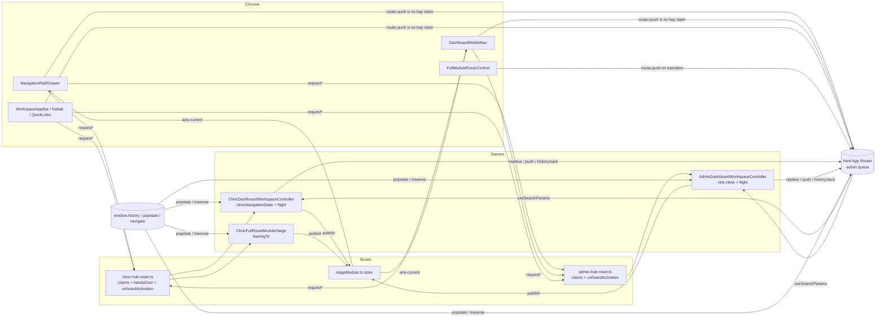
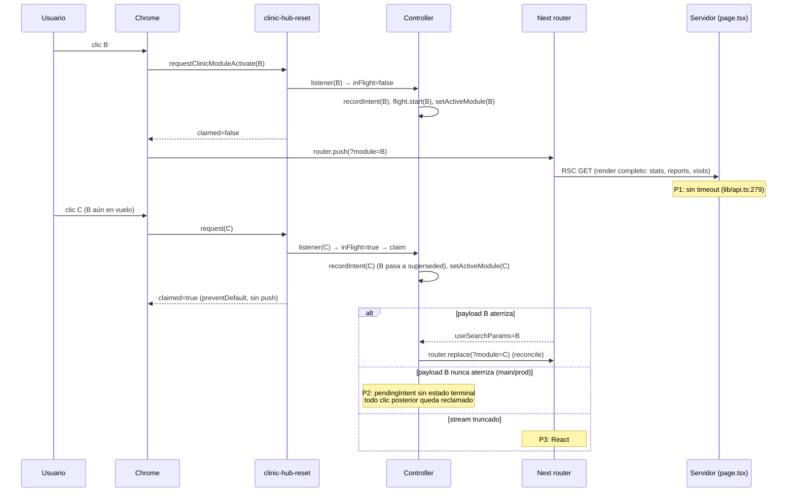
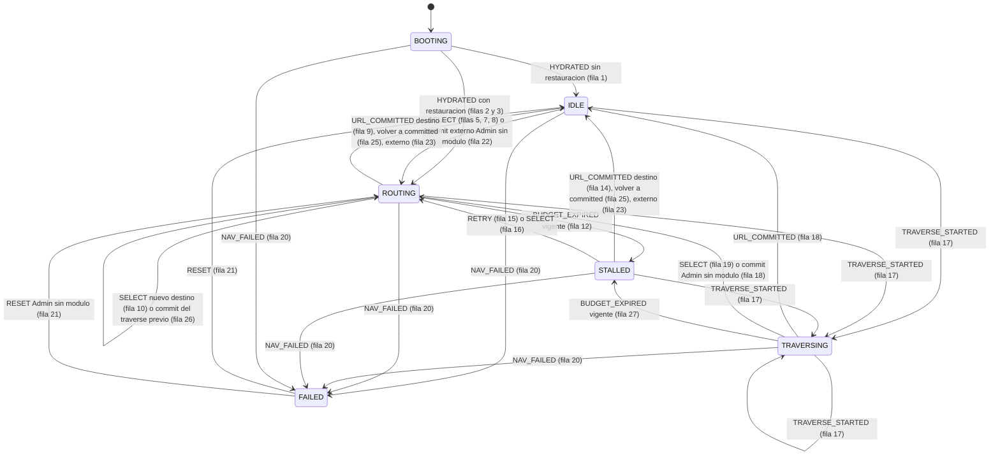
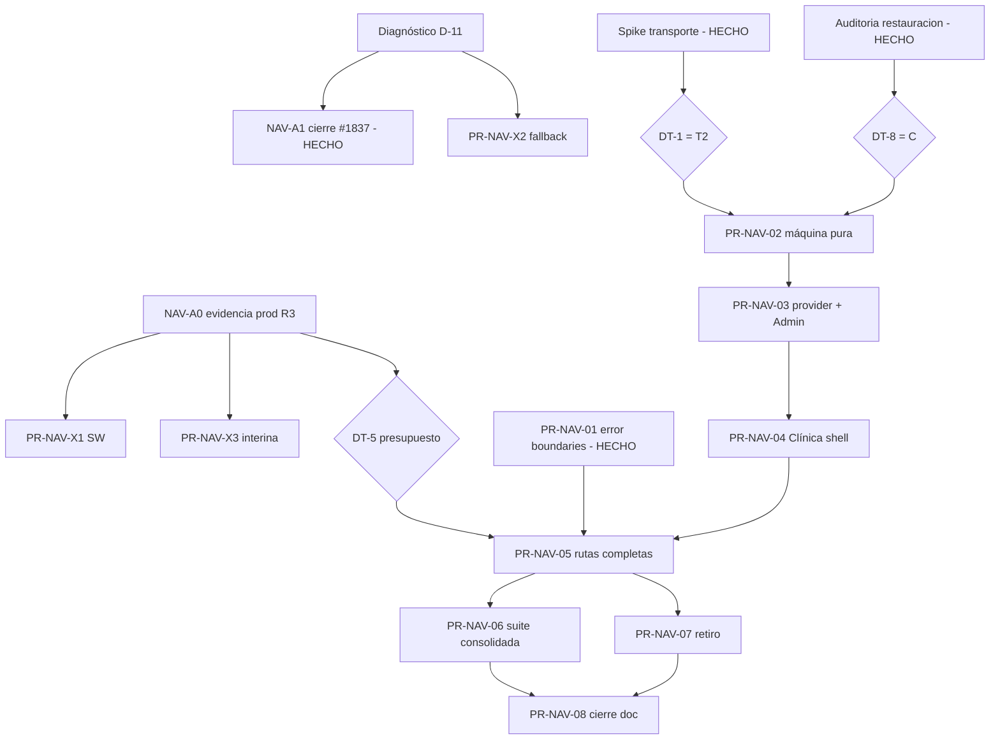

# Auditoría arquitectónica de navegación y hoja de ruta FSM

| Campo | Valor |
| --- | --- |
| Tipo | Auditoría docs-only (R0 lectura + R1 escritura de este documento) |
| Fecha | 2026-10-09 |
| Repositorio | `LABVETNEB/PORTAL-VETNEB` |
| Referencia auditada | rama `fix/dashboard-navigation-flight-budget`, HEAD `c35ebcb340e5a64b573292eef790a326bb6709c8` (head de PR #1837, abierta) |
| Base comparada | `main` = `37dbcaf6714f6ae7fb37eaad100370af2ab53cb8` (PR #1836) |
| Frontend productivo | `37dbcaf6` según sonda `/api/build-info` registrada el 2026-10-09 en una sesión previa; **no reverificado en esta sesión** (lectura de producción fuera del scope) |
| Stack verificado | Next.js `16.3.8` según `pnpm-lock.yaml` (desde #1834), React `19.3.0`. **Corrección rev. 2:** durante la auditoría original `frontend/node_modules` tenía `next@16.3.6` (instalación del 2026-10-07, anterior a #1834); la afirmación "leídos de `frontend/node_modules`" era inexacta para Next. Las pruebas válidas de rev. 2 (§15.2, §15.3) corrieron sobre `16.3.8` tras `pnpm install --frozen-lockfile` autorizado por Nico |
| Lifecycle status | Rev. 1: PROPUESTA. **Rev. 2 (2026-10-09): APROBADO por Nico** — DT-1 = T2, DT-2 = sin refresh por selección, restauración inicial = opción C, especificación FSM de 27 transiciones (§0) |
| Estado de implementación | NO IMPLEMENTADO (programa FSM). PR-NAV-01 fusionada (#1839, `c51b7e74`); #1837 fusionada (`585bf3ba`). Las 27 transiciones **no** tienen aún verificación mecánica: corresponde a PR-NAV-02 |
| Revisión 2 | 2026-10-09 sobre `main` = `c51b7e74`. Incorpora el spike de transporte SP-1..SP-7 y la auditoría de restauración R-1..R-8 (§0, §15.2, §15.3). La propuesta T1 de rev. 1 se conserva como historia y queda marcada como superada donde aplica |

---

## 0. Revisión 2 — decisiones experimentales

Esta revisión sustituye la arquitectura de transporte T1 propuesta en rev. 1 por la decisión
experimental T2. No reescribe la evidencia de rev. 1: los diagnósticos §3–§10 conservan su texto
original, y las secciones normativas (§11–§22) marcan qué parte de la propuesta T1 quedó superada.

### 0.1. Decisiones aprobadas por Nico

| Id | Decisión | Evidencia | Sección |
| --- | --- | --- | --- |
| DT-1 | **T2**: `router.push` para módulos, hub y rutas completas, con `ROUTING` supervisado | SP-5 FAIL 0/10 (regla binaria de §15.2) | §11.2, §15.2 |
| DT-2 | **Ninguna selección inicia un `router.refresh()`**; la frescura llega con el render de la navegación | SP-4, SP-5 y D-10 extendido | §11.2, §21 |
| DT-8 | **Restauración inicial = opción C**: `router.replace` con `display = committed` hasta el commit | R-1..R-8 (175 corridas) | §15.3, §12.4 #2–#3 |
| — | **FSM de 27 transiciones** con invariantes S1–S11 y L1–L5. **Sin verificación mecánica todavía**: es el criterio de aceptación de PR-NAV-02 | Partición revisada a mano | §12, §13 |

### 0.2. Fuentes experimentales

Arnés y actas en el scratchpad de la sesión de Claude del 2026-10-09, **no versionados**:
`ACTA_SPIKE_DT1_TRANSPORTE.md`, `CONTRATO_FSM_T2_PR_NAV_02.md`, `evidence/results.json` (105 corridas
SP-1..SP-7) y `evidence-restore/restore-results.json` (175 corridas R-1..R-8). Entorno común: build de
producción de `c51b7e74` con Next `16.3.8` (`BUILD_ID C0uUMNcb2UNtPiY0Lv7pZ`), `next start` con
`CI=true` y las variables de `.github/workflows/frontend-ci.yml:130-135` (requisito de
`frontend/src/lib/api.ts:99-105`), fixture `frontend/e2e/fixtures/admin-populated-api-server.mjs` sin
modificar detrás de un proxy de control local, y Chromium headless de Playwright 1.63.0. No hay
mediciones productivas: H-01..H-08 siguen abiertas.

### 0.3. Matriz de trazabilidad de rev. 2

| Cambio | Antes (rev. 1) | Después (rev. 2) | Evidencia |
| --- | --- | --- | --- |
| Transporte de módulo | T1 `pushState` "recomendada" | T2 `router.push` | SP-5 0/10; control T2 en §15.2 |
| Frescura | `REFRESH_DATA` por selección | Render de la navegación; sin refresh | SP-4; SP-5; D-10 extendido 3/3 + 3/3 |
| Restauración (#2–#3) | `REPLACE_NATIVE` | `ROUTER_REPLACE`, `display = committed` | R-1 A FAIL / C PASS; R-2..R-8 |
| Tabla §12.4 | 24 filas con efectos nativos | 27 filas; `PUSH_NATIVE`, `REPLACE_NATIVE` y `REFRESH_DATA` eliminados | §12.4 (columna "Orig.") |
| Invariantes | S1–S8, L1–L4 | S1–S11, L1–L5 | §13 |
| Defectos | D-01..D-11 | + D-12 (restauración de Clínica muerta) | R-2 |
| Hipótesis | H-01..H-07 | + H-08 (refresh pendiente retiene commits) | SP-5 |
| Formulario "Aplicar" de auditoría | "usa el router" | `<form method="get">` (navegación de documento) | `AdminAuditFilterBar.tsx:57-69` |
| Versión de Next | "16.3.8 leído de `node_modules`" | 16.3.8 por lockfile; 16.3.6 instalado en rev. 1 | Encabezado |
| Escenarios "payload held" | Se reescribían a 0 `_rsc` | Siguen siendo contratos E2E | §16 PR-NAV-03 |

---

## 1. Resumen ejecutivo

El síntoma reportado — *la URL cambia pero el contenido no; los clics siguientes dejan de responder;
sólo un Reload recupera* — no tiene una causa única. La auditoría identifica **11 defectos
comprobados** y **7 hipótesis causales pendientes**. Los defectos se agrupan en tres raíces
estructurales:

1. **Coordinación sin estado terminal.** Los dashboards de Admin y Clínica coordinan la navegación
   de módulos con estado implícito repartido en 7–10 `useRef`/`useState` por controlador, más dos
   buses globales con semántica de "claim", un store de `stageModule`, un clasificador puro sólo
   para Clínica y listeners `popstate`/Navigation API en tres componentes. En `main` (= producción)
   el `pendingIntent` de SINGLE FLIGHT (#1835) sólo termina con un commit de URL o un `popstate`:
   si el payload RSC no aterriza, cada clic posterior queda reclamado y la URL/historial se congelan
   mientras el stage sigue moviéndose (D-02). PR #1837 agrega un presupuesto de 10 s como
   contención, pero sigue abierta con `validate-frontend` en FAILURE y no cubre las rutas
   completas de Clínica (D-04).
2. **El transporte de un cambio de módulo es un render de servidor completo.** Cada `?module=` vuelve
   a ejecutar la página entera (todas las llamadas de datos, sin timeout) aunque el cliente ya tiene
   renderizados **todos** los workspaces como slots y el controlador ignora `initialModule` después
   del montaje (D-03, D-09). La latencia del backend define la ventana durante la que existen todas
   las carreras que #1830–#1837 fueron parcheando.
3. **No hay frontera de error de navegación.** No existe ningún `error.tsx`, `global-error.tsx` ni
   `loading.tsx` en `frontend/src/app`; un stream RSC truncado deja la aplicación en la pantalla de
   error genérica de Next hasta un Reload (D-01, reproducido bajo inyección de fallos en una sesión
   previa).

**Riesgo arquitectónico principal:** seguir agregando guardas locales sobre una máquina de estados
implícita, duplicada (Admin inline vs Clínica pura) y dependiente del orden de eventos del
navegador y de React. Cada PR de la serie #1830–#1837 corrigió un caso real y agregó un mecanismo;
ninguno redujo el número de autoridades de navegación (hoy 9, §5.3).

**Arquitectura objetivo:** una *Explicit Finite-State Navigation Machine* por superficie, con un
único dueño montado en `app/dashboard/layout.tsx` (persiste entre `/dashboard`, sus rutas completas y
`/dashboard/admin`), transiciones puras y deterministas, y — sujeto a la decisión DT-1 — el cambio de
módulo transportado por `window.history.pushState` nativo (contrato documentado de Next 16), de modo
que URL y contenido cambian en la misma transición y **el estado "en vuelo" desaparece** para los
cambios de módulo. El estado asíncrono queda acotado a la navegación entre rutas distintas, con
presupuesto, estado `STALLED` recuperable y frontera de error.

**Estado de preparación:** NO LISTO para implementar la FSM. Faltan: (a) evidencia productiva de
latencias RSC y de errores de navegación (R3, [MANUAL-NICO]); (b) la decisión DT-1 sobre el
transporte; (c) el spike de verificación del transporte nativo (§15.2). **Sí está lista** una primera
intervención independiente de la FSM: fronteras de error (PR-NAV-01, §22).

> **Rev. 2 (2026-10-09).** El párrafo "Arquitectura objetivo" describía la propuesta T1, y el spike la
> descartó: con un `router.refresh()` pendiente, un `pushState` nativo mueve la URL pero no el contenido
> (SP-5, 0/10). **DT-1 = T2**: el cambio de módulo conserva un estado en vuelo, y la FSM lo supervisa
> con `navId`, presupuesto y `STALLED` (§11.2, §12). Lo que sigue vigente de la propuesta: el dueño
> único en el layout, las transiciones puras y la frontera de error.
>
> Estado de preparación actualizado: (b) y (c) **resueltos**; PR-NAV-01 **fusionada** (#1839); (a)
> NAV-A0 sigue pendiente (R3, [MANUAL-NICO]). **PR-NAV-02 especificada** (§16) y pendiente de
> autorización. Su verificación mecánica de la tabla no se ha ejecutado.

---

## 2. Alcance, metodología y limitaciones

### 2.1. Alcance

| Incluido | Excluido (no-alcance explícito) |
| --- | --- |
| Navegación de módulos en `/dashboard` (Clínica) y `/dashboard/admin` | Backend, DB, migraciones, RLS |
| Rutas completas de Clínica (`/dashboard/informes`, `/dashboard/logistica/**`) | Implementación de cualquier fix |
| Chrome de navegación: banda lateral, barra móvil, app-bar, kebab, quick links | Ejecución contra staging o producción |
| Script pre-hidratación `public/theme-init.js` y service worker `public/sw.js` | Dependencias, lockfile, CI/workflows |
| Integración con Next.js App Router 16.3.8 (lectura de `node_modules/next/dist`) | Navegación pública más allá de su relación causal con D-01 y H-03 |
| Estado de PR #1830, #1833, #1835, #1836, #1837 | Rediseño visual |

### 2.2. Metodología

1. Protocolo de entrada de `AGENTS.md` §2: referencia, actor (caso A: auditoría + documento),
   `AGENTS.md` leído completo, búsqueda de `AGENTS.md` anidados con `git ls-files` (sólo el raíz es
   tracked), baseline Git (§3).
2. Lectura completa de los 14 archivos de coordinación (§5) y de los puntos de llamada de
   `router.*`, `history.*`, `popstate`, `window.location.*` (búsqueda exhaustiva en `frontend/src`).
3. Lectura de los contratos de Next instalados: `app-router.js`, `app-router-instance.js`,
   `server-patch-reducer.js`, `fetch-server-response.js`, `layout-router.js` y la guía
   `dist/docs/01-app/01-getting-started/04-linking-and-navigating.md`.
4. Lecturas GitHub R0: estado de PR, checks, review threads de #1837 y logs del run fallido.
5. Contraste con evidencia de reproducción de sesiones previas (2026-10-07 a 2026-10-09). Esa
   evidencia **no está versionada** (arneses en scratchpads); se cita como tal y se marca la prueba
   que la volvería reproducible.

### 2.3. Limitaciones

- Ningún comportamiento fue re-ejecutado en esta sesión: la tarea autoriza sólo lectura y este
  documento. Toda afirmación de comportamiento runtime lleva su fuente (código, CI o reproducción
  previa no versionada).
- No hay telemetría productiva de navegación (no existe RUM ni logging de errores de cliente, ver
  `docs/ops/METRICS_BASELINE.md`): ninguna hipótesis sobre frecuencia en producción puede cerrarse
  desde el repositorio.
- El artefacto `trace.zip` del run fallido de #1837 no se descargó (descarga = permiso explícito);
  el diagnóstico de D-11 queda como hipótesis H-04.
- `git fetch --prune` no se ejecutó (§5.2 de `AGENTS.md`: R1 sólo con pedido de implementación); el
  estado remoto se leyó con `gh` (R0).
- **Rev. 2.** Las líneas de `node_modules/next/dist` citadas en rev. 1 (§12.6, §23.2) se leyeron
  sobre `16.3.6`, que era lo instalado. Rev. 2 reverificó sobre `16.3.8` las que usa la especificación
  revisada: `app-router.js:38-71, 84-95, 233-307`, `app-router-instance.js:50-170, 234-241, 352-357`,
  `use-action-queue.js:109-139` y `refresh-reducer.js:57-76`. Rev. 2 sí re-ejecutó comportamiento
  (§15.2, §15.3), siempre en local; producción sigue sin medirse.

---

## 3. Estado inicial del repositorio y PR relevantes

### 3.1. Baseline Git (capturado antes del análisis)

| Elemento | Valor |
| --- | --- |
| Rama | `fix/dashboard-navigation-flight-budget` |
| HEAD | `c35ebcb3` "fix(dashboard): end single flight when a navigation never lands" |
| `git diff --stat` (tracked) | vacío |
| Untracked | `frontend/AGENTS.md`, `frontend/CLAUDE.md` (generados por `next dev`; preservados, no son contrato: no están en `git ls-files`) |
| Stashes | 5 (`stash@{0}`..`stash@{4}`), preservados, no manipulados |
| Worktrees | 1 (`C:/PORTAL-VETNEB`) |
| `AGENTS.md` tracked | sólo el raíz |

### 3.2. Estado de las PR (leído con `gh pr view`, 2026-10-09)

| PR | Título | Estado | Merge commit | Head | Aporte a la navegación |
| --- | --- | --- | --- | --- | --- |
| #1830 | synchronize live module navigation state | MERGED 2026-10-07 | `1ca68922` | `e3c3ce90` | `supersededTargets`, `historyTraversal.ts`, origen `history` de un commit |
| #1833 | preserve clinic navigation on full routes | MERGED 2026-10-08 | `00c7ef1c` | `689ef793` | Bus `handsOver` para `ClinicFullRouteModuleStage`, `unheardActivation` |
| #1835 | single navigation authority per dashboard | MERGED 2026-10-08 | `05764256` | `8ce514f3` | `stageModule` store, SINGLE FLIGHT (claims), `pushedFrom` + `history.back()` |
| #1836 | drop clinic full-route handover when Back starts | MERGED 2026-10-08 | `37dbcaf6` | `7aafbee8` | Guard `window.event?.type === "popstate"`, traverse vía Navigation API |
| #1837 | end single flight when a navigation never lands | **OPEN** | — | `c35ebcb3` | `navigationFlight.ts` (presupuesto 10 s) + `useNavigationFlight.ts` |

> **Rev. 2 (lectura `gh pr view`, 2026-10-09).** #1837 se fusionó el 2026-10-09T17:09:21Z (`585bf3ba`);
> #1838 (este documento) el 2026-10-09T15:44:25Z (`d186aff5`); #1839 (PR-NAV-01, fronteras de error)
> el 2026-10-09T19:23:45Z (`c51b7e74`). La tabla anterior conserva el estado observado en rev. 1.

### 3.3. Checks de #1837 sobre `c35ebcb3`

| Contexto required | Estado |
| --- | --- |
| `validate-pr-governance` | SUCCESS |
| `qga-workflow-security` | SUCCESS |
| `validate-backend` | SUCCESS |
| `validate-frontend` | **FAILURE** (run `37889048178`: `frontend-heavy-validation` 1253 passed / 1 failed / 1 skipped) |

Fallo: `frontend/e2e/admin/shell/admin-mobile-final-polish-no-scroll.spec.ts:580` ("Admin desktop
final polish smoke at 1280x800"), línea 608: *strict mode violation:
`[data-dashboard-navigation-drawer]` resolved to 2 elements*. Review threads de #1837: ninguno.
`main` en `00c7ef1c` (#1833) falló con la misma clase de error sobre
`[data-dashboard-mobile-nav="admin"]` (run `37725244360`); los runs de `main` posteriores
(`05764256`, `37dbcaf6`) pasaron. Ver D-11 y H-04.

---

## 4. Skills aplicadas

| Skill | Uso | Problema concreto que justificó su uso |
| --- | --- | --- |
| `vetneb-bugs-errores-optimizacion-rutas` (principal) | Separación síntoma/causa/evidencia/impacto; localización por capa (frontend, SW, Next, backend) | El síntoma cruza router de Next, controladores, SW y render de servidor |
| `vetneb-briefing-planificacion-diseno-desarrollo-pruebas` | Estructura de cada PR (scope, superficies afectadas/no afectadas, tests existentes/faltantes, criterio de merge) | Convertir la arquitectura objetivo en PR mínimos ejecutables por otro agente |
| `vetneb-production-web-optimization-engineer` | Análisis de complejidad, ownership, priorización P0–P3, plan mínimo con rollback | Nueve autoridades de navegación y lógica duplicada Admin/Clínica |
| `vetneb-web-end-to-end-global` | **No cargada.** La cobertura E2E se analizó con `frontend/e2e/suites/catalog.ts` y §7 de `AGENTS.md` | No hizo falta guía adicional más allá del catálogo |
| `vetneb-security-production-invariants` | **No cargada.** Los invariantes relevantes (`no-store`, sesiones, sin stack traces) se tomaron de `AGENTS.md` §9 | Sólo PR-NAV-01 roza un invariante (no exponer stack traces en `error.tsx`); queda listado como criterio de aceptación |

Contradicciones detectadas entre skills y `AGENTS.md` (prevalece `AGENTS.md`; se reportan, no se
resuelven en silencio):

| Skill dice | `AGENTS.md` dice | Resolución aplicada |
| --- | --- | --- |
| "Indicar Terminal 1 / Terminal 2 cuando se entreguen comandos" | §1: sólo cuando hay procesos simultáneos | Un solo flujo |
| "Antes de tocar código: `git fetch --prune`" | §5.2: R1 sólo con pedido de implementación | No ejecutado; estado remoto leído con `gh` (R0) |
| Cierre manual: `gh pr merge --squash --delete-branch` | §5.8/§5.9: squash con `--match-head-commit`; borrado de rama separado y verificado | Los comandos de este documento siguen `AGENTS.md` |
| `vetneb-production-web-optimization-engineer`: "No usar `rg`" | Sin restricción | Búsquedas hechas con la herramienta Grep del agente; no material |

---

## 5. Inventario de componentes responsables de navegación

### 5.1. Coordinación (estado y decisiones)

| Archivo | LOC | Rol actual | Estado propietario |
| --- | ---: | --- | --- |
| `frontend/src/components/dashboard/ClinicDashboardWorkspaceController.tsx` | 389 | Dueño del stage de Clínica en `/dashboard` | `activeModule`, `hubOverride`, `hasManuallyReturnedToHub`, `hasRestoredLastModule`, `navigationState` (ref), `historyTraversalStarted` (ref), `flight` |
| `frontend/src/app/dashboard/admin/AdminDashboardWorkspaceController.tsx` | 418 | Dueño del stage de Admin | `activeModule`, `previousUrlModule`, `currentUrlModule`, `pendingNavigationIntent`, `supersededTargets`, `pushedFrom`, `historyTraversalStarted`, `hasManuallyReturnedToHub`, `hasRestoredLastModule`, `flight` |
| `frontend/src/components/dashboard/ClinicFullRouteModuleStage.tsx` | 92 | Stage de rutas completas; "hand over" a `/dashboard` | `leavingTo` |
| `frontend/src/lib/dashboard/navigation/clinicNavigationState.ts` | 255 | Clasificador puro de commits (sólo Clínica) | — (puro) |
| `frontend/src/lib/dashboard/navigation/navigationFlight.ts` | 64 | Presupuesto de SINGLE FLIGHT (sólo en #1837) | timer |
| `frontend/src/lib/dashboard/navigation/stageModule.ts` | 77 | Store global del módulo publicado por el dueño | pila de claims por superficie |
| `frontend/src/lib/dashboard/navigation/historyTraversal.ts` | 29 | Adaptador Navigation API `navigate` (`traverse`) | — |
| `frontend/src/lib/clinic-hub-reset.ts` | 94 | Bus Clínica: hub reset + module activate con claims, `handsOver`, `unheardActivation` | `moduleActivateListeners`, `unheardActivation` |
| `frontend/src/lib/admin-hub-reset.ts` | 95 | Bus Admin: idem sin `handsOver` | `moduleActivateListeners`, `unheardActivation` |
| `frontend/src/components/dashboard/useNavigationFlight.ts` | 19 | Hook del presupuesto (#1837) | — |
| `frontend/src/components/dashboard/useStageModule.ts` | 44 | Publicación/lectura del store | — |
| `frontend/src/features/dashboard/application/dashboardModuleNavigation.ts` | 123 | Gramática `?module=` / `?hub=1` | — (puro) |

### 5.2. Chrome (emisores de intención)

| Archivo:línea | Emisión | Navega si no hay claim |
| --- | --- | --- |
| `frontend/src/components/dashboard/NavigationRail.tsx:110-118` | `request*ModuleActivate` | `PublicRouteControl` → `router.push` |
| `frontend/src/components/dashboard/NavigationDrawer.tsx:110-118` | idem | idem |
| `frontend/src/components/dashboard/DashboardMobileNav.tsx:538-545` | idem | idem (barra) |
| `frontend/src/components/dashboard/WorkspaceAppBar.tsx:139-143` | idem | `router.push` explícito |
| `frontend/src/components/dashboard/DashboardMobileKebabMenu.tsx:136-140` | idem | idem |
| `frontend/src/app/dashboard/admin/AdminOverviewQuickLinks.tsx:30` | `requestAdminModuleActivate` | `PublicRouteControl` |
| `frontend/src/components/dashboard/FullModuleRouteControl.tsx:30-37` | — | `startTransition(() => router.push(href))`; bloquea clics mientras `isPending` |
| `frontend/src/components/dashboard/DashboardNotificationsBell.tsx:231` | — | `router.push(destination)` |
| `frontend/src/components/public/PublicRouteControl.tsx:121-143` | — | `router.push`/`router.replace`; marca `data-public-route-control-hydrated` por nodo |

### 5.3. Autoridades de navegación (quién puede mover URL o contenido)

| # | Autoridad | Evidencia |
| --- | --- | --- |
| 1 | Router de Next (`push`, `replace`, traverse) | `node_modules/next/dist/client/components/app-router.js:233-305` |
| 2 | Estado optimista del controlador + claims de SINGLE FLIGHT | `ClinicDashboardWorkspaceController.tsx:261-282`; `AdminDashboardWorkspaceController.tsx:309-331` |
| 3 | Replay de `unheardActivation` al suscribirse | `clinic-hub-reset.ts:45-89`; `admin-hub-reset.ts:63-93` |
| 4 | Hand-over de ruta completa | `ClinicFullRouteModuleStage.tsx:37-71` |
| 5 | Restauración del último módulo (`router.replace` al montar; Admin además `history.replaceState` nativo) | `ClinicDashboardWorkspaceController.tsx:317-355`; `AdminDashboardWorkspaceController.tsx:338-377` |
| 6 | `history.back()` emitido por los controladores (`pushedFrom`) | `ClinicDashboardWorkspaceController.tsx:216-219`; `AdminDashboardWorkspaceController.tsx:233-239` |
| 7 | Fallback pre-hidratación (`window.location.assign/replace`) | `frontend/public/theme-init.js:63-133` |
| 8 | `BackForwardCacheGuard` (`location.reload()` en `pageshow.persisted`) | `frontend/src/components/dashboard/BackForwardCacheGuard.tsx:12-22` |
| 9 | `AppVersionGate` (`location.replace` a `/?vetnebUpdate=`) | `frontend/src/components/app-version/AppVersionGate.tsx:53-57` |

Las autoridades 7–9 producen navegaciones de documento completo (no comparten estado con 1–6) y se
consideran **legítimas y fuera de la FSM**; las autoridades 2–6 son las que la FSM debe consolidar.

---

## 6. Mapa arquitectónico actual



Observaciones del mapa:

- La misma intención atraviesa hasta cuatro saltos (chrome → bus → dueño → router) y vuelve por
  otros dos (router → `useSearchParams` → efecto de clasificación).
- La "confirmación" de una navegación se infiere de un cambio de `useSearchParams` observado en un
  `useEffect`; no hay identificador de navegación que correlacione intención y commit.
- `Stage` resuelve la coherencia chrome↔stage (#1835) pero es un segundo canal de estado con su
  propia pila de claims.

---

## 7. Flujo real de navegación y puntos de fallo

### 7.1. Cambio de módulo en `/dashboard` (Clínica) con SINGLE FLIGHT



### 7.2. Puntos de fallo

| Id | Punto | Dónde | Defecto/hipótesis |
| --- | --- | --- | --- |
| P1 | Render de servidor sin límite de tiempo | `frontend/src/lib/api.ts:279-283`; `app/dashboard/page.tsx:73-115`; `app/dashboard/admin/page.tsx:284-305` | D-03 |
| P2 | `pendingIntent` sin terminal | `main`: `ClinicDashboardWorkspaceController.tsx:241-252`, `AdminDashboardWorkspaceController.tsx:297-305` (en `37dbcaf6`) | D-02 |
| P3 | Sin frontera de error | `frontend/src/app` (sólo `not-found.tsx`) | D-01 |
| P4 | Ruta completa esperando un commit que no llega | `ClinicFullRouteModuleStage.tsx:37-71`; `FullModuleRouteControl.tsx:30-37` | D-04 |
| P5 | Orden de listeners `popstate` vs commit eager de React | `clinic-hub-reset.ts:48-55`; `ClinicFullRouteModuleStage.tsx:51-67` | D-08 |
| P6 | Fallo tardío de una navegación abandonada → recarga a su URL | `next/dist/client/components/router-reducer/reducers/server-patch-reducer.js:22-40` | D-10 |
| P7 | Error de red → Next espera conectividad y reintenta | `next/dist/client/components/router-reducer/fetch-server-response.js:209-225` | H-06 |
| P8 | `theme-init.js` servido cache-first desde un SW con versión fija | `frontend/public/sw.js:7, 77-87, 172-186` | H-03 |

---

## 8. Defectos comprobados y evidencias

Convención: **Comprobado (estructural)** = el hecho se demuestra leyendo código/configuración en
`c35ebcb3` o `37dbcaf6`. **Reproducido (previo)** = observado en un arnés local de una sesión previa,
no versionado; su prueba reproducible es parte de la hoja de ruta. Severidad P0–P3 según la skill
`vetneb-production-web-optimization-engineer`.

### D-01 — No existe ninguna frontera de error ni de carga en el App Router

| Campo | Contenido |
| --- | --- |
| Síntoma | Tras una respuesta RSC 200 truncada: la URL nueva queda empujada, la página muestra el error genérico de Next ("This page couldn't load") y la app no responde hasta Reload |
| Archivo/líneas | `frontend/src/app/` contiene `not-found.tsx` y ningún `error.tsx`, `global-error.tsx` ni `loading.tsx` (búsqueda `find src/app -name error.tsx -o -name loading.tsx -o -name global-error.tsx`) |
| Evidencia | Estructural (búsqueda). Reproducido (previo, 2026-10-09, `next start` + fixture): stream truncado → `pushState` de la URL nueva + React error #412, en público, Admin y Clínica. 500/524/abort/HTML → navegación MPA (recupera sola) |
| Causa raíz | Comprobada para el efecto "app muerta": no hay boundary que capture el error de render del segmento |
| Impacto | Todas las superficies. Coincide con "sólo se recupera con Reload" |
| Severidad | P1 |
| Prueba de causalidad | E2E que responda el `_rsc` de una navegación con `route.fulfill` de un cuerpo Flight cortado (no `route.abort`, que Next trata como fallo de red) y verifique recuperación sin Reload |
| Dependencias | Ninguna. Independiente de la FSM |

### D-02 — SINGLE FLIGHT sin estado terminal en `main` (= producción)

| Campo | Contenido |
| --- | --- |
| Síntoma | La URL y el historial quedan congelados en el módulo de origen; el stage y `aria-current` siguen a cada clic; sólo Back o Reload liberan |
| Archivo/líneas | `37dbcaf6`: `ClinicDashboardWorkspaceController.tsx:241-252` (`inFlight = pendingIntent !== null` → claim) y `:232` (único escape: `popstate`); `AdminDashboardWorkspaceController.tsx:297-305` |
| Evidencia | Estructural: el intent sólo se consume en el efecto de URL o en `popstate`. Reproducido (previo): RSC colgado ⇒ congelamiento; contrafactual `window.next.router.push` saltando el bus converge al instante ⇒ el bloqueo es del código VETNEB, no de Next |
| Causa raíz | Comprobada (máquina sin terminal). Que un payload "nunca aterrice" en producción es H-01 |
| Impacto | Admin y Clínica, todas las anchuras. Explica "la URL no cambia / los clics dejan de responder" |
| Severidad | P1 (P0 si H-01 se confirma con frecuencia relevante) |
| Prueba | Ya existe en #1837: escenarios "a payload held past the owner's flight budget" en `frontend/e2e/platform/app-shell/dashboard-real-pointer-navigation.spec.ts` (cohorte `visual-contract`) y unit en `test/unit/ui/dashboard/frontend-dashboard-lateral-navigation.test.ts` |
| Dependencias | #1837 (contención). La FSM lo elimina por construcción para cambios de módulo si DT-1 = transporte nativo |

### D-03 — El render de servidor de un cambio de módulo no está acotado

| Campo | Contenido |
| --- | --- |
| Síntoma | La ventana entre clic y commit de URL dura lo que tarde el backend; durante esa ventana existen todas las carreras de #1830–#1837 |
| Archivo/líneas | `frontend/src/lib/api.ts:279-283`: `fetch` sin `signal`/timeout. `frontend/src/app/dashboard/page.tsx:73-115`: `getDashboardStats` secuencial y luego `Promise.all(reports, visits)` en **cada** render. `frontend/src/app/dashboard/admin/page.tsx:284-305`: 4 lecturas (`audit`×3 + `system health`) en cada render, cualquiera sea el módulo |
| Evidencia | Estructural. Sin `loading.tsx` (D-01), Next no puede comitear la URL hasta completar el render |
| Causa raíz | Comprobada como amplificador; la latencia productiva real es H-01 |
| Impacto | Admin y Clínica. Con arranque en frío del backend la ventana puede ser de decenas de segundos (no medido) |
| Severidad | P1 |
| Prueba | Medición productiva p50/p95/p99 del `_rsc` de `/dashboard?module=` y `/dashboard/admin?module=` (R3, [MANUAL-NICO]); localmente, latencia inyectada en el fixture |
| Dependencias | DT-1 (transporte) y DT-3 (timeout SSR, PR fuera de este programa si se decide) |

### D-04 — Rutas completas de Clínica sin estado terminal (no cubierto por #1837)

| Campo | Contenido |
| --- | --- |
| Síntoma esperado | En `/dashboard/informes` o `/dashboard/logistica/**`, tras clicar un destino de la banda, el stage muestra "Cargando X" indefinidamente si `/dashboard` no aterriza; "Abrir módulo completo" queda en "Abriendo módulo…" e ignora clics |
| Archivo/líneas | `ClinicFullRouteModuleStage.tsx:37-49` (`setLeavingTo` sin salida temporal) y `:56-67` (únicas salidas: traverse/`popstate`/unmount); `FullModuleRouteControl.tsx:33-36` (`if (isPending) return`) |
| Evidencia | Estructural: no existe otra transición de salida. #1837 sólo arma presupuesto en los dos controladores (`git diff --stat 37dbcaf6..c35ebcb3`: 10 archivos, ninguno es `ClinicFullRouteModuleStage.tsx` ni `FullModuleRouteControl.tsx`) |
| Causa raíz | Comprobada (máquina implícita sin terminal). Ocurrencia productiva = H-01 |
| Impacto | Clínica, rutas completas |
| Severidad | P2 (P1 si H-01 se confirma) |
| Prueba | E2E con el payload de `/dashboard` retenido más allá del presupuesto desde una ruta completa; debe converger o mostrar estado recuperable |
| Dependencias | PR-NAV-05 (o PR-NAV-X3 interina, §16) |

### D-05 — La misma máquina está especificada dos veces y diverge

| Campo | Contenido |
| --- | --- |
| Síntoma | Cada corrección se aplica dos veces (#1837 toca ambos controladores) y las reglas difieren |
| Archivo/líneas | Clínica: clasificador puro `clinicNavigationState.ts:92-207`. Admin: reimplementación inline con refs `AdminDashboardWorkspaceController.tsx:141-254` |
| Evidencia | Divergencias comprobadas: (a) Admin trata `nextModule === previousCommittedModule` como "mantener optimista" (`:226`), Clínica no; (b) Admin registra `pushedFrom` en el listener (`:322-325`), Clínica en el reductor (`clinicNavigationState.ts:111-112`); (c) Admin usa `null` como destino de hub (`:295`), Clínica usa `hubOverride` + `confirmClinicHubEntry` (`:96-109`, `:189-193`); (d) Admin no tiene `handsOver`; (e) Admin resuelve el hub retirado con `history.replaceState` nativo (`:352-377`), Clínica con `router.replace` (`:342-346`) |
| Causa raíz | Comprobada: no hay especificación única |
| Impacto | Mantenibilidad; probabilidad de corregir un rol y no el otro |
| Severidad | P2 |
| Prueba | Model-based test que ejecute la misma secuencia de eventos contra ambos y compare (PR-NAV-02) |
| Dependencias | PR-NAV-02 |

### D-06 — Nueve autoridades de navegación

Ver §5.3. **Comprobado (estructural).** Impacto: ningún componente puede afirmar cuál es el estado de
navegación vigente; el orden de efectos de React y de listeners del navegador decide. Severidad P2.
Prueba: inventario automatizable (guard de arquitectura que cuente llamadas a
`router.push|replace|history.*` en `frontend/src/components/dashboard` y `app/dashboard`) — incluido
en PR-NAV-07.

### D-07 — Estado implícito sin tipo: combinaciones ilegales representables

| Campo | Contenido |
| --- | --- |
| Evidencia | Clínica: 7 piezas de estado independientes (§5.1); Admin: 10. Ningún tipo excluye, por ejemplo, `pendingIntent !== null` con `flight.isActive() === false` y `pushedFrom` no nulo; #1837 tuvo que introducir explícitamente el caso "intent sin vuelo" (`ClinicDashboardWorkspaceController.tsx:266-267`) |
| Causa raíz | Comprobada |
| Impacto | Cada fix crea un caso borde nuevo (historial de #1830–#1837) |
| Severidad | P2 |
| Prueba | PR-NAV-02: tipo de estado discriminado + test de exhaustividad de la tabla de transiciones |

### D-08 — Corrección dependiente del orden de eventos y de `window.event` (obsoleto)

| Campo | Contenido |
| --- | --- |
| Evidencia | Reproducido (previo, 15/15): React 19 comitea *eager* la transición iniciada en `popstate` dentro del listener del router; el controlador monta y re-emite `unheardActivation` antes de que corra el `popstate` del stage. Corregido en #1836 con Navigation API (`ClinicFullRouteModuleStage.tsx:56-67`) y con `window.event?.type === "popstate"` (`clinic-hub-reset.ts:53-55`) |
| Causa raíz | Comprobada y mitigada. Residual: `window.event` es una API heredada; sin Navigation API sólo queda ese guard |
| Severidad | P3 (residual) |
| Prueba | Ya existe: variante "without the Navigation API" en `dashboard-real-pointer-navigation.spec.ts` |
| Dependencias | La FSM elimina el replay (`unheardActivation`) al montar el dueño en el layout (§11.3) |

### D-09 — El RSC de un cambio de módulo no aporta nada a la selección del módulo

| Campo | Contenido |
| --- | --- |
| Evidencia | `app/dashboard/page.tsx:126-157` y `app/dashboard/admin/page.tsx:757-785` pasan **todos** los workspaces como slots en cada render. Los controladores leen `initialModule`/`initialHub` sólo como valor inicial de `useState` (`ClinicDashboardWorkspaceController.tsx:92-104`, `AdminDashboardWorkspaceController.tsx:125-127`). El único valor por módulo del servidor es `initialAccessErrorStatus` de Admin (`admin/page.tsx:307-318`) |
| Causa raíz | Comprobada: el viaje al servidor sólo refresca datos; la selección de módulo podría ser local |
| Impacto | Toda la complejidad de "superseded/claims/flight" existe para coordinar un viaje cuyo resultado no decide el módulo |
| Severidad | P1 (arquitectónico) |
| Prueba | Spike §15.2 con `window.history.pushState` nativo (contrato documentado: `node_modules/next/dist/docs/01-app/01-getting-started/04-linking-and-navigating.md:343-347`) |
| Dependencias | DT-1, DT-2 |
| Resultado rev. 2 | El hecho estructural se mantiene. La consecuencia propuesta (selección local por `pushState`) **se descartó**: el spike muestra que, con un `router.refresh()` pendiente, la URL nativa se adelanta al contenido (SP-5). Además, el viaje al servidor sí decide un valor por módulo, `initialAccessErrorStatus` (SP-4, R-1). DT-1 = T2 |

### D-10 — Fallo tardío de una navegación abandonada recarga el documento a su URL

| Campo | Contenido |
| --- | --- |
| Evidencia | `server-patch-reducer.js:22-30`: `action.mpa` se evalúa **antes** que `previousTree !== state.tree` (`:33`), por lo que un 524/error de red tardío de B provoca `completeHardNavigation` a la URL de B aunque el usuario esté en C. Reproducido (previo) también sin presupuesto (Back + fallo tardío) |
| Causa raíz | Comprobada; defecto de Next, no de VETNEB |
| Severidad | P2 |
| Prueba | E2E con payload abandonado que falla tarde (`route.fulfill` 524 tras liberar) |
| Dependencias | Con DT-1 = transporte nativo, los cambios de módulo no emiten payload y el caso queda limitado a rutas completas |
| Rev. 2 | Reproducido sobre Next 16.3.8 en ambos transportes: `router.push` de filtro retenido y liberado con 500 tras un cambio de módulo produce navegación de documento a la URL del filtro (T1 5/5, T2 5/5). **Extendido a `ACTION_REFRESH`**: un `router.refresh()` retenido que falla tarde tras un cambio de módulo recarga el documento en el módulo anterior (T1 3/3, T2 3/3). Con DT-1 = T2 el riesgo aplica a todo `ROUTING` y a los `router.refresh()` existentes (§19) |

### D-11 — `validate-frontend` de #1837 en FAILURE por doble instancia del chrome

| Campo | Contenido |
| --- | --- |
| Evidencia | Run `37889048178`, `admin-mobile-final-polish-no-scroll.spec.ts:608`: dos `nav[data-dashboard-navigation-drawer="admin"]`. Misma clase en `main@00c7ef1c` (run `37725244360`, `[data-dashboard-mobile-nav="admin"]`). El fallback de Suspense de `DashboardNavigationFrame.tsx:160-166` renderiza `LateralNavigation` **con** los atributos identificadores, a diferencia de `DashboardMobileNav.tsx:576-594` (`identify={false}`) |
| Causa raíz | Pendiente (H-04): el fallback identificado explica la duplicación del drawer, pero no la del mobile nav en `00c7ef1c` |
| Severidad | P2 (bloquea el merge de #1837) |
| Prueba | Inspección del `trace.zip` del run (requiere descarga autorizada) y A/B del spec sobre `37dbcaf6` |
| Evidencia adicional rev. 2 | En Clínica, el HTML SSR de `/dashboard?module=perfil` contiene `aria-current="page"` en `operaciones` **y** en `perfil` en las bandas laterales; el estado es visible 65–98 ms antes de hidratar (R-8, 5/5). Es coherente con el fallback de Suspense identificado de H-04. Admin no lo presenta |

### D-12 — La restauración del último módulo de Clínica no ocurre (rev. 2)

| Campo | Contenido |
| --- | --- |
| Síntoma | Entrar a `/dashboard` con un último módulo almacenado distinto de `operaciones` abre siempre `operaciones` |
| Archivo/líneas | `frontend/src/components/dashboard/ClinicDashboardWorkspaceController.tsx:297-299` persiste `activeModule` (inicializado en el default) **antes** de que el efecto de `:317-355` lea el almacenado; la lectura encuentra `operaciones` y retorna en `:340` |
| Evidencia | R-2 (5/5): almacenado `logistica` → `storage = operaciones` tras hidratar, 0 `_rsc`, sin `router.replace`. Admin no lo sufre: su efecto de persistencia ignora `null` (`AdminDashboardWorkspaceController.tsx:333-336`) |
| Causa raíz | Comprobada: orden de efectos en el mismo commit |
| Impacto | Clínica en producción. La preferencia de último módulo no tiene efecto |
| Severidad | P3 (funcional, sin pérdida de datos ni divergencia URL↔contenido) |
| Prueba | E2E R-2 de §15.3 |
| Dependencias | Lo corrige por construcción la fila #2 de §12.4 en PR-NAV-04; no se corrige aparte |

---

## 9. Hipótesis causales pendientes

| Id | Hipótesis | Evidencia a favor | Evidencia en contra / faltante | Prueba que la cierra | Actor |
| --- | --- | --- | --- | --- | --- |
| H-01 | El síntoma productivo es D-02/D-04 disparado por payloads RSC lentos o colgados | D-03 (sin timeout, render completo por clic); el contrafactual de D-02 | Ninguna latencia productiva medida; ninguna reproducción con datos reales | Latencias `_rsc` p50/p95/p99 y tasa de navegaciones > 10 s (logs de Render o RUM) | R3 — [MANUAL-NICO] |
| H-02 | Streams RSC truncados ocurren en producción (proxy/CDN/reinicio de instancia) | D-01 reproducido bajo inyección | Sin logs de cliente | Logs de error de cliente (requiere PR-NAV-01 con reporte sanitizado o RUM) | R3 |
| H-03 | Clientes con SW instalado ejecutan un `theme-init.js` obsoleto | `sw.js:7` `SW_VERSION` fijo desde 2026-06-26; `theme-init.js` cambió el 2026-07-15 (`26f09221`) y el 2026-09-04 (`c62de271`); scripts same-origin son cache-first (`sw.js:77-87,172-186`) | La versión de julio sólo desiste tras la hidratación global y excluye `/dashboard`: produce clics perdidos pre-hidratación, no congelamiento | Inspección en un dispositivo afectado (Application → Cache Storage) | [MANUAL-NICO] |
| H-04 | D-11 es una doble instancia transitoria (fallback de Suspense identificado o subárbol oculto) | `DashboardNavigationFrame.tsx:160-166` | `cacheComponents` no está habilitado (`next.config.ts`), por lo que el `Activity` oculto de `layout-router.js:684-688` no aplica | `trace.zip` del run + A/B | Agente (lectura) tras autorización de descarga |
| H-05 | Navegadores sin Navigation API siguen expuestos a variantes de D-08 | El guard `window.event` es el único respaldo | Cubierto por la variante E2E sin Navigation API | Matriz de navegadores de usuarios reales | [MANUAL-NICO] |
| H-06 | En redes móviles intermitentes, Next deja una navegación esperando conectividad indefinidamente (equivale a D-02) | `fetch-server-response.js:209-225` | No reproducido | E2E con `context.setOffline(true)` durante el payload | Agente |
| H-07 | Las superficies públicas sólo están afectadas por D-01 | Rutas públicas estáticas, salen de prefetch; sin reproducción en 5 viewports × 30 interacciones (2026-10-08) | — | PR-NAV-01 + E2E público de stream truncado | Agente |
| H-08 (rev. 2) | En producción, un `router.refresh()` pendiente (`DashboardRefreshButton.tsx:23`, `UploadReportModal.tsx:528`, `LoginContent.tsx:123`) retiene el commit de navegaciones posteriores mientras no recibe headers | Comprobado en local: retención ⇒ sin commit con el hilo ocioso; liberación ⇒ convergencia en 40–182 ms; aplica a `pushState` (la URL se adelanta) y a `router.push` (URL y contenido congelados) (SP-5) | El bloqueo cesa cuando llegan los headers; el RSC responde en ~10 ms aun con backend lento (streaming). Sin medición del TTFB productivo | TTFB `_rsc` productivo y frecuencia de refresh + navegación (NAV-A0) | R3 — [MANUAL-NICO] |

Límites causales demostrados en rev. 2 (no extrapolar):

- El bloqueo de H-08 depende de la fase **anterior a los headers**. Con un backend lento pero headers
  ya recibidos no hay bloqueo (variante "backend lento": 5/5 avanzan).
- El mecanismo interno, dos transiciones de React sobre la misma cola de estado del router
  (`use-action-queue.js:139`, `app-router.js:240`, `app-router-instance.js:352-357`), es una
  **inferencia no instrumentada**. Sólo la causalidad observable está comprobada.
- Toda la evidencia es de Chromium headless sobre Windows con fixture local; WebKit/iOS, PWA instalada
  y producción no se ejecutaron.

---

## 10. Análisis de complejidad y deuda técnica

### 10.1. Crecimiento por PR

| PR | Mecanismo agregado | Mecanismo retirado |
| --- | --- | --- |
| #1830 | `supersededTargets`, `historyTraversal.ts`, origen del commit | — |
| #1833 | `handsOver`, `unheardActivation` en Clínica | — |
| #1835 | `stageModule.ts`, claims SINGLE FLIGHT, `pushedFrom`, `history.back()` | Lectura de URL del chrome |
| #1836 | Guard `window.event`, traverse en el stage de ruta completa | — |
| #1837 | `navigationFlight.ts`, `useNavigationFlight.ts`, `onExpire` | — |

### 10.2. Tamaño actual

| Componente | LOC |
| --- | ---: |
| Coordinación pura y buses (`clinicNavigationState`, `navigationFlight`, `stageModule`, `historyTraversal`, dos buses, dos hooks) | 677 |
| Controladores + stage de ruta completa | 899 |
| Tests unitarios de navegación (`dashboard-clinic-navigation-state`, `frontend-dashboard-lateral-navigation`, `frontend-dashboard-last-module`) | 1 822 |
| E2E de navegación (`dashboard-real-pointer-navigation`, `dashboard-global-live-navigation-sync`) | 1 544 |
| Archivos de test que anclan fuentes de navegación (`git grep` de los 8 módulos) | 28 |

### 10.3. Deuda identificada

| Deuda | Tipo | Consecuencia |
| --- | --- | --- |
| Estado implícito y duplicado (D-05, D-07) | Diseño | Correcciones dobles, casos borde nuevos por fix |
| Transporte por servidor para una decisión local (D-09) | Arquitectura | Toda la familia de carreras "superseded" |
| Buses globales con replay temporal (`LATE_ACTIVATION_MAX_AGE_MS = 5_000`) | Diseño | Corrección dependiente de tiempo y orden de montaje |
| Guards de fuente que anclan texto literal de controladores (28 archivos) | Test | Toda migración debe realinearlos en el mismo PR (§4 de `AGENTS.md`) |
| Ninguna observabilidad de navegación de cliente | Operación | Ninguna hipótesis productiva puede cerrarse desde el repo |

---

## 11. Arquitectura objetivo FSM

### 11.1. Principios

1. **Un dueño por superficie** (`admin`, `clinic`) y **una sola instancia**: un store externo
   creado por un `DashboardNavigationProvider` montado en `frontend/src/app/dashboard/layout.tsx`,
   que persiste entre `/dashboard`, `/dashboard/informes`, `/dashboard/logistica/**` y
   `/dashboard/admin` (el layout no se desmonta entre páginas hermanas del App Router).
2. **Transiciones puras**: `transition(config, ctx, state, event) → { ctx, state, effects[] }` (firma
   exacta en §12.1) sin imports, sin DOM, sin timers, testeable desde `test/unit/ui` como
   `clinicNavigationState.ts` hoy.
3. **Efectos como datos**: el provider es el único intérprete de efectos (`router.*`, navegación de
   documento, timers, persistencia). Ningún componente llama al router para navegar módulos. *(Rev. 2:
   la máquina no emite efectos `history.*` nativos; ver §12.5.)*
4. **Solicitado ≠ confirmado**: cada navegación asíncrona lleva un `navId` monótono. *(Rev. 2:* el
   `navId` correlaciona presupuestos (`BUDGET_EXPIRED`), y un evento de presupuesto con `navId`
   obsoleto no tiene efecto (S3). Un commit de URL no trae `navId`: se confirma por igualdad con el
   destino vigente y se descarta si pertenece a `superseded` (§12.4 #9, #11).*)*
5. **Sin segunda autoridad**: la FSM reemplaza a los controladores, buses, `stageModule` y
   hand-over; no se agrega encima. La migración es por superficie y cada PR retira lo que reemplaza.
6. **Next sigue siendo el router**: la FSM no intercepta ni reimplementa el router; usa sus API
   públicas documentadas.

### 11.2. Transporte (DT-1 — decidido en rev. 2: T2)

**Decisión (rev. 2): T2.** Módulos, hub y rutas completas navegan con `router.push`; la restauración
inicial y la normalización de Admin, con `router.replace` (§15.3). Todo cambio asíncrono pasa por
`ROUTING` con `navId`, presupuesto y `STALLED` (§12). Ninguna selección inicia `router.refresh()`
(DT-2): la frescura de datos e `initialAccessErrorStatus` llegan con el render de la propia navegación.

Propuesta de rev. 1, conservada como historia:

| Opción | Cambio de módulo | Estado "en vuelo" de módulo | Frescura de datos | Resultado rev. 2 |
| --- | --- | --- | --- | --- |
| T1 — nativo (recomendada en rev. 1) | `window.history.pushState(null, "", href)`; Next lo integra como `ACTION_RESTORE` síncrono (`app-router.js:237-262`) que tiene prioridad sobre acciones pendientes (`app-router-instance.js:146-158`) | No existe | `router.refresh()` posterior (DT-2), descartable, no bloquea la navegación | **Descartada.** SP-1, SP-2, SP-6 y SP-7 pasan, pero SP-5 falla 0/10: con un `router.refresh()` pendiente la URL avanza y el contenido no. El refresh que T1 necesita para frescura (SP-4) es justamente lo que lo bloquea, y si falla tarde recarga el módulo anterior (D-10 extendido) |
| T2 — router | `router.push(href)` | Existe: requiere `navId`, presupuesto, superseded | Implícita en el render | **Adoptada.** Ante el mismo refresh pendiente, URL y contenido quedan congelados juntos (consistentes) y el presupuesto lo acota |

Texto original de rev. 1, conservado: "Con T1 la URL y el contenido cambian en la misma transición;
Back/Forward entre entradas nativas restaura desde el árbol guardado en `history.state` sin fetch
(`app-router.js:282-299`). El repositorio ya depende de este contrato:
`AdminDashboardWorkspaceController.tsx:367-374` ('Native replace, synced into useSearchParams by the
router'). Riesgos de T1 a verificar en el spike (§15.2): frescura de datos, `initialAccessErrorStatus`
por módulo en Admin, interacción con navegaciones de filtros de auditoría, PWA/iOS."

**Corrección rev. 2 sobre los filtros de auditoría.** Rev. 1 afirmaba que "siguen usando el router".
En el código, "Aplicar" es un `<form method="get">` nativo, es decir una navegación de documento
(`frontend/src/app/dashboard/admin/AdminAuditFilterBar.tsx:57-69`, con `FilterBar` sin router). La
única navegación por router del filtro es "Limpiar", que usa `PublicRouteControl replace` →
`router.replace` (`:128-136`). Con T2, "Limpiar" es un commit externo para la FSM (§12.4 #22/#23).

### 11.3. Ownership y contrato con el chrome

- `request*ModuleActivate(moduleId)` se conserva como **adaptador de entrada**: despacha
  `SELECT_MODULE` y devuelve `true` siempre que haya dueño (el dueño navega). El chrome no cambia
  (sigue haciendo `preventDefault` si hay claim) y el fallback pre-hidratación de `theme-init.js`
  sigue cubriendo clics antes de hidratar.
- Como el provider vive en el layout y su store existe antes de que monte cualquier página, el
  replay `unheardActivation` y el hand-over de la ruta completa dejan de ser necesarios.
- `useStageModule` pasa a ser un selector del store de la FSM (`state.display`), no un store aparte.
- **Rev. 2.** `requestAdminHubReset` y `requestClinicHubReset` no tienen emisores en `frontend/src`
  (sólo sus definiciones: `admin-hub-reset.ts:18`, `clinic-hub-reset.ts:5`). `SELECT_HUB` queda
  especificado para Clínica (§12.4 #7) pero hoy `?hub=1` sólo se alcanza por URL directa. En Admin,
  `SELECT_HUB` se rechaza (#6).
- **Rev. 2 — requisito de integración.** El `display` de `IDLE` y la emisión de `URL_COMMITTED` se
  derivan **en render** a partir de `useSearchParams`/`usePathname`, no en `useEffect`. Evidencia
  (§15.3): un valor derivado en render cambia en el mismo commit que la URL de un `router.replace`
  (5/5). El stage de los controladores actuales, derivado en efecto, llega con 8–364 ms de retraso.

---

## 12. Estados, eventos y tabla de transiciones

> **Rev. 2 (2026-10-09).** Esta sección reemplaza la especificación T1 de rev. 1 (tabla de 24 filas con
> `PUSH_NATIVE`, `REPLACE_NATIVE` y `REFRESH_DATA`; recuperable en el historial de git, commit
> `d186aff5`, §12). Fuente: contrato técnico de rev. 2 (§0.2), transcrito sin reinterpretación. La
> columna "Orig." de §12.4 traza cada fila contra rev. 1. **La partición de guards se revisó a mano;
> su verificación mecánica (exhaustividad, ≥ 10 000 trazas) es el criterio de aceptación de PR-NAV-02
> y todavía no se ejecutó.**

### 12.1. Tipos (exactos para PR-NAV-02)

```ts
export type Surface = "admin" | "clinic";

export type NavLocation =
  | { readonly kind: "none" }                                   // Admin: /dashboard/admin sin módulo válido (desnuda, ?hub=1, ?module inválido)
  | { readonly kind: "module"; readonly module: string }
  | { readonly kind: "hub" }                                    // Clínica: /dashboard?hub=1
  | { readonly kind: "route"; readonly path: string; readonly module: string }; // Clínica: ruta completa

export type MachineConfig = {
  readonly surface: Surface;
  readonly modules: readonly string[];  // ids canónicos de la superficie
  readonly defaultModule: string;        // "admin" | "operaciones"
};

export type NavContext = {
  readonly committed: NavLocation;       // última ubicación confirmada por commit de URL
  readonly display: NavLocation;         // lo que stage y chrome deben mostrar
  readonly nextNavId: number;            // monótono, empieza en 1, nunca se reutiliza
  readonly superseded: readonly NavLocation[]; // destinos reemplazados en vuelo (vacío fuera de ROUTING/STALLED)
  readonly lastModule: string | null;    // último módulo persistido; destino de normalización Admin post-BOOTING
};

export type NavState =
  | { readonly tag: "BOOTING" }
  | { readonly tag: "IDLE" }
  | { readonly tag: "ROUTING"; readonly navId: number; readonly target: NavLocation; readonly intent: "user" | "restore"; readonly history: "push" | "replace"; readonly afterTraverse: boolean }
  | { readonly tag: "TRAVERSING"; readonly navId: number; readonly destination: NavLocation }
  | { readonly tag: "STALLED"; readonly navId: number; readonly target: NavLocation; readonly intent: "user" | "restore" | "traverse"; readonly history: "push" | "replace" }
  | { readonly tag: "FAILED"; readonly reason: "render" | "payload" | "unknown" };

export type NavEvent =
  | { readonly type: "HYDRATED"; readonly location: NavLocation; readonly explicit: boolean; readonly storedModule: string | null }
  | { readonly type: "SELECT_MODULE"; readonly module: string }
  | { readonly type: "SELECT_HUB" }
  | { readonly type: "OPEN_ROUTE"; readonly path: string; readonly module: string }
  | { readonly type: "URL_COMMITTED"; readonly location: NavLocation }
  | { readonly type: "TRAVERSE_STARTED"; readonly destination: NavLocation }
  | { readonly type: "BUDGET_EXPIRED"; readonly navId: number }
  | { readonly type: "NAV_FAILED"; readonly reason: "render" | "payload" | "unknown" }
  | { readonly type: "RETRY" }
  | { readonly type: "RESET"; readonly location: NavLocation };

export type NavEffect =
  // Navegación de usuario
  | { readonly type: "ROUTER_PUSH"; readonly to: NavLocation }
  // Normalización inicial y de entradas Admin sin módulo
  | { readonly type: "ROUTER_REPLACE"; readonly to: NavLocation }
  // Recuperación (sólo desde STALLED por acción del usuario)
  | { readonly type: "HARD_NAVIGATE"; readonly to: NavLocation; readonly mode: "assign" | "replace" }
  // Temporización
  | { readonly type: "ARM_BUDGET"; readonly navId: number }
  | { readonly type: "CANCEL_BUDGET"; readonly navId: number }
  // Persistencia y publicación
  | { readonly type: "PERSIST"; readonly module: string }
  | { readonly type: "PUBLISH_DISPLAY" };

export type TransitionResult = { readonly ctx: NavContext; readonly state: NavState; readonly effects: readonly NavEffect[] };
export function initial(config: MachineConfig): { ctx: NavContext; state: NavState };
export function transition(config: MachineConfig, ctx: NavContext, state: NavState, event: NavEvent): TransitionResult;
```

Contratos de entrada que cumple el **provider**, no la máquina:

- `HYDRATED.storedModule` llega canonicalizado con la gramática real (`parseAdminModule`, que aplica
  alias, / `parseClinicModule`), o `null`. `HYDRATED.explicit` = la URL tenía `module` o `hub`,
  válidos o no.
- `TRAVERSE_STARTED.destination` es la URL destino: `navigate` de Navigation API (`event.destination`),
  o `location` en el respaldo `popstate`, que dispara después de mover la URL.
- `URL_COMMITTED` se emite sólo cuando la ubicación comiteada cambia.

### 12.2. Estados finitos

| Estado | Datos | Significado |
| --- | --- | --- |
| `BOOTING` | — | Montado sin URL leída; sólo acepta `HYDRATED` (y `NAV_FAILED`) |
| `IDLE` | — | `display` = `committed`; sin navegación asíncrona |
| `ROUTING` | `navId`, `target`, `intent` (`user` \| `restore`), `history` (`push` \| `replace`), `afterTraverse` | Navegación T2 esperando commit, con presupuesto armado: selección de usuario (`display = target`) o restauración/normalización (`display = committed`) |
| `TRAVERSING` | `navId`, `destination` | Back/Forward iniciado, con presupuesto armado; `display = destination` |
| `STALLED` | `navId`, `target`, `intent` (`user` \| `restore` \| `traverse`), `history` | Presupuesto vencido; UI recuperable (`RETRY` = navegación de documento; nueva selección = reintento suave) |
| `FAILED` | `reason` | Error capturado por la frontera; recuperable con `RESET` |

Rev. 1 decía: "Con T1, un cambio de módulo es `IDLE → IDLE` (síncrono). `ROUTING` sólo aparece al
cruzar páginas". **Superado:** con T2 todo cambio de módulo, hub o ruta pasa por `ROUTING`.

### 12.3. Eventos

| Evento | Payload | Origen |
| --- | --- | --- |
| `HYDRATED` | `location`, `explicit`, `storedModule` (canonicalizado por el provider) | Provider al montar |
| `SELECT_MODULE` | `module` | Adaptador `request*ModuleActivate` |
| `SELECT_HUB` | — | `requestClinicHubReset` (hoy sin emisores, §11.3) |
| `OPEN_ROUTE` | `path`, `module` | `FullModuleRouteControl`, chrome en ruta completa |
| `URL_COMMITTED` | `location` (sin `navId`) | Derivado **en render** de `usePathname`/`useSearchParams` del provider (§11.3) |
| `TRAVERSE_STARTED` | `destination` | `navigate` de Navigation API (`event.destination`) o `popstate` (`location`) |
| `BUDGET_EXPIRED` | `navId` | Timer del intérprete |
| `NAV_FAILED` | `reason` | Frontera de error (PR-NAV-01) |
| `RETRY` | — | UI de `STALLED` |
| `RESET` | `location` | `retry()` de la frontera de error (`app/dashboard/error.tsx:10,26`) |

### 12.4. Tabla de transiciones (27 filas)

Funciones auxiliares puras (definición normativa):

| Función | Definición |
| --- | --- |
| `same(a, b)` | Igualdad estructural: mismo `kind` y, cuando existen, mismo `module` y mismo `path` |
| `valid(m)` | `config.modules.includes(m)` |
| `targetOf(ev)` | `SELECT_MODULE`: `valid(m) ? {module m} : null`. `SELECT_HUB`: `surface === "clinic" ? {hub} : null`. `OPEN_ROUTE`: `surface === "clinic" && valid(module) ? {route path, module} : null` |
| `bootRestore(ev)` | Admin: `ev.location.kind === "none"` → `{module: valid(stored) ? stored : defaultModule}`. Clínica: `!ev.explicit && same(ev.location, {module default}) && valid(stored) && stored !== default` → `{module stored}`. Si no, `null` |
| `normalization(L)` | Admin y `L.kind === "none"` → `{module: valid(ctx.lastModule) ? lastModule : defaultModule}`. Si no, `null` |
| `settle(L)` | `normalization(L) = T ≠ null` → `ROUTING(n, T, restore, replace, false)`, `committed = display = L`, efectos `ROUTER_REPLACE(T)`, `ARM_BUDGET(n)`, `PUBLISH_DISPLAY`. Si no → `IDLE`, `committed = display = L`, `superseded = []`, efectos `PERSIST(L.module)` si `L.kind ∈ {module, route}` (y `lastModule = L.module`), `PUBLISH_DISPLAY` |
| `n` | `ctx.nextNavId`; toda transición que lo consume lo incrementa en 1 |

Reglas de `display`: en `IDLE`, `committed`. En `ROUTING` `user`, `target`. En `ROUTING` `restore`,
`committed`. En `TRAVERSING`, `destination`. En `STALLED`, el valor que tenía al entrar. En
`FAILED`, sin cambios.

Columna "Orig." = fila del roadmap y cambio aplicado. `SELECT_*` = `SELECT_MODULE`, `SELECT_HUB` u
`OPEN_ROUTE`, con `X = targetOf(ev)`.

| # | Estado | Evento | Guard | Estado siguiente / contexto | Efectos (en este orden) | Orig. |
| --- | --- | --- | --- | --- | --- | --- |
| 1 | `BOOTING` | `HYDRATED` | `bootRestore(ev) === null` y no rige #3 | `IDLE`; `committed = display = ev.location`; `lastModule = ev.location.module` si `module`, si no `storedModule` | `PERSIST(m)` si `ev.location.kind === "module"`; `PUBLISH_DISPLAY` | #1 (absorbe #3 de Clínica) |
| 2 | `BOOTING` | `HYDRATED` | `bootRestore(ev) = T` y `T` proviene de `storedModule` | `ROUTING(n, T, restore, replace, false)`; `committed = display = ev.location`; `lastModule = T.module` | `ROUTER_REPLACE(T)`; `ARM_BUDGET(n)`; `PUBLISH_DISPLAY` | #2: `REPLACE_NATIVE` → `ROUTER_REPLACE`; display deja de ser el almacenado |
| 3 | `BOOTING` | `HYDRATED` | Admin, `ev.location.kind === "none"` y `!valid(storedModule)` (`T = {module default}`) | igual que #2 con `T` default | igual que #2 | #3: Admin normaliza vía router; Clínica pasa a #1 |
| 4 | `IDLE` | `SELECT_*` | `X ≠ null` y `same(X, committed)` | `IDLE` (sin cambios) | — | #4 extendida a hub y ruta |
| 5 | `IDLE` | `SELECT_MODULE` | `X ≠ null` y `!same(X, committed)` | `ROUTING(n, X, user, push, false)`; `display = X`; `superseded = []` | `ROUTER_PUSH(X)`; `ARM_BUDGET(n)`; `PUBLISH_DISPLAY` | #5: **sin** `PUSH_NATIVE`, **sin** `REFRESH_DATA`, `PERSIST` pasa al commit |
| 6 | cualquiera | `SELECT_*` | `X === null` (módulo inválido, hub en Admin, ruta en Admin) | sin cambios | — | #6 (ruta completa) absorbida por #5/#8; la fila pasa a ser el rechazo explícito |
| 7 | `IDLE` | `SELECT_HUB` | `X ≠ null` y `!same(X, committed)` | `ROUTING(n, {hub}, user, push, false)`; `display = {hub}` | `ROUTER_PUSH({hub})`; `ARM_BUDGET(n)`; `PUBLISH_DISPLAY` | #7: `PUSH_NATIVE` → `ROUTER_PUSH`. Hoy sin emisor (`requestClinicHubReset` no tiene llamadores) |
| 8 | `IDLE` | `OPEN_ROUTE` | `X ≠ null` y `!same(X, committed)` | `ROUTING(n, X, user, push, false)`; `display = X` | `ROUTER_PUSH(X)`; `ARM_BUDGET(n)`; `PUBLISH_DISPLAY` | #8 |
| 9 | `ROUTING(id, T)` | `URL_COMMITTED(L)` | `same(L, T)` | `IDLE`; `committed = display = L`; `superseded = []`; `lastModule = L.module` si aplica | `CANCEL_BUDGET(id)`; `PERSIST(L.module)` si `module`/`route`; `PUBLISH_DISPLAY` | #9 |
| 10 | `ROUTING(id, T)` | `SELECT_*` | `X ≠ null`, `!same(X, T)`, `!same(X, committed)` | `ROUTING(n, X, user, push, false)`; `display = X`; `superseded = (superseded ∪ {T}) \ {X}` (el destino vigente nunca está en `superseded`) | `CANCEL_BUDGET(id)`; `ROUTER_PUSH(X)`; `ARM_BUDGET(n)`; `PUBLISH_DISPLAY` | #10 (incluye `restore` superado por el usuario) |
| 11 | `ROUTING(id)` / `STALLED(id)` | `URL_COMMITTED(L)` | `L ∈ superseded` | sin cambios | — (commit obsoleto: no se pinta) | #11 extendida a `STALLED` |
| 12 | `ROUTING(id, T)` | `BUDGET_EXPIRED(k)` | `k === id` | `STALLED(id, T, intent, history)`; `display` sin cambios | `PUBLISH_DISPLAY` | #12 |
| 13 | `ROUTING(id)` / `TRAVERSING(id)` / `STALLED(id)` | `BUDGET_EXPIRED(k)` | `ROUTING`/`TRAVERSING`: `k !== id`. `STALLED`: cualquier `k` (su presupuesto ya venció; un disparo duplicado es inerte) | sin cambios | — (timer obsoleto) | #13 extendida |
| 14 | `STALLED(id, T)` | `URL_COMMITTED(L)` | `same(L, T)` | como #9 | `PERSIST(L.module)` si aplica; `PUBLISH_DISPLAY` | #14 |
| 15 | `STALLED(id, T, intent, history)` | `RETRY` | — | `ROUTING(n, T, intent === "restore" ? "restore" : "user", history, false)` (un traverse trabado reintenta como `user`: `display = T` sin salto) | `HARD_NAVIGATE(T, history === "push" ? "assign" : "replace")`; `ARM_BUDGET(n)`; `PUBLISH_DISPLAY` | #15 (modo derivado del historial) |
| 16 | `STALLED(id, T)` | `SELECT_*` | `X ≠ null`, `!same(X, committed)` | `ROUTING(n, X, user, push, false)`; `display = X`; `superseded = same(X, T) ? superseded : (superseded ∪ {T}) \ {X}` | `ROUTER_PUSH(X)`; `ARM_BUDGET(n)`; `PUBLISH_DISPLAY` | #16 (re-seleccionar el destino trabado = reintento suave) |
| 17 | `IDLE` / `ROUTING(id)` / `STALLED(id)` / `TRAVERSING(id)` | `TRAVERSE_STARTED(D)` | `IDLE`: `!same(D, committed)`. Resto: siempre | `TRAVERSING(n, D)`; `display = D`; `superseded = []` | `CANCEL_BUDGET(id)` si había; `ARM_BUDGET(n)`; `PUBLISH_DISPLAY` | #17: agrega presupuesto (fila #27) y `TRAVERSING` como origen |
| 18 | `TRAVERSING(id)` | `URL_COMMITTED(L)` | — | `settle(L)` | `CANCEL_BUDGET(id)`; efectos de `settle(L)` | #18 + normalización Admin |
| 19 | `TRAVERSING(id, D)` | `SELECT_*` | `X ≠ null`, `!same(X, D)` | `ROUTING(n, X, user, push, true)`; `display = X` | `CANCEL_BUDGET(id)`; `ROUTER_PUSH(X)`; `ARM_BUDGET(n)`; `PUBLISH_DISPLAY` | #19: elimina "según #5/#6 desde committed" (lógica T1) |
| 20 | `BOOTING` / `IDLE` / `ROUTING` / `TRAVERSING` / `STALLED` | `NAV_FAILED(r)` | — | `FAILED(r)`; `display` sin cambios | `CANCEL_BUDGET(id)` si había; `PUBLISH_DISPLAY` | #20 |
| 21 | `FAILED` | `RESET(L)` | — | `settle(L)` | efectos de `settle(L)` | #21: **sin** `REFRESH_DATA`; la recuperación es el `retry()` de la frontera (`app/dashboard/error.tsx:10,26`) |
| 22 | `IDLE` | `URL_COMMITTED(L)` | `!same(L, committed)` | `settle(L)` | efectos de `settle(L)` | #22 + normalización Admin |
| 23 | `ROUTING(id, T)` / `STALLED(id, T)` | `URL_COMMITTED(L)` | `!same(L, T)`, `L ∉ superseded` y (`STALLED` o `!afterTraverse`) | `settle(L)` | `CANCEL_BUDGET(id)` (sólo `ROUTING`); efectos de `settle(L)` | #23 |
| 24 | `IDLE` | `TRAVERSE_STARTED(D)` | `same(D, committed)` | `IDLE` | — | #24 |
| 25 | `ROUTING(id, T)` / `STALLED(id, T)` | `SELECT_*` | `X ≠ null`, `same(X, committed)`, `!same(X, T)` | `IDLE`; `display = committed`; `superseded = []` | `CANCEL_BUDGET(id)` (sólo `ROUTING`); `ROUTER_PUSH(X)`; `PUBLISH_DISPLAY` | **Nueva** |
| 26 | `ROUTING(id, T, afterTraverse = true)` | `URL_COMMITTED(L)` | `!same(L, T)`, `L ∉ superseded` | `ROUTING(id, T, intent, history, false)`; `committed = L` | — | **Nueva** |
| 27 | `TRAVERSING(id, D)` | `BUDGET_EXPIRED(k)` | `k === id` | `STALLED(id, D, traverse, replace)`; `display = D` | `PUBLISH_DISPLAY` | **Nueva** |

Justificación de las filas nuevas:

- **#25.** Bajo T2, volver al módulo ya comiteado con otro en vuelo (A→B→A) exige descartar el pendiente.
  Next no tiene API de cancelación, pero un `navigate` nuevo marca `discarded` la acción pendiente
  (`app-router-instance.js:147-161`; comprobado en SP-3). El `ROUTER_PUSH(A)` sobre la URL vigente no
  produce cambio de URL, así que `URL_COMMITTED` nunca llegaría y `ROUTING(A)` violaría L2. Next lo
  resuelve como `replace` sin entrada nueva (`app-router.js:59-66`).
- **#26.** Un clic dentro de la ventana de un traverse (#19) no debe ser abandonado por el commit del
  traverse que empezó antes. Sin esta fila, #23 lo trataría como externo y la vista parpadearía hacia
  la entrada de historial antes de llegar al clic.
- **#27.** Bajo T2, un traverse hacia una entrada sin caché emite payload (spike SP-6: Back cruzando un
  reload = 1 `_rsc`) y puede quedar colgado igual que cualquier payload (SP-5). L2 debe cubrir
  `TRAVERSING`.

Pares explícitamente ignorados: sin cambio de estado, sin efectos y con test obligatorio.

| Estado | Eventos ignorados |
| --- | --- |
| `BOOTING` | `SELECT_*` con `X ≠ null`, `URL_COMMITTED`, `TRAVERSE_STARTED`, `BUDGET_EXPIRED`, `RETRY`, `RESET` |
| `IDLE` | `HYDRATED`, `URL_COMMITTED` con `same(L, committed)`, `BUDGET_EXPIRED`, `RETRY`, `RESET` |
| `ROUTING` | `HYDRATED`, `SELECT_*` con `same(X, T)` (ya en vuelo con presupuesto), `RETRY`, `RESET` |
| `TRAVERSING` | `HYDRATED`, `SELECT_*` con `same(X, D)`, `RETRY`, `RESET` |
| `STALLED` | `HYDRATED`, `SELECT_*` con `same(X, committed)` y `same(X, T)` (alcanzable con entradas de historial duplicadas `[A, A]`: Back desde `ROUTING` hacia una entrada igual a `committed`), `RESET` |
| `FAILED` | `HYDRATED`, `SELECT_*` con `X ≠ null`, `URL_COMMITTED`, `TRAVERSE_STARTED`, `BUDGET_EXPIRED`, `NAV_FAILED`, `RETRY` |

Partición de guards por par:

| Par | Reparto exhaustivo y disjunto |
| --- | --- |
| `BOOTING × HYDRATED` | #2 (destino desde almacenado) / #3 (Admin `none` sin almacenado válido) / #1 (resto) |
| `* × SELECT_*` | `X === null` → #6 en todo estado; con `X ≠ null`: `IDLE` #4 / #5·#7·#8; `ROUTING` same(X,T) ignorado / same(X,committed) #25 / resto #10; `TRAVERSING` same(X,D) ignorado / resto #19; `STALLED` same(X,committed)∧same(X,T) ignorado / same(X,committed) #25 / resto #16; `BOOTING`, `FAILED` ignorado |
| `IDLE × URL_COMMITTED` | same → ignorado / resto #22 |
| `ROUTING × URL_COMMITTED` | same(L,T) #9 / L ∈ superseded #11 / afterTraverse #26 / resto #23 (disjuntos porque `T ∉ superseded`, garantizado por #10/#16) |
| `STALLED × URL_COMMITTED` | same(L,T) #14 / L ∈ superseded #11 / resto #23 |
| `TRAVERSING × URL_COMMITTED` | #18 |
| `* × TRAVERSE_STARTED` | `IDLE` same(D,committed) #24 / resto #17; `ROUTING`, `STALLED`, `TRAVERSING` #17; `BOOTING`, `FAILED` ignorado |
| `* × BUDGET_EXPIRED` | `ROUTING` k=id #12 / k≠id #13; `TRAVERSING` k=id #27 / k≠id #13; `STALLED` #13; `BOOTING`, `IDLE`, `FAILED` ignorado |
| `* × NAV_FAILED` | `FAILED` ignorado / resto #20 |
| `* × RETRY` | `STALLED` #15 / resto ignorado |
| `* × RESET` | `FAILED` #21 / resto ignorado |
| `* × HYDRATED` | `BOOTING` #1–#3 / resto ignorado |

Cobertura: 6 estados × 10 eventos = 60 pares. Cada par lo resuelve exactamente una fila o una
entrada ignorada, con guards que forman partición sin solaparse (tabla anterior). PR-NAV-02 lo
verifica por test.

Contradicciones T1 eliminadas respecto de §12.4 original: `PUSH_NATIVE` (#5, #7), `REPLACE_NATIVE`
(#2, #3), `REFRESH_DATA` (#5, #21), "IDLE → IDLE en el shell" (#5) y "según #5/#6" (#19). Ninguna
fila emite un efecto nativo de historial.



### 12.5. Efectos e intérprete

| Categoría | Efecto | Implementación del intérprete (PR-NAV-03) | Filas |
| --- | --- | --- | --- |
| Navegación de usuario | `ROUTER_PUSH(to)` | `router.push(href(to), { scroll: false })`; `href` con la gramática existente (`buildDashboardModuleHref`, `clinicModuleHref`; default de Clínica = URL desnuda) | 5, 7, 8, 10, 16, 19, 25 |
| Normalización inicial / Admin sin módulo | `ROUTER_REPLACE(to)` | `router.replace(href(to), { scroll: false })` | 2, 3, `settle` (18, 21, 22, 23) |
| Recuperación | `HARD_NAVIGATE(to, mode)` | `location.assign` / `location.replace` | 15 |
| Recuperación de render | — (fuera de la máquina) | `retry()` de `app/dashboard/error.tsx`, que despacha `RESET(location)` | 21 |
| Temporización | `ARM_BUDGET(id)` / `CANCEL_BUDGET(id)` | `setTimeout` → `BUDGET_EXPIRED(id)` (valor DT-5) | todas las entradas/salidas de `ROUTING`/`TRAVERSING` |
| Persistencia | `PERSIST(m)` | `writeDashboardLastModule` | sólo en confirmaciones (1, 9, 14, `settle`) |
| Publicación | `PUBLISH_DISPLAY` | notificación del store | toda transición que cambia `display` o el tag |

Prohibidos por tipo: `PUSH_NATIVE`, `REPLACE_NATIVE` y `REFRESH_DATA`.

### 12.6. Contratos de integración con Next.js 16.3.8

| Contrato | Fuente (16.3.8 salvo indicación) | Uso rev. 2 |
| --- | --- | --- |
| `router.push`/`router.replace` escriben la URL en el `useInsertionEffect` del mismo commit que el árbol nuevo | `app-router.js:38-71` | Requisito de `display` en render (§11.3); R-1 (§15.3) |
| `ACTION_NAVIGATE`/`ACTION_RESTORE` marcan `discarded` la acción pendiente; su estado nunca se aplica | `app-router-instance.js:75-97, 147-161` | #10, #16, #25; SP-3 (§15.2) |
| Navegar a la URL vigente es `replace` sin entrada nueva | `app-router.js:59-66` | #25 |
| `popstate` de entradas `__NA` → traverse (`ACTION_RESTORE`) | `app-router.js:284-299`; `app-router-instance.js:234-241` | #17, #18 |
| `router.refresh()` = `ACTION_REFRESH` en transición; el estado del router se consume con `use()` | `app-router-instance.js:352-357`; `use-action-queue.js:109-139` | H-08: un refresh pendiente sin headers retiene commits posteriores (SP-5) |
| `pushState`/`replaceState` nativos sincronizan `useSearchParams` | Docs `04-linking-and-navigating.md` ("Native History API"); `app-router.js:233-279` | **No lo usa la FSM** (T1 descartado). Sigue vigente para el código actual (`AdminDashboardWorkspaceController.tsx:370-374`) hasta PR-NAV-03 |
| Next nunca aborta el fetch de una navegación de usuario | `fetch-server-response.js:209-215`, `:454-455` (líneas de rev. 1 sobre 16.3.6, no reverificadas) | Justifica presupuesto en `ROUTING`/`TRAVERSING` |
| Fallo tardío con `mpa` → navegación de documento | `server-patch-reducer.js:22-30` (rev. 1, 16.3.6, no reverificado); comportamiento reproducido sobre 16.3.8 (D-10 rev. 2) | Riesgo residual (§19) |

---

## 13. Invariantes Safety / Liveness

> **Rev. 2.** Reemplaza S1–S8 / L1–L4 de rev. 1. Cambios: S1, S4 y S5 reformulados para T2; S3
> restringido a `BUDGET_EXPIRED` (los commits se correlacionan por destino); L1 reformulado; L2
> extendido a `TRAVERSING`; nuevos S9, S10, S11 y L5. Ninguno está verificado todavía: la columna
> "Verificación PR-NAV-02" describe pruebas por implementar.

| Id | Invariante | Filas que lo sostienen | Verificación PR-NAV-02 | Verificación posterior |
| --- | --- | --- | --- | --- |
| S1 | En `IDLE`, `display = committed` | 1, 4, 9, 14, 21–25, `settle` | model-based (todas las trazas) | E2E: URL ↔ workspace ↔ `aria-current` |
| S2 | Un `aria-current` por landmark visible = `display` | — (UI) | n/a | E2E; excluye el fallback SSR de Clínica (D-11, evidencia adicional rev. 2; PR-NAV-X2) |
| S3 | `BUDGET_EXPIRED` con id obsoleto no produce efectos ni cambios | 13 + ignorados | unit + generador de ids viejos | — |
| S4 | Un commit ∈ `superseded` nunca se pinta | 11 | unit + model-based | E2E "late answer never repaints" |
| S5 | Una entrada por ráfaga de usuario; 0 por restauración/normalización | 5, 10, 25, 2, 3 | model-based sobre historial simulado | E2E de historial (R-6 ya en verde para la implementación actual) |
| S6 | Ninguna navegación de documento salvo `HARD_NAVIGATE`, MPA de Next (D-10) o autoridades 7–9 | 15 | por tipo de efecto | E2E sin `document` |
| S7 | Un dueño por superficie | — | n/a | guard PR-NAV-07 |
| S8 | `FAILED` sin stack traces | — | n/a | PR-NAV-01 (ya en `main`) |
| **S9** (nueva) | Ninguna transición emite `REFRESH_DATA`, `PUSH_NATIVE` ni `REPLACE_NATIVE` | todas | por tipo + test de unión de efectos | guard PR-NAV-07 |
| **S10** (nueva) | En `ROUTING` `restore`, `display = committed` | 2, 3, `settle` | model-based | E2E R-1/R-2 |
| **S11** (nueva) | Exactamente un presupuesto armado mientras el estado es `ROUTING`/`TRAVERSING`, con su `navId` | todas | model-based contando `ARM`/`CANCEL` | — |
| L1 | Desde `IDLE`/`ROUTING`/`TRAVERSING`/`STALLED`, un `SELECT_*` válido emite `ROUTER_PUSH` en la misma transición, salvo destino ya mostrado | 4, 5, 7, 8, 10, 16, 19, 25 | unit + model-based | E2E payload retenido |
| L2 | `ROUTING` y `TRAVERSING` terminan: `IDLE`, `STALLED`, `TRAVERSING` o `FAILED` tras `BUDGET_EXPIRED` vigente | 12, 27 + S11 | model-based con reloj simulado | — |
| L3 | Desde `STALLED` (`RETRY`) y `FAILED` (`RESET`) hay recuperación sin Reload manual | 15, 21 | unit | E2E |
| L4 | `TRAVERSE_STARTED` siempre saca de `ROUTING`/`STALLED` | 17 | unit + model-based | E2E Back en vuelo |
| **L5** (nueva) | Un Admin sin módulo nunca queda en `IDLE` | `settle`, 3 | model-based | E2E Back a entrada desnuda |

Ninguna fila contradice estos invariantes: `PERSIST` sólo en confirmaciones, `display` definido por
estado y `superseded` vaciado al salir de `ROUTING`/`STALLED`.

---

## 14. Comparación arquitectura actual versus propuesta

| Dimensión | Actual (`c35ebcb3`) | Propuesta |
| --- | --- | --- |
| Autoridades que mueven URL/contenido (2–6 de §5.3) | 5 | 1 (intérprete del provider) |
| Especificaciones de la máquina | 2 (pura Clínica + inline Admin) | 1 pura, parametrizada por superficie |
| Estado de coordinación | 7–10 refs/estados por controlador + 2 buses + store | 1 estado discriminado por superficie |
| Correlación intención↔commit | Inferida por módulo y `supersededTargets` | `navId` para presupuestos; commits por igualdad con el destino vigente y `superseded` (rev. 2) |
| Cambio de módulo en vuelo | Siempre (render de servidor) | ~~Nunca con T1~~ **Rev. 2: siempre (T2)**, supervisado por `ROUTING` con presupuesto |
| Terminal ante payload colgado | Presupuesto 10 s (sólo en #1837, sólo controladores) | `STALLED` en todo `ROUTING` y `TRAVERSING` (rev. 2, #12/#27) |
| Frontera de error | Ninguna | `FAILED` + `error.tsx` |
| Dependencia de orden de listeners / `window.event` | Sí (D-08) | No: el dueño existe antes del chrome; traverse es un evento más |
| Tests de contrato de la máquina | Unit de Clínica; Admin sólo por E2E | Unit exhaustivo + model-based compartido |

### 14.1. Conservar, reemplazar, eliminar

| Mecanismo | Decisión | PR |
| --- | --- | --- |
| `historyTraversal.ts` | Conservar como adaptador de `TRAVERSE_STARTED` | — |
| `dashboardModuleNavigation.ts` (gramática) | Conservar | — |
| `dashboard-last-module.ts` | Conservar (efecto `PERSIST`) | — |
| `PublicRouteControl` + `theme-init.js` | Conservar (pre-hidratación es navegación de documento) | — |
| `BackForwardCacheGuard`, `AppVersionGate` | Conservar (fuera de la FSM) | — |
| `request*ModuleActivate` | Conservar firma como adaptador; retirar listeners/claims | 03, 04 |
| `clinicNavigationState.ts` | Reemplazar por la máquina | 04 → eliminar en 07 |
| Lógica inline de Admin | Reemplazar | 03 |
| `navigationFlight.ts` / `useNavigationFlight.ts` | Reemplazar por `ARM_BUDGET` con `navId` | 05 → eliminar en 07 |
| `stageModule.ts` / `useStageModule.ts` | Reemplazar por selector del store | 03/04 → eliminar en 07 |
| `unheardActivation`, `handsOver`, `relinquish*HandOver`, guard `window.event` | Eliminar | 05 / 07 |
| `ClinicFullRouteModuleStage` (hand-over) | Reducir a vista de `display` | 05 |
| Restauración del último módulo en los controladores | Reemplazar por transiciones #2–#3 (rev. 2: opción C, `ROUTER_REPLACE`; incluye el `replaceState` nativo de `resolveRetiredHub`, `AdminDashboardWorkspaceController.tsx:352-377`; corrige D-12) | 03, 04 |

---

## 15. Estrategia de migración y eliminación de redundancias

### 15.1. Reglas

1. **Una superficie por PR** (Admin primero: sin hub vigente y sin rutas completas, menor superficie).
2. Cada PR de corte **retira en el mismo PR** el mecanismo que su superficie deja de usar; lo
   compartido se elimina cuando el último consumidor migra (PR-NAV-07).
3. Los 28 archivos de test que anclan fuentes (§10.2) se **realinean en el mismo PR** que rompe su
   ancla, nunca se debilitan ni se marcan `skip` (`AGENTS.md` §4, §18).
4. Ningún PR convive con dos autoridades activas para la misma superficie.
5. #1837 se trata como **contención** hasta PR-NAV-05; la FSM la retira. *(Rev. 2: #1837 fusionada,
   `585bf3ba`; la regla sigue vigente.)*

### 15.2. Spike de transporte (gate de DT-1, sin PR de código)

**Estado rev. 1:** "Pendiente de ejecución: no se ha corrido ni se registra ningún resultado en este
documento". Se planificaba en un scratchpad, sobre un build `next start` con fixture y sin commitear
código, con un acta que iría al documento de implementación de PR-NAV-03.

**Estado rev. 2: ejecutado el 2026-10-09** en el entorno de §0.2 (105 corridas, 5 por variante, 0
crashes, 0 `pageerror`). Las ausencias se probaron con una barrera causal (`requestAnimationFrame` →
`requestIdleCallback` ×3 y un request centinela), sin esperas fijas. La primera corrida de humo, hecha
sin `CI=true` en runtime (con las lecturas SSR fallando por `api.ts:99-105`), **se descartó entera**.

| # | Verificación | Criterio | Resultado rev. 2 | Evidencia |
| --- | --- | --- | --- | --- |
| SP-1 | `pushState` nativo de `?module=` actualiza `useSearchParams` sin request `_rsc` | 0 requests | **PASS** 40/40 | 120 `pushState`, Admin+Clínica × 1280/390 × con/sin Navigation API: 0 `_rsc`, 0 prefetch, 0 `document`; stage y `aria-current` siguen a `useSearchParams` |
| SP-2 | Back/Forward entre entradas nativas restaura sin request y sin recarga | 0 requests, 0 `document` | **PASS** 40/40 | 240 traversals: 0 `_rsc`, 0 `document`, token de documento estable, 6/6 `popstate` por corrida |
| SP-3 | `pushState` durante un `router.push` pendiente (filtro de auditoría retenido) descarta el pendiente y no lo pinta tarde | sin repintado | **PASS** 15/15 (salvedad no discriminante) | Stage nuevo en la barrera; 0 repintados ni URLs tardías; historial +1. El control sin `pushState` sí comitea el filtro. La navegación por router del filtro es "Limpiar" (§11.2). Liberado con 500 → navegación de documento a la URL abandonada en T1 **y** T2 (5/5 c/u, D-10) |
| SP-4 | `router.refresh()` tras `pushState` refresca datos del módulo y `initialAccessErrorStatus` de Admin | valores nuevos visibles | **PASS** 5/5 | `pushState` → 0 `_rsc`, dato viejo; `router.refresh()` → 1 `_rsc` `module=admin-health`, dato nuevo; el 403 aparece tras el refresh; sesión revocada + refresh → `/login`. El 403 del módulo anterior queda heredado hasta el siguiente render, también en T2 (fail-closed) |
| SP-5 | `router.refresh()` colgado no bloquea un segundo `pushState` | URL y stage avanzan | **FAIL** 0/10 | Con el refresh retenido: Admin URL `?module=admin-pricing` / stage `admin-clinics`; Clínica URL `?module=logistica` / stage `informes`, en la barrera y 3 s después; converge 41–182 ms tras liberar. Control T2 (`router.push`): URL y stage congelados juntos, convergen 40–85 ms tras liberar. Backend lento sin retención: avanza (4/5 en la barrera, 5/5 ≤ 93 ms) |
| SP-6 | Reload sobre una entrada nativa renderiza el módulo correcto | SSR correcto | **PASS** 10/10 | Documento 200 con el módulo nativo; HTML SSR con un único workspace = nativo |
| SP-7 | Sin Navigation API (`delete window.navigation`) SP-2 se mantiene | igual | **PASS** 20/20 | `window.navigation = undefined` verificado en página; mismo contrato |

Regla de rev. 1, aplicada sin modificar: "Si cualquier verificación falla, DT-1 = T2 y la tabla §12.4
se usa con `ROUTING` también para cambios de módulo (filas #9–#16); el plan de PR no cambia de forma,
sí el esfuerzo de PR-NAV-03/04". **Resultado: DT-1 = T2.**

Supuesto adicional ejecutado para DT-2 (3 corridas por transporte): refresh retenido → cambio de
módulo → refresh liberado con 500 ⇒ **navegación de documento de vuelta al módulo anterior** en T1 y
en T2 (D-10 extendido).

### 15.3. Auditoría de restauración inicial R-1..R-8 (rev. 2, decisión DT-8)

Ejecutada el 2026-10-09 en el entorno de §0.2: 35 escenarios × 5 corridas = 175, 0 crashes, 0 errores
de hidratación. Opciones evaluadas para las filas #2–#3:

- **A** `REPLACE_NATIVE`.
- **B** `ROUTER_REPLACE` con display optimista.
- **C** `ROUTER_REPLACE` con `display = committed` hasta el commit.

En Clínica, A y C se emularon con el efecto exacto que emitiría la máquina tras hidratar, porque su
restauración actual no ocurre (D-12). "Lag" = estado hidratado con la URL ya movida y el stage aún sin
re-renderizar, propio de los controladores actuales.

| # | Escenario | Actual (`c51b7e74`) | A | C | Evidencia (5/5 salvo indicación) |
| --- | --- | --- | --- | --- | --- |
| R-1 | Admin, URL desnuda, almacenado `admin-pricing` | PASS con lag 19–69 ms; híbrido `replaceState` nativo + `router.replace` (1 `_rsc`) | **FAIL** | **PASS** | A: con `system/health` 403 y el `router.replace` retenido, `replaceState(?module=admin-pricing)` deja URL+stage en `admin-pricing` con el 403 del render desnudo, aunque la verdad del servidor para ese módulo es "sin error". Bajo A puro no hay render posterior. C: `∅/∅/ERR → admin-pricing/∅/- → admin-pricing/admin-pricing/-`; el valor derivado en render cambia en el mismo commit que la URL |
| R-2 | Clínica, URL desnuda, almacenado `logistica` | **FAIL** (D-12): restauración no ocurre | PASS (Clínica sin datos SSR por módulo); lag 36–41 ms | **PASS**: retenido = URL `/dashboard` + `operaciones` (desnuda ≡ default); final `logistica`, 1 `_rsc` | `storage = operaciones` tras hidratar |
| R-3 | Sin almacenado | PASS | PASS | PASS | Admin → `?module=admin` (1 `_rsc`); Clínica → `/dashboard` + `operaciones`, 0 `_rsc`, sin normalización |
| R-4 | Almacenado inválido / retirado / alias | PASS | PASS | PASS | Admin `bogus`/`home` → `?module=admin`; `maintenance` → `?module=admin-maintenance`; Clínica `bogus`/`hub` → `operaciones` |
| R-5 | Reload tras restaurar | PASS | n/a | PASS | Documento 200 con el módulo restaurado; HTML SSR con un único workspace = restaurado |
| R-6 | Back/Forward tras restaurar | PASS | PASS | PASS | La restauración agrega **0** entradas; Back → página previa; Forward → URL+stage restaurados |
| R-7 | Sin permisos / revocada | PASS | PASS | PASS | Sin cookie → `/login?next=…` (proxy). Backend 401 → `/login` por redirect SSR (`admin/page.tsx:225,241`; `dashboard/page.tsx:76,98,108`) antes de cualquier restauración. 403 en auditoría → error de acceso idéntico a la carga directa |
| R-8 | `?module=` explícito con otro almacenado | PASS | — | PASS | La URL explícita gana (0 `_rsc`). Admin `?module=bogus` / `?hub=1` ya restauran hoy con `replaceState` nativo puro (0 `_rsc`). Clínica `?module=bogus` → URL intacta + `operaciones` |

**Decisión DT-8: opción C.**

- **A** se descarta: en Admin deja `initialAccessErrorStatus` del render desnudo bajo el módulo
  restaurado, sin render posterior que lo corrija (R-1).
- **B** se descarta: viola URL↔workspace durante toda la ventana pendiente y hereda el mismo
  transitorio de acceso (SP-4, control T2).
- **C** es la única opción consistente en todo instante observado.

Costo aceptado: en Admin, la entrada por URL desnuda muestra el módulo almacenado cuando aterriza el
payload y no en la hidratación. Ventana medida en local, desde la hidratación hasta el commit de la URL
restaurada: **Admin 38–69 ms, Clínica 64–148 ms**. En producción depende del `_rsc` real (H-01, sin
medir). Durante esa ventana el stage puede mostrar un placeholder neutro, nunca contenido de otro
módulo. La alternativa de restaurar en el servidor (preferencia en cookie) no se evaluó.

---

## 16. Hoja de ruta detallada por PR

Riesgo según `AGENTS.md` §3.1. Ningún PR de esta hoja toca backend, DB, dependencias, lockfile ni
workflows. Todas las operaciones Git/GitHub son [MANUAL-NICO] salvo delegación explícita futura.

### Fase A — Diagnóstico, baseline y contención

#### A0 — Evidencia productiva (operación, no PR)

| Campo | Contenido |
| --- | --- |
| ID | NAV-A0 |
| Objetivo | Cerrar H-01, H-02, H-03, H-05 con datos reales |
| Justificación | Ninguna hipótesis productiva es cerrable desde el repo (§2.3) |
| Dependencias | Ninguna |
| Scope | Logs de Render (latencia de `GET /dashboard*?_rsc`), navegador/PWA de los usuarios afectados, video de la secuencia |
| Exclusiones | Cualquier escritura en producción; datos clínicos en la evidencia |
| Riesgo | R3 (lectura de entorno productivo) |
| Esfuerzo | Bajo (recolección) |
| Skill Claude | `vetneb-lanzamiento-mantenimiento` si Nico delega sólo el análisis de la evidencia sanitizada |
| Implementación | — |
| Tests | — |
| Aceptación | p50/p95/p99 de `_rsc` por superficie; % > 10 s; lista de navegadores; acta sanitizada (§17 de `AGENTS.md`) |
| Rollback | — |
| Bloqueos | Autorización R3 de Nico; acceso a logs |

#### A1 — Cierre de #1837 (PR existente)

| Campo | Contenido |
| --- | --- |
| ID | NAV-A1 (PR #1837) |
| Objetivo | Contener D-02 en producción mientras llega la FSM |
| Justificación | D-02 comprobado; #1837 agrega terminal temporal en ambos controladores |
| Dependencias | Diagnóstico de D-11 |
| Scope | Sin cambios de código salvo que el diagnóstico de D-11 atribuya el fallo a #1837 |
| Exclusiones | Rutas completas (D-04), refactor |
| Riesgo | R2 (operación GitHub delegable) |
| Esfuerzo | Bajo |
| Skill Claude | `vetneb-bugs-errores-optimizacion-rutas` para el diagnóstico de D-11 |
| Implementación | Leer `trace.zip` del run `37889048178` (descarga autorizada); A/B del spec sobre `37dbcaf6` |
| Tests | `pnpm --dir frontend exec playwright test e2e/admin/shell/admin-mobile-final-polish-no-scroll.spec.ts` (cohorte `admin-mobile`) |
| Aceptación | Los 4 contextos required en SUCCESS sobre el head verificado |
| Rollback | Revert del squash |
| Bloqueos | Decisión de Nico: re-ejecutar el job fallido o abrir PR-NAV-X2 |
| Estado rev. 2 | **Cumplido**: #1837 fusionada el 2026-10-09 (`585bf3ba`). D-11/H-04 sigue sin diagnóstico cerrado (§8, evidencia adicional rev. 2) |

#### PR-NAV-01 — Fronteras de error de navegación

| Campo | Contenido |
| --- | --- |
| ID | PR-NAV-01 |
| Objetivo | Un stream RSC truncado o un error de render nunca deja la app muerta: el usuario ve un estado de error recuperable con reintento |
| Justificación | D-01 (comprobado estructural, reproducido previo); afecta las tres superficies |
| Dependencias | Ninguna |
| Scope | Nuevos: `frontend/src/app/error.tsx`, `frontend/src/app/global-error.tsx`, `frontend/src/app/dashboard/error.tsx`. Test unit nuevo en `test/unit/ui/frontend/`. Spec E2E nuevo (p. ej. `frontend/e2e/platform/app-shell/navigation-truncated-stream-recovery.spec.ts`) + entrada en `frontend/e2e/suites/catalog.ts` + realineación de los dos censos congelados (`test/architecture/e2e-suite-catalog-completeness.test.ts`, `test/unit/infrastructure/e2e-completeness-workflow.test.ts`) |
| Exclusiones | `loading.tsx` (cambia la semántica de commit: decisión DT-4), controladores, buses, backend, SW |
| Riesgo | R1 (frontend in-scope); roza invariante §9 (sin stack traces) |
| Esfuerzo | Medio: los boundaries son pequeños; el costo está en el E2E determinista del stream truncado y los censos |
| Skill Claude | `vetneb-bugs-errores-optimizacion-rutas` (reproducción y causa); `vetneb-security-production-invariants` (UI de error sin detalles internos) |
| Implementación | `error.tsx` cliente con mensaje genérico y botón "Reintentar" que llama `reset()` dentro de `startTransition` junto a `router.refresh()`; `global-error.tsx` con `<html>/<body>` propios; ningún `error.message`/`digest` visible |
| Tests | Nuevo E2E: `route.fulfill` del `_rsc` de una navegación con cuerpo Flight cortado en público, Admin y Clínica → estado de error visible → "Reintentar" recupera sin `document` request extra. Existentes: `e2e:smoke`, `e2e:public-clinic`, `e2e:visual-contract` |
| Aceptación | RED sobre `main` / GREEN con el fix; 0 stack traces en DOM; `pnpm --dir frontend lint`, `typecheck`, `build`, `security:public-surface` PASSED; cohorte del spec PASSED |
| Rollback | Revert: eliminar los tres archivos restaura el comportamiento previo |
| Bloqueos | Ninguno |
| Estado rev. 2 | **Fusionada** (#1839, `c51b7e74`): existen `frontend/src/app/error.tsx`, `global-error.tsx` y `dashboard/error.tsx`. La frontera del dashboard recupera con la API `retry()` de Next (`app/dashboard/error.tsx:10,26`); la FSM la usa como origen de `RESET` (§12.4 #21) |

### Fase B — Especificación FSM

#### PR-NAV-02 — Máquina pura + tests model-based

| Campo | Contenido |
| --- | --- |
| ID | PR-NAV-02 |
| Objetivo | Especificación ejecutable de §12 sin cablear: `initial()`/`transition()` puras, tipos discriminados, exhaustividad **verificada mecánicamente** |
| Justificación | D-05, D-07: hoy hay dos especificaciones divergentes y ninguna exhaustiva |
| Dependencias | DT-1 = T2, DT-2 y DT-8 decididos (rev. 2, §0). Pendiente sólo la autorización de Nico para implementar |
| Scope | Dos archivos nuevos, ninguno modificado: `frontend/src/lib/dashboard/navigation/dashboardNavigationMachine.ts` (tipos de §12.1, auxiliares y tabla de §12.4 exactos; sin imports, sin DOM, sin timers, sin `Date`/`Math.random`; sólo TypeScript borrable, sin `enum`, `namespace` ni parameter properties, porque el runner usa `--experimental-strip-types`) y `test/unit/ui/dashboard/dashboard-navigation-machine.test.ts` (`node:test` + `node:assert/strict`; importa por ruta relativa como `dashboard-clinic-navigation-state.test.ts:4-11`). Ambos deben quedar trackeados antes de `pnpm test`: los guards leen fuentes con `readSourceFile`, que sólo lee archivos trackeados (`test/helpers/tracked-source-files.ts:327-335`), así que un archivo sin trackear quedaría fuera de su inventario |
| Exclusiones | Controladores, chrome, buses, provider, `stageModule`, `navigationFlight`, specs E2E, `catalog.ts`, censos, tests existentes, dependencias, workflows, backend, DB, SW, `page.tsx`, este roadmap |
| Riesgo | R1 |
| Esfuerzo | Medio: 27 filas + 60 pares estado × evento + generador de trazas con PRNG propio con semilla (sin dependencias) |
| Skill Claude | `vetneb-briefing-planificacion-diseno-desarrollo-pruebas` (criterios y matriz); `vetneb-production-web-optimization-engineer` (diseño mínimo) |
| Implementación | `transition(config, ctx, state, event): { ctx, state, effects }` con la tabla de §12.4 exacta; los pares no listados se resuelven según la tabla de ignorados de §12.4 (sin cambios, 0 efectos). Ninguna reinterpretación de guards: una ambigüedad detectada al implementar detiene el PR y se reporta |
| Tests | (1) Una prueba por fila #1–#27, con estado, contexto y efectos exactos en orden. (2) Exhaustividad de los 60 pares con casos de cada rama de guard (partición de §12.4). (3) Unión de efectos: ningún tipo fuera de `NavEffect` (S9). (4) Model-based: ≥ 10 000 trazas reproducibles (PRNG con semilla fija declarada, p. ej. mulberry32; ≤ 40 eventos; Admin y Clínica) con `navId` viejos, ubicaciones válidas e inválidas, commits superados y traverses; tras cada paso S1, S3, S4, S10, S11, L5; drenaje final de presupuestos para L2; misma semilla ⇒ mismo hash de traza. (5) Trazas nombradas: A→B→A con B en vuelo (#1830, fila 25); Back antes del commit en ruta completa (#1836, fila 17); payload retenido más allá del presupuesto (#1837, filas 12/15); hub → módulo; refresh pendiente + selección (SP-5 → `STALLED`); restauración superada por un clic (#2 → #10); Back a la entrada desnuda de Admin (#18 → `ROUTER_REPLACE`); `RESET` a URL desnuda de Admin (#21); clic durante traverse (#19 → #26 → #9) |
| Aceptación | Test dirigido PASSED; 27/27 filas y 60/60 pares cubiertos; `pnpm --dir frontend lint`, `typecheck`, `build` y `pnpm security:public-surface` PASSED; `pnpm validate:local` PASSED o FAILED sólo por el gate ambiental `03b` (DB) documentado. Si un test demuestra que la tabla tiene un hueco o un solapamiento, PR-NAV-02 **no la corrige sola**: se reporta y la enmienda vuelve a este documento |
| Rollback | Revert (código no referenciado) |
| Bloqueos | Autorización de Nico (rev. 1: DT-1, resuelto) |

### Fase C — Sustitución controlada

#### PR-NAV-03 — Provider de layout + corte de Admin

| Campo | Contenido |
| --- | --- |
| ID | PR-NAV-03 |
| Objetivo | Admin navega módulos exclusivamente por la FSM (T2); en `IDLE`, URL y contenido coinciden en el mismo commit |
| Justificación | D-02, D-05, D-06 y D-09 para Admin (D-09: el viaje al servidor se conserva porque aporta `initialAccessErrorStatus`, §15.2 SP-4) |
| Dependencias | PR-NAV-02 fusionada (máquina verificada mecánicamente); acta del spike (§15.2) y auditoría de restauración (§15.3), que se incorporan al documento de implementación |
| Scope | Nuevo `frontend/src/components/dashboard/DashboardNavigationProvider.tsx` (store + intérprete); `frontend/src/app/dashboard/layout.tsx` (montaje); `AdminDashboardWorkspaceController.tsx` (pasa a vista de `display`); `frontend/src/lib/admin-hub-reset.ts` (adaptador de despacho); `useStageModule.ts` (selector, sin romper la API del chrome); doc `docs/implementation/dashboard-navigation-fsm-admin.md`; realineación de guards que anclan el controlador Admin (p. ej. `test/unit/ui/admin/frontend-dashboard-admin.test.ts`, `test/architecture/dashboard-b13-admin-entry.test.ts`, `test/unit/ui/dashboard/frontend-dashboard-last-module.test.ts`) |
| Exclusiones | Clínica (controlador, buses, rutas completas); filtros de auditoría ("Aplicar" es un formulario de documento; "Limpiar" queda como `router.replace` externo, que la FSM trata como commit externo #22/#23); los `router.refresh()` existentes; SW; backend |
| Riesgo | R1 (frontend in-scope); alto impacto funcional |
| Esfuerzo | Alto: el corte es pequeño en LOC, pero la realineación de guards, el intérprete con presupuesto (T2 conserva el estado en vuelo) y el E2E por 6 viewports son extensos |
| Skill Claude | `vetneb-production-web-optimization-engineer` (ownership único); `vetneb-web-end-to-end-global` (selección de cohortes y realineación de specs) |
| Implementación | El provider crea un store por superficie e interpreta los efectos de §12.5 (`ROUTER_PUSH`, `ROUTER_REPLACE`, `HARD_NAVIGATE`, presupuesto, `PERSIST`, `PUBLISH_DISPLAY`); **ninguna** llamada a `history.pushState/replaceState` ni a `router.refresh()` desde la FSM. `request*ModuleActivate` despacha `SELECT_MODULE` y devuelve `true`. `display` de `IDLE` y `URL_COMMITTED` se derivan **en render** (§11.3). `initialAccessErrorStatus` llega con el render de la navegación. Restauración por filas #2–#3 (opción C, con placeholder neutro mientras `ROUTING` `restore`). Se retiran del controlador Admin `pendingNavigationIntent`, `supersededTargets`, `pushedFrom`, flight, restore y `resolveRetiredHub` (incluido su `replaceState` nativo) |
| Tests | Existentes que deben seguir PASSED sin debilitarse: `dashboard-global-live-navigation-sync.spec.ts`, `dashboard-real-pointer-navigation.spec.ts`, `dashboard-b08-…`, `dashboard-b09-…`, `dashboard-b13-admin-entry.spec.ts` (cohorte `visual-contract`), `e2e:admin-mobile`. Los escenarios "payload held" **se conservan como contratos** (bajo T2 hay payload por cambio de módulo). Nuevos: refresh pendiente (`DashboardRefreshButton`) + selección de módulo → converge o `STALLED` dentro del presupuesto (H-08); restauración R-1, R-5 y R-6 de §15.3; Back a la entrada desnuda de Admin → normalización (L5); ningún frame con URL ≠ `display` tras el commit (requisito de render) |
| Aceptación | Para Admin: S1–S11 aplicables, L1, L2, L4 y L5 en E2E; **1** `_rsc` de navegación por selección efectiva; los superseded se descartan sin repintar; `STALLED` visible dentro del presupuesto; 0 entradas de historial por restauración; Back/Forward exacto; `e2e:visual-contract` y `e2e:admin-mobile` PASSED; gates frontend §6 PASSED |
| Rollback | Revert del squash restaura controlador y bus; el provider sin consumidores queda inactivo |
| Bloqueos | Rev. 1: DT-1, DT-2 (**resueltos** en rev. 2). Vigentes: PR-NAV-02 fusionada; valor inicial del presupuesto (DT-5) a fijar por Nico antes de implementar, porque bajo T2 el presupuesto ya aplica a cambios de módulo |

#### PR-NAV-04 — Corte de Clínica (shell + hub)

| Campo | Contenido |
| --- | --- |
| ID | PR-NAV-04 |
| Objetivo | Clínica en `/dashboard` (módulos y hub) navega exclusivamente por la FSM |
| Justificación | D-02, D-05, D-07, D-09 para Clínica; D-12 (restauración muerta, rev. 2) |
| Dependencias | PR-NAV-03 (provider) |
| Scope | `ClinicDashboardWorkspaceController.tsx` (vista de `display` + `hub`); `frontend/src/lib/clinic-hub-reset.ts` (adaptador; `handsOver` permanece hasta PR-NAV-05); doc `docs/implementation/dashboard-navigation-fsm-clinic.md`; realineación de guards que anclan el controlador Clínica |
| Exclusiones | Rutas completas y `ClinicFullRouteModuleStage`, `FullModuleRouteControl` |
| Riesgo | R1 |
| Esfuerzo | Medio-alto (hub + restore + guards; T2 suma el intérprete con presupuesto ya creado en PR-NAV-03) |
| Skill Claude | `vetneb-bugs-errores-optimizacion-rutas` (regresiones de hub y restore conocidas: `?hub=1` leído como default) |
| Implementación | `SELECT_HUB` = `ROUTER_PUSH(?hub=1)` con `ROUTING` (#7; hoy sin emisor, §11.3). Restauración por filas #2–#3 (opción C), que corrige D-12 por construcción. Se retiran `navigationState`, `hubOverride`, `historyTraversalStarted`, flight y restore del controlador. `UploadReportModal.tsx:528` conserva su `router.refresh()` (fuera de alcance; H-08 lo acota el presupuesto) |
| Tests | `dashboard-real-pointer-navigation.spec.ts` (bloques de hub y A→B→A), `dashboard-global-live-navigation-sync.spec.ts`, `e2e:public-clinic`, `dashboard-interaction-foundation.spec.ts` (`e2e:smoke`). Nuevos: restauración R-2/R-5/R-6 de §15.3 (último módulo almacenado ≠ default se restaura con 0 entradas de historial); refresh pendiente + selección (H-08) |
| Aceptación | S1–S11 aplicables, L1, L2 y L4 en Clínica; hub→módulo→Back vuelve al hub; D-12 cerrado por E2E; `e2e:visual-contract`, `e2e:public-clinic`, `e2e:smoke` PASSED |
| Rollback | Revert del squash |
| Bloqueos | Ninguno adicional |

#### PR-NAV-05 — Rutas completas: `ROUTING`/`STALLED` y retiro del hand-over

| Campo | Contenido |
| --- | --- |
| ID | PR-NAV-05 |
| Objetivo | Navegación ruta completa ↔ shell con terminal garantizado y estado recuperable |
| Justificación | D-04, D-08, D-10 (acotado); L2, L3 |
| Dependencias | PR-NAV-04 |
| Scope | `ClinicFullRouteModuleStage.tsx` (vista de `display`/`STALLED`); `FullModuleRouteControl.tsx` (despacha `OPEN_ROUTE`, pending desde la FSM); `clinic-hub-reset.ts` (retiro de `handsOver`, `unheardActivation`, guard `window.event`, `relinquish…HandOver`); doc de implementación; realineación de guards |
| Exclusiones | Backend, `loading.tsx`, SW |
| Riesgo | R1 |
| Esfuerzo | Medio |
| Skill Claude | `vetneb-bugs-errores-optimizacion-rutas` |
| Implementación | Filas #8–#19 y #25–#27 de la tabla de rev. 2 (rev. 1 citaba "#6, #8–#16") con `navId`; UI de `STALLED` con "Reintentar" (`HARD_NAVIGATE`) y la banda operativa |
| Tests | Nuevo: payload de `/dashboard` retenido > presupuesto desde ruta completa → `STALLED` visible → clic posterior navega; "Abrir módulo completo" colgado → recuperable. Existentes: bloques de ruta completa de `dashboard-real-pointer-navigation.spec.ts` (incluida la variante sin Navigation API), `dashboard-clinic-full-route-stage-parity.spec.ts` (`e2e:public-clinic`), specs de logística full-route |
| Aceptación | L2, L3 en rutas completas; ningún estado sin salida; cohortes `visual-contract` y `public-clinic` PASSED |
| Rollback | Revert del squash |
| Bloqueos | DT-5 (valor del presupuesto con datos de A0) |

### Fase D — Validación

#### PR-NAV-06 — Suite consolidada de concurrencia y fallos

| Campo | Contenido |
| --- | --- |
| ID | PR-NAV-06 |
| Objetivo | Matriz única y reproducible de fallos de red/RSC × superficies × historial |
| Justificación | Hoy los specs prohíben `route.abort` y siempre liberan holds: ningún test cubre "nunca aterriza" fuera de #1837 ni stream cortado fuera de PR-NAV-01 |
| Dependencias | PR-NAV-05 |
| Scope | `frontend/e2e/platform/app-shell/` (spec nuevo de matriz) + helper de compuertas en `frontend/e2e/helpers/` (respetando `helpers/session.ts` como fuente única); `catalog.ts` + censos |
| Exclusiones | Código de producción |
| Riesgo | R1 (test-only) |
| Esfuerzo | Medio |
| Skill Claude | `vetneb-web-end-to-end-global` |
| Implementación | Fallos: retenido > presupuesto, truncado, 500, 524 tardío, offline (H-06), refresh pendiente sin headers (H-08) y refresh abandonado que falla tarde (D-10 extendido). Secuencias: A→B, A→B→A, A→B→C rápido, Back en vuelo, Forward, reload, hub, restauración inicial. Con y sin Navigation API; desktop y 390×844. Model-based E2E acotado (secuencias generadas con semilla fija, ≤ 30 por corrida) |
| Tests | El propio spec; cohorte a asignar verificando `catalog.ts` (§7 de `AGENTS.md`) |
| Aceptación | 100 % de celdas PASSED en Linux CI; duración incremental de `e2e:ci` ≤ 10 % |
| Rollback | Revert |
| Bloqueos | Ninguno |

### Fase E — Cierre

#### PR-NAV-07 — Retiro de mecanismos compartidos obsoletos

| Campo | Contenido |
| --- | --- |
| ID | PR-NAV-07 |
| Objetivo | Eliminar código muerto tras el corte y fijar el invariante "un dueño" con un guard |
| Justificación | §14.1; D-06 |
| Dependencias | PR-NAV-03, 04, 05 |
| Scope | Eliminar `clinicNavigationState.ts`, `navigationFlight.ts`, `useNavigationFlight.ts`, `stageModule.ts` (si el selector ya no lo usa) y sus tests; nuevo guard en `test/architecture/` que prohíbe `router.push|replace` para `?module=` fuera del intérprete del provider y `history.pushState|replaceState|back` para `?module=` en todo `frontend/src`, incluido el provider (rev. 2, S9) |
| Exclusiones | Comportamiento runtime (diff sólo de borrado + guard) |
| Riesgo | R1 |
| Esfuerzo | Bajo-medio |
| Skill Claude | `vetneb-production-web-optimization-engineer` |
| Implementación | Borrado + guard |
| Tests | `pnpm test` completo; cohortes de PR-NAV-03..05 |
| Aceptación | LOC de coordinación (§10.2) reducidas ≥ 40 %; guard en verde; sin imports colgantes (`typecheck`) |
| Rollback | Revert |
| Bloqueos | Ninguno |

#### PR-NAV-08 — Cierre documental

| Campo | Contenido |
| --- | --- |
| ID | PR-NAV-08 |
| Objetivo | Actualizar este documento a estado final, riesgos residuales y alta en `docs/audit/README.md` si Nico lo decide |
| Dependencias | PR-NAV-07 |
| Scope | `docs/audit/AUDITORIA_ARQUITECTURA_NAVEGACION_FSM_HOJA_DE_RUTA.md`, opcional `docs/audit/README.md` |
| Exclusiones | Código |
| Riesgo | R1 docs-only |
| Esfuerzo | Bajo |
| Skill Claude | `vetneb-briefing-planificacion-diseno-desarrollo-pruebas` |
| Implementación | — |
| Tests | `git diff --check` |
| Aceptación | Estados canónicos por invariante S/L |
| Rollback | Revert |
| Bloqueos | Ninguno |

### PR condicionales (sólo si la evidencia los justifica)

| ID | Disparador | Objetivo | Scope | Riesgo | Esfuerzo |
| --- | --- | --- | --- | --- | --- |
| PR-NAV-X1 | A0 confirma H-03 | `theme-init.js` fuera de cache-first o `SW_VERSION` atado a la versión de la app | `frontend/public/sw.js` (+ test de PWA existente) | R2 (caché productiva de clientes) | Bajo |
| PR-NAV-X2 | Diagnóstico de D-11 confirma H-04 | El fallback de Suspense del frame no lleva atributos identificadores (patrón `identify={false}` de `DashboardMobileNav`) | `frontend/src/components/dashboard/DashboardNavigationFrame.tsx` + specs afectados | R1 | Bajo |
| PR-NAV-X3 | A0 muestra payloads > 10 s **y** PR-NAV-05 no está próxima | Presupuesto interino en `ClinicFullRouteModuleStage`/`FullModuleRouteControl` reutilizando `navigationFlight.ts` | esos dos archivos + E2E | R1 | Bajo (se elimina en PR-NAV-05) |

---

## 17. Matriz de dependencias y orden de implementación



| Orden | Ítem | Paralelizable con | Prioridad causal | Estado rev. 2 |
| ---: | --- | --- | --- | --- |
| 1 | PR-NAV-01 | NAV-A0, diagnóstico D-11, spike | Alta: única recuperación de D-01 | Fusionada (#1839) |
| 1 | NAV-A0 | todo | Alta: dimensiona D-02/D-04 | Pendiente (R3, [MANUAL-NICO]) |
| 2 | NAV-A1 (#1837) | PR-NAV-01 | Alta: contención de D-02 en prod | Fusionada |
| 3 | Spike → DT-1 | PR-NAV-01 | Gate de la FSM | Hecho: DT-1 = T2 (§15.2); restauración DT-8 = C (§15.3) |
| 4 | PR-NAV-02 | — | — | Especificada; pendiente de autorización |
| 5 | PR-NAV-03 | — | — | Pendiente (depende de PR-NAV-02 y DT-5) |
| 6 | PR-NAV-04 | — | — | Pendiente (cierra D-12) |
| 7 | PR-NAV-05 | — | Cierra D-04 | Pendiente |
| 8 | PR-NAV-06, PR-NAV-07 | entre sí | — | Pendiente |
| 9 | PR-NAV-08 | — | — | Pendiente |

Restricción de recursos (`AGENTS.md` §8): una cohorte E2E o build por vez; ningún PR de esta hoja
requiere ejecución simultánea de builds frontend y backend.

---

## 18. Plan de pruebas y validación

| Nivel | Qué prueba | Dónde | Introducido por |
| --- | --- | --- | --- |
| Unit por fila | Cada transición de §12.4 | `test/unit/ui/dashboard/dashboard-navigation-machine.test.ts` | PR-NAV-02 |
| Unit exhaustividad | Los 60 pares estado × evento: fila declarada o par ignorado (partición de §12.4) | idem | PR-NAV-02 |
| Model-based unit | ≥ 10 000 trazas con semilla fija; invariantes S1, S3, S4, S10, S11, L5 por paso y L2 por drenaje (rev. 2; rev. 1 listaba S1, S3, S4, S7, L1, L2, L4) | idem | PR-NAV-02 |
| Regresión histórica | Secuencias de #1830–#1837 y de rev. 2 (refresh pendiente, restauración superada, Back a Admin desnudo, clic durante traverse) como casos nombrados | idem | PR-NAV-02 |
| E2E refresh pendiente + selección (rev. 2) | Un `router.refresh()` retenido sin headers no deja URL y contenido divergentes; converge o `STALLED` (H-08) | spec nuevo | PR-NAV-03, PR-NAV-04, PR-NAV-06 |
| E2E restauración (rev. 2) | R-1, R-2, R-5, R-6 de §15.3 con la FSM; D-12 cerrado | spec nuevo o existentes realineados | PR-NAV-03, PR-NAV-04 |
| E2E payload retenido | Se **conservan** como contratos bajo T2 (rev. 1 preveía reescribirlos a 0 `_rsc`) | `dashboard-real-pointer-navigation.spec.ts` | PR-NAV-03/04 |
| Guard de arquitectura | Un solo intérprete de navegación de módulo | `test/architecture/` | PR-NAV-07 |
| E2E de contrato | Workspace, URL, `aria-current`, historial por superficie | specs existentes de `visual-contract` | PR-NAV-03/04 (realineados) |
| E2E de fallos | Retenido, truncado, 500, 524 tardío, offline | spec nuevo | PR-NAV-01, PR-NAV-05, PR-NAV-06 |
| E2E Back/Forward | Con y sin Navigation API | existentes + matriz | PR-NAV-06 |
| E2E navegación rápida | A→B→C, A→B→A con payloads retenidos (rutas completas) | existentes | PR-NAV-05 |
| Production runner | `next start` (no `next dev`: el HMR descarta `router.push` y produce falsos positivos de D-02) | local con `CI=true` **en runtime** (sin él `api.ts:99-105` rechaza el fixture y las lecturas SSR fallan en silencio; rev. 2) | todos los PR de Fase C |

Reglas de ejecución que aplican a todos los PR:

- Nunca `route.abort` para simular cancelación (Next lo trata como fallo de red y navega MPA).
- No esperar ausencias con `waitForTimeout`; probar "no ocurre" con unit y con compuertas.
- Tras E2E, revertir `frontend/next-env.d.ts` antes de `pnpm test`; no dejar `playwright-report/` ni
  `test-results/` en el diff.
- `pnpm validate:local` falla sin DB desde #1711 (`03b`): reportarlo FAILED ambiental y ejecutar
  `pnpm build` aparte.

---

## 19. Riesgos, estimación de esfuerzo y rollback

| Riesgo | Probabilidad | Impacto | Mitigación |
| --- | --- | --- | --- |
| ~~T1 cambia la frescura percibida de los datos~~ (rev. 1; T1 descartado) | — | — | Rev. 2: la frescura llega con el render de cada navegación T2 (DT-2) |
| Realineación de 28 guards introduce debilitamiento accidental | Media | Alto | Revisión explícita "sin debilitar" por guard en cada PR; censos exactos |
| El provider en el layout altera la hidratación de rutas no dashboard | Baja | Medio | El layout es `app/dashboard/layout.tsx`: público no afectado |
| Un `router.refresh()` pendiente retiene el commit de navegaciones posteriores (H-08; rev. 1 lo creía mitigado por `ACTION_RESTORE`) | Media (sin medición productiva) | Medio | Presupuesto → `STALLED` en `ROUTING`/`TRAVERSING`; E2E de §18 |
| ~~Next cambia el contrato de `pushState` en un minor~~ (rev. 1; la FSM ya no lo usa) | — | — | Guard S9 de PR-NAV-07 |
| D-10 extendido: un `navigate` o `refresh` abandonado que falla tarde recarga el documento en su URL | Media | Medio | Defecto de Next; residual en todo `ROUTING` y en los `router.refresh()` existentes. Para la restauración es inocuo (recarga en la URL restaurada) |
| Latencia de la restauración C en producción (Admin entrada desnuda) | Media | Bajo | Placeholder neutro; DT-5 con datos de NAV-A0 |
| Retraso de un render entre commit de URL y stage si `display` se deriva en efecto | Alta si no se respeta §11.3 | Medio | Requisito de render (§11.3), con E2E en PR-NAV-03/04 |
| La tabla de 27 transiciones tiene un hueco o solapamiento no detectado a mano | Media | Alto | Exhaustividad mecánica de PR-NAV-02; si falla, la enmienda vuelve a este documento |
| Evidencia sólo en Chromium headless / Windows / fixture local | — | Medio | Matriz de navegadores (H-05) y NAV-A0 fuera de este programa |
| Migración parcial deja dos autoridades | Baja | Alto | Regla §15.1.4 y guard de PR-NAV-07 |

| PR | Esfuerzo | Rollback |
| --- | --- | --- |
| PR-NAV-01 | Medio | Revert (3 archivos nuevos) |
| PR-NAV-02 | Medio (rev. 2: 27 filas, 60 pares y trazas nombradas adicionales) | Revert (código no referenciado) |
| PR-NAV-03 | Alto (rev. 2: T2 exige intérprete con presupuesto y conserva los E2E de payload retenido; agrega E2E de refresh pendiente y restauración) | Revert del squash |
| PR-NAV-04 | Medio-alto (rev. 2: + E2E de D-12 y refresh pendiente) | Revert del squash |
| PR-NAV-05 | Medio | Revert del squash |
| PR-NAV-06 | Medio | Revert |
| PR-NAV-07 | Bajo-medio | Revert |
| PR-NAV-08 | Bajo | Revert |

Los PR de Fase C son revertibles de forma independiente sólo en orden inverso (05 → 04 → 03).

---

## 20. Criterios de aceptación global

1. S1–S11 y L1–L5 (rev. 2; rev. 1: S1–S8 y L1–L4) en PASSED con evidencia de CI Linux sobre el head
   de cada PR.
2. Cero autoridades de navegación de módulo fuera del intérprete del provider (guard PR-NAV-07).
3. Ningún estado sin salida: toda traza model-based termina fuera de `ROUTING` y `TRAVERSING` tras el
   presupuesto.
4. Stream truncado, payload colgado, 524 tardío y offline recuperables sin Reload manual en las
   tres superficies (salvo D-10, documentado como residual de Next).
5. LOC de coordinación (§10.2) reducidas ≥ 40 % sin perder casos de los E2E existentes.
6. Los cuatro contextos required en SUCCESS en cada PR (`AGENTS.md` §6).
7. Evidencia productiva post-despliegue (R3, [MANUAL-NICO]): ningún reporte del síntoma en el período
   que Nico defina. Rev. 2 (T2): exactamente 1 request `_rsc` de navegación por selección efectiva y
   ningún `router.refresh()` emitido por selecciones; ninguna navegación queda en vuelo más allá del
   presupuesto sin mostrar `STALLED`. *(Rev. 1, superado: "con T1, 0 requests `_rsc` que bloqueen la
   navegación de módulo y exactamente 1 request `_rsc` de `REFRESH_DATA` por selección efectiva".)*

---

## 21. Decisiones técnicas pendientes

| Id | Decisión | Opciones | Recomendación | Bloquea | Estado rev. 2 |
| --- | --- | --- | --- | --- | --- |
| DT-1 | Transporte de cambio de módulo | T1 nativo / T2 router | Rev. 1: T1, condicionada al spike §15.2 | PR-NAV-02..04 | **Decidido: T2** (SP-5 FAIL, §15.2) |
| DT-2 | Frescura de datos tras un cambio de módulo con T1 | `router.refresh()` por selección / refresco manual / fetch cliente por módulo | Rev. 1: `router.refresh()` por selección | PR-NAV-03/04 | **Decidido: ninguna selección inicia `router.refresh()`**; frescura por el render T2 (SP-4, SP-5, D-10 extendido) |
| DT-8 (rev. 2) | Restauración inicial (filas #2–#3) | A `REPLACE_NATIVE` / B `ROUTER_REPLACE` optimista / C `ROUTER_REPLACE` con `display = committed` | C | PR-NAV-02..04 | **Decidido: C** (§15.3) |
| DT-3 | Timeout del fetch SSR (`lib/api.ts`) | Sin cambio / `AbortSignal.timeout` | Evaluar con A0; sería un PR propio fuera de este programa | — | Pendiente |
| DT-4 | `loading.tsx` en `/dashboard` | No / sí | No en este programa: cambia cuándo comitea la URL y anula supuestos de E2E | — | Pendiente (sin cambio) |
| DT-5 | Valor del presupuesto de `ROUTING` | 10 s (actual #1837) / derivado de p99 | p99 de A0 + margen | PR-NAV-05 | Pendiente. **Rev. 2:** bajo T2 el presupuesto aplica también a cambios de módulo y a `TRAVERSING`, así que condiciona además PR-NAV-03/04 |
| DT-6 | #1837 | Mergear como contención / cerrar y esperar FSM | Mergear tras resolver D-11 | NAV-A1 | Resuelto: fusionada (`585bf3ba`); D-11 sin diagnóstico cerrado |
| DT-7 | Alta en `docs/audit/README.md` | Sí / no | Decidir en PR-NAV-08 | — | Pendiente |

---

## 22. Primera intervención recomendada

**PR-NAV-01 — Fronteras de error de navegación** (§16), en paralelo con la recolección NAV-A0 y el
diagnóstico de D-11.

Motivos: es el único defecto que deja la aplicación sin recuperación en las **tres** superficies;
está comprobado estructuralmente y fue reproducido bajo inyección; no depende de DT-1 ni de la FSM;
su scope es frontend-only con rollback trivial; y la FSM lo necesita igualmente (`NAV_FAILED` →
`FAILED`).

No se recomienda iniciar PR-NAV-02..05 hasta tener DT-1 decidido con el acta del spike.

> **Rev. 2.** PR-NAV-01 está fusionada (#1839). DT-1, DT-2 y DT-8 están decididos (§0). La siguiente
> intervención es **PR-NAV-02**, especificada en §16, cuando Nico la autorice. NAV-A0 y el diagnóstico
> de D-11 siguen siendo paralelizables.

---

## 23. Fuentes de evidencia

### 23.1. Código (en `c35ebcb3` salvo indicación)

| Archivo | Líneas citadas |
| --- | --- |
| `frontend/src/components/dashboard/ClinicDashboardWorkspaceController.tsx` | 92-104, 116-134, 147-163, 177-237, 243-256, 261-282, 317-355, 360 |
| `frontend/src/app/dashboard/admin/AdminDashboardWorkspaceController.tsx` | 125-127, 141-185, 187-254, 271-284, 309-331, 338-377, 382 |
| `frontend/src/components/dashboard/ClinicFullRouteModuleStage.tsx` | 37-71 |
| `frontend/src/components/dashboard/FullModuleRouteControl.tsx` | 30-37 |
| `frontend/src/lib/dashboard/navigation/clinicNavigationState.ts` | 92-114, 121-124, 156-207, 224-240 |
| `frontend/src/lib/dashboard/navigation/navigationFlight.ts` | 27-64 |
| `frontend/src/lib/dashboard/navigation/stageModule.ts` | 34-77 |
| `frontend/src/lib/dashboard/navigation/historyTraversal.ts` | 18-29 |
| `frontend/src/lib/clinic-hub-reset.ts` | 43-94 |
| `frontend/src/lib/admin-hub-reset.ts` | 57-95 |
| `frontend/src/components/dashboard/DashboardNavigationFrame.tsx` | 100-128, 151-177 |
| `frontend/src/components/dashboard/DashboardMobileNav.tsx` | 529-545, 571-594 |
| `frontend/src/components/dashboard/NavigationRail.tsx` / `NavigationDrawer.tsx` | 110-118 |
| `frontend/src/components/dashboard/WorkspaceAppBar.tsx` | 139-143 |
| `frontend/src/components/public/PublicRouteControl.tsx` | 96-180 |
| `frontend/src/app/dashboard/page.tsx` | 51-158 |
| `frontend/src/app/dashboard/admin/page.tsx` | 257-318, 750-787 |
| `frontend/src/lib/api.ts` | 254-300 |
| `frontend/public/theme-init.js` | 56-133 (y `26f09221:frontend/public/theme-init.js` para la variante de julio) |
| `frontend/public/sw.js` | 7, 77-87, 139-186 |
| `frontend/src/components/dashboard/BackForwardCacheGuard.tsx` | 12-22 |
| `frontend/src/components/app-version/AppVersionGate.tsx` | 53-57 |
| `37dbcaf6:ClinicDashboardWorkspaceController.tsx` | 232, 241-252 |
| `37dbcaf6:AdminDashboardWorkspaceController.tsx` | 297-305 |

### 23.2. Next.js 16.3.8 instalado

> **Rev. 2.** Título conservado de rev. 1. Las líneas de esta tabla se leyeron sobre `16.3.6`, que era
> lo instalado entonces (corrección del encabezado). Las reverificadas sobre `16.3.8` están en §2.3 y
> §12.6.

| Archivo | Líneas |
| --- | --- |
| `next/dist/client/components/app-router.js` | 233-305 |
| `next/dist/client/components/app-router-instance.js` | 107-158 |
| `next/dist/client/components/router-reducer/reducers/server-patch-reducer.js` | 17-40 |
| `next/dist/client/components/router-reducer/fetch-server-response.js` | 209-225, 454-455 |
| `next/dist/client/components/layout-router.js` | 551-557, 684-688 |
| `next/dist/docs/01-app/01-getting-started/04-linking-and-navigating.md` | 343-347 |
| `next/dist/docs/01-app/02-guides/single-page-applications.md` | 221-227 |

### 23.3. Tests

| Archivo | Cohorte / runner |
| --- | --- |
| `test/unit/ui/dashboard/dashboard-clinic-navigation-state.test.ts` | `pnpm test` |
| `test/unit/ui/dashboard/frontend-dashboard-lateral-navigation.test.ts` | `pnpm test` |
| `test/unit/ui/dashboard/frontend-dashboard-last-module.test.ts` | `pnpm test` |
| `frontend/e2e/platform/app-shell/dashboard-real-pointer-navigation.spec.ts` | `visual-contract` |
| `frontend/e2e/platform/app-shell/dashboard-global-live-navigation-sync.spec.ts` | `visual-contract` |
| `frontend/e2e/platform/app-shell/dashboard-card-navigation-shell.spec.ts` | `visual-contract` |
| `frontend/e2e/regression/dashboard-b08-navigation-migration.spec.ts`, `dashboard-b09-…`, `dashboard-b13-admin-entry.spec.ts` | `visual-contract` |
| `frontend/e2e/clinic/shell/dashboard-clinic-full-route-stage-parity.spec.ts` | `public-clinic` |
| `frontend/e2e/admin/shell/admin-mobile-final-polish-no-scroll.spec.ts` | `admin-mobile` |

### 23.4. GitHub (lecturas R0, 2026-10-09)

| Fuente | Dato |
| --- | --- |
| `gh pr view 1830/1833/1835/1836/1837` | Estados, heads y merge commits de §3.2 |
| `gh pr checks 1837` | §3.3 |
| Run `37889048178` (`--log-failed`) | D-11 |
| Run `37725244360` (`--log-failed`) | Antecedente de D-11 en `main@00c7ef1c` |
| `gh run list --workflow frontend-ci.yml` | `main@37dbcaf6` y `main@05764256` en success |
| GraphQL `reviewThreads` de #1837 | 0 threads |

### 23.5. Evidencia experimental de rev. 2 (no versionada)

| Fuente | Contenido |
| --- | --- |
| `ACTA_SPIKE_DT1_TRANSPORTE.md` (scratchpad de la sesión de Claude del 2026-10-09) | Acta SP-1..SP-7, metodología de barrera causal, referencias de código Next 16.3.8 |
| `evidence/results.json` (ídem) | 105 corridas SP-1..SP-7 |
| `CONTRATO_FSM_T2_PR_NAV_02.md` (ídem) | Matriz R-1..R-8, decisión DT-8, tabla de 27 transiciones, invariantes y alcance de PR-NAV-02, transcritos en §12–§13, §15.3 y §16 |
| `evidence-restore/restore-results.json` (ídem) | 175 corridas R-1..R-8 |
| `gh pr view 1837/1838/1839` (R0, rev. 2) | Estados y merge commits de la nota de §3.2 |
| `frontend/src/app/dashboard/admin/AdminAuditFilterBar.tsx:57-69, 128-136` | Corrección del formulario "Aplicar" (§11.2) |
| `frontend/src/components/dashboard/ClinicDashboardWorkspaceController.tsx:297-299, 317-355` | D-12 |
| `test/helpers/tracked-source-files.ts:327-335` | Requisito de archivos trackeados de PR-NAV-02 |

Los artefactos del scratchpad no tienen copia en el repositorio. Por eso las afirmaciones de rev. 2
pasan a ser pruebas versionadas mediante los E2E y unit de PR-NAV-02..06 (§18).

### 23.6. Documentación previa relacionada

`docs/implementation/dashboard-global-live-state-sync.md`,
`docs/implementation/dashboard-stage-module-single-owner.md`,
`docs/implementation/dashboard-module-navigation-controller.md`,
`docs/implementation/dashboard-b08-navigation-migration.md`,
`docs/implementation/dashboard-b09-mobile-navigation-unification.md`.

---

## 24. Conclusión y estado de preparación para implementar

La navegación de los dashboards no falla por un error puntual. Falla porque una máquina de estados
implícita, duplicada y sin estados terminales coordina un viaje al servidor cuyo resultado no decide
el módulo. Las PR #1830–#1837 corrigieron casos reales con evidencia, y cada una agregó un mecanismo
más. La propuesta invierte esa tendencia: un solo dueño, transiciones explícitas y, si el spike lo
confirma, ningún estado en vuelo para los cambios de módulo.

| Aspecto | Estado rev. 1 | Estado rev. 2 |
| --- | --- | --- |
| Diagnóstico estructural | COMPLETO (11 defectos comprobados) | COMPLETO (12: + D-12) |
| Causalidad productiva del síntoma | NO CERRADA (H-01..H-07 pendientes; requiere NAV-A0, R3) | NO CERRADA (H-01..H-08; NAV-A0 pendiente) |
| Especificación FSM | PRELIMINAR (§11–§13), pendiente de DT-1 | APROBADA bajo T2 (§12, 27 filas; §13, S1–S11 y L1–L5). **Verificación mecánica pendiente** (PR-NAV-02) |
| Primera intervención (PR-NAV-01) | LISTA para implementar con pedido explícito de Nico | FUSIONADA (#1839) |
| Programa FSM (PR-NAV-02..08) | NO LISTO: bloqueado por DT-1 (spike) y DT-2 | PR-NAV-02 LISTA para implementar con autorización de Nico; PR-NAV-03..08 dependen de ella |
| Navegación declarada resuelta | **NO** | **NO** |

Rev. 2: la conclusión de rev. 1 decía que la propuesta eliminaría el estado en vuelo de los cambios
de módulo "si el spike lo confirma", y el spike no lo confirmó (SP-5). La propuesta vigente mantiene un
solo dueño y transiciones explícitas, y convierte el estado en vuelo en un estado **supervisado**
(`ROUTING` con `navId`, presupuesto y `STALLED`) en lugar de eliminarlo.

### Estado final de esta tarea

| Elemento | Estado |
| --- | --- |
| Archivo creado | `docs/audit/AUDITORIA_ARQUITECTURA_NAVEGACION_FSM_HOJA_DE_RUTA.md` (untracked) |
| Código, tests, configuración | Sin cambios |
| Operaciones Git/GitHub de escritura | Ninguna |
| Untracked preexistentes y stashes | Preservados |
| Riesgo residual | Las afirmaciones "reproducido (previo)" dependen de arneses no versionados hasta que los PR de la hoja de ruta agreguen sus pruebas |

### Estado final de la revisión 2

| Elemento | Estado |
| --- | --- |
| Archivo modificado | Sólo este documento (docs-only) |
| Código, tests, fixtures, configuración, dependencias, workflows | Sin cambios |
| Resultados experimentales | Transcritos sin alterar desde las actas de §23.5 |
| Riesgo residual | La tabla de 27 transiciones no tiene verificación mecánica (PR-NAV-02); evidencia sólo local (Chromium, Windows, fixture) |
